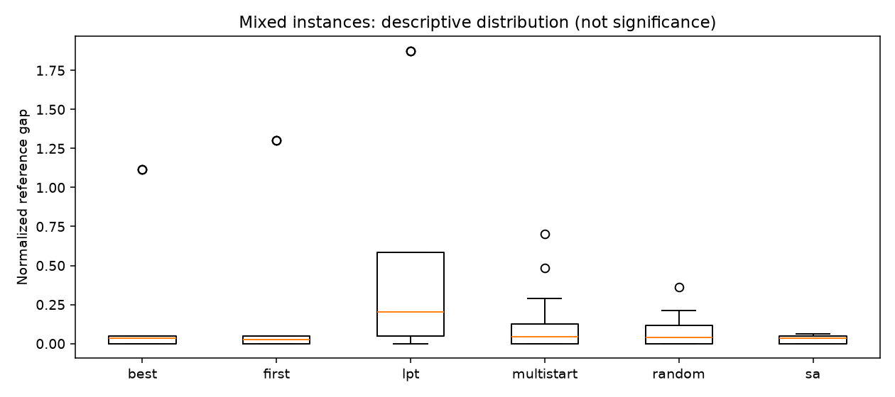
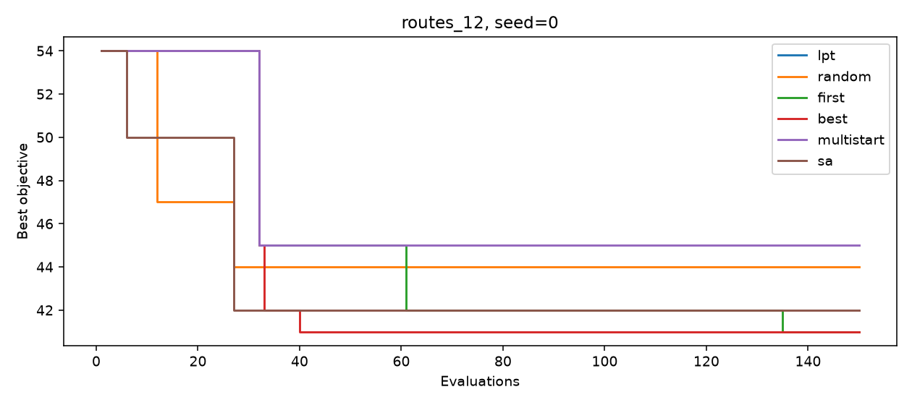
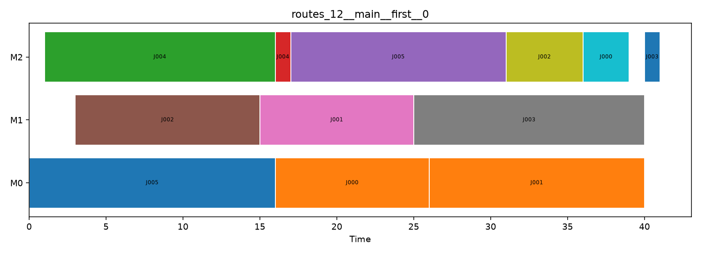

# Month 1 报告：Scheduling Core & Search Lab

## 1. 结论与交付范围

按全年 M1 四周主题完成调度核心、规则、邻域、独立验证、五种搜索和实验框架。保留已有 Week 1 Day 1–4，补齐后续 24 篇笔记、四篇周报与本报告。笔记包含原理、手算、代码定位、实验命令与自测，不将材料生成等同于个人学习完成。

验证包含 107 项测试、十个不同手算案例、三条精确解码轨迹、五个小实例枚举对拍和九类损坏排程。正式实验共 162 次，全部成功；另有故障注入验证失败留痕。复现脚本逐次重算并核对目标、状态、评价数、候选、排程和完整轨迹。

没有算法在所有实例上领先。SA 在本批单机迟交案例中更好，First/Best 在多工序案例中更好。以下结果仅支持这批小规模合成数据的教学分析。

## 2. 模型

集合：作业 J、工序 O、机器 M；作业内工序构成有序链。参数为 processing_time、release_time、due_date、weight、eligible_machine_ids。工时是正整数、权重有限且正；无交期为 None。

决策包括优先级排列、工序机器指派，以及解码得到的开始/结束时间。约束为工序恰好加工一次、合法机器资格、非负开始、满足释放时间、正确工时、作业内 precedence、机器区间不重叠。区间采用 [start,end)，允许相接。

目标独立计算：Cmax、ΣCj、Σ(Cj−rj)、Σmax(0,Cj−dj)、ΣwjCj、Lmax。实验选择单机总迟交和并行/多工序 Cmax，避免用 r=0 单机 Cmax 这个几乎无排序区分度的指标演示搜索。

支持同质加工时长与不可抢占；没有换型、维护日历、工人、动态订单和机器相关工时，这些留给后续月份。

## 3. 实现与算法

Candidate.order 包含每道工序一次；assignments 对齐 instance.operations。decoder 每步扫描最高优先级的就绪工序，将其追加到指定机器，start=max(机器末尾、前驱结束、释放时间)。不会向已有空隙插入。

独立验证器不调用 decoder，接受任意工序列表顺序，并检查完整性与所有支持约束。Objective 保持纯指标模块，由调用方先验证。

| 方法 | 实现 |
|---|---|
| LPT baseline | 降工时优先级＋最早完工指派；多工序时只是通用初始解 |
| Random | 随机排列和合法指派，保留最好 |
| First | 固定邻居扫描，遇到严格改善立即移动 |
| Best | 扫描后选最优改善；预算截断时保留已见最好 |
| Multi-start | First＋随机重启，重启评价计入总预算 |
| SA | 随机 swap/insert/reassign，以 exp(−Δ/T) 接受坏解 |

每次完整解码＋验证＋目标计算计一次评价，包含初始化、拒绝候选、no-op、随机重启。所有方法共享同一初始解。LS 可提前停止；其他搜索使用完整上限。邻居生成成本另体现在墙钟时间，因此同评价上限不等于严格同秒数。

## 4. 正确性证据

| 检查 | 已执行内容 |
|---|---|
| 原有行为 | 原 51 项测试继续通过 |
| 手算 | 10 个实例的规则顺序、完工时刻及 4 个指标 |
| 解码 | 同一两作业三工序输入的 3 条精确轨迹 |
| 负例 | precedence、overlap、illegal assignment、missing、duplicate、release、duration、unknown ID、非法时间类型 |
| 枚举 | seed=0…4，每例 4 任务/2 机器，共 384 组合，对拍 oracle 与 decoder 最小值 |
| 搜索 | 六方法预算 1/2/60、同 seed 轨迹、最好值单调、空/单元素终止 |
| I/O 与失败 | JSON 往返、CSV 空交期、非法输入、注入求解异常 |

独立 oracle 自己构造时间表，不调用 decoder；只支持单工序小例和完成时间单调目标。目标公式共享，但由手算提供另外的验证。不能用这些测试宣称实现对所有未测试工业约束正确。

工程检查：pytest、Ruff、Black、mypy；具体依赖见 [requirements-lock.txt](../projects/01_scheduling_core/requirements-lock.txt)。

## 5. 实验设置与原始记录

实例参数详见 [Week 4 Day 2](Week_4/Day2.md)，实际输入见 [instances](../projects/01_scheduling_core/artifacts/month1/instances)。算法 seed=0/1/2；预算 150；SA T0=10、cooling=0.98；Multi-start interval=40。

六实例×六方法×三 seed=108 主实验；三个 SA 变体×六实例×三 seed=54 敏感性实验，总计 162。源码 SHA-256、输入 SHA-256、Git commit/dirty、平台和 Python 版本已记录。源码未提交时通过 dirty 标记及源码 hash 明确版本状态。

原始文件：[results.csv](../projects/01_scheduling_core/artifacts/month1/results.csv) · [summary.csv](../projects/01_scheduling_core/artifacts/month1/summary.csv) · [metadata.json](../projects/01_scheduling_core/artifacts/month1/metadata.json) · [失败记录](../projects/01_scheduling_core/artifacts/month1/failures.json)。

## 6. 主实验结果

下表是三个 seed 的均值，越小越好。确定性方法重复运行不算三个独立随机样本。

| 实例 / 目标 | LPT | Random | First | Best | Multi-start | SA |
|---|---:|---:|---:|---:|---:|---:|
| tiny_single / ΣT | 57 | 36 | 36 | 36 | 36 | 36 |
| tiny_parallel / Cmax | 38 | 38 | 38 | 38 | 38 | 38 |
| single_12 / ΣT | 719 | 313 | 575 | 529 | 373 | 261.67 |
| parallel_12 / Cmax | 45 | 44.33 | 45 | 45 | 45 | 44.67 |
| parallel_24 / Cmax | 95 | 94.33 | 92 | 94 | 94 | 93.33 |
| routes_12 / Cmax | 54 | 45.33 | 41 | 41 | 45 | 42 |

tiny_single 经枚举证明 optimum=36，tiny_parallel optimum=38。其余参考取全部主实验＋敏感性运行的最好值：single_12=250、parallel_12=43、parallel_24=90、routes_12=40，均标为 best-known。

gap=(value−reference)/max(1,abs(reference))；参考为零时是绝对差，不是百分比。best-known gap 只反映与本批最好记录的差异，不是全局最优性证书。

First/Best 在 tiny_single 分别使用 23/37 次评价就停止；tiny_parallel 都是 17 次。较大实例两者用满 150，部分邻域扫描被截断。因此排名同时反映邻域扫描顺序和预算大小，不能只归因于算法名称。

## 7. 敏感性结果

三个 seed 的 SA 均值；只比较同一行。

| 实例 | 主配置 10/0.98 | 低温 0.1/0.98 | 高温 100/0.98 | 快冷却 10/0.9 |
|---|---:|---:|---:|---:|
| single_12 | 261.67 | 262.00 | 282.67 | 255.33 |
| parallel_12 | 44.67 | 44.67 | 44.33 | 44.33 |
| parallel_24 | 93.33 | 91.67 | 94.33 | 92.00 |
| routes_12 | 42.00 | 41.67 | 46.33 | 42.67 |

两个 tiny 实例各设置均追平其 optimum。快冷却在 single_12 平均较好；parallel_24 低温均值较好；routes_12 的高温均值较差。没有跨全部实例统一最好的设置。参数未在独立留出集验证，继续保留教学默认配置，不宣称完成生产调参。

## 8. 图与案例



合并 gap 的箱线图仅作描述；不同目标的原始值不混合平均。



固定 routes_12、seed=0，显示历史最好值随评价预算的变化。它不是三 seed 平均曲线。LPT 只有一个初始点。



图展示主实验中该实例的一个最好排程，Cmax=41；敏感性实验另有 40，因此这张图不声称展示全批最优。同一作业颜色一致，工序标签包括序号。

## 9. 修复与局限

修复原有 Day 4 的 WSPT 手算答案 28→43、错误相对链接和带释放时间时 Cmax 的过强描述。代码补充单机规则资格检查、JSON 工时不静默截断、非有限权重/非整数时刻拒绝。原示例行为通过回归检查。

当前限制：小规模、仅六个合成实例、三 seed；所有生成实例全机器资格；无独立调参测试集；追加 decoder 有表示与构造偏置；First/Best 先扫描排列再扫描机器指派，小预算可能根本到不了指派邻域；SA 允许 no-op，接受率不能直接当作有效探索率。报告不做统计显著性声明。

## 10. 复现与下一步

从仓库根目录：

```powershell
python projects/01_scheduling_core/examples/m1w4d1_benchmark.py --output projects/01_scheduling_core/artifacts/my_run
python projects/01_scheduling_core/examples/m1w4d4_reproduce.py projects/01_scheduling_core/artifacts/month1
python -m pytest projects/01_scheduling_core -q
```

新输出目录需不存在或为空。安装与静态检查见 [项目 README](../projects/01_scheduling_core/README.md)。复现忽略时间差异，严格比较算法结果与轨迹。

进入 M2 后复用同一模型、Objective 和独立验证器，用 MILP/CP-SAT 提供更大实例的 bound 与最优性证明；再扩展机器资格分布、更多规模和独立测试集。个人学习从 [月度索引](README.md) 按日继续即可。
