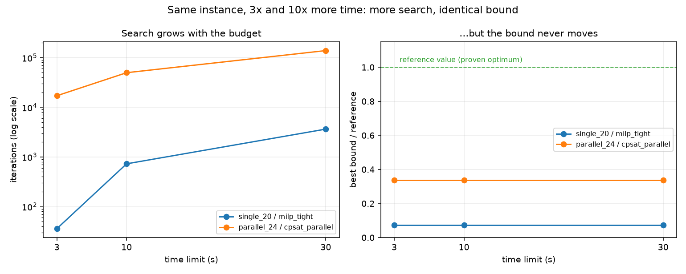

# Month 2 报告：Optimization Model Lab

## 1. 研究范围

本月把「找到一个好解」升级为「**证明一个解有多好**」：从 LP 与对偶的基本功出发，实现单机与并行机的 MILP、CP-SAT 区间模型，理解 Big-M、松弛强弱、bound / gap / nodes 与终止原因，并把对称破缺、warm start、不可行诊断这些 Solver Engineering 手段做成可比较的实验。

全部求解只依赖 **OR-Tools 9.15**，一个依赖覆盖三个后端：GLOP（连续 LP）、CBC（MILP 与分支定界）、CP-SAT（区间变量与传播）。M2 **不重新定义调度语义**——`Instance`、`Schedule`、独立验证器、Objective 全部复用 M1，否则「精确方法的解」与「启发式的解」就不是在同一个问题上比较。

验证包含 **232 项测试**、一次 59 次运行的正式批次（零失败）、一次 29 次运行的 Week 4 工程实验，以及 Week 1 的 37 个 LP 场景。每个返回的调度排程都过 M1 的独立验证器。

## 2. 模型

### 2.1 连续 LP（Week 1）

生产计划、运输、指派三类模型，外加一个**独立构造的对偶模型**（不是同一个模型的另一组 API，而是按对偶规则重新写出的模型）。因此 `primal_objective == dual_objective` 是**两次独立求解**的数值对拍，而不是同一次求解的两种读法。

### 2.2 单机 MILP（Week 2）

disjunctive（序列）模型：二元变量 `y_jk` 决定两两先后，时间变量 `C_j`，Big-M 约束连接两者。

| 变体 | Big-M |
|---|---|
| `milp_tight` | 逐对 `M_jk = H - r_k`，由有效时间界 `H = max r + Σp` 导出 |
| `milp_loose` | 全局常量 `M = n · H`（合法性：`n·H ≥ H ≥ H − r_k`） |
| `milp_alt` | **时间索引**模型（完全不同的 formulation） |

### 2.3 CP-SAT 区间模型（Week 3）

并行机用 `OptionalIntervalVar` + `AddExactlyOne` + `AddNoOverlap`；JSP 用工序区间 + 机器 `NoOverlap` + 作业内 precedence；有限容量资源用 `AddCumulative`。

### 2.4 强化与诊断（Week 4）

对称破缺 + 冗余约束；hint / 目标上界割 / 前缀固定三条**性质完全不同**的手段；数值缩放体检与不可行冲突定位（充分冲突集 + 删除过滤得极小冲突集）。

## 3. 实现与算法

项目按职责拆为四个包：

```text
02_optimization_models/
├── opt_common/       复用 M1：路径装配与领域接口重导出
├── opt_solvers/      统一 SolveResult + 方法注册表 + M1 规则基线
├── opt_models/       LP / MILP / CP-SAT / 强化 / 诊断
└── opt_experiments/  跨方法批次与各周驱动
```

**统一结果接口**（`opt_solvers/result.py`）是全月的主线。三类方法的底层语义差别很大，若不统一，「比较」就会退化成读日志。三条纪律被写进代码而不是文档：

1. **没有 bound 就写 `None`。** 启发式没有下界，把 `best_bound` 填成目标值会让 `gap` 恒为 0，看起来「已证明最优」——这是求解器实验里最严重的伪证据。`SolveResult.__post_init__` 还直接拒绝 `best_bound > objective`。
2. **`build_time` 与 `solve_time` 分开记。** 建模慢与求解慢是两种问题。
3. **`OPTIMAL` 不等于解可行。** 每个返回排程都过 M1 的 `schedule_errors`。

**方法注册表**让四周互不干扰：每个周模块用 `@register("name")` 注册，批次只认识名字；名字缺失记 `FAILED` 而不中断整批。本批共注册 14 个方法（13 个进入配置 + `cpsat_cumulative` 由 Week 3 的容量实验单独覆盖）。

## 4. 正确性证据

| 检查 | 已执行内容 |
|---|---|
| 单元与回归测试 | 232 项：foundation 25、LP 24、MILP 42、CP-SAT 63、strengthening 62、diagnostics 16 |
| 强对偶 | primal 与**独立构造的** dual 分别求解，目标值相等（差值 ≤ 4.5e-13）；对偶的对偶回到原值 |
| 互补松弛 | 逐对核对 `x_i · rc_i = 0`；容差探针实测到一个 4.0e+02 的违反量 |
| 影子价格区间 | 线性预测在 `cap_M ∈ [80, 120]` 成立，区间外失效（下方基变换、上方约束不再紧） |
| 枚举对拍 | 小实例上三个 MILP formulation 的最优值与 M1 的 `exhaustive_optimum` 一致 |
| CP-SAT 语义 | 两个 JSP 与并行机小例的手算 Cmax 一致；`INFEASIBLE` / `MODEL_INVALID` 分别构造并断言 |
| 强化正确性 | **对称破缺与冗余约束不改变最优值**（四变体目标全等）——改变即建模错误 |
| 前缀固定语义 | 固定全部位置必须**精确复现**初解；固定零个位置必须复现完整模型 |
| 独立验证 | 正式批次 59 次运行，**0 次**被独立验证器拒绝 |
| 边界纪律 | 批次 0 次 `best_bound > objective`；启发式的 bound / gap 落表为**空**而非 0 |

## 5. 实验设置与原始记录

配置见 [configs/month2.json](../projects/02_optimization_models/configs/month2.json)：8 个实例 × 13 个方法 × 3 档时间预算 = **59 次运行**，零失败。原始记录在 [artifacts/month2](../projects/02_optimization_models/artifacts/month2)。

版本状态（这次是可信的）：

```text
git_commit          = 71335003098b      （真实提交，非「未提交工作区」）
working_tree_dirty  = False             （运行前工作区干净）
source_sha256       = 2d557ab9fd25a2dc41779b11095afc8e2de5fb7e88fd2e6acef8be86af00136e
                     └─ 与当前源码重算的 source_hash() 一致（已复核）
```

**整批确定性已实测**：三次独立运行，59 个 `run_id` 在 `(status, objective, best_bound, gap, validation)` 上**零差异**。CP-SAT 固定 `num_search_workers = 1` 与 `random_seed`，CBC 为确定性后端。

实例参考值分三档（见 [report.md](../projects/02_optimization_models/artifacts/month2/report.md)）：

| 实例 | 参考类型 | 参考值 |
|---|---|---:|
| `single_8` | `optimum`（独立枚举） | 85 |
| `single_12` | `proven_by_solver` | 532 |
| `single_20` | `proven_by_solver` | 903 |
| `parallel_8` | `proven_by_solver` | 29 |
| `parallel_12` | `proven_by_solver` | 39 |
| `parallel_24` | `proven_by_solver` | 71 |
| `routes_6` | `proven_by_solver` | 56 |
| `routes_10` | `best-known` | 71 |

只有 `single_8` 的参考值来自**与被测求解器无关**的独立枚举；其余是本批求解器证明的，`routes_10` 连证明都没有。这个分档本身就是结论的一部分。

## 6. 主实验结果

`milp_alt` 的 wall time 含建模；启发式不使用时间预算（毫秒级完成）。

| 实例 / 目标 | 规则基线最好 | `milp_tight` | `milp_loose` | `milp_alt` | CP-SAT |
|---|---:|---|---|---|---|
| `single_8` / ΣT | 85（spt） | OPTIMAL 85 (1.19s) | OPTIMAL 85 (1.16s) | OPTIMAL 85 (0.21s) | — |
| `single_12` / ΣT | 532（spt） | FEASIBLE 543, gap 0.898 (10.08s) | FEASIBLE 573, gap 0.904 (10.62s) | **OPTIMAL 532 (0.51s)** | FEASIBLE 532, bound 1.0, gap 0.998 |
| `single_20` / ΣT | 903（spt） | FEASIBLE 968, gap 0.932 (10.05s) | FEASIBLE 1089, gap 0.938 (10.04s) | **OPTIMAL 903 (0.68s)** | — |
| `parallel_8` / Cmax | 31 | — | — | OPTIMAL 29 (0.75s) | OPTIMAL 29 (0.01s) |
| `parallel_12` / Cmax | 46 | — | — | OPTIMAL 39 (1.42s) | OPTIMAL 39 (0.02s) |
| `parallel_24` / Cmax | 75 | — | — | FEASIBLE 73, gap 0.411 (10.17s) | FEASIBLE 71, gap 0.662 (10.00s) |
| `routes_6` / Cmax | — | — | — | — | OPTIMAL 56 (0.03s) |
| `routes_10` / Cmax | — | — | — | — | FEASIBLE 71, gap 0.479 (10.00s) |

### 6.1 结论一：formulation 的结构比 Big-M 的紧松重要得多

单机总迟交上，两个 disjunctive 变体的**根 LP 界都是 0**（分数松弛可以让每个作业都「按时完工」），而时间索引模型的根界达到最优值的 **98.75% / 99.86% / 99.97%**。后果是数量级的：

```text
single_20, 10 秒预算
  milp_tight   → FEASIBLE 968，界 65.5，gap 0.932     （817 节点）
  milp_alt     → OPTIMAL  903，界 903，gap 0          （0 节点，0.68s）
```

值得单独记住的是：**Big-M 的紧与松在这里没有改变根界**。它改变的是系数规模（跨度 33.5 vs 201.0，松模型差约 6 倍）与搜索路径（同样的 10 秒里 tight 找到 968、loose 找到 1089）。教科书上「M 越紧越好」的说法在本问题上并不指向主要的性能差异来源——**换 formulation 才是指向性的**。

### 6.2 结论二：更多时间不必然改善界

同一实例在同一方法上扫描预算，迭代数大幅增长而**界在小数点后 17 位完全不变**：

| 实例 / 方法 | 3 s | 10 s（主） | 30 s |
|---|---|---|---|
| `single_20` / `milp_tight` | 界 65.50927046336038，36 节点 | 界 **同值**，727 节点 | 界 **同值**，3633 节点 |
| `parallel_24` / `cpsat_parallel` | 界 24.0，17052 冲突 | 界 **同值**，49613 冲突 | 界 **同值**，138210 冲突 |

`single_20` 上节点数增长约 **101 倍**，界一动不动。原因是松弛太弱：分支产生的新节点 LP 界与根节点同级，全局下界被根界钉住。**把 3 秒加到 30 秒（10 倍预算）在这批实例上买不到任何 gap 改善**——这是「先换 formulation，再谈调预算」最直接的实测证据。



> **这张表的数字必须来自 `artifacts/month2/results.csv`。** 本节初稿曾写过一组「31 / 817 / 3794」的节点数，它们**在已提交的 artifacts 里不存在**——多半来自某个未提交的中间运行。迭代数不可复现（见第 7 节），所以任何写进报告的数都必须能落到具体文件上；落不到的就删掉。上表三个数分别对应 `single_20__tl_3__milp_tight__0` 等三个 run 记录，可以直接查。

### 6.3 结论三：对称破缺的价值随规模反转

Week 4 的小实例消融显示对称破缺是**负收益**（`par_6x3` 冲突 190→377→529，`par_10x3` 898→1461→1574），而正式批次里 `parallel_24` 上它**决定性地赢**：

```text
cpsat_parallel   FEASIBLE 71，界 24.0，gap 0.662，10s 用满（49641 冲突）
cpsat_symmetry   OPTIMAL  71，界 71.0，gap 0，   0.46s      （10644 冲突）
```

一个 30 秒都证不出来的实例，加了对称破缺后 **0.46 秒证明最优**。两者并不矛盾：小实例上额外的传播开销没有被搜索空间的缩小抵消，大实例上省下的搜索量远超开销。**同一个技巧在不同规模上可以结论相反**，这正是「如实记录负收益」的价值——只报大实例会得出「对称破缺总是好的」这一错误信条。

## 7. 时间预算敏感性

| 实例 | 方法 | 3 s | 10 s（主） | 30 s |
|---|---|---|---|---|
| `single_12` | `milp_tight` | 543 / gap 0.898 | 543 / gap 0.898 | 543 / gap 0.898 |
| `single_20` | `milp_tight` | 968 / gap 0.932 | 968 / gap 0.932 | 968 / gap 0.932 |
| `parallel_24` | `cpsat_parallel` | 71 / gap 0.662 | 71 / gap 0.662 | 71 / gap 0.662 |
| `routes_10` | `cpsat_parallel` | 71 / gap 0.479 | 71 / gap 0.479 | 71 / gap 0.479 |

四行**全部无变化**。这不是「时间限制没用」——`wall_time` 确实分别是 3.00 / 10.00 / 30.00 秒，求解器也确实跑了那么久。它是第 6.2 节的直接后果：**在弱松弛上，时间不是约束条件，quality 才是**。

Week 4 的独立实验补充了一条方法论警告：**节点数不可复现**。同一实例同一预算重复运行，`single_c` 的 tight 模型节点数从 305 变到 16500（约 54 倍），而 incumbent 与最终界逐位复现。另外 `SetTimeLimit` 在节点边界才被检查，5.0 秒预算实测跑到 6.198 秒。**报告里只写目标值、把节点数当稳定的性能指标，是错的。**

## 8. 图与案例

M2 的图由 [examples/m2_figures.py](../projects/02_optimization_models/examples/m2_figures.py) 统一生成到 `artifacts/figures/`，共 6 张。**脚本只读已提交的 artifacts，不手写任何数值**；绘图代码不在 `SOURCE_PACKAGES` 里，因此重跑绘图不会改变本批次的 `source_sha256`。

| 图 | 依据 | 说明什么 |
|---|---|---|
| `feasible_region.png` | Week 1 Day 1 的 LP | 二维可行域与极点；顶点由系数解出，与手算互为独立核对 |
| `shadow_price.png` | `artifacts/month2_w1/sensitivity.csv` | 影子价格只在基不变的区间内成立，两侧失效原因不同 |
| `symmetry_ablation.png` | `artifacts/month2_w4/results.csv` | 强化的负收益：最优值不变而代价上升 |
| `symmetry_scale.png` | 同上 + 本批 `results.csv` | 同一技巧的符号随规模反转 |
| `bound_vs_time.png` | 本批 `results.csv` | 预算翻 10 倍，搜索量涨而界不动 |
| `method_quality.png` | 本批 `results.csv` | 各方法相对参考值的位置分布 |

**这次是「补上」，不是「本来就有」。** 初稿的 Week 1 Day 1 用 `│ ＼ ●` 拼了一张 ASCII 可行域图——它不按比例、无法复用，读者也没法从图上量出斜率。表格能表达结论，但表达不了**形状**（斜率、区间、随预算的走向）。全部换成代码绘图后，`feasible_region.png` 的顶点是从约束系数两两求交解出来的，与笔记 §4 的手算构成了两条独立路径的互证，这是 ASCII 图做不到的。

仍然没有的：没有任何直方图或统计分布图。Week 4 Day 6 计划里的「性能分布」表达为逐方法的 gap 与 wall-time 列表，不是分布图——**这一条缺口保留**，因为本批每格样本量是 1 次运行，画分布会给出错误的印象（见第 7 节：同一配置重复运行的目标值都可能不同）。

## 9. 修复与局限

本轮自查发现并修复的**两个真实缺陷**：

1. **`benchmark.py` 的版本状态标记失效。** 原实现先创建输出目录、再读 git 状态，于是刚写进去的 `config.json` 让工作区永远显示为 dirty —— `working_tree_dirty` 因此**恒为 True**，失去了全部意义。M1 批次的不可复现正是栽在这上面。已改为在创建输出目录**之前**捕获 commit 与 dirty 状态，本次批次的 `working_tree_dirty = False` 且 `source_sha256` 与当前源码重算值一致。
2. **示例脚本 `m2w4d6` 的排序键在目标为 0 时判错。** 原写法 `objective or float("inf")` 在目标值为 `0.0` 时把它当成假值，于是「最好的解」永远选不上。已改为显式判 `None`。当前实例集里没有零目标案例，所以它一直没暴露。

当前限制：

```text
规模：        8 个合成实例，作业数 6–24，单 seed
参考值：      只有 1 个实例有独立枚举的最优值，其余依赖求解器自证
调参：        未在独立留出集上验证任何参数结论
绘图：        无图（见第 8 节）
前端：        没有 lint / formatter / 类型检查——验证环境里没有 ruff / black / mypy
求解器：      只有 OR-Tools 一个后端，未与商业求解器交叉验证
断言来源：    目标值与 bound 由求解器给出后经 M1 验证器复核可行性，
              但「求解器报的 bound 本身是否正确」只由 root LP 对拍与
              独立枚举做过交叉检查，覆盖面有限
```

一处需要读者注意的语义细节：`milp_fixing` 报告 `OPTIMAL` 时，指的是「**在固定前缀的约束下**最优」——它是把可行域缩小后的最优，不是原问题的最优。`runs/*.json` 的 `detail` 里记录了 `fixed_prefix` 与 `seed_objective` 以便追溯，但 `results.csv` 不区分这一点。本批次里它的目标值恰好等于原问题最优值（因为 SPT 初解在这些实例上本身最优），所以没有产生误导行；换一批实例就可能。

## 10. 复现与下一步

仓库根目录：

```powershell
python projects/02_optimization_models/examples/m2_month2_benchmark.py --output projects/02_optimization_models/artifacts/my_run
python -m pytest projects/02_optimization_models -q
```

项目目录等价命令与各周驱动见 [PROJECT_GUIDE.md](../projects/02_optimization_models/PROJECT_GUIDE.md)。输出目录必须为空或不存在；每次重跑换新目录名。

验证本批次是否可信，三步：

```text
1. metadata.json 的 source_sha256 是否等于当前源码重算的 source_hash()
2. working_tree_dirty 是否为 False，git_commit 是否指向一个真实提交
3. 重跑一次，比较 (status, objective, best_bound, gap, validation) 是否逐行一致
```

本批次三项全部通过，第 3 项在三次独立运行上零差异。

进入 M3 后复用同一套 `Instance` / `Schedule` / 独立验证器 / Objective 与统一结果接口，只需新增 FJSP 模型并注册进同一张方法表。M3 的工业约束会引入换型、日历与工人，这些都会改变可行域，因此**每加一项约束都要重新确认它没有把最优解切掉**——Week 4 用来验证对称破缺「不改变最优值」的那套做法可以直接搬过去。
