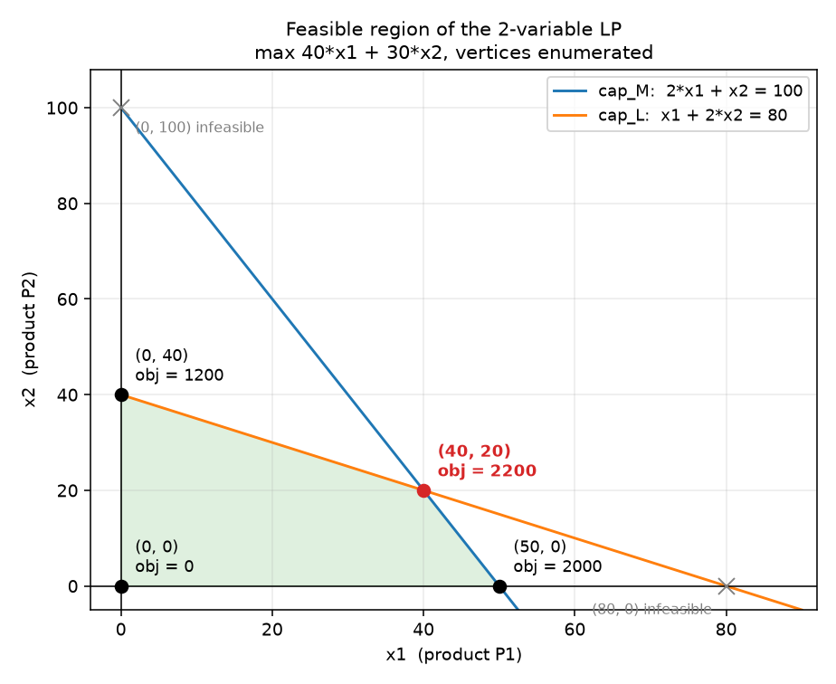

# Day 1：LP 标准型、可行域、极点与 slack

> 当日主题：把「生产计划」写成一个标准型 LP，并用极点枚举看清可行域
> 当日产出：**生产计划数学模型**（集合 / 参数 / 变量 / 目标 / 约束五步写法）+ [lp_models.py](../../projects/02_optimization_models/opt_models/lp_models.py) 的建模层 + 极点枚举表
> 建议投入：3～4 小时

---

## 1. 今日学习目标

完成今天的学习后，你应该能够：

1. 说出 LP 标准型的四个组成部分，并把一个「产量决策」问题改写成标准型。
2. 按「集合 → 参数 → 变量 → 目标 → 约束」的固定顺序写出数学模型，不跳步、不混序。
3. 在二维情形手算可行域的极点：把两条约束直线求交，逐个检查是否落在可行域内。
4. 解释「极点」与「内点」的区别，并说明为什么 LP 的最优解一定能在极点上取到。
5. 计算任意一条约束在某点的 `slack`，并说出 `slack = 0` 意味着什么。
6. 读懂求解器返回的 `primal` 解与 `shadow price`，并把它们与手算结果对照。
7. 用精确有理数（`Fraction`）做顶点枚举，知道为什么不能用二进制浮点直接比大小。
8. 说出「变量上界写成行、不写成变量界」这条接口约定背后的对偶理由。

---

## 2. 为什么 Day 1 要先把问题写成标准型

Month 1 的流水线是这样的：

```text
JSON → Parser → Instance → Validator → 可信输入
                                     ↓
                        Rules → Schedule → Objective → 数字
```

这条链子把「输入可信、结果可复现」做扎实了，但它有一个刻意留下的空缺：`Rules` 全是**启发式规则**——LPT、SPT、EDD。启发式能给出一个解，却**不告诉你离最优还有多远**。Month 2 要补的就是这一环：

```text
M1：  问题 → 规则 → 解            「有一个解，但不知道好不好」
M2：  问题 → 精确模型 → 求解器 → 最优解 + 界 + 对偶信息
       ↑
       今天在这里：先把问题写成模型
```

精确方法的入口是**建模**，不是调库。一个调度或排产问题能不能求解，八成取决于它被写成什么样子。所以 Week 1 不开调度模型，先把 LP 这件事从零走一遍。

今天只做一件事：**把「生产计划」从一段业务描述，变成一个可以逐项核对的数学模型**，并在两变量的情形下把可行域画出来、把极点一个个算出来。建模这一步做扎实了，精确方法才有立足点。

---

## 3. 概念：LP 标准型、可行域、极点与 slack

### 3.1 定义

**定义（线性规划）**：给定向量 `c ∈ R^n`、矩阵 `A ∈ R^{m×n}`、向量 `b ∈ R^m`，线性规划是

```text
max  c'x
s.t. A x <= b
     x >= 0
```

这一形式称为**标准型**（standard form，本课程约定：目标取 `max`、约束取 `<=`、变量非负）。三个组成部分各有名字：

| 名称 | 含义 | 在本周算例里是什么 |
|---|---|---|
| 目标函数 `c'x` | 要最大化的量 | 总利润 |
| 约束 `A x <= b` | 资源、产能、需求的限制 | 两条产能行 + 三条需求行 |
| 变量范围 `x >= 0` | 决策量的取值范围 | 产量不能为负 |

**定义（可行域）**：满足全部约束与变量范围的 `x` 的集合 `F = {x : Ax <= b, x >= 0}` 称为可行域。

**定义（极点）**：若 `x ∈ F` 不能写成 `F` 中另外两个不同点的严格凸组合，则称 `x` 是 `F` 的极点（vertex / extreme point）。

### 3.2 理论结论

以下三条都是**定理**，不是实验观察，留意它们各自的条件：

1. 可行域 `F` 是凸集（两个可行点的连线全在 `F` 内）。
2. 若 LP 有最优解，则**至少有一个极点是最优解**——所以「只在极点上找最优」不会漏掉答案。
3. 二维情形下，极点就是「两条约束直线（含坐标轴）的交点，且该交点可行」。

第 2 条是单纯形法的全部理由：它只沿着极点走（第 4.2 节把这句话在算例上完整走一遍）。注意它的条件——**最优解存在**；若问题无界，则一个极点都不最优。

### 3.3 slack：约束「还剩多少余量」

**定义（slack，松弛量）**：对 `<=` 行，`slack = b - a'x`；对 `>=` 行，`slack = a'x - b`；等式行的 `slack` 恒为 0。可行解处 `slack >= 0`。

三个概念要分清：

```text
活动值 activity = a'x       这条约束「用了多少」
右端项 rhs      = b         这条约束「允许多少」
松弛量 slack    = b - a'x   还剩多少（<= 行）
```

- `slack = 0`：约束**顶死**（紧约束，binding / active），此时放松一单位可能改变目标值；
- `slack > 0`：约束没顶住（松约束），此时放松它**在局部上**不会改变目标值。

`slack` 是第一天就要建立的读数习惯：只看 `x` 看不出哪条约束在起作用，加上 `slack` 才知道「瓶颈在哪」。第 7 节的实验表把五个点（四个极点 + 一个内点）的 `slack` 全部列了出来，可以逐行核对：紧约束处为 0，内点处全为正。

### 3.4 一个容易混淆的地方

「极点是两条线的交点」只在二维成立。三维是三个平面的交点，`n` 维是 `n` 个超平面的交点，而且**必须线性无关**。所以在四维以上，「枚举所有交点」很快就不可行——那种规模只能交给求解器。今天用二维，是因为二维能把整张可行域画出来、逐个核对。

### 3.5 二维可行域长什么样

把第 4 节算例的可行域画出来。图由 [m2_figures.py](../../projects/02_optimization_models/examples/m2_figures.py) 生成，四个顶点是**从系数解出来的**（两两求交再筛可行），不是照着结论描的——所以图和手算互为独立核对：



可行域是那个四边形 `(0,0) — (50,0) — (40,20) — (0,40)` 加上内部。四条边对应四条约束，四个顶点对应四条边的两两相交。第 3.2 节的定理在这里变成一句可以看见的话：**最好的点一定在这个四边形的角上**，不会在内点、也不会在边的中间。

图中灰色叉号是**被排除的两个交点**，排除的原因一眼可见：`(0, 100)` 在 `cap_L` 的右上方（违反 `cap_L`），`(80, 0)` 在 `cap_M` 的右方（违反 `cap_M`）。它们是无约束直线对的交点，但不是可行域的顶点——**「交点」与「顶点」不是一回事**，这是二维手算里最容易记错的一点。

---

## 4. 手算：两变量算例的两种解法

算例（后面每天都用它或它的三产品版本）：

```text
max  40 x_P1 + 30 x_P2
s.t. 2 x_P1 +   x_P2 <= 100      (cap_M，M 资源)
       x_P1 + 2 x_P2 <=  80      (cap_L，L 资源)
      x_P1, x_P2 >= 0
```

同一个算例用手算解两遍：先**枚举全部极点**（4.1），再**只沿着边走**（4.2）。两种解法必须给出同一个答案——这个一致性本身就是一次对拍。

### 4.1 解法一：枚举全部极点

两条产能直线的交点数一共 `C(4,2) = 6` 个（两条约束直线 + 两条坐标轴），逐个检查可行性：

```text
交点           求解              是否可行
cap_M ∩ cap_L  2x1 + x2 = 100   x1 + 2x2 = 80  ->  (40, 20)   可行
cap_M ∩ x1 = 0                              ->  (0, 100)   违反 cap_L（100 > 80）
cap_M ∩ x2 = 0                              ->  (50, 0)    可行
cap_L ∩ x1 = 0                              ->  (0, 40)    可行
cap_L ∩ x2 = 0                              ->  (80, 0)    违反 cap_M（160 > 100）
x1 = 0 ∩ x2 = 0                             ->  (0, 0)     可行
```

四个可行点就是全部极点，代入目标：

```text
(0, 0)     40*0  + 30*0  = 0
(0, 40)    40*0  + 30*40 = 1200
(40, 20)   40*40 + 30*20 = 1600 + 600 = 2200    ← 最优
(50, 0)    40*50 + 30*0  = 2000
```

两条直线相交的解 `(40, 20)` 也可以直接手解方程组得到：

```text
2 x1 +  x2 = 100
  x1 + 2 x2 =  80
两式相加：3 x1 + 3 x2 = 180  ->  x1 + x2 = 60
代入第一式：x1 = 40，于是 x2 = 20
```

**为什么手算这一步不能省**：求解器给的是数字，手算给的是**判据**。`(40, 20) → 2200` 这一组数就是判据，每次核对求解器都要用它，没有它，「结果正确」就只是求解器的自述。

### 4.2 解法二：单纯形法——不枚举，只沿着边走

#### 4.2.1 为什么不能靠枚举

4.1 只有 2 个变量、2 条约束，交点 `C(4,2) = 6` 个，数得过来。但算一下规模：`n` 个变量、`m` 条约束，交点数是 `C(n+m, n)`——**组合数**。`n = 50, m = 50` 时它是 `10^29` 量级，枚举在第一步就死了。

第 3.2 节的第 2 条定理说「至少有一个极点是最优解」，所以**只要在极点里找**就不会漏。问题是极点太多。单纯形法的全部内容就是一句话：**不把所有极点都看一遍，只从一个极点走到相邻的、更好的极点，直到走不动为止。**

「相邻」是关键：两个极点相邻，当且仅当它们之间只隔着**一条边**。每次只换一条边，代价就与「边上撞到哪条约束」有关，而不是与极点总数有关。

#### 4.2.2 写成松弛型：slack 变成变量

先把不等式变成等式。第 3.3 节的 `slack` 在这里从「读数」升级成**变量**：

```text
z = 40 x1 + 30 x2          （目标写成等式，z 也当一个变量）
s1 = 100 - 2 x1 -   x2     （cap_M 的余量）
s2 =  80 -   x1 - 2 x2     （cap_L 的余量）
x1, x2, s1, s2 >= 0
```

初始解取「两条产能都没用」：`x1 = x2 = 0`，于是 `s1 = 100`、`s2 = 80`、`z = 0`。这就是顶点 `(0, 0)`。

把「用非基变量表示基变量」列成表，每行读作等式 `行首变量 = 右端 - Σ(系数 × 非基变量)`：

```text
基变量   x1    x2    s1    s2  |  右端
z        40    30     0     0  |     0      <- z = 40x1 + 30x2
s1        2     1     1     0  |   100
s2        1     2     0     1  |    80
非基变量：x1 = x2 = 0
```

#### 4.2.3 转轴 1：x1 入基，s1 出基

**入基判据——谁涨得快就换谁进。** 看 `z` 行：`x1` 的系数 `40`、`x2` 的系数 `30`，都是正的，说明把任一个从 0 抬起来 `z` 都会涨。选系数最大的 `x1` 入基。

**比值检验——沿这条边走多远会撞墙。** `x1` 每涨 1，`s1` 掉 2、`s2` 掉 1，于是两条约束各自允许的上限是：

```text
s1 这条： s1 = 100 - 2 x1 >= 0  ->  x1 <= 100 / 2 = 50
s2 这条： s2 =  80 -   x1 >= 0  ->  x1 <=  80 / 1 = 80
取小的：x1 <= 50   ->  s1 先撞到 0，s1 出基
```

**几何上这一步就是**：从 `(0, 0)` 沿 `x2 = 0` 这条边往右走，先撞上 `cap_M`（`x1 = 50`），而不是 `cap_L`（`x1 = 80`）。所以新顶点是 `(50, 0)`。

**代入——把 `x1` 换成新的基变量。** 从 `s1` 那一行解出 `x1`：

```text
2 x1 = 100 - x2 - s1   ->   x1 = 50 - 1/2 x2 - 1/2 s1
```

再把它代进 `s2` 行和 `z` 行（这一步就是高斯消元，手算时逐项代）：

```text
s2 = 80 - (50 - 1/2 x2 - 1/2 s1) - 2 x2 = 30 - 3/2 x2 + 1/2 s1
z  = 40 (50 - 1/2 x2 - 1/2 s1) + 30 x2  = 2000 + 10 x2 - 20 s1
```

新表：

```text
基变量   x1    x2    s1    s2  |  右端
z         0    10   -20     0  |  2000
x1        1   1/2   1/2     0  |    50
s2        0   3/2  -1/2     1  |    30
非基变量：x2 = s1 = 0   ->   顶点 (50, 0)，z = 2000
```

对照 4.1 的枚举表：`(50, 0) → 2000` ✓。

#### 4.2.4 转轴 2：x2 入基，s2 出基

`z` 行里 `x2` 的系数是 `+10`，还是正的，所以还没到最优。`s1` 的系数是 `-20`（负的），说明把 `s1` 从 0 抬起来 `z` 会**变小**——不用管它。

比值检验：

```text
x1 行： x1 = 50 - 1/2 x2 >= 0   ->  x2 <= 50 / (1/2) = 100
s2 行： s2 = 30 - 3/2 x2 >= 0   ->  x2 <= 30 / (3/2) =  20
取小的：x2 <= 20   ->  s2 出基
```

几何上：从 `(50, 0)` 沿着 `cap_M` 这条边往上走，撞上 `cap_L`（在 `x2 = 20` 处）。代入：

```text
x2 = 20 + 1/3 s1 - 2/3 s2
x1 = 50 - 1/2 (20 + 1/3 s1 - 2/3 s2) - 1/2 s1 = 40 - 2/3 s1 + 1/3 s2
z  = 2000 + 10 (20 + 1/3 s1 - 2/3 s2) - 20 s1 = 2200 - 50/3 s1 - 20/3 s2
```

新表：

```text
基变量   x1    x2     s1      s2    |  右端
z         0     0   -50/3   -20/3   |  2200
x1        1     0    2/3    -1/3    |    40
x2        0     1   -1/3     2/3    |    20
非基变量：s1 = s2 = 0   ->   顶点 (40, 20)，z = 2200
```

#### 4.2.5 停：没有正系数了

`z` 行的系数是 `-50/3` 和 `-20/3`，**全部非正**。这意味着把任何一个非基变量从 0 抬起来，`z` 都只会变小或不变——**没有任何相邻顶点比现在更好**。

而 4.1 的定理保证「最优解一定在极点上」，所以「没有更好的相邻顶点」等价于「**这是全局最优**」。停。

结果 `(40, 20)`、`z = 2200`，与 4.1 的枚举**完全一致**。

#### 4.2.6 两种解法对比

```text
                走过/检查的顶点        转轴次数        答案
4.1 枚举        6 个交点全部检查       —              (40, 20), z = 2200
4.2 单纯形      (0,0) -> (50,0) -> (40,20)，3 个      2 次
```

枚举检查了 6 个交点、其中 4 个可行；单纯形只看了 3 个极点、走了 2 步就到了。**差距在小算例上还不明显，但它随规模拉开**：枚举要 `C(n+m, n)` 个点，单纯形每一步只换一条边。

三个阶段各自对应一个可以独立理解的动作：

```text
入基  = 选一条目标涨得最快的边      （看 z 行的正系数）
比值  = 沿这条边走，先撞上哪条约束  （RHS / 该列系数，取最小）
出基  = 撞上的那条约束离开基        （它顶死了，余量归零）
```

#### 4.2.7 三个限制（单纯形不是万能的）

1. **需要一个初始可行基。** 今天运气好——`x1 = x2 = 0` 本身就是可行极点。一般的 LP 没有这么方便的起点，得先解一个辅助问题把起点造出来，这段代价不在上面的步数里。
2. **退化会原地打转。** 如果比值检验里有两个一样小的比值，转轴后右端可能出现 0，走一步却停在同一个顶点上。这不影响正确性，但「转轴次数」就不再等于「走过的不同顶点数」。
3. **理论上可能循环。** 退化加上特定的入基规则，理论上可以让单纯形回到已经来过的基、无限转下去。这在实践里极少见，但它是真的——所以「单纯形一定会停」不是无条件成立的，要加上防循环的规则才是。

这三条都不影响今天这个算例，但**「算例里没出问题」不等于「方法没有边界」**。

---

## 5. 建模五步与接口约定

### 5.1 五步写法

这是本周所有模型的统一写法，顺序不能改——**先集合、后数值**：

| 步骤 | 写什么 | 本算例 |
|---|---|---|
| 1. 集合 | 索引集合与它们的记号 | `P = {P1, P2}`、`R = {M, L}` |
| 2. 参数 | 与集合对齐的数值，每个都带单位 | `profit_p`、`usage[r][p]`、`capacity_r` |
| 3. 变量 | 决策量 + **取值范围** | `x_p >= 0`，`p ∈ P` |
| 4. 目标 | `max` / `min` + 求和表达式 | `max Σ_p profit_p · x_p` |
| 5. 约束 | 每条一句话：谁被谁限制 | `Σ_p usage[r][p] · x_p <= capacity_r`，`r ∈ R` |

写成表达式（而不是先写数字）有两个好处：改数据不改公式；读的人能在看见数字之前先看懂结构。

### 5.2 接口约定：上界写成行

本仓库的建模层坚持一条约定：**所有上界都用约束行表达，不用变量上界**。比如「需求上限」写成

```text
demand_P1:  x_P1 <= 40          ← 一条行
```

而不是

```python
x_P1 = solver.NumVar(0, 40, "x_P1")   # ← 变量上界，本仓库不用
```

原因在对偶上：**带有限上界的变量会在对偶里多出一组项**，`b'y` 这个干净的结论就会被弄脏（`Σ u_i y_i` 项会冒出来）。在建模阶段就把上界写成行，对偶表可以照抄标准形式，不需要补丁。

代码里这条约定有直接代价与收益：`build_dual` 遇到有限上界会抛 `ValueError: build_dual cannot handle bounded variables`，而不是悄悄给出一个缺项的对偶。**宁可报错，不要给一个少了一截的「对偶目标」。**

### 5.3 三个 builder 的命名约定

约束名与变量名是**对偶变量的名字的来源**，所以必须稳定：

```text
变量      x_<产品>            x_P1, x_P2
产能行    cap_<资源>          cap_M, cap_L
需求行    demand_<产品>       demand_P1 ...
交付行    delivery_<产品>     delivery_P2 ...
对偶变量  y_<原约束名>        y_cap_M ...
对偶行    d_<原变量名>        d_x_P1 ...
```

名字对齐之后，「谁是谁的对偶」靠名字就能对上，不靠位置索引——一张「原始—对偶对照表」可以直接由代码生成。

### 5.4 单位与量纲：一条自查规则

写模型时把单位一起写出来，可以挡掉一大类错误：

| 量 | 单位 | 本算例取值 |
|---|---|---|
| `profit_p` | 元 / 件 | 40、30 |
| `usage[r][p]` | 单位资源 / 件 | `usage[M][P1] = 2` |
| `x_p` | 件 | 待求 |
| `capacity_r` | 单位资源 | 100、80 |
| 目标 `c'x` | 元 | 待最大化的总利润 |
| `cap_<资源>` 的影子价格 | 元 / 单位资源 | `50/3`、`20/3`（对偶解） |

自查规则：**每条约束两边的量纲必须一致**，目标函数的量纲必须就是你要最大化的那个量。`2 x_P1 + x_P2 <= 100` 左边是「单位资源」、右边也是「单位资源」，成立。影子价格的单位是「元 / 单位资源」，这解释了为什么它读作「多一单位资源能多赚多少钱」。

---

## 6. 实现：`lp_models.py` 的建模层

对应文件 [lp_models.py](../../projects/02_optimization_models/opt_models/lp_models.py)。

建模层是一堆**纯数据**加一个**装配点**：

| 名字 | 角色 |
|---|---|
| `Row(name, terms, sense, rhs)` | 一条约束的结构化记录，`terms` 是 `(变量名, 系数)` |
| `ProductionData` / `TransportData` / `AssignmentData` | 三个纯参数容器，`frozen`、可 `replace` |
| `_assemble(...)` | 唯一的求解器装配点：把纯数据变成一个 `LPModel` |
| `LPModel` | 模型句柄：求解器对象 + 解释解所需的全部元数据 |
| `build_production_lp(data)` | 纯数据 → `LPModel` |
| `enumerate_vertices_2d(model)` | 二维极点枚举，用 `Fraction` 精确算 |
| `solve_model(model)` | 求解并抽出 primal / slack / reduced cost / shadow price |

两个设计细节值得记住：

1. **`LPModel` 同时装「求解器对象」和「元数据」**（变量名、约束名、系数、目标方向）。求解器只认识索引，不认识「`x_P2` 是什么」；没有元数据，读数就没法翻译回业务语言。
2. **活动值由本模块自己重算**，不调用求解器。`pywraplp` 的 `Constraint` 没有 `activity()`，而且即使有也不该抄——自己按系数重算，约束是否被满足才是一次**独立复算**，而不是把求解器的话再讲一遍。一切对拍都建立在这条上。

极点枚举用精确有理数：

```python
from fractions import Fraction
# 两条直线求交，用 Fraction(str(x)) 而不是 Fraction(x)——
# Fraction(0.1) 会拿到 0.1 的二进制展开，Fraction("0.1") 才是十分之一
```

本算例两条直线的交点恰好是整数，看不出差别；但换一个运输算例就会出现分数解，那时候「精确比较」和「浮点比较」的差别就是「可行」与「不可行」的差别。

装配点的关键几行（本仓库**唯一**声明变量的地方）：

```python
@dataclass(frozen=True, slots=True)
class Row:
    name: str                          # 约束名，对偶变量名由它派生
    terms: tuple[tuple[str, float], ...]   # (变量名, 系数)，只存非零项
    sense: str                         # "<=" / ">=" / "="
    rhs: float

# _assemble 里声明变量：
variables[var_name] = solver.NumVar(
    -infinity if lower is None else lower,    # 自由变量的下界是 -inf，不是 +inf
    infinity if upper is None else upper,     # 上界一律留空：上界要写成行
    var_name,
)
```

第二行注释对应一个真实踩过的坑：如果把「没有下界」写成 `infinity`，自由变量的区间就变成 `[+inf, +inf]`，运输问题的对偶会直接返回 `ABNORMAL`。**自由是用 `-inf` 表达的，不是用 `+inf`。**

---

## 7. 实验：`m2w1d1_lp_standard_form`

对应脚本 [m2w1d1_lp_standard_form.py](../../projects/02_optimization_models/examples/m2w1d1_lp_standard_form.py)，在项目目录下运行：

```bash
python examples/m2w1d1_lp_standard_form.py
```

脚本做四件事：打印五步模型 → 用 `Fraction` 枚举极点 → 打印五个点的 `slack` 表 → 与求解器对拍。实际输出：

```text
== 1. 集合 ==
产品集合 P = ['P1', 'P2']
资源集合 R = ['M', 'L']

== 2. 参数（全部写在集合之后，单位统一）==
单位利润 profit   = {'P1': 40.0, 'P2': 30.0}
单位消耗 usage[M] = {'P1': 2.0, 'P2': 1.0}
单位消耗 usage[L] = {'P1': 1.0, 'P2': 2.0}
可用产能 capacity = {'M': 100.0, 'L': 80.0}

== 3. 变量与目标（标准型：max c'x, Ax <= b, x >= 0）==
变量  x >= 0，共 2 个：['x_P1', 'x_P2']
目标  max 40*x_P1 + 30*x_P2
约束  共 2 条：
        cap_M    2*x_P1 + 1*x_P2 <= 100
        cap_L    1*x_P1 + 2*x_P2 <= 80

== 4. 极点（两条直线求交，用 Fraction 精确算）==
  极点坐标    目标值   使该点成为极点的紧约束
  (0, 0)            0   (无：原点)
  (0, 40)        1200   cap_L
  (40, 20)       2200   cap_M, cap_L
  (50, 0)        2000   cap_M

两条直线平行时无交点、交点越界时不是可行点，都被枚举排除。
原点没有非负约束之外的紧约束，所以紧约束列为空。

== 5. slack：约束「还剩多少余量」 ==
  点              目标值           cap_M       cap_L
  (0, 0) 原点            0            100          80
  (50, 0) 只做 P1     2000              0          30
  (0, 40) 只做 P2     1200             60           0
  (40, 20) 最优极点     2200              0           0
  (20, 20) 内点       1400             40          20

紧约束处 slack = 0；内点的 slack 全部大于 0——这就是「极点 vs 内点」的区别。

== 6. 求解器核对 ==
状态 OPTIMAL，最优目标 2200
最优解 {'x_P1': 39.999999999999986, 'x_P2': 20.00000000000001}
影子价格 {'cap_M': 16.666666666666668, 'cap_L': 6.666666666666663}
手算顶点 (40, 20) 的目标：40*40 + 30*20 = 2200
极点枚举的最优值 = 求解器最优值，断言通过。
```

三处观察：

1. **极点枚举与求解器结论一致**：都是 `(40, 20)`、目标 2200。这是脚本里 `assert` 的内容。
2. **求解器给的 `x_P1` 是 `39.999999999999986`，不是 40。** 这是浮点表示误差，不是模型误差——把解舍入到 12 位小数后，可行性与目标值都精确成立。
3. **影子价格是分数**：`cap_M` 是 `16.666...`、`cap_L` 是 `6.666...`。手算：解 `2 y_M + y_L = 40`、`y_M + 2 y_L = 30` 得 `y_M = 50/3`、`y_L = 20/3`——正是这两个小数。

脚本只打印、不写文件：Week 1 的落盘产物由 [lp_experiments.py](../../projects/02_optimization_models/opt_experiments/lp_experiments.py) 统一负责。

---

## 8. 今日练习

1. **练习 1（手算）**：对 `max 30 x1 + 20 x2, 2 x1 + x2 <= 50, x1 + 3 x2 <= 50, x >= 0` 手算全部极点与最优值。
2. **练习 2（改写）**：把上题的 `x2 <= 15`（需求上限）加进去，重做极点枚举，说明新约束是否改变了最优解。
3. **练习 3（slack 计算）**：对原算例的点 `(30, 20)`，算出两条约束的 `activity`、`slack`，并判断它是内点还是极点。
4. **练习 4（代码阅读）**：不运行脚本，先手写 `enumerate_vertices_2d` 的枚举逻辑（含「平行」与「越界」两种排除），再与控制台输出对照。
5. **练习 5（接口约定）**：把算例改成「`x_P1` 有上界 35」，说明为什么本仓库要求把它写成 `demand_P1` 行，而不是变量上界。

---

## 9. 验收清单

- [ ] 能默写 LP 标准型的三个组成部分，并说明本课程约定的目标方向与约束方向。
- [ ] 能按「集合 → 参数 → 变量 → 目标 → 约束」五步写出生产计划模型。
- [ ] 能手算二维算例的全部极点，并说明哪些候选交点被排除、为什么。
- [ ] 能解释「最优解一定在某极点上取到」，并说出它的前提条件。
- [ ] 能计算任意点的 `slack`，并说清 `slack = 0` 与 `slack > 0` 的含义。
- [ ] 能说出「上界写成行、不写成变量界」这条约定的对偶理由。
- [ ] 能解释 `enumerate_vertices_2d` 为什么用 `Fraction(str(x))` 而不是 `Fraction(x)`。
- [ ] 能说明为什么活动值由本模块自己重算，而不是从求解器读。
- [ ] 在项目目录下运行 `python examples/m2w1d1_lp_standard_form.py`，输出目标值 2200 且断言通过。
- [ ] 在项目目录下运行 `python -m pytest -q` 全部通过（含本周的极点枚举与手算对照测试）。

---

## 10. 自测题

不看上文回答：

- Q1：LP 标准型的三行是什么？本课程约定目标方向是 `max` 还是 `min`？
- Q2：可行域的定义是什么？它是凸集吗？
- Q3：什么是极点？为什么 LP 的最优解可以在极点上找到？
- Q4：二维时「候选极点」怎么来？哪些候选点必须被排除？
- Q5：`slack` 的定义是什么？等式行的 `slack` 是多少？
- Q6：一个内点的 `slack` 有什么特征？
- Q7：为什么本仓库要求把「需求上限」写成约束行，而不是变量上界？
- Q8：约束名 `cap_M` 与对偶变量名 `y_cap_M` 的关系是什么？为什么名字要稳定？
- Q9：为什么顶点枚举要用 `Fraction(str(x))`？`Fraction(0.1)` 会得到什么？
- Q10：求解器给 `x_P1 = 39.999999999999986`，这说明模型错了吗？

### 参考答案

- A1：`max c'x`、`Ax <= b`、`x >= 0`；本课程约定目标方向为 `max`、约束方向为 `<=`。
- A2：满足全部约束与变量范围的 `x` 的集合；是凸集（两个可行点的连线全在可行域内）。
- A3：不能表示为可行域中另外两个点的严格凸组合的点；因为最优值若在可行域中某点取到，则也在某个极点取到，这是 LP 基本定理。
- A4：候选点是「两条约束直线（含坐标轴）的交点」；平行无交点、交点不满足其它约束（越界或为负）的两类被排除。
- A5：`<=` 行取 `b - a'x`、`>=` 行取 `a'x - b`；等式行恒为 0。
- A6：所有 `slack` 都严格大于 0——没有一条约束顶死。
- A7：有限上界会在对偶里多出一组项，使 `b'y` 这个结论不成立；写成行则可以直接套标准对偶表。
- A8：`y_cap_M` 是约束 `cap_M` 的对偶变量；名字稳定才能让「原始—对偶」靠名字对应，而不是靠脆弱的位置索引。
- A9：因为 `Fraction(0.1)` 会拿到 0.1 的二进制浮点展开（一个很长的分数），`Fraction("0.1")` 才是精确的十分之一；顶点是否可行必须精确判断。
- A10：没有错。这是浮点表示误差；把解舍入到 12 位小数后，可行性与目标值都精确成立。

---

## 11. 今日一句话总结

> **LP 的三行写法（`max c'x`、`Ax <= b`、`x >= 0`）是把业务问题变成可核对对象的第一步；两变量算例里，极点是两条直线的交点、最优值一定在某个极点上取到，而 `slack` 告诉你哪条约束正在卡住你——先把这套手算做熟，再去读求解器的数字。**
