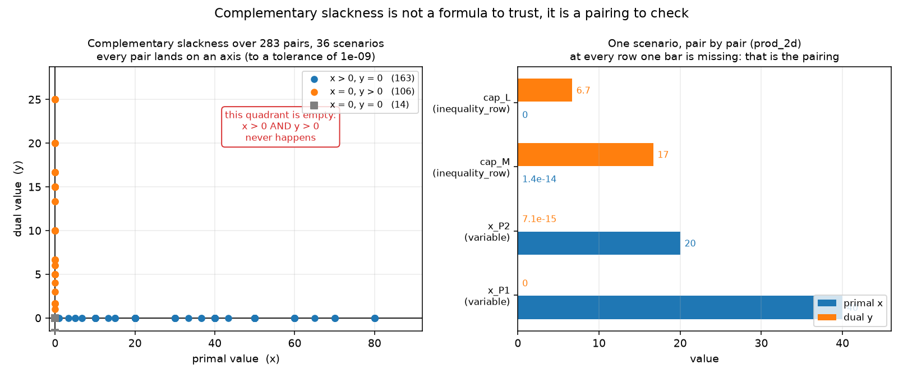
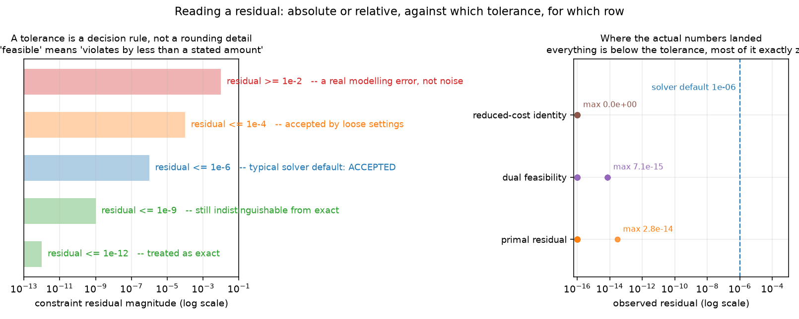

# Week 1 · Day 6：验证 LP：可行性、最优性与浮点容差

> **先读教材正文**：[第 2 章：对偶与敏感性](../教材/02_对偶与敏感性分析.md)、[第 6 章：求解器工程](../教材/06_求解器工程与结果解释.md)。本页用于读后的复习和项目实验，不能代替零基础教材中的完整推导。

[月度索引](../README.md) · [本周知识主线](../week1.md) · [前一天](Day5.md) · [后一天](Day7.md)

> 当日主题：把「求解器说 OPTIMAL」这句话拆开，看清它证明了什么、没证明什么
> 当日产出：**一张三层核对表 + 一张排错对照表 + 一个可复用的对拍脚本**（`m2w1d6_tolerances.py`）
> 建议投入：3～4 小时

---

## 1. 今日学习目标

完成今天的学习后，你应该能够：

1. 说清「求解器返回 OPTIMAL」这句话的**主语是谁**：它说的是后端在它自带的容差内没有找到更好的解，不是「你的业务模型一定有最优解」。
2. 把验证拆成三层——**可行性、目标值、最优性证据**——并说出每一层各自需要什么材料、能排除什么错误。
3. 按**原始数据**（而不是求解器内部的缩放矩阵）重算约束活动值与残差，并解释为什么「残差为 0」与「松弛量为 0」不是同一句话。
4. 用 `Fraction` + `Decimal` 把解舍入后再按精确有理数重算目标，确认报告里的目标值不是浮点凑出来的巧合。
5. 逐对检查互补松弛，说清 283 对里「两个都为正」的那个象限为什么必须是空的。
6. 解释 `feasible` 的准确含义是「违反量小于某个约定值」，并区分**绝对容差**与**相对容差**。
7. 说出数值缩放存在的理由，以及「分钟与秒混用、目标系数 1 与 1e6 混用」这类尺度不一致为什么是最常见的坑。
8. 知道本批 36 个场景的核对数字（最大原始残差 2.842e-14、最大对偶间隙 9.095e-13）是**该批次、该实例、该后端**的一次观察，不能推广成「所有 LP 都这样」。
9. 拿到一个偏差时先看量级再看前提：1e-2 的违反是建模错误，不是噪声。

---

## 2. 为什么第六天要专门做「验证」

Day 4 推出了对偶，Day 5 用影子价格解释了资源变化的边际收益。这两天的推导里藏着一个共同前提：**手上那个 $(x,y)$ 真的是最优解**。今天要做的，就是把这个前提变成一条条可以逐项检查的断言。

有三件事决定了这一天必须单独存在：

1. **状态词不是你的模型的形容词。** 后端收到的是它自己预处理、缩放之后的矩阵；它说的 OPTIMAL 是对**那个矩阵**的结论。你的模型与那个矩阵之间隔着建模代码、单位换算、上界写法与数值缩放，每一层都可能出错。
2. **一行 `assert status == "OPTIMAL"` 什么也没检查。** 状态码是最弱的一种证据：它只说「后端停下来了，并且它认为自己找到了最优解」。要把它变成你自己的结论，必须自己复算一遍。
3. **容差会改变「最优」的含义。** 求解器判断可行性时用的是带容差的比较，所以它返回的解**严格来说可能不可行**，只是违反量小到落在容差之内。你必须知道那个「小」有多大，才能判断眼前这个偏差是噪声还是错误。

一句话：**前四天在造结论，今天在造「凭什么相信这个结论」的检查表。**

这也是 [第 6 章教材](../教材/06_求解器工程与结果解释.md) 开篇那条工作链的落点：输入数据 → 检查数据 → 建模 → 求解 → 解码 → 验证 → 输出。求解器只负责中间一段；验证那一步永远在你的责任范围里。教材里的例子是排程服务，今天把它退化成最简单的情形——只有一个数值模型、一个数值解——把这条链走完整。

---

## 3. 先分清：状态码在回答谁的问题

`pywraplp` 通过 `Solve()` 返回一个整数状态码，本仓库用 `STATUS_NAMES` 把它翻成统一词表：

| 状态 | 读作 | 这时能读到什么 |
|---|---|---|
| `OPTIMAL` | 找到最优解 | primal、dual、reduced cost、slack 全部可用 |
| `FEASIBLE` | 找到可行解，未证明最优 | 只能读 primal 与残差；对偶来自最优基，不可用 |
| `INFEASIBLE` | 没有最优解（注意：见下文） | 什么都没有，本仓库各个字段填 `None` |
| `UNBOUNDED` | 目标无下界 | 本环境实测**一次也没出现过**（见下文） |
| `ABNORMAL` / `NOT_SOLVED` | 求解未能正常结束 | 没有可解释的读数 |

这张表里最重要的是 `dual_available` 这一栏的取舍：本仓库规定**只有 `OPTIMAL` 才给对偶**。原因是影子价格来自最优基，在不可行或未求解的模型上，`dual_value()` 返回的 0 只是内存里的初值，把它当作影子价格就是伪证据。

**本环境的一条实测限制**（写在 `lp_models.py` 的 `GLOP_STATUS_CAVEAT` 里，不是理论结论）：OR-Tools `pywraplp` 9.15 + GLOP 后端对**无界**的 LP 也返回状态码 2，也就是词表里的 `INFEASIBLE`。两个完全不同的情形拿到同一个状态码：

```text
min -x, x >= 0（可行，但目标无下界）      -> 状态 INFEASIBLE
min y, y >= 1 与 y <= 0（真的不可行）    -> 状态 INFEASIBLE
```

所以状态 2 只能读作「**没有最优解**」，绝不能读作「可行域为空」。要区分「不可行」与「无界」，必须另找证据：手算、给变量加人工界、或者换一个后端再看一次。这条限制正好印证了本节开头那句话——状态是**后端对缩放后模型的结论**，它是一个观察，不是一个定理。

**把状态码与三层检查对齐，就得到一张排错对照表**：

| 出错的地方 | 典型症状 | 哪一层能发现 |
|---|---|---|
| 业务规则写错（漏掉资格限制、把软交期写成硬截止） | 解在数学上完美，业务上不可用 | 三层**都发现不了**，只能人工对照业务 |
| 数据单位不一致（分钟与秒混用） | 目标值与预期差 60 倍，或解落在容差边缘 | 第二层（目标重算） |
| 约束系数抄错、不等号方向写反 | 残差量级在 1e-2 以上 | 第一层（可行性） |
| 上界写成变量界而不是约束行 | 对偶目标漏项，gap 不为零 | 第三层（对偶间隙） |
| 读错 `reduced_cost` 的符号 | rc 恒等式不成立 | 第三层（rc 恒等式） |
| 浮点噪声 | 残差在 1e-13 以下且没有结构 | 不属于错误，靠容差量级区分 |

第一行是这张表存在的原因：**求解器永远抓不到业务错误。** 它只能证明「你写给它的模型」；你少写一条资格约束，它就返回一个「最优地违反那条你没写的约束」的方案，而且状态码会光明正大地报 `OPTIMAL`。这就是 [第 6 章教材](../教材/06_求解器工程与结果解释.md) 6.1 节那句「求解器证明的是收到的模型，不是我们本来想表达的模型」。

---

## 4. 第一层核对：把解代回你自己的约束

可行性核对的做法只有一句话：**拿打印出来的变量值，按你自己写的原始系数重算每条约束的左端项，再与右端项比较。**

违反量的定义（对 $a_i^Tx\le b_i$ 的行）是

$$v_i=\max\left(0,\;a_i^Tx-b_i\right),$$

等式行取 $|a_i^Tx-b_i|$；非负要求 $x_j\ge0$ 的违反量是 $\max(0,-x_j)$。模型层面的残差取所有这些量的最大值。

**为什么要用原始数据重算。** 求解器内部把每一行都缩放过，它自己的「活动值」与你的数据差一个缩放因子。直接读它的自述，等于把「求解器有没有解对它自己的矩阵」当成「有没有解对你的模型」。本仓库的 `solve_model` 刻意不调用 `Constraint.activity()`：`activity` 由 `Row.activity(values)` 按系数重算，`max_constraint_residual` 也在这条独立路径上算出。

**「残差为 0」与「松弛量为 0」不是一件事。** 残差只取正向部分：左端项没有越过右端项时它就是 0。松弛量是有符号的，`<=` 行取 $b-a^Tx$。在本批数据里可以看到这个区别：

```text
prod_2d 场景：cap_M 行的 slack = 1.421e-14（略微偏松）
             而 max_constraint_residual = 0.000e+00（没有越过，所以残差为 0）
```

一个 1.4e-14 的 slack 说明这一行**没有被精确压到等号上**，但它是「还差一点才到」的一侧，属于可行方向，因此不产生残差。若把它误当成违反量，就会把浮点尘埃判成错误。

**手算一遍「看起来更优的不可行点」。** Day 1 的最优解是 $(40,20)$，两条资源都恰好用完。现在把第一分量微调成 40.001：

```text
约束一：2 x 40.001 + 20 = 100.002   -> 越过 0.002
约束二：40.001 + 2 x 20 = 80.001    -> 越过 0.001
目标值：40 x 40.001 + 30 x 20 = 2200.04  -> 比 2200 高
```

它看起来「利润更高」，但只是违反约束，并非发现了更优解。第一层核对的作用就是拦住这类误判：**目标值可观，不等于方案可行。**

**本批 36 个 OPTIMAL 场景的第一层结果**（取自 `artifacts/month2_w1/results.csv` 的 `max_constraint_residual` 列）：

| 量 | 观察值 |
|---|---|
| 场景总数（37 个里除去 1 个刻意不可行的算例） | 36 |
| 残差**恰好为 0** 的场景数 | 35 / 36 |
| 最大残差 | 2.842e-14（出现在 `profit_P2_45`） |
| 在 1e-6 容差下越界的场景数 | 0 |

**相对残差也要算一遍。** 2.842e-14 出现在一条右端项为四位数的约束上，相对量级在 1e-17 上下；即便改用本批数据里较小的右端项做分母，相对量级仍在 1e-15 以下。「先算相对量级，再谈严不严重」，这条习惯后面每次都要用到。

**把第一层写成代码，骨架只有几行：**

```python
for row in model.rows:                # 遍历你自己的约束（不是求解器的）
    activity = row.activity(primal)   # 按原始系数重算 a'x
    if row.sense == "<=":
        violation = max(0.0, activity - row.rhs)
    elif row.sense == ">=":
        violation = max(0.0, row.rhs - activity)
    else:
        violation = abs(activity - row.rhs)
    worst = max(worst, violation)
```

重点在第一行与第二行里的**「你自己的」**四个字：`model.rows` 是建模时记下来的结构化系数记录（`Row`），不是求解器的约束对象。文档字符串里那句「不直接复用求解器内部约束对象」，落到代码上就是这一处选择。

---

## 5. 第二层核对：用原始目标函数重算目标值

第一层确认了「这个点可行」，第二层要确认「报告里那个数确实是这个点的目标值」。做法同样是自己动手：把 $x$ 代回 $\max 40x_1+30x_2$，与求解器打印的 `objective` 比。

日常手算到此为止。但今天的脚本把这件事做得更彻底，值得学的是它的**方法**而不是它的结论：

```text
x_P1 = 39.999999999999986   -> 保留 12 位小数 -> 40.0
x_P2 = 20.00000000000001    -> 保留 12 位小数 -> 20.0
把舍入后的整数解按精确有理数（Fraction + Decimal）重算目标：2200
求解器报的目标：2200.0
差 = 0.000e+00
```

这一步同时回答了两个问题：

1. **读数尾巴是不是模型误差？** 不是。`39.999999999999986` 与 40 的差是浮点表示误差，舍入到 12 位小数后就消失了；把舍入后的整数解代回原模型，两条约束的残差精确为 0。
2. **报告里的目标值是不是浮点凑巧？** 用有理数精确重算得到 2200（精确到整数），与求解器报的 2200.0 一致，说明这个数是真的，不是舍入出来的巧合。

**为什么不能反过来用「重算的目标等于报告目标」证可行性。** 一个违反约束的点也能算出 2200.04 这样的目标值，重算与报告要相等同样成立。目标重算是**交叉核验**，不是可行性证明；两层的顺序不能颠倒。

**三条常见错误**：

1. **把 `Objective().Value()` 当成永远可用。** 不可行时它返回 `0.0`，与「最优值为 0」在读数上无法区分。本仓库因此只在 `SOLVED_STATUSES` 下才填 `objective`。
2. **两条路径其实来自同一个读数。** 目标重算的价值在于**换一条路径**；如果「重算」只是把求解器报的数原样搬一遍，它什么也没验证。所以脚本要先舍入到 12 位小数、再用精确有理数算。
3. **换了单位却忘了同步目标。** 把工时从分钟改成秒时，目标系数、交期与时间界都要一起改；只改一处的实验记录事后无法与历史结果比较。

---

## 6. 第三层核对：最优性证据

前两层确认「这是一个可行且目标值读对的点」。第三层才回答「凭什么说它最优」。这里要用到 Day 4 的证据，而且要**分开列**，因为它们各自排除不同类型的错误：

| 检查 | 数值定义 | 排除什么错误 |
|---|---|---|
| 对偶间隙 | $\lvert c^Tx-b^Ty\rvert$ | 对偶目标与原始目标不匹配（强对偶不成立） |
| 互补松弛 | $\max\lvert x_j\cdot rc_j\rvert$ 与 $\lvert slack_i\cdot y_i\rvert$ | 解可行但**不是**最优 |
| rc 恒等式 | $\max\lvert rc_j-(c_j-\sum_i a_{ij}y_i)\rvert$ | 读错了 `reduced_cost` 的符号约定 |
| 对偶可行性 | $y$ 的符号条件与 $\sum_i a_{ij}y_i\ge c_j$ | 对偶解本身不可行（那 gap=0 也没有意义） |
| 对偶的对偶 | 再解一次 `build_dual(dual)` 的目标 | `build_dual` 的结构写错 |

**先看「对偶的对偶」这一条**，它是本仓库的一条无参检查：$\max$ 问题的对偶是 $\min$，再取一次对偶应当回到原问题，目标值也应当回到原值。本批 36 个场景全部通过（`dual_involution_ok = True`），这说明对偶模型不是手工拼出来的特例。

**本批 36 个场景的分布**（`最大` 说的是最坏情况，`非零场景数` 说的是典型情况，两列要一起读）：

| 量 | 最大 | 非零的场景数 |
|---|---:|---:|
| 原始残差 | 2.842e-14 | 1 / 36 |
| rc 恒等式 | 0.000e+00 | 0 / 36 |
| 互补松弛 | 5.684e-13 | 23 / 36 |
| 对偶可行性 | 7.105e-15 | 7 / 36 |
| 对偶间隙 | 9.095e-13 | 7 / 36 |

「原始残差最大 2.842e-14」与「35 / 36 个场景残差恰好为 0」这两句话不矛盾，但**只说前一句会给人错误的印象**：典型情况不是「一个很小的正数」，而是**精确的零**。`rc 恒等式` 那一行更极端——它是一次纯代数复算，不经过求解器迭代，36 个场景全部精确为 0。

**再手算一遍 prod_2d 的互补松弛**（Day 4 推出的 $y=(50/3,20/3)$，$x=(40,20)$）：

```text
x_P1 = 40 > 0       -> 要求 rc_P1 = 0
                       rc_P1 = 40 - (2 x 50/3 + 1 x 20/3) = 40 - 40 = 0       对上了
x_P2 = 20 > 0       -> 要求 rc_P2 = 0
                       rc_P2 = 30 - (1 x 50/3 + 2 x 20/3) = 30 - 30 = 0       对上了
cap_M  slack = 0    -> 要求 y_M 可以不为 0，读数 16.667 = 50/3                对上了
                       （这一行的 slack 实际读数是 1.421e-14，见第 4 节）
cap_L  slack = 0    -> 要求 y_L 可以不为 0，读数 6.667 = 20/3                 对上了
```

四条全部满足。注意**反方向不成立**：松弛为 0 的行，它的影子价格也可能为 0；检验数为 0 的变量，产量也可能为 0。互补松弛是「至少一个为零」的配对关系，不是「一个正另一个就必然正」。

**为什么 283 对里没有一个落在「两个都正」的象限。** 因为 Day 4 的那个分解

$$b^Ty-c^Tx=\underbrace{y^T(b-Ax)}_{\text{松弛项}}+\underbrace{x^T(A^Ty-c)}_{\text{检验数项}}$$

右侧每一项都非负，而它们的和正是对偶间隙——本批 36 个场景里这个间隙最大 9.095e-13，按 1e-9 的尺子就是 0。于是每一项都必须为 0，而每项又是若干非负乘积之和，所以**逐个乘积都得为 0**。「两个都为正」会给出一个严格正的乘积，直接让这个和为 0 的结论崩掉。



- 左面板把本批 36 个场景的 283 对 $(x,y)$ 全部画成散点：横轴是 primal value（`x`，这里是变量值或行的松弛），纵轴是 dual value（`y`，这里是检验数或影子价格）。
- 图例里的三个计数分别对应「$x>0$ 而 $y=0$」（163 对）、「$x=0$ 而 $y>0$」（106 对）、「两个都为 0」（14 对）；红框标注的那句 *this quadrant is empty* 指的是右上角——「$x>0$ **且** $y>0$」一对都没有。
- 右面板把 `prod_2d` 一个场景摊开逐对看：每一行上原始量（primal x，蓝）与对偶量（dual y，橙）两根条形**总有一根接近 0**，标题里那句 *at every row one bar is missing* 说的就是这件事。
- 与手算对照：`cap_L` 的 dual 是 6.7（即 $20/3$）、`cap_M` 的 dual 是 17（图上一位小数，精确值 $50/3$）、`x_P2` 的 dual 显示为 7.1e-15 —— 理论上应当是 0，读出来的这个尾巴是浮点噪声。

**「283 对全部为 0」这句话要加限定词。** 用 1e-9 阈值判定，283 对全部落在坐标轴上；但严格的浮点乘积里有 35 对不是精确的 0，最大到 5.684e-13。这个 1e-13 量级的尾巴正是下一节要讨论的对象。

---

## 7. 容差的准确含义

`feasible` 不等于「精确满足」，而是「**违反量小于某个约定的值**」。默认值常常是 $10^{-6}$：Gurobi 把 `FeasibilityTol` 的默认值定在这个量级；本环境的 GLOP 更严一些（原始/对偶可行性容差在 $10^{-8}$ 量级）。这些数字是**求解器自己的判断规则**，不是数学常数。



- 左面板是一条容差阶梯（横轴为对数刻度的 constraint residual magnitude）：`residual <= 1e-12` 标注为 *treated as exact*，`1e-9` 是 *still indistinguishable from exact*，`1e-6` 是 *typical solver default: ACCEPTED*，`1e-4` 是 *accepted by loose settings*，而 `residual >= 1e-2` 才是 *a real modelling error, not noise*。
- 右面板把本批实测值投影到同一根对数轴上，三条系列分别是 `primal residual`（最大 2.8e-14）、`dual feasibility`（最大 7.1e-15）与 `reduced-cost identity`（最大 0.0e+00，即全部精确为 0），虚线 `solver default 1e-06` 是求解器默认的可行性容差。
- 一句话读法：**所有实测残差都比 1e-6 低 8 个数量级**（精确为 0 的那些更是无从比较），连「容差边缘」都够不上；同时可以看到 `reduced-cost identity` 那一行整条压在 1e-16 的地板上，因为它是一次纯代数复算，不经过求解器迭代。

**绝对残差与相对残差不是一回事。** 一条约束左端项的量级是 $10^6$ 时，$10^{-6}$ 的绝对残差是百万分之一的相对误差，通常无关紧要；而同一条约束若左端项的量级只有 $10^{-2}$，同样的绝对残差就是 100% 的误差。检查器常用的比较规则是

$$|a-b|\le\varepsilon_{abs}+\varepsilon_{rel}\max(|a|,|b|),$$

绝对容差管接近零的数，相对容差管数值尺度。**注意这只是验证器的一种比较规则，不代表求解器内部必然使用同样的容差。**

**「多严算太严」可以实测。** 脚本用同一批数据在 $10^{-15}$ 到 $10^{-6}$ 之间扫了一遍阈值：

```text
       阈值       通过场景数   未通过者
    1e-15           2   prod_2d、prod_base
    1e-14           2   prod_2d、prod_base
    1e-13           2   prod_2d、prod_base
    1e-12           4   无
    1e-11           4   无
    1e-09           4   无
    1e-06           4   无
```

$10^{-15}$、$10^{-14}$、$10^{-13}$ 这三个阈值把浮点尘埃判成了错误——它们不是「更严格」，而是**没有意义**：连「精确为零」的量在双精度下都未必读成 0。本仓库因此取 `DEFAULT_TOLERANCE = 1e-9`：比实测噪声宽约 4 个数量级，又严于求解器自带的 $10^{-8}$ 量级可行性容差。它的定位是**事后对拍用的尺子**，不用来放宽求解器的行为。

**阈值要结合单位、数据精度和后果选，不是越小越科学。** 库存单位是「件」、预算单位是「元」、时间单位是「秒」时，三者能容忍的绝对偏差完全不同——「产量差 1e-9 件」可以忽略，「安全库存差 1e-9 件」也几乎总是可以忽略，但「交付量差 1e-9 件」在合同里就只能取整来谈。挑选阈值时至少要交代清楚三件事：

| 要交代的 | 本项目的答案 |
|---|---|
| 用的是什么容差 | 事后对拍取 `DEFAULT_TOLERANCE = 1e-9`，记录在 `metadata.json` 的 `tolerance` 字段 |
| 为什么是它 | 比实测噪声（2e-13 量级）宽约 4 个数量级，又严于求解器自带的 1e-8 量级可行性容差 |
| 它管什么、不管什么 | 管「事后比较两个读数是否算相等」；**不**用来放宽求解器内部的可行性判断 |

第三行是这份表里最容易被忽略的一行。把对拍阈值调宽，不会让模型更可解；它只会让检查器少报警。两件事必须分开存放、分开记录。

---

## 8. 数值缩放：为什么单位也算技术问题

浮点 MILP/LP 不用精确实数运算。系数之间的量级跨度一旦拉开，求解器就会在小数位上丢精度：$10^6$ 量级的系数与 $10^{-3}$ 量级的系数写在同一个矩阵里，双精度能保留的有效位要同时兼顾两头。

**变量、成本与约束系数尽量控制在同一个合理尺度**，通常比一味收紧容差更有意义。三个最常见的尺度不一致：

1. **时间单位混用。** 一部分工序用分钟、一部分用秒，系数比是 60；若再把目标函数写成「按小时计的收益」，又多一层 3600。
2. **目标系数跨量级。** 两个产品的单位利润是 1 与 $10^6$，最优基的选择会被大数主导，小数的差异落进浮点噪声里。
3. **大 M 型约束。** $x\le Mz$ 里的 $M$ 取得极大，而 $z$ 接近零但仍在整数容差范围内，右侧仍可能允许显著的 $x$（[第 6 章教材](../教材/06_求解器工程与结果解释.md) 6.6 节的例子）。

**处理顺序**是先检查单位、再推导有效的变量界、缩小不必要的 $M$、避免巨大的系数跨度，最后才考虑参数容差。换单位时要同步改目标、交期和时间界，只改一处等于把尺度问题换个地方藏起来。

官方背景见 [Gurobi 数值容差与缩放说明](https://docs.gurobi.com/projects/optimizer/en/current/concepts/numericguide/tolerances_scaling.html)。本项目的对拍阈值写在 `artifacts/month2_w1/metadata.json` 里（`tolerance = 1e-09`，并附上选它的理由），做实验时应当把这个值一起记录，而不是只记结果。

---

## 9. 不唯一的时候：验证不变量，而不是变量值

一个可复现的实验不该建立在「每次求解都给出同一组变量值」这个假设上。本批核心场景里的 `transport_base` 与 `assign_base` 目标值都是整数、看起来很干净，但**它们的解有多唯一，是两回事**：运输模型的对偶最优解一定不唯一（下面给出平移的理由），而 `assign_base` 的最优指派只在这一份费用矩阵上唯一。

Day 3 已经说明：运输模型的最优对偶解成对出现。若 $(u,v)$ 是一组最优位势，那么对任意实数 $t$，

$$u_i\leftarrow u_i+t,\qquad v_j\leftarrow v_j-t$$

之后，每条运输边上的 $u_i+v_j$ 不变，平衡运输的对偶目标 $b^Ty$ 也不变。于是同一份数据可以返回**数值完全不同**的两组最优位势——这不是实现不稳定，而是问题本身有多个最优解。

**因此该比较的是不变量**：双方可行性、目标值、对偶不等式与互补松弛的配对关系。不宜断言「每个变量必须与一次历史输出逐位一致」；确实需要唯一解时，应明确写出「我们额外使用了某种择优规则」（例如平局按名字升序），而不是声称数学最优解唯一。`assign_base` 的最优指派在本实例上唯一，但那也是**这一份费用矩阵**的性质，不是指派问题的普遍性质。

Day 5 已经见过类似现象的另一面：$b=40$ 与 $b=160$ 这两个折点上，对偶最优解不再唯一，某个对偶值是支持超平面的斜率，不能当成双侧唯一的导数。

---

## 10. 拿到一个偏差时的排查顺序

**不要把「浮点噪声」当成所有偏差的解释。** 它是最后一个假设，不是第一个。顺序应当是：先看量级，再看前提是否成立，最后才怀疑浮点。

| 偏差量级 | 先怀疑什么 | 不该说的话 |
|---|---|---|
| 恰好 0 或 1e-13 以下 | 不是错误 | —— |
| 1e-9 ~ 1e-6 | 是否踩在求解器容差上、是否存在尺度跨度 | 「一定是噪声」 |
| 1e-4 ~ 1e-2 | **建模错误**：系数抄错、单位不一致、不等号写反 | 「浮点误差嘛」 |
| 1e-1 以上 | 前提不成立：变量名错配、约束根本没进模型 | 「再收紧容差就好」 |

三种「看起来像噪声」、其实是前提问题的情形，各记一条：

1. **尺度问题。** 残差 1e-6 落在量级 1e6 的行上是噪声，落在量级 1e-2 的行上是灾难。判断前先算相对量级。
2. **建模错误。** 把「每小时加工 3 件」写成「每件 3 小时」，残差会是 1e-1 量级；求解器不会报错，它会给你一个基于错误模型的「最优解」。
3. **读法错误。** 第 11 节的假警报探针里，那个 $y=(20,10)$ 对偶可行、对偶目标 2800 也「像个正经数字」，但它不是最优证书。**数字大小正常不等于语义正确**，这一类只能靠互补松弛与恒等式抓。

**顺序反过来会掩盖真正的错误。** 一旦先入为主认定「差这一点是浮点问题」，下一步就会去调容差；而调宽容差只会让错误消失得更彻底——检查器不再报警，模型却仍然是错的。

---

## 11. 实验：`m2w1d6_tolerances.py` 逐节读

脚本链接：[m2w1d6_tolerances.py](../../projects/02_optimization_models/examples/m2w1d6_tolerances.py)。

从仓库根目录运行：

```powershell
python projects/02_optimization_models/examples/m2w1d6_tolerances.py
```

脚本的设计原则写在文件开头的 docstring 里：**对拍用的量全部由本模块自己复算**——约束活动值按系数重算、对偶目标由 `build_dual` 独立求解，不抄求解器的自述。全文件分八节，下面按节读。

**第 1 节：五条独立核对的定义。** 先把要检查的量一次列清（约束残差、互补松弛、rc 恒等式、对偶可行性、对偶目标），后面每一节都在复用这五条。这一节的写法值得学：把「要检查什么」写在最前面，读者才知道后面那些数字在对抗哪些错误。

**第 2 节：四个核心场景的核对结果。** `metrics(model)` 对每个模型做两件事——解原始模型、解对偶模型——然后一次性返回五个量。

```text
场景                  primal      dual      |gap|     相对 gap         残差       互补松弛      rc 恒等       对偶可行
prod_2d               2200      2200  4.547e-13  2.067e-16  0.000e+00  2.368e-13  0.000e+00  7.105e-15
prod_base             2300      2300  0.000e+00  0.000e+00  0.000e+00  2.132e-13  0.000e+00  0.000e+00
transport_base         180       180  0.000e+00  0.000e+00  0.000e+00  0.000e+00  0.000e+00  0.000e+00
assign_base              9         9  0.000e+00  0.000e+00  0.000e+00  0.000e+00  0.000e+00  0.000e+00
```

四行里 `primal` 与 `dual` 两列都由**独立求解**得到；它们只在浮点噪声级别上不同，其余四个量都在 1e-13 以下。`相对 gap` 用的是 $\lvert gap\rvert/\max(1,\lvert\text{objective}\rvert)$，脚本把它单列一列，是为了避免拿 4.5e-13 这个绝对数去吓自己。

**第 3 节：容差探针。** 就是第 7 节引的那张表。它的结论只有半句——「多严算太严」。脚本特意在输出里写明：「多松算太松」要靠构造已知错误来检验，所以脚本的**第 7 节**会喂一个已知错误的输入。

**第 4 节：浮点噪声。** 把 `prod_2d` 的解按 12 位小数舍入，再用 `Fraction(Decimal(str(...)))` 精确重算目标，得到第 5 节引用的那几行输出。

**第 5 节：状态码陷阱。** 现建两个 LP：`min -x, x >= 0`（可行但无界）与 `min y, y >= 1, y <= 0`（真的不可行），两者都返回 `INFEASIBLE`。这一节是今天对「状态码」最直接的反驳。

**第 6 节：不可行算例里哪些字段是 `None`。**

```text
状态 INFEASIBLE，objective = None，dual_available = False
primal = {}   dual = {}   slack = {}
max_constraint_residual = None
互补松弛检查 = None
冲突来自两条手算就能看出的行：
  demand_P2: <= 50
  delivery_P2: >= 60
```

**`None` 不是 0。** `pywraplp` 在不可行时 `Objective().Value()` 返回 `0.0`；若把它当目标值写进结果表，就是把「没有解」伪装成「解为 0」。本仓库的 `LPSolution` 只在 `SOLVED_STATUSES` 下才填 `objective`，互补松弛在没有对偶解时返回 `None`——**没有检查过不等于检查通过**。这两条判断证据的边界，比任何具体数字都重要。

顺带注意，冲突的**证据来自手算**：$x_{P2}\le50$ 与 $x_{P2}\ge60$ 不可能同时满足。这条结论不是从状态码推出来的。同一份数据里还有第二条冲突：交付 60 件 `P2` 需要 120 单位 `L`，超过 `L` 的产能 80。

**第 7 节：检查器真的会报警吗。** 前面几节都在展示「检查通过」，这一节反过来喂一个已知错误的输入，验证检查器**确实会报警**：

```text
取一个对偶可行但不是最优的 y = {'cap_M': 20.0, 'cap_L': 10.0}
  对偶可行违反量 = 0.000e+00（符号条件与对偶约束都满足，所以它是 0）
  互补松弛违反量 = 4.000e+02（x_P1 = 40 而 rc_P1 = -10，乘积不为 0，被抓到）
  与原始最优目标的差 = 600
```

手算核对这个反例：$y=(20,10)$ 满足 $2y_1+y_2=50\ge40$ 与 $y_1+2y_2=40\ge30$，所以它**对偶可行**，对偶目标 $100\times20+80\times10=2800$ 仍是原问题的一个合法上界；但它不是最优的——$x_{P1}=40$ 而 $rc_{P1}=40-(2\times20+1\times10)=-10$，乘积 $-400$ 不为零，互补松弛立刻抓到了。

这一节把第三层的五个检查分出了层次：**对偶可行性是必要条件，光有它不够；互补松弛才是把「可行」推进到「最优」的那一步。**

**第 8 节：断言。** 前七节都在打印，最后一节把结论固化成 `assert`：四个核心场景各自的 gap 与四个检查量都必须小于 `DEFAULT_TOLERANCE`；不可行算例的 `objective` 与互补松弛检查必须是 `None`。这样脚本一旦跑通，就把今天这张对拍表变成了回归测试。

---

## 12. 今日练习

1. **练习 1（手算）**：取 $x=(39.999,20)$，按原始系数算两条资源约束的残差与目标值，判断它属于「噪声级」「可疑」还是「错误」，并写出你的判断依据。
2. **练习 2（手算）**：`prod_base`（三产品 $\max40x_1+30x_2+25x_3$，产能 100/80，需求上限 40/50/80）的最优点是 $x=(20,0,60)$、$y=(15,10,0,0,0)$。逐条写出这 8 对互补松弛，并说明 `demand_P3` 那一行的影子价格**必须**为 0。
3. **练习 3（实现）**：给脚本加一节，把 `max_primal_nonnegativity_violation` 也打进第 2 节的表里；说明它在本批数据上为什么恰好为 0，以及什么情形下它会是一个极小的正数。
4. **练习 4（反例）**：构造一个小的对数容差探针，使得「阈值 $10^{-13}$ 通过、$10^{-6}$ 不通过」——即一个真正的建模错误恰好落在两个量级之间。
5. **练习 5（工程）**：把脚本第 2 节的输出改成「只在检查不通过时打印」，并说明为什么这样改之后仍然需要保留通过/不通过的计数。

---

## 13. 验收清单

- [ ] 能用一句话说清「求解器说 OPTIMAL」的**主语**是后端对缩放后矩阵的结论，不是你的模型。
- [ ] 能复述状态码陷阱：本环境 GLOP 对无界 LP 也返回 `INFEASIBLE`（状态码 2）。
- [ ] 能写出违反量的定义 $v_i=\max(0,a_i^Tx-b_i)$，并说清它与有符号 slack 的区别。
- [ ] 手算过 $(40.001,20)$ 的越界量 0.002 与 0.001，并知道它比 2200 高的那 0.04 不构成改进。
- [ ] 能复述 `prod_2d` 的四条互补松弛配对，并知道反方向不成立。
- [ ] 说得清 283 对里「两个都正」的象限为什么必须为空，也知道严格来讲有 35 对不是精确的 0。
- [ ] 能解释 `feasible` = 「违反量小于约定值」，并区分绝对容差与相对容差。
- [ ] 知道本批最大原始残差 2.842e-14、最大对偶间隙 9.095e-13，并知道这是该批次的一次观察。
- [ ] 知道本仓库 `DEFAULT_TOLERANCE = 1e-9` 是**事后对拍**的阈值，不用来放宽求解器。
- [ ] 知道不可行时各字段是 `None` 而不是 0，且「没有检查过」不等于「检查通过」。
- [ ] 能说出一个「对偶可行但非最优」的反例，并指出互补松弛为什么抓得到它。
- [ ] 脚本第 8 节的断言能在本环境跑通。

---

## 14. 自测题

- Q1：求解器返回 `OPTIMAL`，能证明哪些事情？不能证明哪些事情？
- Q2：为什么验证要自己重算约束活动值，而不是调用求解器的约束对象接口？
- Q3：残差为 0 与 slack 为 0 有什么区别？举一个本批数据里的例子。
- Q4：`(40.001,20)` 的目标值 2200.04 比 2200 大，为什么不构成更优解？
- Q5：把解舍入到 12 位小数后用 `Fraction` 重算目标，这一步排除了哪种怀疑？
- Q6：互补松弛的 283 对里，「$x>0$ 且 $y>0$」的象限为什么必须是空的？
- Q7：「松弛为 0 的行，影子价格一定为正」这句话对吗？
- Q8：$10^{-15}$ 的容差阈值为什么不是「更严格」，而是「没有意义」？
- Q9：约束左端项量级是 $10^6$ 时，$10^{-6}$ 的绝对残差算严重吗？为什么不能一概而论？
- Q10：本批 36 个场景的最大残差是 2.842e-14，能不能写成「LP 求解器的原始残差一般在 1e-14 量级」？
- Q11：不可行算例里 `objective = None` 而不是 `0.0`，这个选择的理由是什么？
- Q12：脚本第 7 节那个 $y=(20,10)$ 是对偶可行的，为什么它仍然不是最优证书？

### 参考答案

- A1：能证明的是「后端在它自带的容差内，对**它收到的那个（已预处理、已缩放的）矩阵**没有找到更好的解」。不能证明：你的建模代码与业务规则一致、你的数据单位统一、返回的点严格满足你的原始约束、以及你的模型确实有最优解。状态是后端的结论，还要你自己复算才能变成你的结论。
- A2：求解器内部把每一行都缩放过，它的活动值与你的原始数据差一个缩放因子；直接读它的自述，等于把「它有没有解对它自己的矩阵」当成「有没有解对你的模型」。本仓库的 `activity` 由 `Row.activity(values)` 按系数重算，是一条独立路径。
- A3：残差只取正向部分，左端项没有越过右端项时它就是 0；slack 是有符号的。本批 `prod_2d` 的 `cap_M` 行 slack = 1.421e-14（略偏松），但 `max_constraint_residual = 0`，因为它是「还差一点才到」的一侧，属于可行方向。
- A4：因为它违反了约束。第一资源越界 0.002、第二资源越界 0.001，它根本不在可行域里。目标值必须在可行域上比较；不可行点的高目标只是没被约束惩罚的虚数。
- A5：排除了「读数尾巴是模型误差」与「报告的目标值是浮点凑巧」两种怀疑：舍入到 12 位小数后解落到整数格点上，用有理数精确重算得到精确的 2200，与求解器报告一致，说明 1e-14 的尾巴是浮点表示误差而不是模型误差。
- A6：因为对偶间隙的分解把 $b^Ty-c^Tx$ 写成两个非负项之和，而每项又是若干非负乘积之和。这两部分的和就是对偶间隙，本批最大 9.095e-13（按 1e-9 的尺子就是 0），所以每一项都必须为 0，于是每个乘积都得为 0。「两个都正」会给出一个严格正的乘积，与「和为零」矛盾。
- A7：不对。互补松弛只要求「至少一个为零」，不要求「一个为零则另一个为正」。反例就在 Day 5 的敏感性扫描里：折点处对偶最优解不唯一，某个松弛为 0 的行仍可以有价格为 0 的对偶解。
- A8：因为双精度下「精确为零」的量也未必读成 0，本环境实测的最大噪声在 2e-13 量级。$10^{-15}$、$10^{-14}$、$10^{-13}$ 这三个阈值会把浮点尘埃（例如 `prod_2d` 的 2.368e-13）判成错误，得到的是假警报，不是更强的检查。
- A9：不能一概而论。$10^{-6}$ 相对于 $10^6$ 是百万分之一的相对误差，通常无关紧要；同样的绝对残差落在量级为 $10^{-2}$ 的行上就是 100% 的误差。判断必须结合相对尺度——这也是比较规则写成 $\varepsilon_{abs}+\varepsilon_{rel}\max(|a|,|b|)$ 的原因。
- A10：不能。2.842e-14 是**该批次、该实例、该后端**（本环境 GLOP）的一次观察。换一组数据、换一个求解器、换一个缩放策略，噪声量级都可能变化；把一次实测写成一般结论，正是教材 6.9 节反复提醒的那类错误。
- A11：因为 `pywraplp` 在不可行时 `Objective().Value()` 返回 `0.0`。直接沿用会把「没有解」伪装成「解为 0」——0 也可能是一个有意义的目标值，两者无法区分。填 `None` 让「这个方法不提供这个量」变成显式信息。
- A12：因为它只满足**对偶可行性**，而最优性需要原始与对偶**双方**最优且互补松弛成立。手算 $rc_{P1}=40-(2\times20+1\times10)=-10$，而 $x_{P1}=40>0$，乘积 $-400$ 不为零，互补松弛直接失败。它的对偶目标 2800 是原问题的一个合法上界，但不紧。

---

## 15. 今日一句话总结

> **求解器的状态是后端对缩放后矩阵的结论；要把它变成你的结论，必须自己重算约束、重算目标，再把互补松弛逐对核一遍——容差只决定「多小的偏差不算错」，不决定「哪些前提成立」。**

---

## 配套代码入口

从仓库根目录运行（需先按[项目指南](../../projects/02_optimization_models/PROJECT_GUIDE.md)配置环境）：

```powershell
python projects/02_optimization_models/examples/m2w1d6_tolerances.py
```

[阅读示例源码](../../projects/02_optimization_models/examples/m2w1d6_tolerances.py)。先完成正文的三层手算，再用脚本核对项目实例；记下实例名、状态、五个核对量与所用的容差阈值，不把一次运行的读数当成固定结论。本页引用的批次数据在 [`artifacts/month2_w1/results.csv`](../../projects/02_optimization_models/artifacts/month2_w1/results.csv)，每张图的生成代码在 [`examples/m2_figures.py`](../../projects/02_optimization_models/examples/m2_figures.py)。实现与数学语义的区别见[概念勘误](../CONCEPT_CORRECTIONS.md)。
