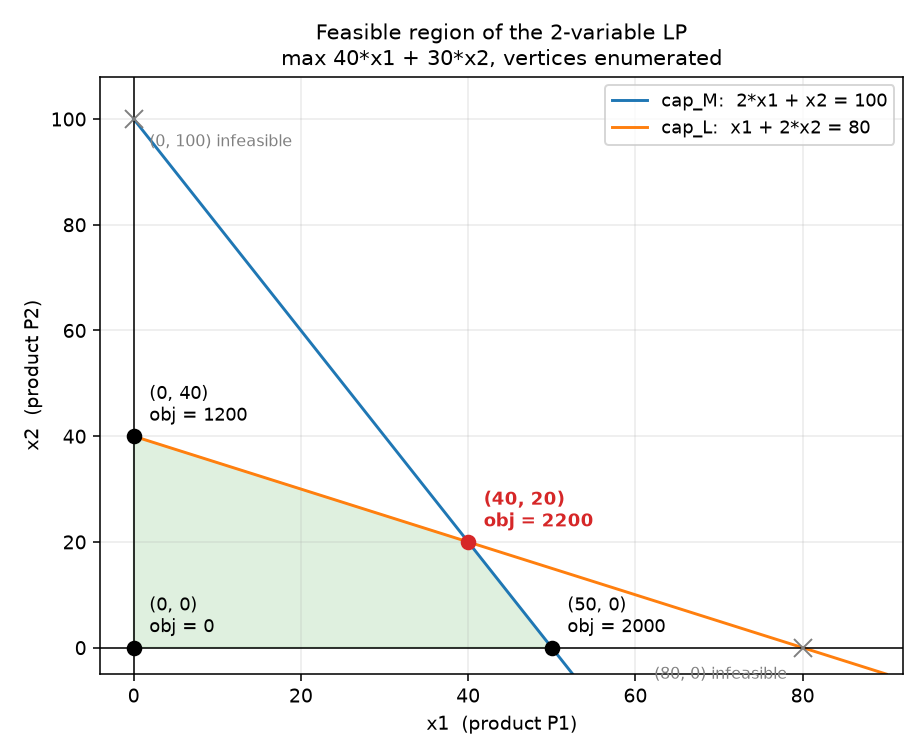
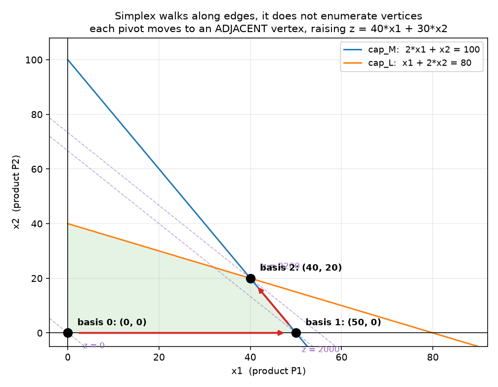
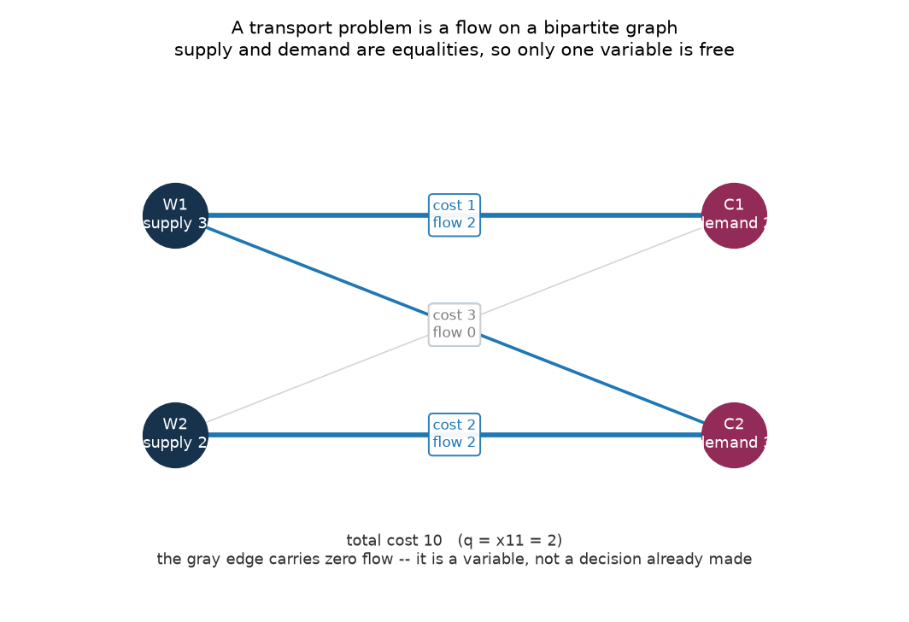
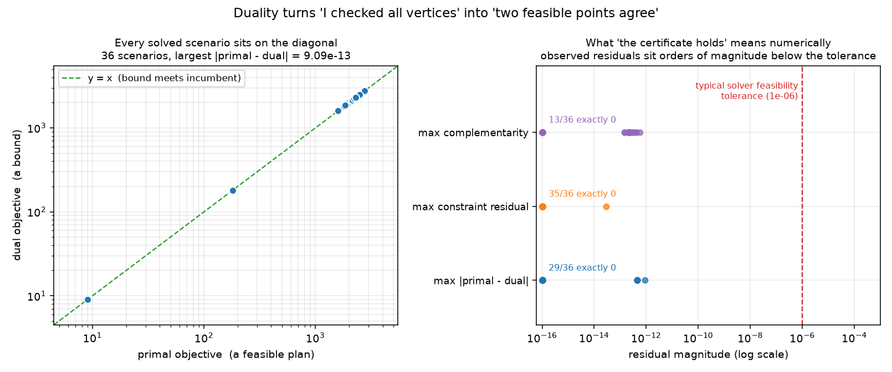
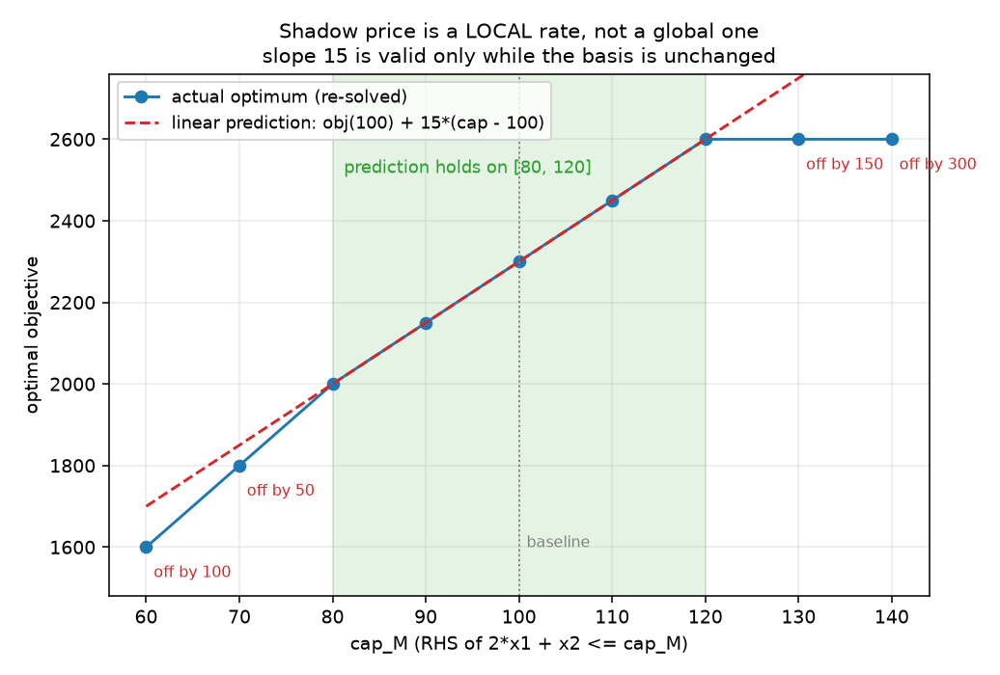

# Week 1 · Day 7：第一周复盘：模型、解与证书构成一条链

> **先读教材正文**：[第 1 章：线性规划](../教材/01_线性规划从建模到求解.md)、[第 2 章：对偶与敏感性](../教材/02_对偶与敏感性分析.md)、[第 7 章：综合实训](../教材/07_综合实训与解答.md)。本页用于读后的复习和项目实验，不能代替零基础教材中的完整推导。

[月度索引](../README.md) · [本周知识主线](../week1.md) · [前一天](Day6.md)

---

## 1. 今日学习目标

完成今天的学习后，你应该能够：

1. 合上笔记写出 Day 1 的两产品生产模型，并逐条说出每个变量、每条约束的单位，以及哪些是参数、哪些是决策量。
2. 说清「沿边走」与「枚举顶点」为什么都能到最优，各自需要什么前提，以及为什么二者不是同一种算法。
3. 说出运输与指派模型的整数解来自矩阵结构，并举出一个会破坏该结构的额外约束。
4. 独立构造一个生产 LP 的对偶，用弱对偶写出一句完整的最优性证明，并指出强对偶额外需要什么。
5. 解释同一个影子价格为什么在一个区间内有效、出了区间就失效，以及失效的原因是基换了而不是数字算错了。
6. 把可行性、目标重算、最优性证据当成三件互相独立的事，分别给出检查方法，并说明容差在其中扮演什么角色。
7. 用教材第 7 章实训一的生产计划题完整走一遍「建模 - 手算 - 求解 - 对偶解释 - 扰动检查 - 核验」，每一步都给出依据和可手算的数字。

---

## 2. 复盘不是摘要，是重组

一周六天，每天各有一个结论。复盘最容易做错的地方，是把六天的结论按顺序再贴一遍——那样得到的是一份**目录**，不是一条**链**。今天要做的是把六个结论重新组织起来，让它们互相支撑：后一环解决的问题，正是前一环留下的。

一条 LP 从业务问题走到可以交给别人复核的结论，中间要过六个环节：

| 环 | 回答的问题 | 对应 | 交给下一环的东西 |
|---|---|---|---|
| 1. 模型 | 求什么、哪些决定被允许 | Day 1 | 可行域（凸多面体）与线性目标 |
| 2. 解 | 在这么大的可行域里怎么找到最优点 | Day 2 | 一个基本可行解与一套基 |
| 3. 结构 | 为什么有些模型不用求解器也能得整数 | Day 3 | 「整数性来自结构」的判断力 |
| 4. 界 | 凭什么说这个解已经最好 | Day 4 | 对偶可行解 = 目标值的上界 |
| 5. 局部性 | 输入变了，这套解释还能用多久 | Day 5 | 价格有效的区间与折点 |
| 6. 核验 | 上面每一步的数字可信吗 | Day 6 | 可行性、目标重算、最优性证据 |

六环的顺序不是随意的：**第 4 环的「界」必须在第 1 环的模型上定义，第 5 环的「区间」必须在第 4 环的基上算，第 6 环检查的是前五环的产物。** 中间任何一环塌掉，后面的数字都会变成「没被验证过的字符串」。

复盘有三件事**不该做**，这一周里每一件都有具体的反面例子：

```text
1. 不重抄六天的结论   —— 复盘的产出是一条链，不是六段摘要的拼接。
                          判断标准：链上任意一环被问起，能说出它依赖谁、被谁依赖。
2. 不把「读过」当「会了」 —— 六天里每个结论都追得到一次手算或一次实测输出；
                          复盘要把它从「看见过」变成「能复述、能手算」。
3. 不做没有量纲的推理   —— 本周每一个数字都带单位（工时、件、元/件、元/工时）。
                          算到一半发现单位对不上，结论就已经不可信了。
```

---

## 3. 第一环：模型（Day 1）——参数、变量、目标、约束

Day 1 立下的规矩是：一个优化问题至少要回答「能决定什么」「哪些决定被允许」「怎样比较两个允许的决定」，对应决策变量、约束、目标函数。参数是建模时已知的数据（工时、订单量、单位利润），变量是求解时才确定的量（产量）。

这一周的贯穿算例是工厂生产 A、B 两种可分割产品，单位利润 40、30，单位消耗与总量如下（[Day 1](Day1.md) 第 2 节）：

| 资源 | A 的消耗 | B 的消耗 | 可用量 |
|---|---:|---:|---:|
| 机器工时 | 2 | 1 | 100 |
| 人工工时 | 1 | 2 | 80 |

$$
\max\;40x_1+30x_2
$$
$$
2x_1+x_2\le100,\qquad x_1+2x_2\le80,\qquad x_1,x_2\ge0.
$$

**量纲自查**（这一步不能省）：约束左侧是「单位产品需要的工时」乘「产量（件）」，得到「工时」；右侧是「可用工时」。两侧同量纲才能比较。目标函数是「元/件」乘「件」，得到「元」。$x_1,x_2\ge0$ 是无量纲的可行性要求。

**线性与凸性**：线性指每个表达式都是变量的常数倍之和，$3x_1+2x_2$ 是线性的，$x_1x_2$ 与 $x_1^2$ 不是，参数乘变量仍是线性的。线性约束的交集是凸多面体：两个可行点之间的整条线段仍然可行。这条凸性是把「找最优」压缩到「比有限个极点」的全部理由。



图注（对应 Day 1）。浅绿色多边形是同时满足两条资源约束与非负约束的可行域；蓝线 `cap_M: 2*x1 + x2 = 100` 是机器工时约束，橙线 `cap_L: x1 + 2*x2 = 80` 是人工工时约束。四个顶点旁标着 `obj = ...`（即 $40x_1+30x_2$ 的值），其中最优点 `(40, 20) obj = 2200` 用红色加粗标出。灰色的 `(80, 0) infeasible` 是被筛掉的直线交点，它提醒一句：**两条边界线相交，不等于交点可行。** 这张图的顶点是从约束系数两两求交解出来再筛可行性的，与手算构成两条独立路径的互证。

**这一环最容易说过头的一句话**：「LP 的最优解总在极点。」正确说法是：对非空有界多面体与线性目标，至少存在一个极点最优解；若最优面是一条边，边上的非极点也最优；一般 LP 可能无界或没有极点，不能无条件宣称。见第 10 节第 1 条。

---

## 4. 第二环：解（Day 2）——可行解、基、换基

Day 2 的问题很具体：变量一多就画不出图，怎么求解？答案是两条路，而它们**不是同一件事**：

```text
路 A：沿边走（单纯形）
  写 Ax + s = b -> 选一组线性独立的列组成基 B -> 令非基变量为零，
  解出 x_B = B^{-1}b -> 基变量非负则得到基本可行解。
  换基时选一个能让目标改善的非基变量进入基，再用最小比值检验决定谁先降到零、
  离开基。每一步只走到**相邻**顶点。

路 B：枚举顶点
  把可行域的极点全部列出来，逐个代入目标取最大的那个。
```

两条路都能到最优，但理由不同：路 A 依赖「每一步保持可行且不降低目标，且不会无限循环」，路 B 依赖「最优值一定能在某个极点取到」。二维手算题上两种做法给出的数是同一个，但**代价完全不同**：路 B 在本题只要比 4 个顶点，规模一大就不可用；路 A 的步数与顶点总数无关。

Day 2 还给了三个读解时用得上的量：

- `slack`（松弛量）：约束还剩多少空间，$s_1=100-2x_1-x_2$、$s_2=80-x_1-2x_2$。
- `reduced cost`（检验数）：$\bar c_j=c_j-y^Ta_j$，增加一单位该活动在当前基下的净收益。
- `dual`：本环先把它读作「资源估价」，它的界语义留到第 4 环再说。



图注（对应 Day 2）。三个黑点是三个基对应的顶点，标号 `basis 0/1/2`：起点是两条坐标轴交点 $(0,0)$，第一次转轴沿 $x_2=0$ 这条轴走到 `basis 1: (50, 0)`，第二次转轴沿机器约束走到 `basis 2: (40, 20)`。红色箭头是转轴方向，注意每次都只走到**相邻**顶点，这就是标题 `Simplex walks along edges, it does not enumerate vertices`（单纯形沿边走，不枚举顶点）的意思。三条紫色虚线是每一步的等利润线，标号 `z = 0 / 2000 / 2200`，$z$ 逐次抬高，最后一次正好顶到可行域。**路径不是抄来的坐标，而是「最小比值检验先被哪条边界挡住」的结果。**

**这一环最容易说过头的一句话**：「slack 为零就说明这个资源值钱。」slack 为零只说明该约束取等号；资源增加后有没有收益是第 4、5 环的事。Day 2 第 4 节那个加入新产品 C 的判断也要小心：$\bar c_C=20-(50/3+20/3)=-10/3<0$ 只说明**当前基**下 C 不值得投产，不是「C 永远不该生产」。

---

## 5. 第三环：结构（Day 3）——整数性来自矩阵，不来自求解器

Day 3 把镜头从「一般资源分配」转向「网络结构」。运输模型的一列表示一条运输边，指派模型是供需都为 1 的特殊运输。两者都能写成 LP，但系数矩阵的形状不一样，形状带来更强的性质。

指派模型的写法里**没有写整数**：

$$
\sum_j x_{ij}=1,\qquad \sum_i x_{ij}=1,\qquad x_{ij}\ge0.
$$

却能拿到整数最优解。理由是结构定理：平衡指派多面体的极点正好是置换矩阵，因此线性成本总能在某个整数极点达到最优。这不是某次运行碰巧返回了整数。运输矩阵可以转成网络关联矩阵，具有**全幺模性**：每一个方形子矩阵的行列式都属于 $\{-1,0,1\}$。配合整数右端项与相应标准形式，可以推出极点整数性。

三条边界必须一起记住：

1. 「存在整数最优极点」不等于「所有最优解都是整数」。两人两任务且费用全相同时，四个变量各取 $1/2$ 也是最优 LP 解，只是它不是极点。
2. 只检查几个基的行列式，不等于证明了全幺模——定义要求的是**每一个**方形子矩阵。
3. 增加跨任务预算、逻辑联动等约束后，原来的结构可能被破坏，此时不能继续依赖整数性，必须重新论证。



图注（对应 Day 3）。左侧两个深色节点是仓库 `W1`、`W2`，标着 `supply 3 / 2`，右侧两个节点是客户 `C1`、`C2`，标着 `demand 2 / 3`。四条边对应四个变量，边上的标签是 `cost ... / flow ...`（单位运费与实际流量），青色边表示有流量、灰色边表示这条边上流量为零。底部那行 `total cost 10 (q = x11 = 2)` 说明总成本 10、此时 $x_{11}$ 取到上界 2。标题里那句 `supply and demand are equalities, so only one variable is free`（供需都是等式，所以只有一个变量是自由的）正是 Day 3 手算的做法：令 $x_{11}=t$，其余三个变量由守恒式确定，目标化成 $18-4t$。**灰色边提醒的是：它是一条变量，不是「已经决定不走」的边。**

**这一环最容易说过头的一句话**：「LP 求解器会给整数解。」正确说法是：在这类结构加整数数据下，**存在**整数最优极点，而且一般求解算法未必直接返回它。见第 10 节第 2、3 条。

---

## 6. 第四环：界（Day 4）——对偶把「资源怎么定价」变成「目标上界」

Day 4 的出发点是一句朴素的话：一个可行方案只回答了一半问题。算出利润 2200，说明「至少能赚 2200」；要说它最优，还需要一个「最多能赚多少」。

对原始问题 $\max c^Tx,\ Ax\le b,\ x\ge0$，选非负资源价格 $y\ge0$ 并要求每项活动消耗的资源价值不低于它的利润，即 $A^Ty\ge c$。于是对任意原始可行 $x$：

$$
c^Tx\le y^TAx\le y^Tb.
$$

第一步来自 $x\ge0$ 与 $A^Ty\ge c$，第二步来自 $y\ge0$ 与 $Ax\le b$。**每个条件都有作用，缺一个不等式链就断。** 于是 $b^Ty$ 是所有可行利润的上界；找最紧的这类上界，就得到对偶：

$$
\min b^Ty\quad\text{s.t. }A^Ty\ge c,\ y\ge0.
$$

这段推导同时证明了**弱对偶**：它不要求 $x$ 或 $y$ 最优，只要求双方可行。**强对偶**是另一件事：LP 的原始问题可行且最优值有限时，对偶也有最优解且两边最优值相等。强对偶是定理，不能从上面两步不等式直接读出来。

**互补松弛**从 gap 分解得到：

$$
b^Ty-c^Tx=y^T(b-Ax)+x^T(A^Ty-c).
$$

双方可行时右侧每项非负，总 gap 为零当且仅当每项都为零，即 $y_i(b_i-a_i^Tx)=0$ 与 $x_j((A^Ty)_j-c_j)=0$。反方向要谨慎：资源刚好用完，价格仍可能为零；检验数为零，产量仍可能为零。



图注（对应 Day 4）。左图横轴是 `primal objective (a feasible plan)`（一个可行方案的原始目标），纵轴是 `dual objective (a bound)`（一个界）；每个已解算例都落在 `y = x (bound meets incumbent)` 这条绿色虚线上，也就是**上界正好被取到**。右图把三种残差量级画在对数轴上：`max |primal - dual|`、`max constraint residual`、`max complementarity`，红色虚线 `typical solver feasibility tolerance (1e-06)` 是求解器通常停手的量级，而实测残差比它低若干个数量级。**这张图想说的是：最优性证书可以核对，核对方式是两边可行加目标相等，而不是「我相信求解器」。**

---

## 7. 第五环：局部性（Day 5）——影子价格只在基不变时是斜率

Day 5 把对偶变量读成「资源增加一单位，最优利润改变多少」。这个解释依赖扰动范围，不能外推。保持 Day 1 的第二项资源为 80，把第一项资源改成 $b$，两条资源约束仍决定最优点时：

$$
x_1=\frac{2b-80}{3},\qquad x_2=\frac{160-b}{3},\qquad 40\le b\le160,
$$
$$
V(b)=\frac{50}{3}b+\frac{1600}{3}.
$$

区间 $[40,160]$ 的来源是 $x_1\ge0$ 与 $x_2\ge0$：在这个范围内原始解可行、对偶解不受 $b$ 影响，于是目标相等，线性公式成立。出了区间就换基：$b<40$ 时机器太稀缺，全部生产单位机器工时利润更高的 B，$V(b)=30b$；$b>160$ 时人工成为唯一瓶颈，最多生产 80 单位 A，$V(b)=3200$。完整函数是分段线性的，斜率依次为 $30$、$50/3$、$0$，在 $b=40,160$ 处出现折点。

一般矩阵版本是同一件事：固定最优基 $B$，右端项从 $b$ 变成 $b+\Delta b$ 后基变量变为 $B^{-1}(b+\Delta b)$，只要它仍非负且目标系数未变，就有

$$
\Delta V=c_B^TB^{-1}\Delta b=y^T\Delta b.
$$

**多个资源同时变化时不能把各自单独允许的区间拼成一个保证有效的长方体**，必须重新检查联合扰动后的全部基变量。



图注（对应 Day 5）。横轴是 `cap_M (RHS of 2*x1 + x2 <= cap_M)`（机器约束的右端项），纵轴是 `optimal objective`（重求解后的最优目标）。蓝线 `actual optimum (re-solved)` 是每个容量点重求解的真实结果，红色虚线 `linear prediction: obj(100) + 15*(cap - 100)` 是按基准影子价格 15 外推的预测。绿色阴影 `prediction holds on [80, 120]` 是预测成立的区间，`baseline` 虚线标出基准点 100。区间外的点旁边都有 `off by ...`（预测与实测之差）的标注：60 处差 100、70 处差 50、130 处差 150、140 处差 300——**预测失效不是公式算错了，是基换了。**

---

## 8. 第六环：核验（Day 6）——三件互相独立的事

Day 6 把验证分成三层：业务验证（变量和约束是否表达了题意）、数值可行性（返回值是否满足模型）、最优性（有没有证据说明无法继续改善）。落到操作上，是三件**互相独立**的事：

```text
1. 可行性   代入检查：不等式的违反量是 max(0, a'x - b)，等式才用 |a'x - b|，
            非负变量检查 max(0, -x_j)。对偶侧还要查 y >= 0 与 A'y >= c。
2. 目标重算 用原始数据独立算一遍 c'x 与 b'y，不看求解器打印的目标值。
3. 最优性   双方可行 + 目标相等 + 互补松弛各项接近零。
```

三点缺一不可：只查目标相等不够，两个不可行点也可能数值相等；只查互补松弛也不够，它同样以双方可行且目标相等为前提。

**容差在这里的角色是决策规则，不是舍入细节。** `残差 <= 1e-6` 的意思是「我们决定：违反量小于这个数就当作可行」，被声明的那个数本身是结论的一部分。比较规则常写成

$$
|a-b|\le\varepsilon_{abs}+\varepsilon_{rel}\max(|a|,|b|),
$$

绝对容差管接近零的数，相对容差管数值尺度。同样的 0.001，用小时计与用秒计意义完全不同，所以阈值要结合单位、数据精度和后果选，而不是越小越科学。


图注（对应 Day 6）。左图是一个容差阶梯：从 `residual <= 1e-12` 的 `treated as exact`（当作精确）到 `residual >= 1e-2` 的 `a real modelling error, not noise`（真正的建模错误），中间 `residual <= 1e-6` 标着 `typical solver default: ACCEPTED`。右图把实测的三种残差放在同一根对数轴上：`primal residual`、`dual feasibility`、`reduced-cost identity`，蓝色虚线是求解器默认的 `1e-06`。标题 `A tolerance is a decision rule, not a rounding detail` 就是这一环的结论：**「可行」的严格含义是「违反量小于某个被声明的数」。**

**这一环最容易说过头的一句话**：「求解器报不可行，就是业务无解。」只能说当前模型在当前求解语义下不可行，还要排除错误输入与错误建模；本周的反例见第 11 节。

---

## 9. 综合练习：教材第 7 章实训一，完整走一遍

题面（依据[教材第 7 章](../教材/07_综合实训与解答.md) 7.1 节）：仍有两产品，利润 40、30，机器消耗 2、1，人工消耗 1、2，机器 100、人工 80。管理者可以额外购买 10 小时机器工时，每小时收费 12。问是否值得买下全部 10 小时。

下面六个步骤按第 2 节那条链的顺序走，每一步都写明依据。

### 第 1 步 建模（依据：Day 1 的量纲自查）

变量 $x_1,x_2\ge0$ 为两种产品的产量（单位：件）；目标是单位利润乘产量的和（单位：元）；两条约束分别是机器工时与人工工时的消耗不超过可用量（单位：工时）。

$$
\max\;40x_1+30x_2
$$
$$
2x_1+x_2\le100,\qquad x_1+2x_2\le80,\qquad x_1,x_2\ge0.
$$

购买决策本身不在这个模型里：它是「把右端项从 100 改成 110 之后重新求解」，属于第 5 步的扰动检查。**把购买写成一个新变量也可以，但那是另一个模型；本题目的是练敏感性解释。**

### 第 2 步 手算求解（依据：Day 1 的极点比较）

四个极点与对应利润：

| 极点 | 机器消耗 | 人工消耗 | 利润 |
|---|---:|---:|---:|
| (0, 0) | 0 | 0 | 0 |
| (50, 0) | 100 | 50 | 2000 |
| (40, 20) | 100 | 80 | 2200 |
| (0, 40) | 40 | 80 | 1200 |

最优点是 $(40,20)$，利润 2200。此时的 slack 是 $s_1=s_2=0$，两条资源都用满。

### 第 3 步 对偶（依据：Day 4 的不等式链）

$$
\min\;100y_1+80y_2
$$
$$
2y_1+y_2\ge40,\qquad y_1+2y_2\ge30,\qquad y_1,y_2\ge0.
$$

令两条对偶约束都取等号：$2y_1+y_2=40$、$y_1+2y_2=30$，消元得 $y_1=50/3$、$y_2=20/3$，均非负，且

$$
100\cdot\frac{50}{3}+80\cdot\frac{20}{3}=\frac{5000+1600}{3}=2200.
$$

原始可行解给出 $c^Tx=2200$，对偶可行解给出 $b^Ty=2200$。弱对偶把最优值夹在两者之间：$2200\le z^*\le2200$，所以 $z^*=2200$，而且**不需要重跑任何搜索**。这就是最优性证书。

### 第 4 步 对偶解释（依据：Day 4 的互补松弛）

四个互补乘积：$y_1s_1=0$、$y_2s_2=0$、$x_1(2y_1+y_2-40)=0$、$x_2(y_1+2y_2-30)=0$。本例里 $s_1=s_2=0$、$x_1,x_2>0$，两侧都取了等号，所以这一对解完全满足互补松弛。业务读法：机器工时每多一小时，最优利润增加 $50/3\approx16.67$ 元；人工工时每多一小时增加 $20/3\approx6.67$ 元。

### 第 5 步 扰动检查（依据：Day 5 的有效区间）

把机器资源改写为 $b$，人工固定 80。$b\in[40,160]$ 时

$$
V(b)=\frac{50}{3}b+\frac{1600}{3},\qquad V(100)=2200.
$$

- $b=103$（把 Day 1 的例子改一下）：$x_1=(206-80)/3=42$，$x_2=(160-103)/3=19$，$V=40\times42+30\times19=1680+570=2250$，比基准多 50，恰好是 $3\times50/3$。
- $b=110$（买下全部 10 小时）：$x_1=(220-80)/3=140/3$，$x_2=(160-110)/3=50/3$，$V=7100/3\approx2366.67$。毛利润增加 $10\times50/3=500/3\approx166.67$。
- 购买成本 $10\times12=120$。净收益 $500/3-120=140/3\approx46.67>0$，**在这些假设下值得买下全部 10 小时**。
- $110$ 仍在 $[40,160]$ 内，所以用影子价格线性外推是对的；这一步的核验方式就是「用重新求解的产量再算一遍目标」，得到 7100/3，与线性预测 $2200+500/3=7100/3$ 一致。这是两条独立路径给出同一个数。

如果强制购买 100 小时，机器变成 200，超出 $[40,160]$：

$$
V(200)=3200,\qquad 2200+100\times\frac{50}{3}=2200+\frac{5000}{3}\approx3866.67.
$$

线性外推会报 3866.67，比真实值 3200 高出约 666.67。此时人工成为唯一瓶颈（最多生产 80 单位 A），机器再多也没有边际收益，斜率已经是 0。**旧价格失效的原因是基换了，不是公式写错了。**

最后一步是把敏感性解释转成决策：若购买量可以在 0 到 100 小时之间自由选择、单价恒为每小时 12，则只要边际毛收益大于 12 就应当继续买。$50/3\approx16.67>12$，直到 $b=160$ 时毛收益降为零。所以最优是买 $160-100=60$ 小时，此时 $V(160)=3200$，购买成本 $60\times12=720$，净利润 $3200-720=2480$。

### 第 6 步 核验（依据：Day 6 的三件事）

```text
可行性     (40, 20)：机器 2*40+20 = 100 <= 100；人工 40+2*20 = 80 <= 80；x >= 0。违反量 0。
           对偶 (50/3, 20/3)：2*(50/3) + 20/3 = 120/3 = 40 >= 40；
                              50/3 + 2*(20/3) = 90/3 = 30 >= 30；两个价格非负。
目标重算   原始 40*40 + 30*20 = 1600 + 600 = 2200（不看求解器打印值）。
           对偶 100*(50/3) + 80*(20/3) = 2200。
最优性     双方可行、目标相等、四个互补乘积全为零 —— 三条都过，证书成立。
适用区间   线性公式只在 [40, 160] 上有效；103 与 110 在区间内，170 与 200 在区间外。
```

### 手算数字总表

| 项 | 值 |
|---|---|
| 最优产量 | $(40,\ 20)$ |
| 最优利润 | 2200 |
| 对偶价格 | $(50/3,\ 20/3)\approx(16.67,\ 6.67)$ |
| 机器价格有效区间 | $[40,\ 160]$ |
| $b=103$ 的产量与利润 | $(42,\ 19)$，2250 |
| $b=110$ 的产量与利润 | $(140/3,\ 50/3)\approx(46.67,\ 16.67)$，$7100/3\approx2366.67$ |
| 买 10 小时的净收益 | $140/3\approx46.67$ |
| $b=170$ 的真实利润 | 3200（旧价格外推会报 3366.67） |
| 自由购买的最优量与净利 | 60 小时，$3200-720=2480$ |

**注意口径**：这张表是**两产品教学小例**的数据，$[40,160]$ 属于这组参数。项目里的三产品实例是另一组数据（[Day 5](Day5.md) 第 2 节末尾提醒过），两套影子价格不能混用。

---

## 10. 概念边界清单：本周最容易说过头的六句话

下面每一条都是「一句话版本」看起来对、加一个条件才对的情形。左列是不要说的话，右列是本周给出的准确说法与依据。

| 不要这样说 | 准确说法（依据） |
|---|---|
| 极点最优，所以 LP 的最优解总在顶点 | 需要可行域结构与最优值存在条件；最优面可能包含非极点，一般 LP 可能无界或无极点（Day 1 第 3 节） |
| 全幺模就是「基的行列式是 $\pm1$」 | 定义是**每一个方形子矩阵**的行列式都属于 $\{-1,0,1\}$；只检查几个基不构成证明（Day 3 第 3 节） |
| 求解器一次返回整数，说明一般 LP 都有整数解 | 运输、指派靠特定矩阵结构与整数数据；额外约束可能破坏结构；且「存在整数最优极点」不等于所有最优解整数（Day 3 第 3、4 节） |
| 求解器报的状态字符串就是可行性结论 | 状态属于「这次运行、这个版本、这个模型」；同一码可能覆盖不同情形，结论要有独立来源（Day 2 第 1 节、Day 6 第 5 节） |
| 影子价格是「这个资源每单位值多少元」 | 它是**当前基**下的斜率，只在基不变的区间内有效；多个 RHS 同时变时不能把各自的区间拼起来（Day 5 第 2、3 节） |
| 容差调小一点就更「精确」 | 容差是决策规则：「可行」的严格含义是违反量小于某个被声明的数；阈值要配单位与后果选，不是越小越科学（Day 6 第 3 节） |

另外两条附带的读法，也值得写进自己的周总结：

- `reduced cost` 是**盈亏平衡价**：它回答「这个活动的单位利润要涨到多少才值得开工」，不是「涨 5 元就多赚 5 元」。
- `slack = 0` 与 `y > 0` 是两个方向的陈述。互补松弛是「乘积为零」，不是「两个因子同时为零」。

---

## 11. 与代码实验连接：复盘脚本在做什么

脚本：[m2w1d7_review.py](../../projects/02_optimization_models/examples/m2w1d7_review.py)。它不重算六天的推导，而是把六天的产物摆在一起，用四条检查把它们串起来。脚本共五节：

```text
第 1 节  建模九步（前五步写模型，后四步读模型）
第 2 节  五个算例的总账：状态、primal、dual、|gap|、互补松弛
第 3 节  prod_base 上对偶的四个读数量：slack、shadow price、reduced cost、gap
第 4 节  三条局限，每条配一个本周出现过的反例
第 5 节  断言：六个关键数字全部来自本周脚本与手算
```

第 1 节把第 3 到第 8 节的内容压成一条流水线：1 写集合、2 写参数（每个参数带单位并与集合对齐）、3 写变量（先声明取值范围再谈含义）、4 写目标（不许有常数项）、5 写约束（每条一句话：谁被谁限制）、6 求解（读状态；不是 `OPTIMAL` 时先别解释目标值）、7 读解（`primal`、`slack`、`reduced cost`、`shadow price` 四个量一起读）、8 对拍（$c^Tx$ 与 $b^Ty$ 互相印证）、9 解释（把数字翻译回业务语言，并标出它成立的**区间**）。

第 2 节的实测输出（数字由脚本现算，不是写死的）：

```text
场景                类型               规模      状态    primal      dual     |gap|    互补松弛
prod_2d           production           2x2    OPTIMAL      2200      2200  4.55e-13   2.37e-13
prod_base         production           3x5    OPTIMAL      2300      2300  0.00e+00   2.13e-13
prod_infeasible   production           3x6 INFEASIBLE      None      None      None       None
transport_base    transportation       6x5    OPTIMAL       180       180  0.00e+00   0.00e+00
assign_base       assignment           9x6    OPTIMAL         9         9  0.00e+00   0.00e+00
```

三行 `OPTIMAL` 里，`prod_2d` 就是本页第 3 节的 (40, 20) 模型（原始与对偶目标都是 2200）；`transport_base` 与 `assign_base` 是网络结构的两个算例。`prod_infeasible` 那一行的四个量都是 `None`：

```text
不可行行的四个量都写 None：没有解的时候不能拿 0 冒充结果。
```

这句话是 Day 2 定下的纪律在复盘表里的样子——`None` 的含义是「这个量在这一行上不存在」，与「这个量等于 0」是两件事。

第 3 节把 `prod_base`（三产品、两条资源、三条需求上限）的四个读数量摊开，实测输出：

```text
约束行        slack  shadow price   业务读法
cap_M        0.0000       15.0000   M 产能多 1 单位，利润 +15；少于 15 元/单位就别扩
cap_L        0.0000       10.0000   L 产能多 1 单位，利润 +10；同理
demand_P1   20.0000        0.0000   需求上限放松 1 单位不改变利润——它现在没顶住
demand_P2   50.0000        0.0000   同上；P2 的需求上限根本用不上
demand_P3   20.0000        0.0000   同上；P3 还有 20 单位余量

变量              x   reduced cost   业务读法
x_P1      20.0000         0.0000   已投产，rc = 0；它是基变量，没有额外信息
x_P2       0.0000        -5.0000   不投产；P2 的单位利润要涨到 35 才值得开工
x_P3      60.0000         0.0000   已投产，rc = 0；它是基变量，没有额外信息
```

两件事值得停一下：**资源行 slack 为零、影子价格为正（15 与 10），需求行 slack 为正、影子价格为零**——这正好是互补松弛的两半。而 `x_P2` 那一行的 reduced cost 是 $-5$，读法是「单位利润从 30 涨到 35 才值得开工」这个**盈亏平衡价**，不是「涨 5 元就多赚 5 元」。

第 4 节的三条局限，是这一周所有「说过头的话」的汇总，每条都配了本周的真实反例：

```text
局限一：状态码不等于可行性结论。
  prod_infeasible 返回 INFEASIBLE，但本环境 GLOP 对无界 LP 也返回同一个码；
  「真的不可行」是手算 x_P2 <= 50 与 x_P2 >= 60 冲突得到的。
局限二：shadow price 只在基不变的区间内有效。
  cap_M 的影子价格在 [80, 120] 上是 15；到 130 时目标停在 2600，
  线性预测会给出 2750，多算了 150。
局限三：对偶解可能不唯一，别把打印出来的那一组当成唯一真理。
  assign_base 的对偶有 6 个变量，取等的对偶约束却只有 5 条
  （其中 2 条来自退化的零分量），于是最优对偶解有一维自由度；
  能核验的是不变量（u_i + v_j <= c_ij、u + v 在配对上取等、Σu + Σv = 9）。
```

局限二的数字与第 5 节的影子价格图讲的是同一件事：$[80,120]$ 内预测误差为 0，130 处差 150。局限三补充了 Day 6 第 4 节的思想：**对偶解不唯一时，要核验的是不变量，不是某一组数。** 六个变量的对偶解有一维自由度，等于说「这一组数不是唯一真理，但它必须满足那三条不变量」。

第 5 节把六个关键数字写成会失败的断言：

```python
    assert abs(base.objective - 2300.0) < TOLERANCE
    assert abs(base.dual["cap_M"] - 15.0) < TOLERANCE
    assert abs(base.reduced_cost["x_P2"] - (-5.0)) < TOLERANCE
    assert abs(base.primal["x_P2"]) < TOLERANCE
    assert abs(far.objective - 2600.0) < TOLERANCE
    assert abs(far.objective - (2300.0 + 15.0 * 30.0)) > 100.0
```

前五条是「本周算过的数必须复现」，最后一条的方向是反的：它断言**线性外推一定失效**（2600 与 2750 之间至少差 100）。**把「结论的边界」也写成一条会失败的检查，比写在文档里更结实**——如果哪天数据一变、外推恰好成立了，脚本会立刻告诉你局限二在这个实例上不再成立。

---

## 12. 自己的周总结写四项

复盘脚本管「机器能核对的数」，自己的周总结管「我能不能复述」。只写四项，每项都要能从原始数据重建：

```text
1. 一个完整模型   两产品生产计划的参数、变量、目标、约束，逐个带单位（Day 1）。
2. 一段对偶推导   从不等式链推对偶，不许先查表（Day 4）。
3. 一张敏感性表   b 的区间、折点、区间内外的预测与实测（Day 5）。
4. 一个被拒的解   一个「看起来更好但其实不可行」的点，写清违反的是哪条约束、
                  违反量多少（Day 6）。
```

第 4 项最容易写空。Day 6 给的素材是把正确的 $(40,20)$ 改成 $(40.001,20)$：第一项资源超出 0.002、第二项超出 0.001，利润看似更高，但它只是违反了约束，不是发现了更优解。**能把这一项写清楚，才说明「可行性」和「最优性」在脑子里是分开的两件事。**

---

## 13. 今日练习

1. **练习 1（建模）**：合上笔记写出运输模型与指派模型，标出每个变量的单位，并说明各自哪一条约束是冗余的（提示：总量平衡）。
2. **练习 2（推导）**：不解方程，直接写出 $b=110$ 时 $V(b)$ 的线性预测值，然后用手算产量核验它；再写出 $b=170$ 时的线性预测值和真实值，算出夸大的幅度。
3. **练习 3（对偶）**：给 $x_1+x_2\le120$ 追加为第三条资源约束，写出新的对偶，判断它在最优点是否取等号，并说明影子价格是否可能为零。
4. **练习 4（容差）**：把 $(40,20)$ 改成 $(40.0000005,\ 20)$，用 $1e-6$ 与 $1e-9$ 两个阈值分别判断它是否「可行」，并说明哪一个判断更合适、依据是什么。
5. **练习 5（边界）**：把指派算例的费用矩阵里所有元素改成同一个常数，重解 LP，观察返回的变量值，并解释这与 Day 3 第 4 节的哪句话对应。

---

## 14. 验收清单

- [ ] 不看代码能写出 Day 1 的两产品模型，并说清每个数字的单位。
- [ ] 能说出「沿边走」与「枚举顶点」各自的前提，以及为什么二者都能到最优。
- [ ] 能复述全幺模的定义（每个方形子矩阵，行列式属于 $\{-1,0,1\}$），并说出一个破坏它的额外约束。
- [ ] 能独立构造对偶，并用弱对偶写出「$2200\le z^*\le2200$」这段证明。
- [ ] 能解释影子价格在 $[40,160]$ 内有效、区间外失效，并说出失效的原因是基换了。
- [ ] 能说出核验的三件事（可行性、目标重算、最优性证据），并知道只查目标相等不够。
- [ ] 能复述综合练习的关键数字：$(40,20)$、2200、$(50/3,20/3)$、2250、$7100/3$、$140/3$、3200、2480。
- [ ] 能指出教学小例的 $[40,160]$ 与项目三产品实例的 $[80,120]$ 是两组不同数据。
- [ ] 能解释复盘脚本第 2 节里不可行行的四个 `None` 为什么不能写成 0。
- [ ] `python projects/02_optimization_models/examples/m2w1d7_review.py` 退出码 0，末行打印断言通过。

---

## 15. 自测题

- Q1：为什么说「模型 - 解 - 结构 - 界 - 局部性 - 核验」是一条链，而不是六段并列的摘要？
- Q2：$(40,20)$ 是极点。有没有最优解落在非极点上？举出本周出现过的形状。
- Q3：单纯形为什么不需要枚举全部极点，仍然能保证找到最优？
- Q4：指派模型里没有写整数约束，凭什么可以期待整数解？把这个理由推广到「运输加一个预算约束」还成立吗？
- Q5：弱对偶需要什么条件？强对偶额外需要什么条件？
- Q6：$b=170$ 时按 $50/3$ 外推会得到 3366.67，真实值是 3200。差在哪一步？
- Q7：只检查「原始目标 = 对偶目标」能证明最优吗？还缺什么？
- Q8：`residual <= 1e-6` 是「精确」的意思吗？如果不是，它是什么？
- Q9：复盘脚本第 3 节里 `x_P2` 的 reduced cost 是 $-5$。这句话能读成「P2 降价 5 元就更赚」吗？
- Q10：`prod_infeasible` 返回 `INFEASIBLE`，可以直接写成「业务上此题无解」吗？

### 参考答案

- A1：因为每一环解决的问题正是上一环留下的：模型给出可行域，解在可行域上工作，结构决定某些模型不必当一般 LP 解，界回答「凭什么最优」，局部性回答「这个解释能用多久」，核验检查前五环的产物。每一环都能说出自己依赖谁、被谁依赖。
- A2：有。当目标等值线与某条边平行时，整条边都最优，边上的点（除两端）不是极点。Day 1 第 6 节的第 3 问就是把目标改成 $2x_1+x_2$，$2x_1+x_2=100$ 这段边全部最优。
- A3：因为线性目标在凸多面体上至少存在一个极点最优解，而单纯形每一步都保持可行、不降低目标，并且只走到相邻顶点——它不需要看完全部顶点就能到达其中一个最优顶点。前提是初始基可行、没有循环等退化麻烦。
- A4：因为平衡指派多面体的极点正好是置换矩阵，所以线性成本总能在一个整数极点取到最优，这是结构定理。加了预算约束以后不再成立：额外约束会切掉那些极点，结构被破坏，必须重新论证或改用整数变量。
- A5：弱对偶只需要双方可行（$x\ge0,Ax\le b,y\ge0,A^Ty\ge c$），不要求最优。强对偶还需要原始问题可行且最优值有限，它是一条定理，不能从弱对偶的不等式链直接读出来。
- A6：差在「基已经换了」。$b\le160$ 时两条资源约束一起决定最优点，斜率是 $50/3$；$b>160$ 时人工成为唯一瓶颈，最多生产 80 单位 A，斜率变成 0，$V$ 停在 3200。外推用的是旧基的斜率。
- A7：不够。两个不可行点也可能数值相等，所以还要先查双方可行性（含 $y\ge0$、$A^Ty\ge c$），再查互补松弛各项是否为零。三件事是独立的。
- A8：不是。它是一个**决策规则**：「违反量小于 $10^{-6}$ 就当作可行」。被声明的那个数本身是结论的一部分，换一套单位（小时换秒）时同一条规则的意义就变了。
- A9：不能。reduced cost 是**盈亏平衡价**：P2 的单位利润要从 30 涨到 35，才会出现让 P2 值得开工的新的最优基。它回答的是「涨到多少才值得开工」，不是「涨多少就赚多少」。
- A10：不能。状态是这次运行、这个版本、这个模型的性质；本周的反例是同一个后端对无界 LP 也返回同一个码。这里「真的不可行」要由手算给出：$x_{P2}\ge60$ 需要 120 单位人工，超过产能 80。

---

## 16. 今日一句话总结

```text
模型（Day 1）-> 解（Day 2）-> 结构（Day 3）-> 界（Day 4）
  -> 局部性（Day 5）-> 核验（Day 6）
```

> **六天不是六个知识点，是一条链：模型定义问题，解在可行域上找点，结构决定哪些模型有便宜可占，对偶给出界，敏感性说明这个界能用多久，核验检查前五环有没有被实现或容差破坏。链上任何一环说不清，那一环后面的数字就只是「没被验证过的字符串」。**

---

## 配套代码入口

从仓库根目录运行（需先按[项目指南](../../projects/02_optimization_models/PROJECT_GUIDE.md)配置环境）：

```powershell
python projects/02_optimization_models/examples/m2w1d7_review.py
```

[阅读示例源码](../../projects/02_optimization_models/examples/m2w1d7_review.py)。先完成正文手算与第 9 节的综合练习，再用脚本核对项目实例；记录实例、状态、约束检查与目标，不把一次运行耗时作为固定结论。脚本里项目实例的读数与前文的 `50/3` 不能混用：两组数据不同，影子价格的数值与有效区间也不同。实现与数学语义的区别见[概念勘误](../CONCEPT_CORRECTIONS.md)。
