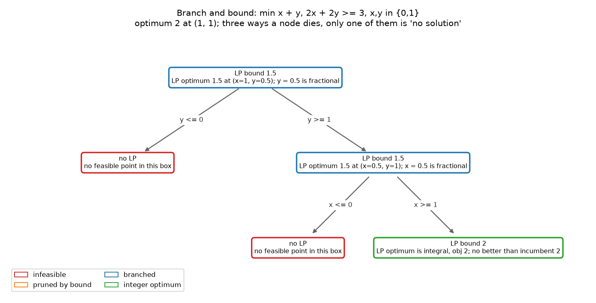

# Week 2 · Day 4：分支定界：寻找好解与证明最优是两件事

> **先读教材正文**：[第 4 章：MILP 与调度](../教材/04_混合整数规划与调度.md)。本页用于读后的复习和项目实验，不能代替零基础教材中的完整推导。

[月度索引](../README.md) · [本周知识主线](../week2.md) · [前一天](Day3.md) · [后一天](Day5.md)

> 当日主题：把「找一个更好的排程」与「证明手上的排程无法更好」拆成两条独立的进展线，并手推一棵完整的搜索树
> 当日产出：**一棵手推到底的分支定界树 + 一份能读懂求解器数字的对照表**（`m2w2d4_branch_and_bound_walk.py`）
> 建议投入：3～4 小时

---

## 1. 今日学习目标

完成今天的学习后，你应该能够：

1. 分别说出下界与上界**各自的来源**，并写出 $L\le z^*\le U$ 这条夹逼式。
2. 手推一个两变量 $0$-$1$ 问题的整棵分支定界树，逐步说出每个节点的 LP 界、松弛解与停止原因。
3. 说清「分支覆盖了全部整数可能性」为什么等价于「最优性得到证明」，而不是「运气好找到了最优解」。
4. 对取值为 2.4 的一般整数变量，写出正确的两个分支 $x\le2$ 与 $x\ge3$，并说明为什么不是「只考虑 $x=2$ 与 $x=3$」。
5. 说出节点结束的三种原因，并解释为什么其中第三种是「按界剪枝」而不是「这片区域被搞清楚了」。
6. 区分搜索的两种进展：降低上界 $U$（找到更好的解）与提高下界 $L$（把证明做扎实）。
7. 正确读 incumbent、best bound 与 gap，并说明为什么 gap 不是「已搜索空间的百分比」、不同软件的原生分母为什么不能直接比。
8. 说清现代求解器的 branch-and-cut 比教科书树多了哪些部件，以及为什么节点数不是跨软件统一的工作量单位。

---

## 2. 为什么今天要把「找解」与「证明」拆开

前三天建立的是一条从建模到界的链路：Day 1 用二元变量表达先后顺序，Day 2 把 Big-M 与逻辑约束的线性化写成不等式，Day 3 把整数变量放松成连续变量得到 LP 松弛，并写明 $z_{LP}\le z_{IP}$。今天要把这条链路接上最后一段：**松弛给出的界怎么被真正用来结束搜索。**

这件事值得单独花一天，因为它同时是三个常见误解的源头。

1. **最小化问题的答案被两个数夹住，而这两个数来自完全不同的地方。** 下界是模型（松弛）算出来的，上界是某个真实可行解带来的。把它们混作一谈，就会写出「求解器给出了 1.5」这种把松弛值当成排程目标的错话 —— 1.5 在 $x,y\in\{0,1\}$ 的模型里根本不可能是一个可达的目标值。
2. **搜索的「进展」有两种，在日志上的表现完全不同。** 找到更好的排程会改变 incumbent；抬高下界却不改变任何已经返回的方案。一个方案半天不变，搜索可能一点没闲着。
3. **「已证明最优」是一种证据等级，不是一个形容词。** 它的含义是：全部区域都被处理过，并且每一片区域都留下了自己的结论。今天手推的那棵树，就是把这句话摊开给人看的最小样本。

另外，今天这个模型只有两个变量、取值只有 0 和 1，四个候选点可以逐个手检 —— 这种「小到能全部手算」的实例正是看清机制的地方。真正的调度实例有几十个作业、上百个顺序变量，树大到不可能画出来，但每个节点上发生的事情和今天完全一样。

---

## 3. 先分清两个数：下界与上界各自的来源

设 $z^*$ 是我们想知道的最优值。对最小化问题，任何时刻手上都有两个数：

| 量 | 方向 | 来源 | 它保证了什么 | 它不能做什么 |
|---|---|---|---|---|
| 下界 $L$ | $\le z^*$ | 把整数变量放松成连续变量，解 LP 松弛 | 最优值不可能比它更低 | 给不出可执行的方案 |
| 上界 $U$ | $\ge z^*$ | **任何一个真实可行解**的目标值 | 至少存在一个这么好的方案 | 不能说明没有更好的方案 |

夹在中间的就是未知的 $z^*$：

$$L\le z^*\le U.$$

两条来源必须分开记：

1. **下界来自「扩大可行域」。** 整数可行集 $F$ 是松弛可行集 $P$ 的子集（$F\subseteq P$）。在更大的集合里最小化，得到的最优值不会更高，所以 $z_{LP}\le z^*$。这个论证完全不需要松弛解能被执行 —— 松弛解常常是一个「半选不选」的东西，在调度里意味着某个作业一半在前、一半在后，根本不是一个排程。
2. **上界来自「真的找到点」。** 只要给出一个具体的、满足全部约束的整数点，它的目标值就是 $U$。**松弛解四舍五入得到的点不能直接当上界**：Day 2 的自测题已经点过这一条 —— 把 $y=0.5$ 抹成 0 或 1，可能立刻违反约束，得到的是「看起来可行」的点，不是可行点。
3. **两个数可以同时往中间走。** 找到更好的解会让 $U$ 变小；把某片区域排除掉会让 $L$ 变大。当 $U=L$（或差距小到容差以内）时，$z^*$ 被夹死，搜索结束。

把这三条放在今天的例子上：下界 1.5 来自松弛，上界 2 来自一个手就能写出来的整数点 $(1,1)$。**1.5 与 2 之间那 0.5 的空隙，就是「证明还没做完」的形状。**

---

## 4. 教学模型：一个能一眼看穿的小问题

为了看清机制，今天用一个只有两个变量的小模型（与教材 4.8 节一致）：

$$\min x+y\quad\text{s.t. }2x+2y\ge3,\quad x,y\in\{0,1\}.$$

它是「整数变量决定选择」这件事的最小版本：$x$ 与 $y$ 只能取 0 或 1，约束要求两个变量的和达到某个门槛，目标又要让这个和尽量小。系数写成 2 与 3 是刻意的 —— 除以 2 以后门槛正好落在 1.5，一个整数解与非整数解都够得着的位置。

**第一步：整数可行集只有四个候选点。** 因为 $x,y\in\{0,1\}$，全部候选就是 $(0,0)$、$(0,1)$、$(1,0)$、$(1,1)$。逐个代进约束：

```text
(0,0):  0 + 0 = 0 < 3     不可行
(0,1):  0 + 2 = 2 < 3     不可行
(1,0):  2 + 0 = 2 < 3     不可行
(1,1):  2 + 2 = 4 >= 3    可行，目标 = 1 + 1 = 2
```

所以整数最优值是 2，而且**可行整数点只有一个**，它同时也是最优点。这一点今天后面要用到：这棵树的任务不是「在多个可行解里挑一个更好的」，而是「证明没有第二个点能把目标压得更小」。

**第二步：解 LP 松弛。** 把 $x,y$ 的取值范围从 $\{0,1\}$ 放宽成 $[0,1]$，其余不变，约束两边除以 2：

$$\min x+y\quad\text{s.t. }x+y\ge1.5,\quad 0\le x\le1,\ 0\le y\le1.$$

目标是 $x+y$，约束也只要求 $x+y\ge1.5$，所以松弛的最优值就是 1.5，取到它的点有无穷多个：只要 $x+y=1.5$ 且两个坐标都落在 $[0,1]$ 里就行。其中两个是「盒子角」与那条直线碰出来的：

```text
(1.0, 0.5):  1.0 + 0.5 = 1.5    两个坐标都在 [0,1] 内
(0.5, 1.0):  0.5 + 1.0 = 1.5    同上
```

于是 $L=1.5$。**这个 1.5 是有效下界**：任何整数可行点的目标值都不可能比它更低 —— 但反过来不成立，1.5 本身不是可达目标（$x,y$ 取整数时 $x+y$ 只能是整数）。

**第三步：上界。** $(1,1)$ 是可行整数点，目标 2，于是 $U=2$。

现在手上是 $1.5\le z^*\le2$，也就是「还不知道最优值是 1 还是 2」。手算早就知道答案是 2，但求解器不知道 —— 它只知道这 0.5 的空隙需要被收拾掉。今天剩下的全部工作，就是把这条缝补起来。

---

## 5. 手算：把整棵树走完

分支定界的思路是一句话：**选一个当前取值为小数的整数变量，把它现在取不到的那些整数切成一左一右两块，再对每一块重新解松弛。** 下面逐个节点来。先把这棵树记在一张表里，再逐条展开推理：

| 节点 | 盒子 | LP 界 | 松弛解 | 停止原因 |
|---|---|---|---|---|
| 根 | $x,y\in[0,1]$ | 1.5 | $(1,\ 0.5)$ | 分支：$y$ 是小数 |
| 左 | $y\in[0,0]$ | 无 | 无可行点 | 不可行，整片删除 |
| 右 | $y\in[1,1]$ | 1.5 | $(0.5,\ 1)$ | 分支：$x$ 是小数 |
| 右-左 | $y\in[1,1],\ x\in[0,0]$ | 无 | 无可行点 | 不可行，整片删除 |
| 右-右 | $y\in[1,1],\ x\in[1,1]$ | 2 | $(1,\ 1)$ | 松弛解已是整数点 |

**节点 0（根）。** 解上面那个松弛，得到界 1.5 与解 $(1,\ 0.5)$。$y$ 是小数 0.5，对 $y$ 分支：

$$y\le0\quad\text{与}\quad y\ge1.$$

这两支的含义是「$y$ 取小于等于 0 的整数」与「$y$ 取大于等于 1 的整数」。因为 $y$ 还被盒子限制在 $[0,1]$ 内，两支具体就是 $y=0$ 与 $y=1$ —— 但写成 $\le$ 与 $\ge$ 才是通用写法，理由在第 7 节讲。两支互不重叠，合起来覆盖 $y$ 的全部整数取值；而当前的松弛解 $y=0.5$ 不在任何一支里，正是要被切掉的那半个。

**节点 1（$y\le0$，即 $y=0$）。** 把 $y=0$ 代进去，约束变成

$$2x+0\ge3\quad\Longrightarrow\quad x\ge1.5.$$

这句话要求 $x\ge1.5$，而盒子只允许 $x\le1$ —— 两个要求不可能同时满足，**这个子问题的 LP 都不可行**。松弛不可行意味着它的可行集是空集，空集里当然没有整数点，所以整片区域可以整块删掉。

这里要小心结论的范围：**不可行是「在 $y\le0$ 这个附加条件下」的结论，不是「原问题无解」。** 求解器日志里出现 infeasible 时，先看清它说的是哪一层。

**节点 2（$y\ge1$，即 $y=1$）。** 代入 $y=1$：

$$2x+2\ge3\quad\Longrightarrow\quad x\ge0.5,\qquad \min x+1.$$

目标里 $y$ 已经是常数 1，$x$ 越小越好，所以取 $x=0.5$：界仍是 1.5，松弛解 $(0.5,\ 1)$，其中 $x$ 是小数。**注意这里的界和根节点一模一样。** 这不是实现出错：切掉一半区域并不保证下界抬高，根节点的那条最优线 $x+y=1.5$ 正好与这一支相交（$(0.5,1)$ 就在线上），所以这一支继承了一个同样紧的界。于是对 $x$ 分支：

$$x\le0\quad\text{与}\quad x\ge1.$$

**节点 3（$y\ge1,\ x\le0$，即 $(0,1)$）。** 直接代入：

```text
约束：2*0 + 2*1 = 2 < 3     违反
目标：0 + 1 = 1             连下界 1.5 都达不到
```

不可行，删除。这里两种说法是同一件事，因为本例的目标 $x+y$ 恰好是约束左端 $2x+2y$ 的一半：「约束成立」与「目标不小于 1.5」在这个模型里是同一句话。**换一个模型就不成立了** —— 一般情况下「目标值低于界」与「约束被违反」是两回事：前者只是说明这个点不可能更好，后者才说明它不合法。

**节点 4（$y\ge1,\ x\ge1$，即 $(1,1)$）。** 两个变量都被盒子钉死了，连 LP 都不用解：盒子里只剩一个点 $(1,1)$，它就是松弛的最优点，界 = 目标 = 2。检查可行性：$2\cdot1+2\cdot1=4\ge3$ 成立，$x,y$ 都是整数 —— **松弛解本身就是整数点**，这个节点到此结束，同时给出一个真实的整数可行解 $(1,1)$，目标 2，是一个 incumbent 候选。

**汇总：这棵树为什么证明了最优值是 2。** 把三片叶子摆在旁边看：

```text
叶子 A（y = 0）        ：没有可行点（约束要求 x >= 1.5，盒子只给 x <= 1）
叶子 B（y = 1, x = 0） ：没有可行点（0 + 1 = 1 达不到 1.5）
叶子 C（y = 1, x = 1） ：松弛最优解就是整数点 (1,1)，目标 2
```

两个分支 $y\le0$ 与 $y\ge1$ 覆盖了整数 $y$ 的两种取值；右支又用 $x\le0$ 与 $x\ge1$ 覆盖了整数 $x$ 的两种取值。四个整数点 $(0,0)$、$(0,1)$、$(1,0)$、$(1,1)$ 一个不漏地落在这三片区域里，而检查过的结论是：前两片区域里一个可行整数点都没有，第三片区域里的整数最优值恰好是 2。

**这就是「遍历完」与「有证据」的等价性。** 证明的形状不是「我找到了 2，所以 2 是最优的」（那是猜测），而是三环相扣：

1. 每个整数点都落在某一片被处理过的区域里 —— 靠**分支的完备性**：$x\le\lfloor v\rfloor$ 与 $x\ge\lceil v\rceil$ 的并集包含该变量的全部整数值，任何整数点都会掉进其中一支，没有区域被漏掉。
2. 每一片区域都留下了自己的结论 —— 不可行的叶子有「LP 不可行」作证据；整数叶子的证据是「松弛最优解本身是整数点」：松弛值是该区域整数最优值的下界，而这个整数解是上界，两者相等，于是该区域的整数最优值被钉死在 2。
3. 把 1 与 2 合起来：不存在目标小于 2 的整数可行点，而 2 本身可达 —— 这就是最优值为 2 的完整证明。

再补一句：证明做完的时候，$U$ 从头到尾都是 2（可行整数点只有一个，没有更好的解可找），被抬起来的是 $L$：根节点上的 1.5 在最后一个叶子上变成了 2。**这一例里全部的工作都花在「证明」那一半上。**

---

## 6. 插画：这棵树在图上的样子



图注（英文标签与中文一一对应）：

1. 根节点蓝框 `branched`：`LP bound 1.5`、`LP optimum 1.5 at (x=1, y=0.5); y = 0.5 is fractional` —— 界 1.5、解 $(1,0.5)$、$y$ 是小数，所以对 $y$ 分支。
2. 左侧红框 `infeasible`：`no LP / no feasible point in this box` —— 对应 $y\le0$ 那一支，盒子里没有任何点满足 $x\ge1.5$。
3. 右侧第二层蓝框 `branched`：界仍是 1.5，解换成 $(0.5,1)$，这次轮到 $x$ 是小数；它的左枝红框 `infeasible`（$x\le0$），右枝绿框 `integer optimum`：`LP bound 2 / LP optimum is integral, obj 2`。
4. 图例两行分别是 `infeasible` / `pruned by bound`（红 / 橙）与 `branched` / `integer optimum`（蓝 / 绿）；**这棵树里没有橙框**，因为根界的 1.5 从来没有达到过 incumbent 2，一次按界剪枝都没发生。标题里的 `three ways a node dies, only one of them is 'no solution'` 说的正是这件事：红框只是三种归宿之一。

这张图不是照抄正文文字，而是由 [m2_figures.py](../../projects/02_optimization_models/examples/m2_figures.py) 里的 `fig_branch_and_bound()` **现跑生成**的：它调用 `bnb_search()` 自己解每一层的二维 LP（`bnb_lp()` 枚举盒子角与那条直线的交点，不依赖通用 LP 求解器，所以图上每个界都能被人手复核），按「先 $y$ 后 $x$」的顺序挑小数变量分支，再把每个节点的界与停止原因写进方框。重跑绘图脚本可以核对这棵树；脚本还会把五个节点的 `node / d / status / note` 逐行打印出来，与图上的框一一对应。

---

## 7. 一般整数变量的分支：为什么是 $\le2$ 与 $\ge3$

上面的例子里 $y$ 只可能取 0 或 1，$\lfloor0.5\rfloor=0$、$\lceil0.5\rceil=1$ 恰好就是「$y=0$」与「$y=1$」，看不出一般规则。换成一般整数变量，假设某个节点的松弛解里 $x_j=2.4$：

```text
正确：x_j <= 2   与   x_j >= 3
错误：x_j == 2   与   x_j == 3
```

为什么后者是错的？两个理由都要说清楚：

1. **它会漏掉更远的整数。** 这两支的并集只有 $\{2,3\}$，而 $x_j$ 还可以取 4、5、……。任何取值大于等于 4 的整数点在两支里都找不到位置，而「覆盖全部整数可能性」正是整棵树结论成立的前提 —— 漏掉一片区域，树的结论就全部失效。
2. **它把等式当成了分支。** 分支的本质是给子问题**加一条不等式**，让子问题的变量域仍然是一个区间（在 LP 里就是收窄盒子的一条边）。$x_j=2$ 是等式，写进 LP 会立刻把一个变量钉死，等于提前假设「这个变量必须取这个值」—— 而这个假设我们并不知道对不对。

所以通用写法是：取小数 $v\notin\mathbb{Z}$，分成 $x_j\le\lfloor v\rfloor$ 与 $x_j\ge\lceil v\rceil$：

$$\lfloor v\rfloor=\max\{k\in\mathbb{Z}:k\le v\},\qquad \lceil v\rceil=\min\{k\in\mathbb{Z}:k\ge v\}.$$

两条性质保证这个划分可用：**互斥**（没有整数同时满足 $\le2$ 与 $\ge3$）与**完备**（每个整数要么 $\le2$、要么 $\ge3$）。当前的松弛解 $x_j=2.4$ 被两支共同排除，这正是分支要切掉的部分。等号的方向也要写对：左边用 $\lfloor v\rfloor$ 而不是 $v$ 本身，写成 $x_j\le2.4$ 等于一个整数都没切掉，分支白做。

顺带一提，选哪个小数变量分支、先走哪一支，是另一种自由度：本例里 $y$ 与 $x$ 都能选，选谁都不影响正确性，只影响树的大小。这个问题（分支选择）在工程上很重要，今天只需要知道它不影响结论。

---

## 8. 节点可以因三种原因结束

一个节点被处理过一次以后，只可能有三种归宿。前两种是「这片区域被搞清楚了」，第三种不是：

| 归宿 | 判定条件 | 它给出的结论 | 证据强度 |
|---|---|---|---|
| 不可行 | 子问题的 LP 无可行点 | 这片区域里没有整数点 | 强：什么都没漏（整数点一定也在松弛可行集里） |
| 松弛已给整数解 | 松弛最优解本身是整数点 | 这片区域的整数最优值就是该解的目标 | 强：松弛值是下界，该解是上界，两者相等 |
| 按界剪枝 | 节点下界 $\ge$ 当前上界 $U$ | 这片区域即使有整数点，也不会比已有的解更好 | 弱：不是因为搞清楚了，而是因为**不必**搞清楚 |

第三种是今天最值得记住的一条：**它的结论不是「这里没有更好的解」，而是「这里不可能更好」。** 差别在证明的完成度 —— 按界剪枝留下的区域从来没有被真正解完，我们只是知道它不值得再看了。

三种归宿对应到图上就是四种颜色：红框（`infeasible`）与绿框（`integer optimum`）是前两种，橙框（`pruned by bound`）是第三种，蓝框（`branched`）是还在往下分、尚未有归宿的节点。

按界剪枝还有一个直接后果：**剪枝的门槛是上界 $U$，所以 $U$ 越小，能剪掉的区域越多。** 搜索开始之前若已经有一个好解（启发式给的，或者上一次运行留下的），整棵树可能在很浅的位置就被剪光。这正是「好初解能加速搜索」的原因 —— 它不做任何「算得更准」的事，只是把门槛抬高。今天脚本里的对照实验把这件事量了出来（第 13 节）。

同理，**松弛越强（下界越高），越容易在浅层触发按界剪枝**。这是 Day 3 讨论「什么叫模型更强」在搜索层面上的回报：强松弛的价值不体现在根节点那个数字好看，而体现在它替搜索省掉了多少节点。注意「越容易」不等于「一定更快」—— 更强的模型通常更大，每个节点的成本也更高。

---

## 9. 寻找好解与证明最优：搜索的两种进展

把两个数的更新分开看，搜索就有两条互不影响的进展线：

| 进展 | 什么被改变 | 日志里的样子 | 对最终答案的作用 |
|---|---|---|---|
| 找到更好的解 | $U$ 下降 | incumbent 被更新、打印新的可行方案 | 让答案更好，同时把剪枝门槛抬高 |
| 抬高下界 | $L$ 上升 | best bound 上升、节点被关闭 | 缩小与 $U$ 的空隙，直到证明完成 |

两条线互相独立，这一点最容易被误读：

1. **方案长时间不变，不等于搜索没有进展。** 它可能一直在抬高 $L$ —— 今天那棵树就是这样：$U$ 从第一步起就是 2，所有工作都花在把 $L$ 从 1.5 抬到 2 上。日志里「best solution 不变、best bound 在涨」时，求解器在做的是**证明**，不是发呆。
2. **找到一个更好的方案，也不等于离证明更近。** 好解只是把门槛抬高；还剩多少区域没被处理，取决于树，不取决于解。
3. **两个数相等才叫结束。** $U=L$ 时 $z^*$ 被夹死。若在预算内只是把缝缩小，正确的说法是「给出了一个 gap 为某个比例的可行解」，不能说「找到了最优解」。

一个实用的读日志习惯：**看到 incumbent 更新时问「它降了多少」，看到 best bound 更新时问「它把哪些节点剪掉了」。** 两句问话分别对应搜索的两半工作，缺任何一半都不能宣布最优。

---

## 10. incumbent、best bound 与 gap 怎么读

三个词各有严格所指，不能互换：

| 术语 | 含义 | 数轴上的位置 |
|---|---|---|
| incumbent | 当前已知最好**可行**解的目标值 $U$ | 右边（上界） |
| best bound | 当前对 $z^*$ 的有效下界 $L$ | 左边（下界） |
| gap | 两者之间的差距，衡量「还欠多少证明」 | 中间那一段 |

对最小化问题，始终有 $L\le z^*\le U$：已找到的可行解给右边，没有被排除的区域给左边。绝对差距就是 $U-L$。本项目报告的相对 gap 是

$$g=\frac{U-L}{\max(1,|U|)}.$$

两个例子把读法固定下来：

```text
U = 12, L = 8 ：绝对差距 4，项目 gap = (12 - 8) / max(1, 12) = 1/3 ≈ 0.333
U = 33, L = 22：绝对差距 11，项目 gap = (33 - 22) / 33 = 0.333
```

第二条就是今天脚本里四个作业那个实例的根节点读数（33 是 SPT 初解的目标，22 是根节点的 LP 界）。

四条必须说清的读法：

1. **分母是约定的，不是天生的。** 有的软件用 $|U|$，有的用 $|L|$，有的另外加一个 $\max(1,\cdot)$ 防止 $U$ 接近 0 时数值爆炸。**分母不同的两个百分比不能直接比较**，报告里写 gap 时必须写出公式 —— 这正是[概念勘误](../CONCEPT_CORRECTIONS.md)里记着的一条。
2. **gap 不是「已搜索空间的百分比」。** 它说的是目标值的夹逼宽度，与树搜了多少、还剩多少节点没有直接关系。gap = 30% 不代表「搜完了 70% 的空间」。
3. **没有解或没有有效界时不要编 gap。** 没有可行解时 $U$ 不存在；启发式没有下界时 $L$ 不存在。这两种情况项目把 gap 记成 `None` 而不是 0 —— 把 $U$ 填进 best_bound 会让 gap 恒等于 0，看起来「已证明最优」，这是求解器实验里最严重的一类伪证据。项目的 `SolveResult`（[result.py](../../projects/02_optimization_models/opt_solvers/result.py)）把这条纪律写进了代码：`gap` 属性按上面的公式计算，任一端为 `None` 就返回 `None`；而且 `best_bound > objective + 1e-6` 会直接抛错，因为「下界高于已知可行解」在最小化问题里是不可能事件。
4. **gap 只衡量证明的完成度，不衡量解好不好用。** gap 很小的可行解未必比 gap 很大的解更适合业务，两者要分开报告。

代码里那两个容差（结果对象里的 `+ 1e-6`、脚本剪枝时的 `- 1e-9`）与 [Week 1 Day 6](../Week_1/Day6.md) 讲的比较规则是同一类东西：浮点比较必须留容差，否则「$L\le U$」这条本该永远成立的不等式会被浮点噪声打破。

---

## 11. 目标必为整数时：下界可以上取整

今天的例子里有一条可以提前收工的捷径：**目标值在整数点上一定是整数**（$x+y$ 在 $x,y$ 取 0/1 时只能是 0、1、2）。既然 $z^*$ 一定是整数，而 $1.5\le z^*$，那么 $z^*\ge2$；又已知 $U=2$，两者相等 —— 证明在根节点就完成了，一个分支都不用做。

一般形式：若已确认「任何一个整数可行解的目标值都是整数」，并且手上有一个有效下界 $L$，那么

$$\lceil L\rceil\le z^*$$

是更强的有效下界，可以拿它去和 $U$ 比。对本例：

```text
ceil(1.5) = 2  与上界 2 相等  ->  最优值 2，gap = 0
```

这条捷径必须带上三个前提，否则会把错误当结论：

1. **「目标值必为整数」要先证明，不能假设。** $c^Tx$ 里出现小数系数、或者目标里混着连续变量（例如总工时、总延迟时间）时，整数解的目标值照样可以带小数，这时上取整就是**抬高了不该抬的下界**，可能把真最优值排除在外。上取整是一次「加强」，加强过头就不再是有效下界了。
2. **取整之前先确认容差。** 计算出来的界常常是 $1.4999999$ 或 $1.5000001$ 这样的数。若真下界是 1、而浮点误差把它算成 $1.0000001$，盲目 `ceil` 会得到下界 2 —— 如果真最优值恰好是 1，我们就用一个错误的下界宣布了「已证明最优」。Week 1 Day 6 讲的那套比较规则（绝对容差加相对容差）正是用在这里：先判定这个数是否**确实**不小于某个整数，再决定要不要上取整。
3. **上取整之后的界仍然要与 $U$ 比。** 若 $\lceil L\rceil>U$，说明前面某一步出了错（模型、目标方向或容差），因为 $L\le z^*\le U$ 是必须成立的不变量，不能反过来拿它去「证明」最优。

还有一句限定：**特意展开这棵树是为了说明机制，不代表实际求解器一定这样搜索。** 一个成熟的求解器在根节点就会尝试用割平面、预处理和取整把这个 1.5 的缝处理掉，未必会老老实实地先分 $y$、再分 $x$。

---

## 12. 真实求解器比教科书树多了什么

教科书树只有两个部件：解松弛、分支。真实求解器在同一个框架上加了好几层：

| 部件 | 做什么 | 对这类问题的影响 |
|---|---|---|
| presolve | 化简约束、收紧变量界、删除冗余行列 | 模型变小；顺手把一些变量的整数界收紧 |
| 割平面 | 加入对全部整数解成立、却能切掉部分小数点的有效不等式 | 直接把根节点的界抬高，减弱「小数解太优」的麻烦 |
| 启发式 | 在搜索过程中尝试构造可行解 | 早点把 $U$ 压下来，让按界剪枝更早生效 |
| 分支选择 | 决定拿哪个小数变量、往哪边先分 | 影响树的大小与深度，不影响正确性 |

它们协同工作，合起来叫 **branch-and-cut**：它仍然是分支定界，只是每个节点上的松弛被割平面加强了、树的形状被分支策略与启发式改变了。今天脚本最后抓到的 CBC 日志里，`At root node, 19 cuts changed objective from 47 to 65` 就是割平面在根节点上做的事 —— 一次分支都没做，界先抬了一截。

由此得到两条读日志的纪律：

1. **写「root bound」时必须说明是哪一层。** 纯 LP 松弛值、presolve 之后的值、加完根节点割之后的值是三个不同的数。脚本里的读法三点出来的就是这一条：日志里的 65 与 Day 3 量到的纯松弛界 0 不是同一个量。
2. **节点数不是跨软件统一的工作量单位。** 同一个实例在不同求解器（甚至同一求解器的不同参数、不同版本）上会给出完全不同的节点数：割平面切掉多少、presolve 化简到什么程度、每个节点解多大的 LP、有没有并行，都会改变这个数。所以「我的模型 130 个节点、他的模型 0 个节点」不能读成「我的模型难 130 倍」；节点数只在同一套配置下做相对比较才有意义，而且它是**搜索量**的代理，不是**难度**的代理。

---

## 13. 实验：`m2w2d4_branch_and_bound_walk.py`

脚本链接：[m2w2d4_branch_and_bound_walk.py](../../projects/02_optimization_models/examples/m2w2d4_branch_and_bound_walk.py)。结构分四段：

1. **手写一遍 branch-and-bound**（`walk()`）：每个节点调 `node_lp()` 解一次 LP 松弛 —— 把 `fixed` 里已经定下来的顺序变量钉住，其余取 $[0,1]$，用 GLOP 解；节点 LP 里的 big-M 取 `len(jobs) * horizon`（松的那一版），它的合法性由 Day 2 的时间界论证保证。剪枝条件落在两处：`bound is None` 记「LP 不可行」，`bound >= incumbent - 1e-9` 记「界 >= incumbent」。若 LP 最优解里没有小数变量，就把小数按 `> 0.5` 抹成整数，交给 `schedule_from_orders()` 翻译成一个**真实排程**（按全序排、每个作业从 $\max(\text{机器就绪},\ \text{释放时间})$ 开工），再用目标函数算出真值去决定是否更新 incumbent。
2. **独立穷举对拍**（`enumerate_optimum()`）：把全部加工顺序枚举一遍，得到最优值与顺序数，作为手推 B&B 的对照答案。
3. **交给 CBC 对照**（`print_solver_numbers()`）：同一实例跑 `milp_tight`、`milp_loose`、`milp_alt` 三种写法，比较状态、objective、best bound、gap、nodes 与两段耗时。
4. **抓一段真实 CBC 日志**（`print_cbc_log()`）：用一个独立子进程重跑同一实例（`build_sequence_model(instance, 'total_tardiness', tight=True)`，时间上限 1200 秒，打开 `EnableOutput()`），用管道把求解器 C 层的输出抓回来，按关键词过滤后原文粘贴，并给出三条读法。

在仓库根目录运行：

```powershell
python projects/02_optimization_models/examples/m2w2d4_branch_and_bound_walk.py
```

实际输出（本次运行，节选）：

```text
== 1. hand 实例（3 job，ΣTj 真最优 1）：DFS branch-and-bound 全过程 ==
  初始 incumbent 来自 M1 的 SPT 规则：ΣTj = 1

  node  深度  节点上的固定决策                       LP 界    incumbent   best bound   gap   动作
     1     0  (根节点)                               0.000          1          0   1.00   分支：x(A,C)=0.214
     2     1  A<C                                 0.000          1          0   1.00   分支：x(B,C)=0.214
     3     2  A<C B<C                             0.000          1          0   1.00   分支：x(A,B)=0.048
     4     3  A<B A<C B<C                         3.000          1          1   0.00   剪枝：界 >= incumbent
     5     3  B<A A<C B<C                         1.000          1          1   0.00   剪枝：界 >= incumbent
     6     2  A<C C<B                             9.000          1          1   0.00   剪枝：界 >= incumbent
     7     1  C<A                                 8.000          1          1   0.00   剪枝：界 >= incumbent
  节点总数 7，其中叶节点 0，按界剪枝 4，按不可行剪枝 0

  手工 B&B 得到的最优值 1，与 M1 独立穷举的 1 一致。
```

这一段是「好初解能加速搜索」最干净的版本：初始 incumbent 恰好等于最优值（SPT 规则给出的 ΣTj = 1），于是**整棵树全被按界剪枝剪光，一次整数解都没找**。把初解拿掉（incumbent 取 $+\infty$）再跑同一实例：

```text
  节点总数 7，其中叶节点 2，按界剪枝 2，按不可行剪枝 0

  两次的节点数都是 7，但叶节点从 0 变成 2：没有 incumbent 时界剪枝的门槛是 +∞，
  前两个叶节点必须自己找出整数解来建立 incumbent，之后剩下的节点才被剪掉。
  这就是 incumbent 的作用：它不做任何「算得更准」的事，只是把界剪枝的门槛抬高。
```

节点数没变（都是 7，因为这棵树太小），叶子数从 0 变成 2：差别全在「门槛」上。第二段换成四个作业、目标改成 ΣCj：

```text
== 2. 4 job 实例（ΣCj 真最优 33，由 24 个加工顺序独立枚举得到）==
  ΣCj 的 LP 界比 ΣTj 有信息：根节点的界就是 Σ_j (r_j + p_j) = 22

  node  深度  节点上的固定决策                       LP 界    incumbent   best bound   gap   动作
     1     0  (根节点)                              22.000         33         22   0.33   分支：x(J0,J2)=0.092
     2     1  J0<J2                              22.000         33         22   0.33   分支：x(J0,J1)=0.079
     3     2  J0<J1 J0<J2                        23.000         33         23   0.30   分支：x(J0,J3)=0.079
  …… 其余 13 行省略（完整节点数见下方统计）
  节点总数 23，其中叶节点 0，按界剪枝 11，按不可行剪枝 1

  手工 B&B 得到的最优值 33，与独立枚举的 33 一致。
```

根节点的 gap 0.33 就是第 10 节算过的那个数（$U=33$、$L=22$）。注意这一列：`print_trace()` 把 best bound 写成 `min(LP 界, incumbent)`，也就是这个节点上两个数里更紧的那一端；它是给人看「接近程度」的，不是从「还没关闭的节点集合」维护出来的求解器级全局界，两者不要混读。第三段把同一实例交给三种 MILP 写法：

```text
== 3. 同一实例交给 CBC：数字对照 ==
  method       状态       objective   best bound   gap       nodes   建模(s)  求解(s)
  milp_tight   OPTIMAL        85.0        85.0   0.0000    130   0.0029    1.442
  milp_loose   OPTIMAL        85.0        85.0   0.0000    124   0.0027    1.437
  milp_alt     OPTIMAL        85.0        85.0   0.0000      0   0.0190    0.127
  nodes = 0 表示 CBC 在根节点就用割平面把问题解完了，一次分支都没做。
```

三种写法给出同样的最优值 85.0、gap 0.0000，搜索量却差得很远：`milp_tight` 用了 130 个节点、`milp_loose` 用 124 个，而 `milp_alt`（时间索引模型）**一个节点都没用** —— 根节点的割平面就把问题解完了。这正好印证第 12 节的第二条纪律：节点数不等于耗时（`milp_alt` 的建模时间反而高出约 6 倍，0.0190 秒对 0.0029 秒），也不等于难度（同一实例的不同写法能差出 130 个节点）。第四段摘一段真实 CBC 日志：

```text
== 4. 真实 CBC 日志（子进程捕获，按关键词过滤，原文粘贴）==
  At root node, 19 cuts changed objective from 47 to 65 in 2 passes
  Integer solution of 120 found by rounding after 68 iterations and 9 nodes (0.01 seconds)
  Integer solution of 115 found by strong branching after 68 iterations and 11 nodes (0.01 seconds)
  Search completed - best objective 107, took 343 iterations and 48 nodes (0.02 seconds)
  Maximum depth 8, 2 variables fixed on reduced cost
```

日志里的 47 / 65 / 107 都不是最终答案：47 到 65 是根节点割平面把下界抬高的过程，107 是某一步搜索到的 incumbent。脚本自己写下的三条读法是：`At root node` 行说的是根节点切了几轮割、界从多少抬到多少；`Integer solution` 行是过程中找到的 incumbent（`by rounding`、`by strong branching` 说明它是怎么来的）；**日志行必须跟 `SolveResult` 对账**，不能把日志里任何一个中间数字当成结论。还有一条更细的读法：这里的根节点界 65 经过了 presolve 的整数界收紧与 19 条根节点割，与 Day 3 量到的纯 LP 松弛界 0 不是同一个量 —— 报告里写「root bound」时必须说明是哪一层。

三条实验观察（都只对本次运行成立，不能当成固定结论）：

1. 初始 incumbent 等于最优值时，整棵树可以被按界剪枝剪光，一次整数解都不用找。
2. 同一实例、同一目标，三种 MILP 写法的节点数可以是 130 / 124 / 0，而目标值完全相同。
3. `milp_alt` 的 nodes = 0 与最短求解时间同时出现，是「根节点割平面加上更强的松弛」共同造成的，不能读成「这种写法永远更快」—— 第 12 节说过的取舍（模型更大、每节点成本更高）在别的实例上会体现出来。

---

## 14. 今日练习

1. **练习 1（手算）**：把教学模型的约束改成 $2x+2y\ge4$，重推整棵树（每个节点的界、分支、每个叶子的结论），并说明最优值是多少。
2. **练习 2（手算）**：把门槛改成 $2x+2y\ge2$ 再走一遍，并说明为什么这一次根节点的松弛解本身就是整数点。
3. **练习 3（推导）**：证明 $\lfloor v\rfloor$ 与 $\lceil v\rceil$ 两支互斥且完备 —— 没有整数同时满足 $x\le\lfloor v\rfloor$ 与 $x\ge\lceil v\rceil$，而每个整数至少满足其中一条。
4. **练习 4（读日志）**：某次运行报告 status = FEASIBLE、objective = 120、best bound = 100。算出绝对差距与本项目口径的 gap，并说明为什么不能宣布「已证明最优」。
5. **练习 5（实现）**：给 `walk()` 加一项统计：被按界剪枝的节点里，界与 incumbent 的差值。在四个作业那个实例上观察有多少节点是「刚好被剪掉」的。

---

## 15. 验收清单

- [ ] 能分别说出下界与上界的来源，并写出 $L\le z^*\le U$。
- [ ] 能默写教学模型四个整数点里哪些可行，并说出整数最优值 2 是怎么来的。
- [ ] 手算的树（根 1.5 / $y\le0$ 不可行 / $y\ge1$ 界 1.5 / $x\le0$ 不可行 / $x\ge1$ 目标 2）能逐条复述。
- [ ] 能说清「分支覆盖全部整数可能性」与「结论是证明而不是猜测」之间的关系。
- [ ] 对一般整数变量 $x_j=2.4$ 能立刻写出 $\le2$ 与 $\ge3$，并说出写成 $\{2,3\}$ 错在哪里。
- [ ] 能说出节点结束的三种原因，并指出第三种与其他两种在证据强度上的区别。
- [ ] 能解释「好初解」为什么能加速搜索：它改的是按界剪枝的门槛，不是松弛质量。
- [ ] 能算出 $U=12$、$L=8$ 时的绝对差距与本项目 gap，并说出为什么 gap 不是搜索空间的百分比。
- [ ] 能说出「目标必为整数时可以把下界上取整」的前提，以及取整前为什么要处理容差。
- [ ] 知道写「root bound」时必须说明是纯松弛、presolve 之后还是加割之后。
- [ ] 能说出为什么节点数不是跨软件统一的工作量单位。
- [ ] 脚本能跑通（退出码 0），第 13 节粘贴的输出与本地运行一致。

---

## 16. 自测题

- Q1：下界与上界分别由什么提供？为什么松弛解不能直接当成可行解？
- Q2：教学模型里为什么 $(1,0.5)$ 与 $(0.5,1)$ 都能取到界 1.5？
- Q3：$y\le0$ 那一支为什么不可行？这个结论的适用范围是什么？
- Q4：$y\ge1$ 那一支的界还是 1.5，说明这次分支白做了吗？
- Q5：$x\ge1$ 那一支的松弛解是整点，为什么这个节点就可以结束了？
- Q6：为什么「遍历完整棵树」就能宣布最优值是 2？这条推理链有哪几环？
- Q7：一般整数变量取值 2.4 时，分支写成「$=2$ 与 $=3$」会破坏哪条性质？
- Q8：节点结束的三种原因是什么？哪一种不是「这片区域被搞清楚了」？
- Q9：$U=12$、$L=8$，绝对差距与本项目 gap 各是多少？这个 gap 能不能读成「已搜索约 2/3 的空间」？
- Q10：为什么「目标必为整数」时可以把下界上取整？盲目 `ceil` 会出什么错？
- Q11：求解器日志里出现两个不同的 root bound，这是矛盾吗？
- Q12：为什么两个求解器报告的节点数不能直接比较？

### 参考答案

- A1：下界来自 LP 松弛（放宽整数变量域，可行集变大，最小值不会更高）；上界来自某个真实可行解的目标值。松弛解常常是「半选不选」的状态，可能违反原约束，也无法翻译成排程，所以不能当可行解用。
- A2：目标是 $x+y$，约束也只要求 $x+y\ge1.5$，所以在盒子 $[0,1]^2$ 里任何满足 $x+y=1.5$ 的点都是松弛最优解；$(1,0.5)$ 与 $(0.5,1)$ 都满足。
- A3：$y=0$ 时约束要求 $x\ge1.5$，而盒子只允许 $x\le1$，两者矛盾，子问题 LP 无可行点。这个结论只说「在 $y\le0$ 这一支里没有解」，不代表原问题无解。
- A4：不白做。分支的价值不只是抬高界，更在于**排除区域**：这一支把「$y$ 取小数」的可能性切掉了，并暴露出下一个要分支的变量 $x$。界没变很正常 —— 切掉一半区域并不保证下界严格上升。
- A5：因为盒子里只剩 $(1,1)$，它既是松弛的最优解（界 = 2）又是合法整数点（目标 = 2）：松弛下界与可达上界相等，这片区域的整数最优值就被钉死在 2。
- A6：三环：(1) 分支 $\le$ 与 $\ge$ 覆盖该变量的全部整数值，每个整数点都在某个叶子里；(2) 每个叶子都被判定过 —— 两个叶子没有可行点，一个叶子的整数最优值恰好是 2；(3) 因此不存在目标小于 2 的整数可行点，而 2 本身可达。
- A7：破坏**完备性**。$\{2,3\}$ 漏掉了 4、5、…… 这些可能的取值，树上就留下一片没人处理过的区域，最坏情况下最优解正藏在那里。
- A8：不可行、松弛已给整数解、节点下界 $\ge$ 当前上界（按界剪枝）。第三种不是搞清楚，而是「不必搞清楚」—— 它留下了一片从未被解开的区域，只是证明了那片区域不可能更好。
- A9：绝对差距 4；本项目 gap = $(12-8)/\max(1,12)=1/3\approx0.333$。不能读成搜索进度：gap 衡量的是目标值夹逼的宽度，与树搜了多少没有直接关系。
- A10：因为整数解的目标值都是整数，所以 $z^*$ 是整数；由 $L\le z^*$ 得 $\lceil L\rceil\le z^*$。盲目 `ceil` 的风险在数值误差：真下界是 1、算出来的界是 $1.0000001$ 时，上取整会给出下界 2，若真最优值恰好是 1，这个「证明」就是错的。所以要先确认「目标必为整数」并处理容差。
- A11：不矛盾。纯 LP 松弛值、presolve 之后的值、加完根节点割之后的值是三个不同阶段的量，通常依次变高。报告里必须写清是哪一层。
- A12：节点数受割平面、presolve、分支策略、每节点工作量与并行方式影响，同一个实例在不同实现上的节点数可以差很多；它是搜索量的代理，不是难度的统一单位，只能在同一套配置下做相对比较。

---

## 17. 今日一句话总结

> **下界由松弛提供、上界由可行解提供；分支定界做的事就是让这两个数从两端逼近 —— 找到好解只是其中一半，把下界抬到与上界相遇才算证明。**

---

## 配套代码入口

从仓库根目录运行（需先按[项目指南](../../projects/02_optimization_models/PROJECT_GUIDE.md)配置环境）：

```powershell
python projects/02_optimization_models/examples/m2w2d4_branch_and_bound_walk.py
```

[阅读示例源码](../../projects/02_optimization_models/examples/m2w2d4_branch_and_bound_walk.py)。先完成正文手算，再用脚本核对项目实例；记录实例、状态、约束检查与目标，不把一次运行耗时作为固定结论。实现与数学语义的区别见[概念勘误](../CONCEPT_CORRECTIONS.md)。
