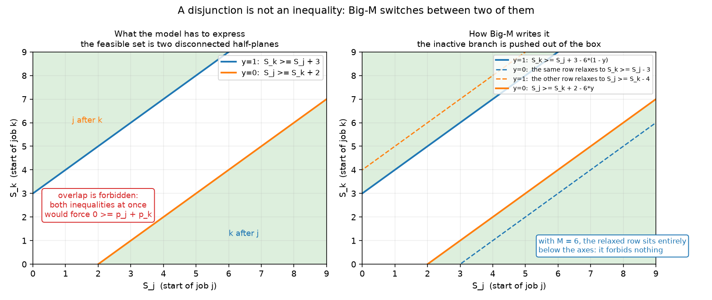
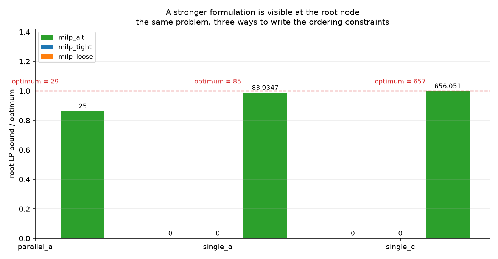
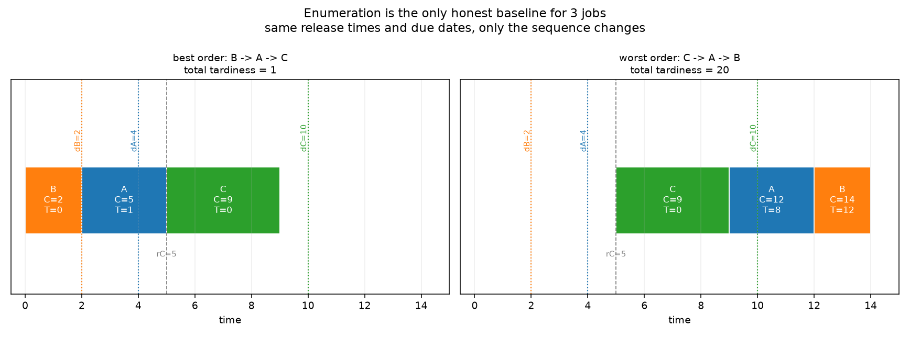

# Week 2 · Day 7：第二周复盘：离散逻辑、松弛与搜索

> **先读教材正文**：[第 3 章：0-1 规划](../教材/03_零一规划与逻辑建模.md)、[第 4 章：MILP 与调度](../教材/04_混合整数规划与调度.md)、[第 7 章：综合实训](../教材/07_综合实训与解答.md)。本页用于读后的复习和项目实验，不能代替零基础教材中的完整推导。

[月度索引](../README.md) · [本周知识主线](../week2.md) · [前一天](Day6.md)

---

## 1. 今日学习目标

完成今天的学习后，你应该能够：

1. 说清「LP 表达不了或」的确切含义：是并集不是线性约束的交集，而不是「LP 不够聪明」。
2. 从变量界推出一个合法 M，并说出 $M_{jk}=\max(0,U_j-L_k)$ 在本项目的单机模型里为什么退化成 $H-r_k$。
3. 分别举出 M 太小与 M 太大的一手反例，并解释「求解器返回 OPTIMAL」为什么救不了一个错误模型。
4. 解释 LP 松弛为什么必然给出下界，以及为什么「把 M 换得更紧」不保证界变高。
5. 复述 $H=\max_jr_j+\sum_jp_j$ 的证明思路（固定顺序左移），并说清它不等于「机器一空就加工」。
6. 说出分支定界节点的三种归宿，并把「找到更好的解」与「把下界抬高」当成两件事读。
7. 用同一批实例说明「同一最优值、不同代价」，并把结论限定在实例集、时间预算与后端版本上。

---

## 2. 复盘不是摘要，是重组

六天里每天各有一个结论（[Day 1](Day1.md) 到 [Day 6](Day6.md)）。复盘最容易做错的地方，是把六个结论按日期再贴一遍——那样得到的是一份**目录**，不是一条**链**。今天要做的是让它们互相支撑：后一环要用的东西，正是前一环交出来的。

| 环 | 回答的问题 | 对应 | 交给下一环的东西 |
|---|---|---|---|
| 1. 离散逻辑 | 为什么必须引入 0-1 变量 | Day 1、Day 2 | 能表达「或」的变量域 |
| 2. M 的来源 | 那句「足够大」到底是多少 | Day 2 | 一个可证明合法的禁用常数 |
| 3. 松弛 | 凭什么先解一个允许小数的模型 | Day 3 | 最小化问题的下界 L |
| 4. 时间界 | 变量窗口与 M 的上界从哪来 | Day 3 | 有限的时间网格 |
| 5. 搜索 | 下界与可行解怎么合成一个证明 | Day 4 | incumbent U、best bound L、gap |
| 6. 变量定义 | 换一套变量会改变什么 | Day 5 | 另一种 formulation 与它的规模代价 |
| 7. 比较方法 | 两种 formulation 谁更好，怎么回答 | Day 6 | 限定在实例、预算、版本上的结论 |

七环的顺序不是随意的：**第 2 环的 M 必须在第 1 环的变量上推导；第 3 环的界是第 2 环那个模型的松弛；第 4 环的上界同时决定了变量窗口与 M 的大小；第 5 环的剪枝用的是第 3、4 环的量；第 6 环换掉的正是前三环的变量与约束结构；第 7 环检查的是前六环报出来的那些数字。** 中间任何一环塌掉，后面的数字都会变成「没被验证过的字符串」。

复盘有三件事**不该做**，这一周里每一件都有具体的反面例子：

```text
1. 不把「读到 0 界」当成「模型坏了」 —— 0 是 ΣTj 的平凡下界，它合法、只是没有信息量。
   真正有信息的是「换变量定义之后它是 83.93 而不是 0」（第 6 环）。
2. 不把一次运行的节点数与耗时写成方法的性质 —— 它们是观测值，不是规格值；
   同一台机器重跑，读数会变（Day 6 第 4 节）。
3. 不把「这个实例上更紧」写成「一般更强」 —— 强度的一般定义是松弛集合的包含关系
   （Day 3 第 4 节），实例证据只能作为线索，不能当证明。
```

---

## 3. 第一环：离散逻辑（Day 1、Day 2）—— LP 表达不了「或」

Day 1 的出发点是调度问题里最普通的一句业务话：同一台机器上的两件工作不能同时做，所以「j 先于 k，或者 k 先于 j」。写成不等式就是两块区域：

$$
S_k\ge C_j\qquad\text{或}\qquad S_j\ge C_k .
$$

加工时间为正时，这两块区域**互不相交**；LP 的可行域是若干个半空间的交，是一个凸集，而两个互不相交半平面的并集不是凸集。所以这不是「约束写得不够好」，而是**线性约束的交集在集合形状上就装不下一个并集**。整数变量做的事就是替我们选择其中一支：$y_{jk}=1$ 表示 j 在 k 之前，$y_{jk}=0$ 表示反过来，于是 Day 1 第 2 节的单机总迟交模型可以整块写出来：

$$
\min\sum_jT_j,\qquad C_j=S_j+p_j,\qquad S_j\ge r_j,\qquad T_j\ge\max(0,C_j-d_j),
$$

$$
S_k\ge C_j-M_{jk}(1-y_{jk}),\qquad S_j\ge C_k-M_{kj}\,y_{jk}.
$$

同一件事在纯逻辑层面有一批更简单的写法（Day 2 第 4 节、教材 3.4 与 3.5）：$a$ 为真则 $b$ 为真写成 $a\le b$；恰好一个写成 $\sum_iz_i=1$，至多一个写成 $\sum_iz_i\le1$；两个二元量的乘积 $w=ab$ 写成 $w\le a$、$w\le b$、$w\ge a+b-1$、$w\ge0$。教材 3.4 的真值表把四种组合逐个代进去检查，这是最省力也最可靠的入门工具：**先列允许的组合，再写式子**，比背中文语序可靠。

**这一环最容易说过头的一句话**：「用 indicator（或求解器的 `OnlyEnforceIf`）就等于把这条逻辑加上去了。」正确说法是：$z=1\Rightarrow a^Tx\le b$ 只是一条**单向蕴含**——$z=0$ 时它不再限制 $x$，**并不表示 $a^Tx\le b$ 必须为假**。真的要当且仅当，还得补上反方向 $z=0\Rightarrow a^Tx>b$；整数 $x$ 时反方向能写成 $z=0\Rightarrow x\ge6$ 这类式子，而连续变量的否定是**严格不等式** $x>5$，普通闭线性约束写不出来，必须结合业务精度重新划边界（Day 2 第 1 节、教材 3.10）。

---

## 4. 第二环：M 的来源（Day 2）—— 它是推导出来的，不是「取个很大的数」

要让 $z=1\Rightarrow a^Tx\le b$ 生效，把它改写成 $a^Tx\le b+M(1-z)$。$z=1$ 时右端就是 $b$，约束生效；$z=0$ 时这条式子必须**不排除**任何本来允许的点，于是要求

$$
M\ \ge\ \max_{x\in X}\bigl(a^Tx-b\bigr),
$$

其中 $X$ 是其余约束与有效变量界圈出来的区域。精确求这个最大值通常没必要，**用变量上下界给一个便宜的安全上界**就够了。

落到排序式上：$S_k\ge C_j-M_{jk}(1-y_{jk})$，已知 $C_j\le U_j$ 与 $S_k\ge L_k$，则 $C_j-S_k\le U_j-L_k$，取

$$
M_{jk}=\max(0,\;U_j-L_k)
$$

即可。本项目的单机模型里，变量的自然界是 $C_j\le H$、$S_k\ge r_k$，而且 $H=\max_jr_j+\sum_jp_j\ge r_k$，于是 $\max(0,H-r_k)=H-r_k$：**`milp_scheduling.pair_big_m` 里的 `horizon - release[b]` 就是这一行公式的特例**，不是另写的一个魔数。松版本 `loose_big_m` 用全局常量 $n\cdot H$：它合法（$nH\ge H\ge H-r_k$），但比逐对界松一个数量级。同一族实例（seed 50、8 作业、单机）上，tight 的逐对值落在 **61–69**，loose 是 $8\times71=\mathbf{568}$，两者都安全。

**反例清单**（这一环的三句话都要能背下来）：

```text
M 太小 —— 会删掉合法顺序。
  C_j = 6、S_k = 0，本应允许 k 在 j 前；禁用式若用 M = 4，
  仍要求 0 >= 6 - 4 = 2，把一个合法点误禁掉（教材 4.4）。
  危险之处在于：求解器可能照样返回「最优」——那只是**错误模型的最优**，
  它不会报错，只会给你一个偏高的目标值，而且看起来完全正常。

M 太大 —— 让小数 y 轻易放松互斥。
  C_j = 10、S_k = 0、y = 0.5 时，松弛后的排序式要求 0 >= 10 - 0.5M。
  M = 100 时轻易满足；M = 10 时不能满足（Day 3 第 3 节）。
  系数过大还会带来数值问题（大数相减的舍入误差）。

「M = 10^6」不是推导 —— 当 Σp 超过 10^6 时它会直接切掉最优解，
  而且一样不报错。本模块宁可用一个「可证明的松」（n·H），
  也不用一个「不可证明的大」。
```



图注（对应 Day 2）。横轴是 $S_j$、纵轴是 $S_k$，$p_j=3$、$p_k=2$、$M=6$。左图 `What the model has to express` 画出**模型要表达的东西**：`y=1: S_k >= S_j + 3`（蓝）与 `y=0: S_j >= S_k + 2`（橙）两块不连通的半平面，红框那句 `overlap is forbidden: both inequalities at once would force 0 >= p_j + p_k` 就是「不能重叠」的全部含义。右图 `How Big-M writes it` 画出**Big-M 怎么写成不等式**：同一条行在禁用的一侧被推到坐标轴下方（蓝色虚线 `the same row relaxes to S_k >= S_j - 3`），底部那句 `with M = 6, the relaxed row sits entirely below the axes: it forbids nothing` 是这张图的关键——**M 合法性的几何版本就是「禁用分支那条线整条落在盒外」**。

---

## 5. 第三环：松弛（Day 3）—— 界不要求松弛解可执行

把每个 $y\in\{0,1\}$ 放宽成 $0\le y\le1$，其余不动，得到 LP 松弛。原整数可行集 $F$ 是松弛可行集 $P$ 的子集，在更大的集合上最小化不可能得到更高的值，所以

$$
z_{LP}\le z_{IP}\le z_{\text{feasible}} .
$$

左边是下界、右边是已找到的可行目标。**这条界不要求松弛解是可执行排程**：教材 4.7 里三个作业可以全部从 0 开工，$T$ 全零，界是 0；而单机整数最优是 2。0 与 2 的差就是「松弛忽略了部分离散结构」的代价。读界的时候要习惯这件事：**松弛解只是为了让界成立，不是为了让人去执行它。**

**这一环最容易说过头的一句话**：「把 M 换得更紧，LP 界就会提高。」正确说法是：更紧的 M 只是收紧可行域，**不保证**该目标的松弛最优值随之变化——最优点可能仍落在保留下来的区域里。

手算版本（Day 3 第 3 节）：$C_j=10$、$S_k=0$、$y=0.5$，$M=100$ 时 $0\ge10-50$ 轻松成立，$M=10$ 时 $0\ge10-5$ 不成立。两个 M 都合法，但界会不会变是另一回事。项目里的实测版本更硬：Day 7 脚本的第 3 张表把 M 换成**逐对最小可行值**——先穷举全部 40320 个加工顺序，对每一对 $(later, earlier)$ 算出「放松成需要多大」的下确界，得到 $[61,66]$（而 tight 逐对界是 $[61,69]$）——再补上 disjunction 等式 $x+x'=1$：

```text
变体                          root LP bound
  现状（tight Big-M）               0.0000
  tight + disjunction 等式         0.0000
  逐对最小可行 M                    0.0000
  逐对最小可行 M + 等式             0.0000
  loose + 等式                     0.0000
```

五种写法全是 0。原因是 LP 仍可以用 $x=0.5$ 让两条约束**各放松 $M/2$**，而 $M/2$ 依旧远大于任何一道工序的加工时间（该实例最长 16），于是所有工序照旧能从 0 开始重叠。**弱的是 formulation 的结构，不是某个系数写得不够紧**——这正是第 6 环要解决的问题。



图注（对应 Day 3）。纵轴是 `root LP bound / optimum`（根节点 LP 界占最优值的比例），横轴三组柱子对应三个实例 `parallel_a`、`single_a`、`single_c`，图例只有一项 `milp_alt`（绿）。每组里另外两种写法 `milp_tight`、`milp_loose` 的柱高为 0，因此只在柱底留下一个 `0` 的标注——**看不见柱子的那两格就是「界等于平凡下界」**。绿柱柱顶写的是界值 `25`、`83.9347`、`656.051`，同一组的红字 `optimum = 29 / 85 / 657` 是最优值；三根绿柱都贴到红色虚线附近。这张图要读的是**同一道题、三种写法、根节点界的量级差**：换系数（tight 与 loose）在图上是同一根 0 柱，换变量定义（time-indexed）才有柱子长出来。

---

## 6. 第四环：时间界（Day 3）—— 证明是「固定顺序左移」

第 2、3 环都用到同一个量 $H$，它的合法性需要一条证明：

$$
H=\max_j r_j+\sum_j p_j .
$$

**证明思路**：取任一可行顺序，按这个顺序把每个作业尽量早开工，即 $S_j=\max(r_j,C_{\text{前一件}})$。这样做不会增加任何完工时间；机器上的空闲只会出现在「等后面才释放的作业」上，空转总量不超过 $\max_jr_j$，而总加工量是 $\sum_jp_j$，所以最后一件的完工不晚于 $H$。对 $C_{\max}$、$\sum C_j$、$\sum w_jC_j$、$\sum T_j$、$L_{\max}$ 这些**关于完工时间单调不减**的目标，把原可行排程按原顺序左移不会让它变差，因此 $H$ 以内至少留着一个最优排程——变量窗口与 M 都可以放心地建到 $H$。

**这一环最容易说过头的一句话**：「存在 H 以内的最优排程，说明最优排程就是机器一空就加工。」**固定顺序左移与禁止主动等待是两件事。** 有释放时间时，主动等待一个即将释放的重要作业可能更好：

```text
A：r = 0，p = 10，权重 1      B：r = 1，p = 1，权重 100
马上做 A：ΣwC = 1×10 + 100×11 = 1110
等到 1 点先做 B：ΣwC = 100×2 + 1×12 = 212
```

212 比 1110 好得多，而它开头空转了一个时间单位。读代码时也要注意：`milp_scheduling.time_horizon` 的注释里出现「非延迟最优排程」的措辞，按上面的反例，它只能在「**存在一个**非延迟最优排程」这个较弱的意义上读。这条已经写进[概念勘误](../CONCEPT_CORRECTIONS.md)。



图注（对应 Day 1）。这是一个三作业单机实例：A(p=3、d=4、r=0)、B(p=2、d=2、r=0)、C(p=4、d=10、r=5)，目标总迟交。左图 `best order: B -> A -> C, total tardiness = 1`，右图 `worst order: C -> A -> B, total tardiness = 20`；每根色条上写着作业名、完工时刻 `C=` 与该作业的迟交 `T=`，同色点线是该作业的交期 `d`，灰色虚线 `rC=5` 是 C 的释放时间。标题 `Enumeration is the only honest baseline for 3 jobs` 说的是这张图的用法：**先把六个顺序全部枚举出来，再拿它去对拍任何模型**——它不依赖求解器，是这个实例上唯一不需要被验证的参考答案。

---

## 7. 第五环：搜索（Day 4）—— 找解与证最优是两件事

分支定界的机制很朴素：解一个节点的 LP 松弛，若某个整数变量是小数 $x_j=2.4$，就分成 $x_j\le2$ 与 $x_j\ge3$ 两个子问题（两支持有全部整数可能，却排除了当前这个小数点）。节点只有**三种归宿**：

```text
1. 不可行          —— 该子问题没有任何可行点，整片区域删掉；
2. 松弛已是整数解  —— 该节点拿到了自己的最优整数解，可能更新 incumbent；
3. 按界剪枝        —— 该节点的下界已不优于当前 incumbent U，不可能产生更好的解。
```

第 3 种正是「好初解」与「强松弛」能加速搜索的原因：$U$ 越小、每个节点的界越紧，能剪掉的区域越多。

U 与 L 是两个方向：**incumbent $U$** 是已找到的最好可行目标，**best bound $L$** 是对全局最优值的有效下界，始终有 $L\le z^*\le U$。搜索可以靠「找到更好的解」降低 $U$，也可以靠「证明」抬高 $L$。**当前最好方案长时间没变，求解器不一定没进展——它可能正在抬 $L$。**

gap 的读法要先定分母。绝对差是 $U-L$；项目报告用的相对 gap 是

$$
g=\frac{U-L}{\max(1,|U|)} .
$$

三个可手算的例子：$U=120$、$L=100$ 时项目 gap 为 $20/120=1/6$；$U=12$、$L=8$ 时为 $4/12=1/3$（教材 4.9）；目标为负时 $L=-10$、$U=-8$，绝对差 2，项目 gap 为 $2/8=25\%$，而不能写成 $(U-L)/U$（那样会得到负数，教材 4.12 题 3）。**gap 不是「已搜索空间的比例」**，120 与 100 之间的 1/6 不表示搜索了 83.3%。


图注（对应 Day 4）。教学模型 $\min x+y$，约束 $2x+2y\ge3$，$x,y\in\{0,1\}$。根节点框内写着 `LP bound 1.5 / LP optimum 1.5 at (x=1, y=0.5); y = 0.5 is fractional`，于是按 $y\le0$ 与 $y\ge1$ 两支分开：左支标 `no LP / no feasible point in this box`（不可行），右支界仍是 1.5、$x=0.5$ 是小数，再按 $x\le0$ 与 $x\ge1$ 分开，左支不可行，右支 `LP bound 2 / LP optimum is integral, obj 2`。左下角图例列了四类节点：`infeasible`、`branched`、`pruned by bound`、`integer optimum`——**这棵树只出现了其中三类，没有出现「按界剪枝」，因为它的界 1.5 一直小于上界 2**；图例列出第四类是为了让「三种归宿」这件事完整。整棵树由 `examples/m2_figures.py` 的绘图程序**自己**解二维 LP、自己挑小数变量分支生成，不是照抄正文。

---

## 8. 第六环：变量定义（Day 5）—— 换的是变量含义，不是参数

顺序模型问「谁在谁之前」，时间索引模型问「作业在哪个时刻开始」。设时间为整数，$x_{jt}=1$ 表示作业 j 在时刻 $t$ 开工，只为 $t\in\{r_j,\dots,H-p_j\}$ 建变量（开工之后必须在 $H$ 内完成，所以最晚起点是 $H-p_j$）：

$$
\sum_t x_{jt}=1\quad(\forall j),\qquad
\sum_j\sum_{t:\,t\le\tau<t+p_j}x_{jt}\le1\quad(\forall\tau).
$$

第二行是**容量行**：它限制的不是「有多少作业在这里开工」，而是「这个时间槽里有多少作业仍在加工」。这就是时间索引模型的强处所在——**它把「不能重叠」直接写成约束，完全不需要 M，也就不存在小数 $y$ 把互斥逻辑放松掉的问题。**

手算一版（教材 4.10）：$p=(2,3,1)$、$H=6$，取槽 $\tau=2$（区间 $[2,3)$）。A 的 $p=2$，从 1 或 2 开工都占用该槽；B 的 $p=3$，从 0、1、2 开工都占用；C 的 $p=1$，只有从 2 开工占用。于是这一行是

$$
x_{A1}+x_{A2}+x_{B0}+x_{B1}+x_{B2}+x_{C2}\le1 .
$$

选 $A0$、$C2$、$B3$ 得到 $A=[0,2)$、$C=[2,3)$、$B=[3,6)$，端点相接——这也是**容量判断用半开区间** $[\tau,\tau+1)$ 的原因（Day 5 第 3 节）。

**这一环最容易说过头的一句话**：「时间索引模型更强，所以更好。」正确说法是：**它不总是更好，$H$ 很大时会变差。** 变量数大约是各工序时间窗长度之和，随 $H$ 线性增长。同一族实例（seed 50）上的实测规模：

```text
  jobs    H    seq 变量  alt 变量  alt/seq   seq 约束  alt 约束
     8    71        44       475     10.8         64        85
    12   113        90      1206     13.4        144       137
    16   138       152      2017     13.3        256       170
    20   180       230      3343     14.5        400       220
    40   380       860     14692     17.1       1600       460
```

顺序模型的变量是 $O(n^2)$（每对一个 $x$），时间索引是 $O(n\cdot H)$，所以规模一大，后者的建模成本与内存会先碰到天花板。模块里为此设了一条闸门 `MAX_TIME_INDEXED_VARS = 400_000`：估算变量数超过它就直接拒绝建模，如实记失败，而不是让整批卡在一个巨型模型上。把小时改成秒，等于把 $H$ 放大几十倍。

最后，等价性的依据是**双向映射**：任一整数排程把实际开工时刻的 $x$ 置 1 就满足恰好一次与容量行；反过来任一整数可行 $x$ 给每个作业选定唯一时刻，容量行保证不重叠。前提是两个模型用**相同的时间粒度、时间界与业务约束**。小例上两边目标一致只是实现证据，不是一般等价性证明（Day 5 第 2 节）。

---

## 9. 第七环：比较方法（Day 6）—— 三件事必须分开测

比较两个 formulation 之前，先回答「是否在求同一题」：作业集合、释放时间、加工时间、交期、目标、机器资格、抢占规则、时间单位、时间界——任何一项不同，最优值的差异都可能来自问题差异而不是方法优劣。数学等价与实现正确是两层：前者要双向映射或最优值保持的论证，后者要独立校验与小例对拍。

三组实验要分开做，读数也不同（Day 6 第 2 节）：

| 实验 | 控制方式 | 主要读数 |
|---|---|---|
| 正确性 | 小实例、允许证明最优 | 枚举值、解可行性、重算目标 |
| 松弛强度 | 相同输入、单独解 LP 松弛 | LP 界、变量数、约束数 |
| 限时性能 | 相同资源预算 | 状态、incumbent、best bound、时间 |

项目批次 `artifacts/month2_w2`（10 秒预算、seed 50/60/52）把最后两组摆在一起，一眼能看出「同一最优值、不同代价」：

```text
single_a（8 作业、单机、总迟交，最优 85）
  milp_tight  limit OPTIMAL 85.0  节点 130   root LP 界 0
  milp_loose  limit OPTIMAL 85.0  节点 124   root LP 界 0
  milp_alt    limit OPTIMAL 85.0  节点   0   root LP 界 83.9347

single_c（15 作业、单机、总迟交，最优 657）
  milp_tight  limit FEASIBLE 732.0  节点 32501   root LP 界 0
  milp_loose  limit FEASIBLE 720.0  节点 58397   root LP 界 0
  milp_alt    limit OPTIMAL  657.0  节点     0   root LP 界 656.0508
```

`single_a` 那一组是「同一最优值、不同代价」：三种写法都证到了 85，代价是 130 个节点、124 个节点、0 个节点。`single_c` 那一组说明 **FEASIBLE 与 OPTIMAL 是两件事**：同样 10 秒，前两种写法只交出「目前找到的最好解」732 与 720（gap 分别约 0.918 与 0.920），time-indexed 在根节点就证完了。**把 `FEASIBLE 732` 与 `OPTIMAL 657` 并列成一张「谁更快」的表，是把两种不同的断言混在了一起。**


图注（对应 Day 6）。左右两张图的横轴都是 `parallel_a`、`single_a`、`single_c`，图例三色分别是 `milp_tight`（蓝）、`milp_loose`（橙）、`milp_alt`（绿）。左图纵轴是 `branch-and-bound nodes`，**对数轴**，小标题那句 `0 nodes means the root relaxation already proved optimality` 解释了为什么 0 会被画成 1：绿柱标 `OPTIMAL 11`（`parallel_a`）、`OPTIMAL 0`（`single_a` 与 `single_c`），蓝柱标 `OPTIMAL 130`（`single_a`）与 `FEASIBLE 32501`（`single_c`），橙柱标 `OPTIMAL 124` 与 `FEASIBLE 5839`（`single_c` 的 loose 在批次表里实测为 58397 个节点，柱顶标注被截断了）。右图纵轴是 `objective / optimum`，红虚线是 1.0：`single_a` 三根柱子都落在 85/85 上，`single_c` 只有绿色落在 657/657，蓝橙分别停在 732 与 720。总标题 `Same problem, same 10-second budget, different formulation` 是这一环的结论：**同一道题、同一个预算，写法不同，代价与断言都不同。**

结论的适用范围必须写出来：实例集、时间预算、后端与版本、机器配置。`build_time` 与 `solve_time` 要分开报，求解器内部的时间限制通常不含 Python 建模与解码（Day 6 第 4 节）。

---

## 10. 概念边界清单：本周最容易说过头的七句话

| 不要这样说 | 准确说法（依据） |
|---|---|
| indicator 就是「当且仅当」 | 通常是**单向**蕴含；反方向要额外建模，连续变量的否定涉及严格不等式（Day 2 第 1 节、教材 3.10） |
| 只要 M 足够大就安全 | M 是推导结果：$M_{jk}=\max(0,U_j-L_k)$；太大让小数 $y$ 抹掉互斥，还有数值问题（Day 2 第 2 节、教材 4.4） |
| M 太小只是「结果差一点」 | 它会删掉合法点；求解器仍可能返回 OPTIMAL，那只是**错误模型的最优**，且不报错（教材 4.4） |
| 更紧的 M 会提高 LP 界 | 可能收紧可行域却不改变该目标的松弛最优值；实测五种写法全是 0（Day 3 第 3 节） |
| H 以内的最优排程意味着「不主动等待」 | 固定顺序左移才能推出 $H$；有释放时间时主动等待可能更好（1110 对 212，Day 3 第 2 节） |
| 时间索引模型更强，所以总是更快 | 变量数随 $H$ 线性增长；$H$ 大时建模成本与内存先到天花板，还有 400000 的规模闸门（Day 5 第 4 节） |
| 求解器报 OPTIMAL 就说明模型对 | 状态是「这次运行、这个模型、这个版本」的属性；模型写错了它照样报最优（Day 4 第 1 节、Day 6 第 1 节） |

另外两条附带的读法，也值得写进自己的周总结：

- `best_bound = 0` 是**合法**的下界（$\sum T_j\ge0$），不是「求解器坏了」；它只说这个模型没提供额外信息。
- 「找到更好的可行解」与「证明更充分」可以同时发生，也可以各自单独发生。前者动 $U$，后者动 $L$。

---

## 11. 综合练习：教材第 7 章实训三，完整走一遍

题面（依据[教材第 7 章](../教材/07_综合实训与解答.md) 7.3 节）：三个作业 A、B、C，加工时间 $p=(2,3,1)$，交期 $d=(2,4,3)$，释放时间都是 0，单机不中断，目标最小化总迟交 $\sum T_j$。

### 第 1 步 建模（依据：Day 1 的排序模型）

变量是开工 $S_j$、完工 $C_j$、迟交 $T_j$，以及每对 $j<k$ 的二元量 $y_{jk}$（$y_{jk}=1$ 表示 j 在 k 之前）。时间界 $H=\max_jr_j+\sum_jp_j=0+6=6$。

$$
\min\;T_A+T_B+T_C
$$

$$
C_j=S_j+p_j,\qquad 0\le S_j\le 6-p_j,\qquad T_j\ge C_j-d_j,\quad T_j\ge0,
$$

$$
S_k\ge C_j-6(1-y_{jk}),\qquad S_j\ge C_k-6y_{jk}\qquad(j<k),\qquad y_{jk}\in\{0,1\}.
$$

逐条读一遍：$C_j=S_j+p_j$ 是定义；$0\le S_j\le6-p_j$ 是变量窗口（由第 6 环的 $H$ 保证不切掉最优解）；两条 $y$ 不等式是「二选一」；$T_j$ 只写下界是因为目标以正系数最小化它，最优解会自己把它压到下界（Day 1 第 3 节）。M 全部取 6，来源是第二环的 $M_{jk}=H-r_k=6-0=6$。

### 第 2 步 手算（依据：Day 1 的枚举基线）

没有释放时间差异，目标又是完工时间的单调不减函数，所以固定顺序后从 0 连续加工即可。六个顺序全部列出：

| 顺序 | 完工时间 | 迟交量 | 总迟交 |
|---|---|---|---:|
| A→B→C | 2、5、6 | 0、1、3 | 4 |
| **A→C→B** | 2、3、6 | 0、0、2 | **2** |
| B→A→C | 3、5、6 | 0、3、3 | 6 |
| B→C→A | 3、4、6 | 0、1、4 | 5 |
| C→A→B | 1、3、6 | 0、1、2 | 3 |
| C→B→A | 1、4、6 | 0、0、4 | 4 |

最优是 A→C→B，总迟交 **2**。校验一下表里的数：A→C→B 的完工 2、3、6，而 $d_A=2$、$d_C=3$、$d_B=4$，所以 $T=(0,0,2)$；C→B→A 的 B 在 4 完工正好等于 $d_B$，$T_B=0$，A 在 6 完工超期 4。**这张表是独立于求解器的参考答案，不许用正在被验证的求解器自己生成。**

### 第 3 步 时间索引模型与一行容量行（依据：Day 5）

同一实例、同一 $H=6$，但换变量：$x_{jt}=1$ 表示作业 j 在整数时刻 $t$ 开工。每个作业恰好开工一次 $\sum_tx_{jt}=1$；最晚起点是 $H-p_j$，所以 A 的 $t\in\{0,\dots,4\}$、B 的 $\{0,\dots,3\}$、C 的 $\{0,\dots,5\}$。容量行（取 $\tau=2$，即槽 $[2,3)$）与第 8 节手算的完全一致：

$$
x_{A1}+x_{A2}+x_{B0}+x_{B1}+x_{B2}+x_{C2}\le1 .
$$

最优排程 $A=[0,2)$、$C=[2,3)$、$B=[3,6)$ 对应 $x_{A0}=x_{C2}=x_{B3}=1$，把这三个 1 代进上面每一行都能验。

### 第 4 步 受限问题：证书的适用范围（依据：教材 7.3）

现在额外要求「C 必须第一个」。可选顺序只剩两个：

```text
C→A→B：完工 1、3、6，迟交 (0, 1, 2)，总迟交 3
C→B→A：完工 1、4、6，迟交 (0, 0, 4)，总迟交 4
```

受限问题的最优是 **3**。**即便求解器对受限问题报出 OPTIMAL = 3，原问题的最优仍然是 2。** 这是本周最值得背下来的一个反例：状态码与「最优」这两个词，永远属于**被解的那个模型**，不属于业务原题。

### 第 5 步 硬截止：负载就能否掉（依据：教材 7.3）

把交期改读成硬截止（$C_j\le D_j$，$D_j=4$）：三个作业都必须在时刻 4 前完工，而单机总工时是 $2+3+1=6>4$。**这个负载论证已经足够证明不可行，不需要动用任何复杂工具**——注意它和「求解器报 INFEASIBLE」是两条独立路径，前者是手算结论，后者是某次运行的状态。

### 第 6 步 把两类结论分开列（依据：教材 7.5 的报告模板）

```text
数学结论（与实例、预算、版本无关）
  1. F ⊆ P  =>  最小化时 z_LP <= z_IP（第 5 环）。
  2. M_jk = max(0, U_j - L_k) 合法（分两种情况代入即证，第 4 环）。
  3. H = max r + Σp 有效，证明是固定顺序左移（第 6 环）。
  4. 节点下界已不小于 incumbent U 时，该子树不可能含更好的整数解（第 7 环）。
  5. 整数目标的有效下界可以上取整加强，但必须处理浮点容差（Day 4 第 2 节）。
  6. 相同时间网格与时间界下，整数排程与起点变量之间是双向映射（教材 4.10）。

该批次观察（只对这批实例、这个预算、这个后端成立）
  1. 本题六个顺序的总迟交为 4、2、6、5、3、4，最优 2（手算，不是观察）。
  2. 顺序模型的 root LP 界在这族实例上是 0，time-indexed 是 83.93 / 85。
  3. single_a 三个模型都到 85，节点数 130 / 124 / 0。
  4. single_c 的 tight 与 loose 在 10 秒内只给 FEASIBLE 732 与 720。
  5. 建模耗时、节点数、变量数：读数，重跑会变。
```

### 手算数字总表

| 项 | 值 |
|---|---|
| 时间界 H | $0+2+3+1=6$ |
| 逐对 M（本项目约定 $H-r_k$） | 6 |
| 六个顺序的总迟交 | 4、**2**、6、5、3、4 |
| 最优顺序与总迟交 | A→C→B，2 |
| 槽 $\tau=2$ 的容量行 | $x_{A1}+x_{A2}+x_{B0}+x_{B1}+x_{B2}+x_{C2}\le1$ |
| 「C 必须第一」的受限最优 | 3（原问题仍是 2） |
| 硬截止 $D=4$ | 不可行（总工时 6 > 4） |

### 附：实训二（教材 7.2）作为第二道手算题

四个订单 A、B、C、D，工时 $(2,3,4,1)$，净收益 $(4,5,7,1)$，可用工时 6；C 必须与 D 一起接，A 与 B 不能同时接，至少接两个：

$$
\max\;4x_A+5x_B+7x_C+x_D,\qquad 2x_A+3x_B+4x_C+x_D\le6,
$$

$$
x_C\le x_D,\qquad x_A+x_B\le1,\qquad x_A+x_B+x_C+x_D\ge2 .
$$

三个可行的两订单组合是 A+D（工时 3、收益 5）、B+D（4、6）、C+D（5、8），含 C、D 再加 A 或 B 超工时，不含 C 的三订单 A+B+D 违反互斥，所以最优是 **C+D，收益 8**。注意 $x_C\le x_D$ 的方向：**「接 C 就必须接 D」只禁止 $(x_C,x_D)=(1,0)$**，正是第一环说的单向蕴含；把它误读成 $x_D\le x_C$ 会连合法点一起删掉。

---

## 12. 与代码实验连接：复盘脚本在测什么

脚本：[m2w2d7_why_models_differ.py](../../projects/02_optimization_models/examples/m2w2d7_why_models_differ.py)。它不重算六天的推导，而是把「模型快慢」拆成三件**可以分别测量**的事，用同一族实例（单机、总迟交、seed 50）跑三张表：

```text
表 A  规模：变量/约束数怎么随时间界长大，建模要花多少时间（只建模、不求解）
表 B  松弛强度：root LP bound 离最优值有多远
表 C  表达方式：换一种写法能不能把松弛救回来（这一条要真去测）
```

表 A 就是第 8 节引用的那张规模表：`alt` 的变量数约等于各工序时间窗长度之和，随时间界 $H$ 线性增长，与顺序模型的比值从 10.8 涨到 17.1；模块的规模闸门是 `MAX_TIME_INDEXED_VARS = 400000`。

表 B 的实测读数（脚本自己跑出来的）：

```text
  jobs   seq root bound   alt root bound   最优值(来源)      alt bound / 最优   alt 状态
     8           0.0000          83.9347       85（alt 证明）       98.75%   OPTIMAL
    12           0.0000         293.0900      294（alt 证明）       99.69%   OPTIMAL
    16           0.0000         542.7683      543（alt 证明）       99.96%   OPTIMAL
    20           0.0000         911.7667      912（alt 证明）       99.97%   OPTIMAL
```

表 C 在第 5 环已经讨论过：五种写法全是 0。脚本对它的解释是这一周最短的一句总结：

```text
  松弛弱的是 formulation 的结构，不是某个系数写得不够紧。
  换系数的紧度（Big-M）不改变松弛强度，换变量定义才改变。
```

脚本的小结还给了选模型时的顺序，值得抄进周总结：**先看时间界 $H$ 与作业数 $n$ 落在哪个规模区间，再看目标函数对松弛是否友好（总迟交对完工时间的依赖是分段线性的），最后才去调 M 这类系数。**

三条读数纪律：耗时列每次运行都会变（同一台机器重跑两次，读数会落在不同值上），所以只能当量级用；节点数不是跨软件统一的工作量单位；脚本里的每一次断言如果与数学推导冲突，要回到数据和定义调查，而不是用「测试通过」代替论证。

---

## 13. 本周学会的标准

对照[本周知识主线](../week2.md)的「学会的标准」，逐条自查：

- [ ] 能写出单机总迟交 MILP，并逐条解释每条约束在业务上限制了什么（第 11 节第 1 步）。
- [ ] 能从变量界推出一个合法 M，并说出它在本项目里为什么是 $H-r_k$（第 4 环）。
- [ ] 能用二元分情况法验证乘积线性化 $w=zx$ 的四条约束（Day 2 第 3 节、教材 4.11）。
- [ ] 能手工走完一棵分支定界树，并说清每个节点为什么停（第 7 环）。
- [ ] 能写出时间索引模型的一条容量行，并说明它为什么不需要 M（第 8 环）。
- [ ] 能读懂 incumbent、best bound 与 gap，并先说出 gap 的分母（第 7 环）。
- [ ] 能说清 LP 松弛为什么给下界，以及为什么松弛解不必可执行（第 5 环）。
- [ ] 能解释一次「同一最优值、不同代价」的实验结果（single_a 的 130 / 124 / 0）。

---

## 14. 今日练习

1. **练习 1（推导）**：取 $C_j\le 20$、$S_k\ge 7$，写出一个合法 $M_{jk}$，并把两种 $y$ 值代进去各验一遍。再说明为什么 $M$ 取 3 是错的。
2. **练习 2（手算）**：把第 11 节实例的 $d_A$ 从 2 改成 10，重新枚举六个顺序，求总迟交最优值，并说明它为什么会变。
3. **练习 3（容量行）**：对同一实例写出槽 $\tau=3$（区间 $[3,4)$）的容量行，并检查最优解 $A0,C2,B3$ 是否满足它。
4. **练习 4（读表）**：`single_a` 上 tight 与 loose 的根 LP 界都是 0、节点数是 130 与 124。分别说出「界相同」与「节点数不同」各说明什么，以及哪一条能写成一般结论。
5. **练习 5（边界）**：把第 11 节第 4 步写成一句话的结论，要求同时出现「受限问题」「原问题」「证书」三个词。

---

## 15. 验收清单

- [ ] 能说出「LP 表达不了或」是集合形状的问题，而不是算法的问题。
- [ ] 能写出 $M_{jk}=\max(0,U_j-L_k)$ 并解释它在本项目里等于 $H-r_k$。
- [ ] 能举出 M 太小与 M 太大各一个反例，并说出「错误模型的最优」这句话的含义。
- [ ] 能解释为什么「更紧的 M」不必然提高 LP 界，并引用五次全 0 的实测。
- [ ] 能复述 $H=\max_jr_j+\sum_jp_j$ 的固定顺序左移证明，并给出主动等待的反例（1110 对 212）。
- [ ] 能说出节点的三种归宿，并知道本页那棵树**没有**出现「按界剪枝」，以及为什么。
- [ ] 能说出项目 gap 的分母是 $\max(1,|U|)$，并手算 $U=120,L=100$ 与 $L=-10,U=-8$ 两例。
- [ ] 能说明时间索引模型为什么不总是更好，并说出规模闸门的数值。
- [ ] 能复述 single_a 的「同一最优值、不同代价」与 single_c 的 FEASIBLE/OPTIMAL 差别。
- [ ] `python projects/02_optimization_models/examples/m2w2d7_why_models_differ.py` 退出码 0，三张表的形状与本页一致。

---

## 16. 自测题

- Q1：为什么「j 先于 k 或 k 先于 j」不能直接写成一组线性不等式？
- Q2：$y_{jk}=0$ 时，排序式 $S_k\ge C_j-M_{jk}(1-y_{jk})$ 是否在说「j 不在 k 之前」？
- Q3：$M$ 取 4 而实际需要 6，求解器可能返回什么？这个返回值错在哪？
- Q4：最小化问题里，两个模型算出同一个松弛界，能说这两个模型一样强吗？
- Q5：$H$ 的证明用了「固定顺序左移」。这个操作与「机器一空就加工」差在哪里？
- Q6：求解器报 `FEASIBLE 732` 而最优是 657，能说这个模型「更差」吗？
- Q7：`best_bound = 0` 是不是表示求解器没有工作？
- Q8：把时间单位从分钟换成秒，会对时间索引模型做什么？对顺序模型做什么？
- Q9：受限问题报 OPTIMAL = 3，可以直接写成「这个问题的最优是 3」吗？
- Q10：为什么说「同一最优值、不同代价」这件事只能用实例说明，不能写成一般定理？

### 参考答案

- A1：因为那是两个可行区域的**并集**，而线性约束的交集一定是凸集；两块互不相交的半平面之并不是凸集，所以必须引入离散变量去选择其中一支（第 1 环）。
- A2：不是。$y_{jk}=0$ 时这一行被放松成 $S_k\ge C_j-M_{jk}$，它只是「不再限制」，**并不表示 $C_j>S_k$**。反方向由另一条不等式负责。这正是单向蕴含的例子。
- A3：返回一个「最优解」，但它落在被错误删掉合法点之后的模型上——是**错误模型的最优**。真正的错误是：那个合法点（小 $M$ 情况下 $S_k=0<C_j=6$）已经被删掉了，而求解器不会报错，只会给一个偏高的目标值（第 4 环）。
- A4：不能。同一个 LP 界可能来自不同的可行域；强度的一般定义是投影后松弛集合的包含关系 $P_1\subseteq P_2$（Day 3 第 4 节）。界相同只是这个实例上的观察。
- A5：左移是**证明工具**：固定一个已知顺序，把每个作业在该顺序下尽量提前，这不增加任何完工时间，于是 $H$ 以内留着一个最优排程。而「机器一空就加工」是一条关于最优排程形状的断言，有释放时间时它是错的——等 1 个单位先做短而重要的作业，$\sum w_jC_j$ 从 1110 降到 212（第 6 环）。
- A6：不能。这些数字是**这次运行**的属性：`FEASIBLE` 说明预算内没证完，`732` 是预算内找到的最好可行解。换时间预算、换实例、换版本，状态与目标都可能变（第 9 环）。
- A7：不一定。0 是 $\sum T_j$ 的平凡下界，它**合法但没有信息量**：顺序模型的松弛允许所有作业从 0 开工、$T$ 全零。求解器的工作量体现在节点数与耗时上，不体现在这个 0 上（第 5 环）。
- A8：时间索引模型的 $H$ 放大几十倍，变量数约按同比例增长，很可能直接撞上 `MAX_TIME_INDEXED_VARS` 而被拒；顺序模型每对一个变量，规模与时间单位**无关**（第 8 环）。
- A9：不能。3 是**受限问题**的最优值，不是原问题的。原问题最优是 2。结论必须带模型范围，这正是 Day 4 那句「固定变量后子问题证明最优，不能直接宣布原问题最优」的具体样子（第 11 节第 4 步）。
- A10：因为「同样最优」这件事在实例上可能只是碰巧：两种写法在这批实例上都到达了 85，但它们的松弛界是 0 与 83.93，搜索代价是 130 与 0 个节点。要写成一般结论，需要给出松弛集合的包含关系或其他数学论证（第 9 环、Day 6 第 5 节）。

---

## 17. 今日一句话总结

```text
离散逻辑（Day 1、Day 2）-> M 的来源（Day 2）-> 松弛（Day 3）-> 时间界（Day 3）
  -> 搜索（Day 4）-> 变量定义（Day 5）-> 比较方法（Day 6）
七环共用一句话：每一步报出来的数，都要能说出它依赖哪个定义、在哪个范围内有效。
```

> **这一周的成果不是「跑通了三个模型」，而是「能说清哪个数是数学结论、哪个数只是这次运行的观察」。** M 是从变量界推出来的、界是从松弛来的、剪枝是从界来的、formulation 的比较必须分成正确性/界/速度三组——链上任何一环被跳过，后面的数字就只是没被验证过的字符串。

---

## 配套代码入口

从仓库根目录运行（需先按[项目指南](../../projects/02_optimization_models/PROJECT_GUIDE.md)配置环境）：

```powershell
python projects/02_optimization_models/examples/m2w2d7_why_models_differ.py
```

[阅读示例源码](../../projects/02_optimization_models/examples/m2w2d7_why_models_differ.py)。先完成正文的第 11 节手算，再用脚本核对项目实例；记录实例、状态、约束检查与目标，不把一次运行耗时与节点数当成方法的固定结论。实现与数学语义的区别见[概念勘误](../CONCEPT_CORRECTIONS.md)。
