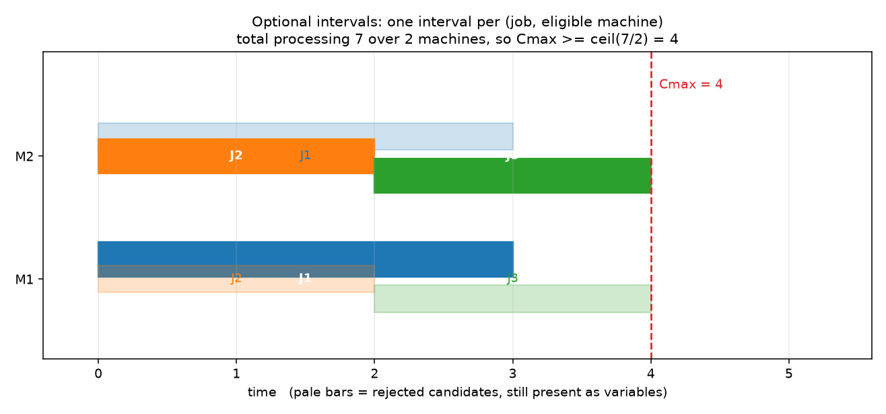

# Week 3 · Day 2：并行机：选择、加工和互斥分别建模

> **先读教材正文**：[第 5 章：CP-SAT](../教材/05_CP_SAT与调度建模.md)。本页用于读后的复习和项目实验，不能代替零基础教材中的完整推导。

[月度索引](../README.md) · [本周知识主线](../week3.md) · [前一天](Day1.md) · [后一天](Day3.md)

> 当日主题：**把「用哪台机器」「在这台机器上做多久」「同一台机器上能不能同时做」拆成三条互不替代的约束**
> 当日产出：**共享主时间变量的并行机模型**、**三作业 3、2、2 实例的完整下界论证与最优性证明**
> 建议投入：3～4 小时

---

## 1. 今日学习目标

完成今天的学习后，你应该能够：

1. 把一道并行机任务的要求拆成三个职责：**选择**（这道工序去哪个候选）、**加工**（时长等式 $S+p=E$）、**互斥**（同一台机器上的区间不重叠），并说清每一件由哪条约束承担。
2. 写出可选区间的核心语义 $a=1\Rightarrow S+p=E$，并解释为什么 $a=0$ 时候选区间的开始、结束数值**不会自动归零**。
3. 用 `AddExactlyOne` 表达「每道工序恰好选一台合格机器」，用 `AddNoOverlap` 表达「同一台机器不同时加工两道工序」，并且**说清这两条为什么不能互相替代**。
4. 逐行解释教材 5.4 的共享主时间变量写法，说得出每个变量在模型里的角色，以及「工时随机器不同」时它是怎么自动切换的。
5. 独立完成三作业 3、2、2、两台同质机器的手算：给出可证下界 $\lceil 7/2\rceil=4$，构造一个达到 4 的排程，据此**证明**最优值为 4。
6. 说清「负载下界恰好可达」是实例性质而不是定理：换成三个工时都是 3，两台机器，下界是 5 但最优值是 6。
7. 说出「机器专属 $S_{jm},E_{jm}$ + 求和恢复完工时间」的写法需要补什么条件，以及共享主时间变量为什么绕开了这个特定陷阱。
8. 分开读 `status`、`objective`、`best_bound`：`OPTIMAL` 与 `FEASIBLE` 各自证明了什么，启发式的 `best_bound` 为什么必须是空的。

---

## 2. 为什么第 2 天要把「选择、加工、互斥」拆开

Day 1 备好了三样零件：**变量域**（每个变量维护一小组仍可能取到的值）、**约束传播**（不枚举完整排程就能推出的删值）、**区间对象**（`S`、`p`、`E` 加一条 $S+p=E$ 的约束，半开区间 $[S,E)$ 在 3 结束、下一个在 3 开始不算重叠）。昨天还专门说清了可选区间的存在语义：

$$a=1\Rightarrow S+p=E,$$

以及那句最容易被读错的话 —— **$a=0$ 时候选区间在调度全局约束里被当作不存在，但它的 $S$、$E$ 不会因此自动归零**。

今天要做的事，是把这些零件装到「多台合格机器」这个场景上。装配之前先看清一件事：**并行机比单机多出来的，只有一个离散决策**。单机问题里区间是必选的，机器是给定的；一旦一道工序有多台合格机器，「去哪台」就变成模型要回答的问题。目标函数里并不出现「选机变量」这种东西，选机是**通过「哪些区间参与机器调度」间接影响 makespan 的**。这正是 CP-SAT 与第 2 周 MILP 写法在观感上的主要差别：这里不需要 Big-M、不需要 $y_{jk}$ 这类「谁在谁前面」的变量，机器上的先后关系由 `NoOverlap` 在内部组织，模型里只留下布尔量 $a$ 和区间。

也正因为如此，三种错误特别容易混在一起发生：

1. **只写机器互斥（`NoOverlap`），忘了选择约束。** 互斥只保证「参与了的区间之间不重叠」，它没有任何一句话要求某道工序必须参与。模型完全可以给全部候选取 $a=0$，交出一个人人都没干活、机器全空的「解」。
2. **只写选择约束（`ExactlyOne`），忘了机器互斥。** 每道工序确实恰好选了一台，但同一台机器上可以同时开工全部工序 —— makespan 退化成最长的那道工序，看起来「非常优」。
3. **两条都写了，但时间变量接错了。** 例如让每台候选机器各自拥有一套开始、结束变量，再用求和去恢复作业完工时间，却不处理缺席候选的时间值（第 8 节）。这种错误比前两种更隐蔽：约束条数对、状态是 `OPTIMAL`、甚至目标值在小实例上也对。

这三条合起来就是今天最该带走的一句话：**「求解器返回 `OPTIMAL`」证明的是「在这个模型里没有更优解」，它一个字也没证明「这个模型说的是你想要的业务」。** 模型语义的正确性只能靠逐条对照「业务要求 → 哪条约束」来保证。

---

## 3. 三个职责：业务一句话，模型一条约束

先把三个职责摆在一张表里。日后拿到一个排程需求，先问自己「它落在哪一行」，再动手写代码。

| 职责 | 业务语言 | 模型里的载体 | 漏掉之后会发生什么 |
|---|---|---|---|
| **选择** | 这道工序用哪台（合格的）机器 | 每台合格机器一个布尔量 $a_{jm}$，再加 $\sum_{m\in M_j} a_{jm}=1$ | 候选可以**全部缺席**：任务凭空消失，机器全空，状态却可能仍是 `OPTIMAL` |
| **加工** | 一旦选中，它在这台机器上就耗 $p_{jm}$ | 存在时满足 $S_j+p_{jm}=E_j$（共享主时间变量的写法） | 时长与所选机器不匹配：选了机器 0 却按机器 1 的工时占机器 |
| **互斥** | 同一台机器同一时刻只做一件事 | 每台机器一条 `AddNoOverlap(该机器的候选区间)` | 同一台机器上的工序可以重叠，「排程」不再是一份排程 |

换成记号写一遍。设 $M_j$ 是工序（本项目的并行机实例里每个作业只有一道工序，所以作业与工序一一对应）$j$ 的合格机器集合，$p_{jm}$ 是它在机器 $m$ 上的工时，$a_{jm}$ 是「$j$ 选择机器 $m$」的布尔量，$I_{jm}$ 是对应的可选区间。模型的骨架是：

1. 对每个 $j$：为每个 $m\in M_j$ 建 $a_{jm}$ 与 $I_{jm}$，并加 $\sum_{m\in M_j}a_{jm}=1$。
2. 对每台机器 $m$：把全部 $I_{jm}$（$m\in M_j$）收进一个列表，加一条 `NoOverlap`。
3. 对每个 $j$：$S_j\ge r_j$；对目标 makespan：$C_{max}\ge E_j$；最后最小化 $C_{max}$。

第 3 步里的 $r_j$ 在本项目是直接写进变量下界的（`NewIntVar(release_time * scale, ...)`），不是先放开域再加一条约束 —— 两种写法等价，但前者让传播一开始就站在 $r_j$ 上。

**这三行不是三种写法，是三个职责。** 可以少写一行而在某个小实例上碰巧得到正确的目标值（例如全资格 + 单机实例上，互斥是隐含的），但这不构成可以省的理由：实例一换，省掉的那条就会以「最优解里有一半任务没做」的形式出现。表里的「漏掉之后会发生什么」一列，就是用来在事后定位问题的。

---

## 4. 可选区间的机制（教材 5.4）

教材 5.4 把机制讲得很紧，这里把它摊开。

为每个候选 $(j,m)$ 建一个布尔量 $a_{jm}$，它的名字在设计上是 `presence`（存在变量）。核心语义是一条**单向蕴含**：

$$a_{jm}=1\Rightarrow S_{jm}+p_{jm}=E_{jm}.$$

注意它是单向的：区间对象关心的是「这个区间在不在」，不是「$S+p=E$ 成不成立」。$a_{jm}=0$ 的候选：

1. 在它所属机器的 `NoOverlap`（以及容量约束 `AddCumulative`）里被**视为不存在**，不占任何位置；
2. 但**它的 $S_{jm}$、$E_{jm}$ 依然是模型里的普通整数变量**，仍然受自己的域（以及你另外加在它们身上的任何约束、任何目标项）支配。

这两点的差别是今天最值得停下来想的地方。第 1 点让人以为「缺席 = 这个区间消失了」，于是很自然地顺推「那它的开始结束当然是 0 了」。第 2 点说明这一步顺推不成立 —— 关于 $a_{jm}=0$ 时 $S_{jm}$、$E_{jm}$ 取什么值，**可选区间本身什么都没说**。它们可以是域里的任何一个值，取决于求解器怎么满足其余约束。

> **易误读点（见[概念勘误](../CONCEPT_CORRECTIONS.md)）**
> 旧表述：可选区间缺席时结束时间自动为零。
> 正确理解：缺席**不自动固定**辅助时间；如果模型另外用求和去恢复作业完工时间，那就必须为缺席候选补一条条件，否则求和里会混进一个自由数。

这条不是学术细节。Day 1 已经说过它；今天它会在第 8 节变成一个具体的、会在真实模型里出现的错误。

---

## 5. 推荐写法：各候选共享作业的主 $S$、$E$

教材 5.4 给的写法是：**让一道作业的全部候选共用同一对开始、结束变量**，也就是作业级的主时间变量。片段如下（`eligible_machines`、`processing`、主时间变量等需先在模型里建好）：

```python
chosen = []
for m in eligible_machines[j]:
    a = model.new_bool_var(f"choose_{j}_{m}")
    interval = model.new_optional_interval_var(
        start[j], processing[j][m], end[j], a, f"task_{j}_{m}"
    )
    machine_intervals[m].append(interval)
    chosen.append(a)
model.add_exactly_one(chosen)
```

逐行读一遍：

1. `model.new_bool_var(...)` 建出 $a_{jm}$。**它是「选择」这件事唯一的载体**，也决定了这道工序会不会出现在机器 $m$ 的候选池里。
2. `start[j]`、`end[j]` 是这道作业的**主**开始、主结束变量，两个变量对全部候选共用。因为它们唯一，作业的完工时间就是 $E_j$ 本身，**不需要**再从多个候选的结束时间「恢复」出来。
3. `processing[j][m]` 是 $p_{jm}$，即作业 $j$ 在机器 $m$ 上的工时。这一步把「工时随机器不同」直接写进了候选对象的时长参数里。
4. `new_optional_interval_var(start, size, end, a, name)` 把三件事绑到一个对象上：$a=1$ 时要求 $S_j+p_{jm}=E_j$；$a=0$ 时该区间在机器调度里不参与；以及这个区间的名字（名字会出现在求解日志和诊断输出里，起名时把工序与机器都编进去）。
5. `machine_intervals[m].append(interval)` 与 `chosen.append(a)` 收集两个不同维度的东西：前者是**机器维度**的候选池（后面交给 `NoOverlap`），后者是**作业维度**的候选列表（马上交给 `ExactlyOne`）。
6. `model.add_exactly_one(chosen)` 一次性表达「至少选择一台」与「至多选择一台」。这两半都必要：少了「至少」，任务可以缺席；少了「至多」，同一道作业可以同时占用多台机器。

**工时随机器不同时会发生什么？** 选中哪台，就激活哪条时长等式。因为 `ExactlyOne` 只让一个 $a_{jm}$ 为真，模型不会同时要求 $E_j-S_j$ 等于两个不同的数。反过来说：如果某道作业的两个候选都被置为真（ExactlyOne 写漏了、或者写成了「至少一个」），而两个工时又不同，那么 $E_j-S_j$ 会同时被要求等于两个数 —— 那是一个直接不可行的方程组，求解器会报 `INFEASIBLE`。**这类「约束互相打架」是最容易定位的一种错误**，比目标值悄悄变小的错误好得多。

本项目 `projects/02_optimization_models/opt_models/cpsat_models.py` 的 `build_cpsat_model` 用的就是这个结构（下面是节选）：

```python
presences = []
for machine_id in eligibility:
    flag = model.NewBoolVar(f"pres_{op.id}_{machine_id}")
    interval = model.NewOptionalIntervalVar(
        start, size, end, flag, f"iv_{op.id}_{machine_id}"
    )
    presence[(op.id, machine_id)] = flag
    presences.append(flag)
    machine_intervals[machine_id].append(interval)
    ...
if len(presences) == 1:
    model.Add(presences[0] == 1)
else:
    model.AddExactlyOne(presences)
```

两处值得对照：

1. **只有一台合格机器时，`ExactlyOne` 退化成 `presences[0] == 1`。** 也就是说「必选区间」不是另一套 API，而是可选区间在 $|M_j|=1$ 时的特例。理解这一点之后，固定路由的 Job Shop 与柔性路由的并行机就不必当成两个模型看。
2. **无重叠的收尾是每台机器一条**：

```python
for intervals in machine_intervals.values():
    if len(intervals) > 1:
        model.AddNoOverlap(intervals)
```

一条机器级约束顶掉该机器上全部两两 disjunctive 约束。这也是为什么 CP-SAT 模型里看不到 $y_{jk}$：先后关系不需要显式的二元变量。

---

## 6. ExactlyOne 与 NoOverlap 各解决什么（本日最重要的辨析）

两条约束各自管一个维度：

- `ExactlyOne`（$\sum_m a_{jm}=1$）作用在**作业维度**：对一道固定的工序，数它有几个候选成立。它说的是「数量」。
- `NoOverlap`（每台机器一条）作用在**机器维度**：对一台固定的机器，检查落在它上面的活跃区间有没有重叠。它说的是「位置」。

它们谈的是两个不同的投影，所以**不能互相替代**。把四种组合摆开看最清楚：

| 写法 | 模型允许的事 | 目标值会变成什么样 |
|---|---|---|
| 只有 `NoOverlap` | 每台机器上不重叠，但**没有任何断言要求工序被选中** | 可以全部候选取 $a=0$：谁都没被排进去，约束一条都没被违反 |
| 只有 `ExactlyOne` | 每道工序恰好选一台，但同一台机器上可以**同时**做很多道 | makespan 退化成最长工时，看起来「很优」 |
| 两条都有 | 每道工序选一台，且机器上不重叠 | 才是并行机模型，目标值可信 |
| 顺序反过来写 | 「每台机器恰好选一个候选」是**另一个意思**的约束 | 它限制的是机器上候选的数量，与「任务必须被做一次」无关 |

第三种组合里还有一个更值得注意的事实：**在只有 `NoOverlap` 的模型里，那个「全缺席」的解在目标上未必看得出来。** 因为 $E_j$ 的变量域下界本来就是 $r_j+p_{jm}$，而 $C_{max}\ge E_j$ 对每个 $j$ 都成立，所以即使全部候选缺席，目标值也至少是 $\max_j(r_j+p_j)$ —— 它和目标函数在正常解上取的值可能在同一个量级，光看数字分辨不出来。本项目的读解函数 `_read_schedule` 会独立检查「每道工序成立的存在变量恰好一个」，不满足就抛错：

```python
eligible = [m for m in op.eligible_machine_ids
            if solver.BooleanValue(built.presence[(op.id, m)])]
if len(eligible) != 1:
    raise ValueError(f"model did not select exactly one machine for {op.id}: {eligible}")
```

这段代码是**工程上的兜底**，不是模型语义的一部分。模型该写的那条 `ExactlyOne` 不能因为读解时会检查就省掉：读解检查只在读到解的那一刻生效，而搜索过程中的界、以及任何以 `presence` 为输入的约束（例如容量约束里的需求值）都不受它保护。

一句话记法：**`ExactlyOne` 管「有没有做」，`NoOverlap` 管「有没有撞车」。** 两个问题各自独立，缺一个就少一种保证。

---

## 7. 缺席不等于归零：这条要单独记住

把第 4 节的第 2 点写成一个可以在代码里复现的观察。

**观察。** 建一个可选区间，存在变量取假，此时它的 `start`、`end` 仍然是模型里的普通整数变量：它们的域（由 `NewIntVar` 的上下界决定）照旧生效，任何加在它们身上的普通线性约束照旧生效，任何把它们放进去的线性表达式照旧生效。可选区间对它们唯一的「特殊处理」是：**在机器调度约束里不算数**。

**后果。** 如果一个模型里存在这样的写法：

$$E_j=\sum_{m\in M_j} E_{jm},$$

并把这个 $E_j$ 送进目标或交期约束，那么每一个缺席候选的 $E_{jm}$ 都会贡献一个**自由数**到求和中。求解器为了让目标好看，会把它们往小里推 —— 但「往小里推」是一个搜索行为，不是模型给的保证；换一个目标、换一组约束，同一个模型就可能给出别的值。

**两种合法修法：**

1. **共享主时间变量（第 5 节）。** 全部候选共用一个 $E_j$，不存在「多个候选的结束时间要加起来」这件事，于是缺席候选根本没有独立的时间数值可以被求和。这就是教材 5.5 说的「共享主时间变量能避免这个特定陷阱」。
2. **给缺席候选一个明确的中性值，并把保证写出来。** 如果非要每个候选一套变量，那就补一条指标式约束，例如 $a_{jm}=0\Rightarrow E_{jm}=0$，并且**检查它与 $E_{jm}$ 的域是否相容**（域的下界若不是 0，这条蕴含就会直接把 $a_{jm}$ 钉死为 1）。写完之后，还要回过头确认：所有引用 $E_{jm}$ 的地方是不是都只想要「选中那个」的值。

绝不能做的第三件事是：**装作第 1 种写法是 API 的语义，于是第 2 种写法里什么也不补。** 把实现里的一个选择（共享主变量）误读成「可选区间缺席时自动归零」，就正好是概念勘误里那一条的来源。

---

## 8. 另一种写法：机器专属 $S_{jm}$、$E_{jm}$ 与求和恢复

第 7 节的修法 2 值得单独看一遍，因为它在别的场景里也有吸引力：有时我们**确实**想要每个候选自己的一套时间变量（例如要给不同机器加不同的日历、不同的准备时间）。这时模型长这样：

```text
对每个 (j, m), m in M_j:
    a[j][m]   in {0,1}
    S[j][m]   in [r_j, H]
    E[j][m]   in [r_j, H]
    I[j][m]   = optional_interval(S[j][m], p[j][m], E[j][m], a[j][m])
sum_m a[j][m] = 1                       （选择）
NoOverlap(机器 m 上的全部 I[*][m])       （互斥）
E_j = sum_m E[j][m]                     （恢复作业完工时间）
C_max >= E_j,  最小化 C_max
```

最后两行就是陷阱所在。求和成立的**前提**是：除选中的那一个之外，所有 $E_{jm}$ 都等于 0。教材 5.5 说得很直接：如果采用每个候选独立的 $S_{jm}$、$E_{jm}$，并用求和恢复作业结束，就**必须对缺席候选的 $E$ 单独处理**（就是第 7 节的修法 2）。

两个补充说明，避免把这个陷阱读成「求和写法不能用」：

1. **它不是唯一合法写法，也不是非法写法。** 它只是一种需要额外条件的写法。共享主时间变量绕开了这个特定陷阱，代价是失去了「每台机器各自一套时间变量」的灵活性。
2. **在小实例上两种写法可能给出同一个答案。** 尤其是 $|M_j|=1$ 时，求和里只有一项，缺失的归零条件无关紧要 —— 于是从单机实例上「验证通过」的经验，不能推广到多台机器。这正是这类错误常常要到规模上去才暴露的原因。

---

## 9. 手算：三作业 3、2、2，两台同质机器（教材 5.5）

现在把整套东西摊在纸上算一遍。这是教材 5.5 的可运行实例：**三道作业，工时分别是 3、2、2；两台同质机器，两道作业都合格；释放时间全为 0。**

```text
作业   工时 p_j   合格机器
J1        3       M0, M1
J2        2       M0, M1
J3        2       M0, M1
```

### 9.1 第一步：给出下界

总加工量是 $3+2+2=7$。**两台机器在同一时刻合起来最多推进 2 个单位的加工** —— 因为 `NoOverlap` 保证每台机器同一时刻至多一道工序，而这里每台机器的每道工序恰好占用 1 个单位需求。于是到时刻 $t$ 为止，两台机器合起来最多完成 $2t$ 个单位的加工。要让全部 7 个单位都完成，必须有 $2t\ge7$，即

$$C_{max}\ \ge\ \frac{7}{2}\ =\ 3.5.$$

本项目的时间是整数（`time_scale=1` 时工时就是整数，见 Day 1 关于整数化与精度的说明），所以可以加强为

$$C_{max}\ \ge\ \lceil 7/2\rceil\ =\ 4.$$

再检查第二个下界来源：**最长的那道作业自己就要占满一台机器 3 个单位时间**，所以 $C_{max}\ge\max_j p_j=3$。这条比 4 弱，取两者较大者，得到 $C_{max}\ge4$。

用项目里的函数说就是 `parallel_makespan_lower_bound`：

$$LB=\max\Big(\max_j p_j,\ \big\lceil \textstyle\sum_j p_j / m\big\rceil\Big),$$

其中 $m$ 是机器数。它在脚本输出里会直接打印出来。

### 9.2 第二步：构造一个达到下界的排程

| 机器 | 排程 |
|---|---|
| M0 | J1 占 $[0,3)$ |
| M1 | J2 占 $[0,2)$，紧接着 J3 占 $[2,4)$ |

逐条核对：机器互斥满足（M0 上只有一道；M1 上两道首尾相接，半开区间 $[0,2)$ 与 $[2,4)$ 不相交）；每道作业恰好在一台机器上；三道作业的时长分别是 3、2、2，与要求一致；释放时间全 0，两道从 0 开始、一道从 2 开始，都满足 $S_j\ge r_j=0$。目标值

$$C_{max}=\max(3,\ 2,\ 4)=4.$$

### 9.3 第三步：结论

**可证下界 4 ≤ 最优值 ≤ 可行上界 4，所以最优值等于 4。** 这就是完整的最优性证明。

必须强调这两个方向各自做了什么：

1. **只排出 4 不够。** 它只证明「存在一个 4 的排程」；要证明最优，还得排除「存在一个 3 的排程」。
2. **只算下界 4 也不够。** 下界对任意可行排程成立，它只排除 3；若不给出达到 4 的排程，我们只知道最优值在 $[4,+\infty)$。
3. 两句话合起来才等于「证明」。缺了任何一半，报告里的状态只能写 `FEASIBLE`（第 11 节）。

### 9.4 这个排程在模型里对应什么

- 存在变量：$a_{1,M0}=1$、$a_{2,M1}=1$、$a_{3,M1}=1$，其余三个候选为 0。
- 主时间变量：$S_1=0,E_1=3$；$S_2=0,E_2=2$；$S_3=2,E_3=4$。
- M0 的 `NoOverlap` 只看见 J1 那一条区间（J2、J3 在 M0 的候选缺席，被当作不存在）；M1 的 `NoOverlap` 看见 J2、J3 两条活跃区间，它们不重叠。
- 目标：$C_{max}\ge E_j$ 对三道作业都成立，取到 4。

看图。这张图把「每个 (作业, 合格机器) 一个候选」这件事直接画了出来：



图注（英文标签与图上的文字一一对应）：

1. 标题两行 **"Optional intervals: one interval per (job, eligible machine)"** 与 **"total processing 7 over 2 machines, so Cmax >= ceil(7/2) = 4"** —— 每个「作业 × 合格机器」建一个可选区间；总工时 7 摊到两台机器，所以下界是 $\lceil7/2\rceil=4$（正是 9.1 的论证）。
2. 纵轴两行 **M1 / M2** 是两台机器（图脚本用 1 起始编号，对应正文里的机器 0 与机器 1），横轴 **"time (pale bars = rejected candidates, still present as variables)"** 是时间，并注明浅色条表示**被拒绝、但仍以变量形式留在模型里**的候选。
3. 实心条是被 `ExactlyOne` 选中的三个候选：**J1** 在 M1 上占 $[0,3)$（蓝）、**J2** 在 M2 上占 $[0,2)$（橙）、**J3** 在 M2 上占 $[2,4)$（绿）；浅色条是同一批作业在另一台机器上的候选（J1 在 M2 的 $[0,3)$、J2 在 M1 的 $[0,2)$、J3 在 M1 的 $[2,4)$），它们不参与所在机器的 `NoOverlap` —— **浅色条不是「被删掉的变量」，而是模型里仍然存在、只是缺席的候选**。
4. 红色虚线 **"Cmax = 4"** 标出这个排程的最长完工时刻，与 9.2 手算的 4 一致；橙色与绿色两条在同一行上首尾相接，正是 `NoOverlap` 允许的形状（半开区间 $[0,2)$ 与 $[2,4)$ 不重叠）。

这张图由 `projects/02_optimization_models/examples/m2_figures.py` 的 `fig_parallel_optional()` 生成，选中的机器与开始时间是脚本里写死的这一组最优排程，不是渲染时的猜测。

### 9.5 下界不总可达：三个 3、两台机器

手算的意义之一是让人**不再把下界当成最优值**。换一个实例：三道作业工时都是 3，两台同质机器。总工时 $9$，所以

$$LB=\max(3,\ \lceil 9/2\rceil)=\max(3,5)=5.$$

但 5 达不到。理由很简单：**每道作业的工时都是 3**，于是任何一台机器上的负载都是若干个 3 之和 —— 只能是 0、3、6、9 这样的数。要满足 $C_{max}\ge5$，两台机器中至少有一台的负载要 $\ge5$，它只能是 6（或者 9）。所以最优 makespan 是 6，而不是 5：一种达到 6 的排法是 M0 做一道（3），M1 做另外两道（$3+3=6$）。

**所以「负载下界恰好可达」是实例性质，不是定理。** 3、2、2 这个实例恰好分得开（3 和 $2+2$），三个 3 分不开。同样的道理适用于 `[8,7,6,5]` 与 `[3,3,2,2,2]` 这两个项目实例：前者 $LB=13$ 恰好可达，后者 $LB=6$ 本身是可达的，但 LPT 这个启发式没找到（第 10、12 节）。

---

## 10. 从手算到脚本：两个小实例的对照

配套脚本 `m2w3d2_parallel_machines.py` 的第 1、2 段各跑一个小实例，两个实例的作用正好相反。

| 实例 | 学时（工时） | 机器 | $LB$ | LPT | CP-SAT | 要点 |
|---|---|---|---|---|---|---|
| LPT 反例 | 3, 3, 2, 2, 2 | 2 | 6 | 7 | 6（`OPTIMAL`） | 下界可达，但**贪心不保证找到** |
| 下界紧 | 8, 7, 6, 5 | 2 | 13 | 13 | 13（`OPTIMAL`） | LPT 恰好取到下界，因此在这个实例上已被证明最优 |

第一个实例的手算过程（沿用 M1 Week 1 Day 5 的原例）：

1. 总工时 $3+3+2+2+2=12$，两台机器，$LB=\max(3,\lceil12/2\rceil)=6$。
2. LPT（先排最长的）先把两个 3 放进两台机器，然后依次把三个 2 放到当前负载较轻的机器上 —— 结果是某台机器上 $3+2+2=7$，目标值 7。
3. CP-SAT 在同一组布尔量上搜索，找到 $3+3$ 与 $2+2+2$ 的分法，目标值 6，等于下界，因此 6 是**被证明的最优值**。

第二个实例：

1. 总工时 $8+7+6+5=26$，$LB=\max(8,\lceil26/2\rceil)=13$。
2. LPT 依次放 8、7、6、5：$8+5$ 与 $7+6$ 的分法恰好使两台机器负载都是 13，达到下界。
3. **这里 LPT 的 13 是一个被证明的最优值**，但证明不是 LPT 给的：它来自「LPT 的 13 是可行解的目标值」+「13 是任何可行排程都可证的下界」这两句话。缺了后者，13 只是一个可行解。

这条区分今天要反复用：**「启发式给出的解」与「被证明的最优解」是两个证据等级的东西；只有当可行值与可证下界相等时，前者才升级为后者。**

---

## 11. 状态与证书：两个必须分开读的字段

读任何一批结果，先看 `status`，再看两个数：`objective` 与 `best_bound`。

| 状态 | 它说了什么 | 它没说什么 |
|---|---|---|
| `OPTIMAL` | 手上的可行解是最优的：目标值与搜索给出的全局下界相等（gap 为 0） | 没有说模型写对了业务（第 2 节） |
| `FEASIBLE` | 找到了一个可行解；搜索没有完成证明（限时中断，或方法本身不含证明） | 没有说这个解离最优有多远 |
| `INFEASIBLE` | 在**这个模型**里不存在可行解 | 没有说是业务无解还是模型写错 |
| `UNKNOWN` | 没有得到结论 | 没有说问题可解或不可解 |

两个数的含义：

- **`objective`** 是手上那个可行解的目标值 —— 它总是「一个真实排程的值」。
- **`best_bound`** 是搜索到该点为止**可证明的下界**。它可能与 `objective` 相等（于是 `OPTIMAL`），也可能小很多（于是 `FEASIBLE`）。

规则的要点是：**`best_bound` 这一栏只能填「被证明了的下界」。** 本项目里启发式的这一栏是**空的** —— 空字符串表示「没有这个量」，不是 0。`parallel_lpt` 这类方法没有任何下界论证，填上它的目标值等于宣称「我证明了这就是下界」，那是一句假陈述。

这条规则在 `w3_parallel_tight` 上有一个特别好的例子：CP-SAT 与 LPT 的 `objective` **都是 13**。

```text
w3_parallel_tight cpsat_parallel   OPTIMAL    obj 13.0   bound 13.0
w3_parallel_tight heur_parallel_lpt FEASIBLE  obj 13.0   bound （空）
```

两个数字一样，含义完全不同：前者说「13 是最优值」，后者只说「13 是一个可行值」。**如果只把 `objective` 一列抄进报告，这个区别就消失了** —— 这正是不用「目标值相等」来判断方法强弱的原因。

---

## 12. 项目批次读数：规模上去之后

`projects/02_optimization_models/artifacts/month2_w3/results.csv` 里本周的并行机实例（每行一次运行）读出来是这样：

| 实例 | 规模 | 方法 | `status` | `objective` | `best_bound` | `iterations` |
|---|---|---|---|---|---|---|
| `w3_parallel_small` | 5 作业 2 机器 | `cpsat_parallel` | `OPTIMAL` | 6.0 | 6.0 | 96 |
| `w3_parallel_small` | 同上，`time_scale=4` | `cpsat_parallel` | `OPTIMAL` | 6.0 | 6.0 | 96 |
| `w3_parallel_tight` | 4 作业 2 机器 | `cpsat_parallel` | `OPTIMAL` | 13.0 | 13.0 | 66 |
| `w3_parallel_8` | 8 作业 3 机器 | `milp_alt` | `OPTIMAL` | 29.0 | 29.0 | 11 |
| `w3_parallel_8` | 同上 | `cpsat_parallel` | `OPTIMAL` | 29.0 | 29.0 | 227 |
| `w3_parallel_8` | 同上 | `heur_parallel_lpt` | `FEASIBLE` | 31.0 | （空） | （空） |
| `w3_parallel_12` | 12 作业 3 机器 | `milp_alt` | `OPTIMAL` | 39.0 | 39.0 | 8 |
| `w3_parallel_12` | 同上 | `cpsat_parallel` | `OPTIMAL` | 39.0 | 39.0 | 687 |
| `w3_parallel_12` | 同上 | `heur_parallel_lpt` | `FEASIBLE` | 46.0 | （空） | （空） |

这些数应当怎样读：

1. **两个精确方法在 29 与 39 上一致，而且各自的 `best_bound` 等于 `objective`。** 25 与 12 的对比里，「两个独立建模路径给出同一个目标值、且都自报下界等于目标值」是互相印证；但这仍然是**两个实现之间的交叉检查**，不是数学证明 —— 数学证明来自「下界 = 目标值」这个逻辑，不是来自「两个数字碰巧一样」。
2. **启发式的两个数（31、46）是可行解，不是证书。** 它们与已证最优值 29、39 的差距是 2 与 7。按批次里用的定义

$$\text{gap}=\frac{\text{objective}-\text{batch\_reference}}{\max(1,|\text{batch\_reference}|)},$$

其中 `batch_reference` 取「本批该实例已被证明最优的最小目标值」，得到 $2/29\approx6.9\%$ 与 $7/39\approx17.9\%$（即 CSV 里 `gap_to_batch_reference` 那两列）。**报告差距时要写清楚分母是什么**：这里的分母是本批的已证最优值，不是 LPT 自己的值。
3. **下界不紧的实例上，别把「LB」当成「最优值的估计」。** `w3_parallel_8` 的 $LB=\max(16,\lceil76/3\rceil)=\lceil 25.33\rceil=26$，而最优是 29；`w3_parallel_12` 的 $LB=\max(20,\lceil114/3\rceil)=38$，最优是 39。下界的作用是**排除**（「不可能小于 26」），不是**逼近**。这两个数放在一起看：LPT 的 31 与 46 都离最优更远，而下界给出的 26 与 38 又太松 —— 三者各说各的话，不能混着引用。
4. **`peak_resource` 一列是独立重算的并发峰值**（每个工序需求 1，`cumulative_profile` 在解上重算），2 机器实例上是 2、3 机器实例上是 3。它在这里的作用是交叉检查「每台机器同时至多一道工序」这条语义 —— 这一列在并行机上不构成约束（`NoOverlap` 已经保证了），到有共享容量的时候才会变成真正收紧模型的那一条。
5. **`iterations` 这一列是分支数（`NumBranches()`），不是时间。** 687 与 8 的差别反映的是两个建模路径在同一实例上的搜索形状不同，不能读成「快慢」。同理，任何一次运行的耗时都不要写成固定结论 —— 跨机器、跨版本的耗时不可比，可比的只有目标值、界和状态这类语义明确的量。
6. `time_scale=4` 那两行给出与 `time_scale=1` 相同的目标值与分支数，是「整数缩放不改变这个问题的最优值」在本实例上的一个读数；它是一次观察，不是「缩放总是不改变搜索量」的定律。

---

## 13. 实验：脚本怎么读

脚本链接：[m2w3d2_parallel_machines.py](../../projects/02_optimization_models/examples/m2w3d2_parallel_machines.py)。

在仓库根目录下运行（需先按[项目指南](../../projects/02_optimization_models/PROJECT_GUIDE.md)配置环境）：

```powershell
python projects/02_optimization_models/examples/m2w3d2_parallel_machines.py
```

脚本结构很小，值得整段读：

1. `parallel_instance(times, machines)` 把一串工时变成一个 M1 的 `Instance`：每个作业**恰好一道工序**，合格机器是全部机器（`Machine("M0")`、`Machine("M1")`……），释放时间全 0。这一步决定了实例是「同质、全资格」的并行机。
2. `show(times, machines)` 依次做四件事：算下界（`parallel_makespan_lower_bound`）、跑启发式（`parallel_lpt` 与 `makespan`）、建 CP-SAT 模型并报出**模型规模**（布尔 presence 数 + CP-SAT 约束条数）、跑 `cpsat_parallel` 并通过 `validate_schedule` 做独立校验。
3. `main()` 跑两个实例，最后打印一段对 `ExactlyOne` 与 `NoOverlap` 分工的说明 —— 脚本自己把今天的结论写在输出里。

实际输出（本次运行，节选）：

```text
=== 1. LPT 非最优的最小反例 ===
实例 p=[3, 3, 2, 2, 2], 2 台机器
  模型规模：布尔 presence 10 个，CP-SAT 约束 18 条
  M1 下界 LB = 6（max(最长工序, ceil(总工时 / 机器数))）
  M1 parallel_lpt  -> Cmax = 7  （> LB）
  cpsat_parallel   -> Cmax = 6, 状态 OPTIMAL, bound = 6.0, 分支 96, 冲突 5
  建模 0.0010 s / 求解 0.0092 s
    M0: J2_O0[2,4], J3_O0[0,2], J4_O0[4,6]  负载 6
    M1: J0_O0[0,3], J1_O0[3,6]  负载 6
  独立验证器：通过（5 道工序）
```

这一段里有四个值得注意的点：

1. **`presence` 的个数 = 作业数 × 机器数 = 5 × 2 = 10。** 这就是「选择」这一职责的变量成本：全资格时它随「作业数 × 机器数」增长，而每台机器上只需要**一条** `NoOverlap`（脚本报的 18 条约束里，含 5 条 `ExactlyOne` 与 2 条 `NoOverlap`，其余是变量域之外的目标式与时间关系）。
2. **`LB = 6` 与 `Cmax = 6` 相等、状态 `OPTIMAL`、`bound = 6.0`** —— 这三件事合起来才是「已证明最优」。LPT 的 7 与它相差 1，脚本自己用括号标了 `（> LB）`。
3. **两台机器的负载都是 6**，都等于 makespan：这个最优解上两台机器全程满载，与下界 6 的说法（每时刻最多推进 2 单位、一共 12 单位、6 个时刻做完）互相印证。
4. **`独立验证器：通过`** 是刻意换了一条路径：目标值由模型自己的表达式给出，而 `validate_schedule` 重新检查机器资格、机器互斥、释放时间和工序链。**不要把「模型算出的目标值」当成校验结果。**

```text
=== 2. 下界紧的实例 ===
实例 p=[8, 7, 6, 5], 2 台机器
  模型规模：布尔 presence 8 个，CP-SAT 约束 15 条
  M1 下界 LB = 13（max(最长工序, ceil(总工时 / 机器数))）
  M1 parallel_lpt  -> Cmax = 13  （= LB，该实例上 LPT 已最优）
  cpsat_parallel   -> Cmax = 13, 状态 OPTIMAL, bound = 13.0, 分支 66, 冲突 3
  建模 0.0009 s / 求解 0.0038 s
    M0: J1_O0[6,13], J2_O0[0,6]  负载 13
    M1: J0_O0[0,8], J3_O0[8,13]  负载 13
  独立验证器：通过（4 道工序）
```

第二段的读法与第一段相反：这里 LPT 的 13 **恰好**等于下界 13，所以「该实例上 LPT 已最优」这句话成立，成立的理由是「可行值 = 可证下界」；而这句话只对这一个实例成立，不是 LPT 的性质（第 10 节第一个实例就是反例）。`presence` 变成 8 = 4 × 2，约束 15 条 —— 规模随作业数线性增长。

```text
=== 3. 选机是一次「恰好一个」的决策 ===
每道工序在每台合格机器上各有一个 OptionalIntervalVar，
AddExactlyOne 保证其中恰好一个 presence 成立，AddNoOverlap 保证
同一台机器上的区间不重叠。LPT 用「长任务先放」的贪心做同一个决策，
CP-SAT 则在同一组布尔变量上搜索并给出最优性证明。
```

**运行时要注意的两点**：脚本只打印、不写盘，所以它不会修改 artifacts；另外它每次运行都会重新求解，**输出里的时间数字（建模/求解耗时）不要抄进笔记当成固定结论**。脚本传的 `time_limit` 是 5.0 秒，但这两个实例都在毫秒级解决，所以限时在这一段里没有起作用。

---

## 14. 今日练习

1. **练习 1（手算）**：三道作业工时 4、3、3，两台同质机器，释放时间全 0。写出完整下界论证，判断 $LB=\lceil10/2\rceil=5$ 是否可达，给出最优值与一个达到它的排程。
2. **练习 2（辨析）**：只写 `AddNoOverlap`、不写 `AddExactlyOne` 的并行机模型，会允许什么样的解？为什么在这种模型里那个解的目标值**未必**看起来异常？请从 $C_{max}\ge E_j$ 与 $E_j$ 的域下界两个角度说明。
3. **练习 3（实现）**：给 `build_cpsat_model` 的并行机分支加一个开关，把 `AddExactlyOne` 换成「不做任何选择约束」，在 `[3,3,2,2,2]` 上跑一次。记录 `status`、`objective` 与读解函数的行为（预期 `_read_schedule` 会因为存在变量不恰好一个而抛错 —— 记录实际观察，不要照抄这句预期）。
4. **练习 4（推导）**：证明下界 $LB=\max(\max_j p_j,\lceil\sum_j p_j/m\rceil)$ 的两项各自成立：第一项用「一道作业必须独占一台机器 $p_j$ 时间」，第二项用「$m$ 台机器每单位时间最多推进 $m$ 单位加工」。
5. **练习 5（辨析）**：写出「每个候选独立 $S_{jm}$、$E_{jm}$ + 求和恢复完工时间」的完整模型，指出若不加「缺席时 $E_{jm}=0$」，在什么条件下会污染目标值；再给出两种修法，并说明为什么共享主时间变量的写法不需要这条补充条件。
6. **练习 6（读数）**：从 `artifacts/month2_w3/results.csv` 里找出 `w3_parallel_12` 的三行，分别抄下 `status`、`objective`、`best_bound`，回答：哪一行给出了最优性证明、哪一行只是一个可行解、两者的目标值相差多少、这个差距的分母在 CSV 里是哪一列。

---

## 15. 验收清单

- [ ] 能说出并行机的三个职责，并各举一条对应的约束。
- [ ] 能默写可选区间的核心语义 $a=1\Rightarrow S+p=E$，并说清 $a=0$ 时候选区间的 $S$、$E$ 不会被自动归零。
- [ ] 能说清 `ExactlyOne` 与 `NoOverlap` 各自作用在哪个维度上，以及为什么不能互相替代。
- [ ] 能说出「只有 `NoOverlap` 没有 `ExactlyOne`」时模型会允许什么样的解，以及为什么它未必在目标值上暴露。
- [ ] 能逐行解释教材 5.4 的那段代码，包括每个变量在模型里的角色。
- [ ] 能解释为什么工时随机器不同时，共享主时间变量不会同时要求 $E-S$ 等于两个不同的数。
- [ ] 能独立完成三作业 3、2、2 的手算：下界 4、排程 M0 做 3 与 M1 做 2+2、结论最优值 4。
- [ ] 能说清「下界 + 达到下界的排程」才构成最优性证明，缺一半只能报 `FEASIBLE`。
- [ ] 能说出三个 3 两台机器的实例，$LB=5$ 但最优是 6，并给出理由（每台机器负载只能是 3 的整数倍）。
- [ ] 能说出「机器专属 $S_{jm},E_{jm}$ + 求和恢复」需要补的条件，以及共享主时间变量为什么绕开该陷阱。
- [ ] 能区分 `OPTIMAL` 与 `FEASIBLE` 各证明了什么，并说清 `objective` 与 `best_bound` 分别是什么。
- [ ] 知道启发式的 `best_bound` 必须为空，并且知道 `w3_parallel_tight` 上「两个 13」的含义不同。
- [ ] 能报出 `w3_parallel_8` 与 `w3_parallel_12` 的三组读数（29 / 29 / 31 与 39 / 39 / 46），并说明 31 与 46 是可行解而不是证书。
- [ ] 知道下界不紧时不能把 $LB$ 当成最优值的估计（26 与 29、38 与 39）。
- [ ] `python projects/02_optimization_models/examples/m2w3d2_parallel_machines.py` 能跑通（退出码 0），输出与第 13 节一致。
- [ ] 知道脚本只打印、不写盘，不会改动已有 artifacts。

---

## 16. 自测题

- Q1：并行机模型的三个职责分别由什么承担？漏掉「选择」会发生什么？
- Q2：可选区间缺席时，它的开始、结束变量会变成 0 吗？这两件事（参与调度、数值取值）有什么区别？
- Q3：只写 `NoOverlap` 不写 `ExactlyOne` 的模型会返回什么样的解？为什么状态可能仍是 `OPTIMAL`？
- Q4：只写 `ExactlyOne` 不写 `NoOverlap` 呢？目标值会变成什么形状？
- Q5：共享主时间变量的写法为什么不需要「缺席时归零」这条补充条件？
- Q6：三作业工时 3、2、2 两台同质机器，最优值是多少？请分别给出下界与达到下界的排程。
- Q7：下界 $\lceil\sum_jp_j/m\rceil$ 一定可达吗？举一个不可达的例子并说明理由。
- Q8：`[3,3,2,2,2]` 上 $LB=6$、CP-SAT 给 6、LPT 给 7，这三个数各证明了什么？
- Q9：为什么启发式的 `best_bound` 必须是空的？填上目标值会怎样？
- Q10：`[8,7,6,5]` 上 LPT 与 CP-SAT 都给 13，能不能说「LPT 在这个实例上被证明了最优」？理由是什么？

### 参考答案

- A1：**选择**由每台合格机器一个布尔量加上 $\sum_m a_{jm}=1$ 承担；**加工**由「存在时满足 $S_j+p_{jm}=E_j$」承担；**互斥**由每台机器一条 `AddNoOverlap` 承担。漏掉选择，候选可以全部缺席：任务一台都没做，机器全空，而 `NoOverlap` 一条都没被违反。
- A2：不会。可选区间对缺席候选唯一的特殊处理是「在机器调度约束里不算数」；它的开始、结束仍是模型里的普通整数变量，受自己的域和别的约束支配。两者的区别正是「参与不参与调度」与「数值等于几」的区别 —— 前者由存在变量决定，后者**没人替你决定**。
- A3：它会允许「全部候选 $a=0$」的解：没有任何断言要求工序被选中，机器上自然是空的。状态仍可能是 `OPTIMAL`，因为求解器只对**写出来的模型**负责，而这个模型的最优解就是那个空排程。目标值未必看起来异常：$C_{max}\ge E_j$ 对每个作业都成立，而 $E_j$ 的域下界本来就是 $r_j+p_{jm}$，所以目标值至少是 $\max_j(r_j+p_j)$，可能在正常量级上 —— 光看数字分辨不出来。
- A4：每道工序确实恰好选一台，但同一台机器上可以同时加工全部工序；`NoOverlap` 缺位意味着「机器的独占性」没有任何约束在管，makespan 会退化成最长的那道工序。
- A5：因为全部候选共用同一个 $E_j$，作业的完工时间就是 $E_j$ 本身，模型里根本不存在「把多个候选的结束时间加起来」这个操作，也就没有「缺席候选的 $E$ 要等于 0」这个前提要满足。
- A6：最优值是 4。下界：总工时 7，两台机器每时刻最多推进 2 单位，$C_{max}\ge7/2$，整数下至少 4；比较最长作业给的 3，取 4。达到下界的排程：M0 做工时 3 的那道（$[0,3)$），M1 依次做两道工时 2 的（$[0,2)$ 与 $[2,4)$），$C_{max}=4$。可行上界 = 可证下界 ⇒ 最优值 4。
- A7：不一定可达。三个工时都是 3、两台机器时，$LB=\max(3,\lceil9/2\rceil)=5$，但每台机器上的负载只能是 3 的整数倍（0、3、6、9），要 $\ge5$ 只能取 6，所以最优是 6。原因是「作业不可分割」：负载没法做成 4.5 与 4.5。
- A8：$LB=6$ 是**任何**可行排程都满足的可证下界（它排除一切小于 6 的排程）；CP-SAT 的 6 加上 `OPTIMAL` 说明「6 可达且没有更优」；LPT 的 7 是一个可行解的目标值，它与最优值相差 1 —— 这个「1」只能由「最优值是 6」这件事实来度量。
- A9：因为 `best_bound` 这一栏的语义是「被证明的下界」。启发式没有任何下界论证，填上目标值等于宣称「我证明了这就是下界」，是假陈述。项目里这一栏留空（空字符串表示「没有这个量」，不是 0）。
- A10：可以，但理由不是「两个数字相同」，而是「LPT 的 13 是一个可行解的目标值，而 13 又是该实例对任意可行排程都成立的下界」—— 可行值等于可证下界即最优。这个论证依赖两个前提：实例的释放时间全为 0 且工时与机器无关（下界公式的适用范围），以及 13 确实是这个实例的下界。两个数字相等本身**不是**理由：`w3_parallel_tight` 上 LPT 与 CP-SAT 的 13 相同，而在 `[3,3,2,2,2]` 上 LPT 的 7 与 CP-SAT 的 6 不同 —— 说明「碰巧一样」不足以说明什么。

---

## 17. 今日一句话总结

> **选择靠 `ExactlyOne`、加工靠时长等式、互斥靠 `NoOverlap` —— 三条约束各管一件事，缺一条会得到一个「状态 OPTIMAL、语义错误」的模型。**

---

## 配套代码入口

从仓库根目录运行（需先按[项目指南](../../projects/02_optimization_models/PROJECT_GUIDE.md)配置环境）：

```powershell
python projects/02_optimization_models/examples/m2w3d2_parallel_machines.py
```

[阅读示例源码](../../projects/02_optimization_models/examples/m2w3d2_parallel_machines.py)。先完成正文手算，再用脚本核对项目实例；记录实例、状态、约束检查与目标，不把一次运行耗时作为固定结论。实现与数学语义的区别见[概念勘误](../CONCEPT_CORRECTIONS.md)。
