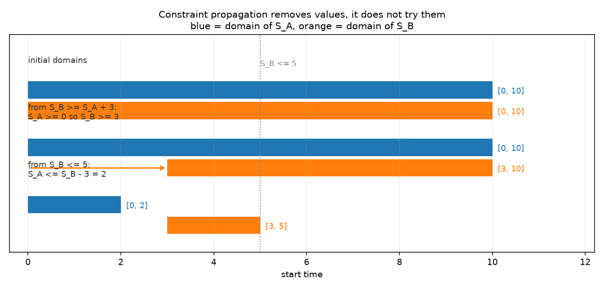
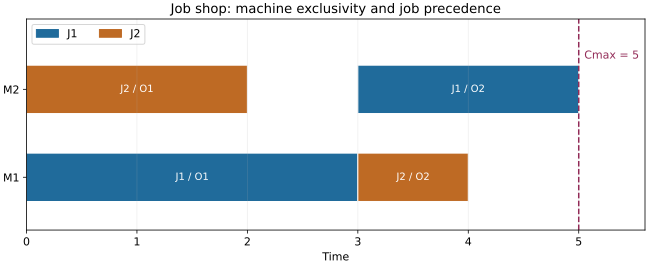
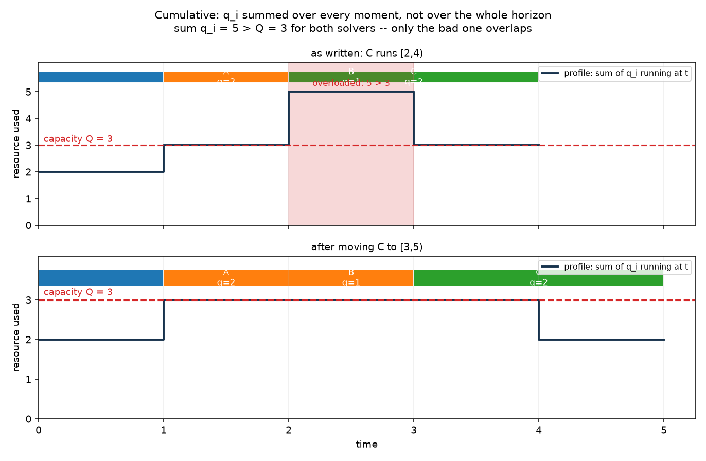
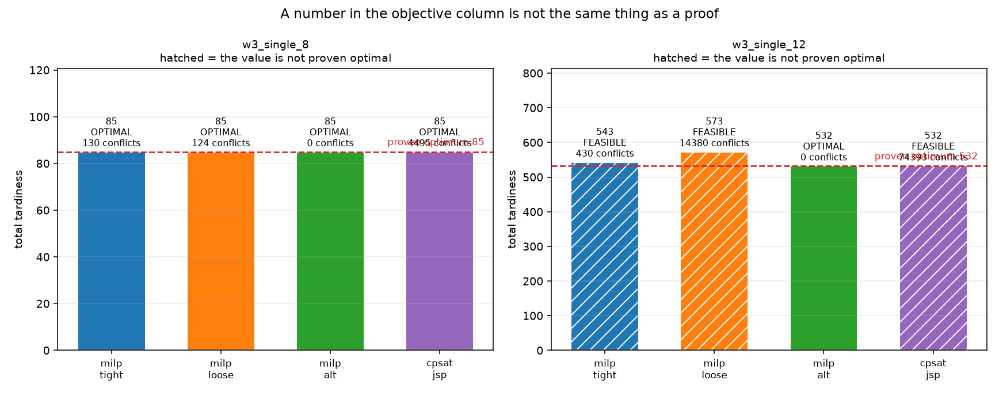

# Week 3 · Day 7：第三周复盘：传播、学习与松弛如何协同

> **先读教材正文**：[第 5 章：CP-SAT](../教材/05_CP_SAT与调度建模.md)、[第 7 章：综合实训](../教材/07_综合实训与解答.md)。本页用于读后的复习和项目实验，不能代替零基础教材中的完整推导。

[月度索引](../README.md) · [本周知识主线](../week3.md) · [前一天](Day6.md)

---

## 1. 今日学习目标

完成今天的学习后，你应该能够：

1. 说清「传播」与「试值」的区别：传播是**删值**，它一次也没有枚举过组合（第 3 节）。
2. 复述区间的两个约定 $S+p=E$ 与半开区间 $[S,E)$，并说出为什么 $[0,3)$ 与 $[3,5)$ 相接不算重叠（第 4 节）。
3. 把「选择 / 加工 / 互斥」三件职责分别归给 ExactlyOne、时长等式与 NoOverlap，并说明为什么三者不能互相替代（第 5 节）。
4. 说出可选区间缺席时它的 $S$、$E$ 会发生什么，以及为什么「缺席即归零」只是某个求和设计带来的补充条件（第 6 节）。
5. 从一个作业的工序链长度推出工期下界，并解释漏写作业链或机器互斥会「错误允许」什么排程（第 7 节）。
6. 解释 $\sum_i q_i>Q$ 为什么不构成不可行的理由，并说清机器 NoOverlap 为什么不能被 Cumulative 顶替（第 8 节）。
7. 逐个说出 OPTIMAL / FEASIBLE / INFEASIBLE / UNKNOWN 的含义，并说明「拿到最优值」与「证明最优」为什么不相等（第 9 节）。
8. 设计一次公平的跨后端比较，并说清节点数与冲突数为什么不是同一种单位（第 10 节）。

---

## 2. 复盘不是摘要，是重组

六天里每天各留下一个结论（[Day 1](Day1.md) 到 [Day 6](Day6.md)）。复盘最容易做错的地方，是把六个结论按日期再讲一遍 —— 那样得到的是一份**目录**，不是一条**链**。今天要把它们串成一条能复述的链：后一环要用的东西，正是前一环交出来的。

| 环 | 回答的问题 | 对应 | 交给下一环的东西 |
|---|---|---|---|
| 1. 域与传播 | CP 的决策空间长什么样 | Day 1 | 「删值」这套推理方式 |
| 2. 区间的约定 | 时间怎样被切成一段一段 | Day 1 | $S+p=E$ 与半开区间 |
| 3. 三种职责 | 选择、加工、互斥分别由谁负责 | Day 2 | 一组布尔 presence + 每机器一条 NoOverlap |
| 4. 缺席的陷阱 | 没被选中的区间在干什么 | Day 1、Day 2 | 主时间变量与中性值的取舍 |
| 5. 两类关系 | 作业链与机器冲突为什么要同时写 | Day 3 | 作业链长度给出的工期下界 |
| 6. 累计资源 | 多个任务同时用一项资源怎么限制 | Day 4 | 峰占用与能量下界 |
| 7. 状态与证据 | 求解器报出的每个字段各自证明了什么 | Day 5 | 状态、目标、界、gap 的读法 |
| 8. 跨后端比较 | 两个求解器在同一个问题上怎么比 | Day 6 | 带条件的结论 |

八环的顺序不是随意的：**第 2 环的区间建在第 1 环的整数域上；第 3 环的三件职责分别作用在第 2 环的区间上；第 4 环处理的是第 3 环里那些「没被选中的候选」；第 5 环把第 3 环的单层选择叠成多层结构；第 6 环把「互斥」换成「容量」；第 7 环读的正是第 3 到 6 环报出来的那些数字；第 8 环检查第 7 环的读法换一个后端还成不成立。** 中间任何一环塌掉，后面的数字都会变成「没被验证过的字符串」。

复盘有三件事**不该做**，这一周每一件都有具体的反面例子：

```text
1. 不把「传播结束了」当成「答案已定」—— 传播没发现矛盾，不等于问题可行；
   传播停下来，也不等于每个域都到了理论最紧（Day 1、教材 5.1）。
2. 不把一次运行的耗时、分支数、冲突数写成方法的性质 —— 它们是观测值；
   同一实例只改预算，状态就会从 FEASIBLE 变成 OPTIMAL（Day 5 第 6 节）。
3. 不把「这个实例上更快」写成「这个范式更强」—— 同一批实例上两个方向都能找到
   反例（第 10 节）；结论必须带上实例集、预算与版本。
```

**本周在整月里的位置**（只看已经走过的三步）：第 1 周学会用数学式表达资源分配，并让每个结论配一份证书；第 2 周处理离散选择与顺序，把「或」写成 0-1 变量，并学会读界与搜索；第 3 周换了一条路 —— 不在代数式上表达顺序，而是把「存在、先后、互斥、容量」直接写成区间对象。三周的共同点没有变：**每一个报出来的数，都要能说出它依赖哪个定义、在哪个范围内有效。**

---

## 3. 第一环：域与传播（Day 1）—— 传播是删值，不是试值

CP 为每个变量维护一个**域**：仍然可能取到的值的集合。它在形式上比 MILP 的整数变量更宽 —— MILP 的整数变量只能写成 $[lb,ub]$ 这样一段连续区间，而 CP 的域可以是若干整数区间的并，例如 $[0,3]\cup[10,12]\cup\{20\}$。Day 1 第 1 节实测过这一点：`Domain.FromIntervals([[0,3],[10,12],[20,20]])` 建出来的变量，求解后只能从这三个片段里取值。**这是两套系统最底层的差别：决策空间从一开始就是离散的，不存在「先连续、再取整」那一步。**

传播（propagation）做的事只有一件：**根据已有信息删掉不可能的值**。教材 5.1 的两步推理是最好记的例子。设 $S_A\in[0,10]$，A 的工时是 3，B 必须在 A 完成后开始，且 B 最晚在 5 开始：

$$
S_B\ge S_A+3,\qquad S_B\le 5 .
$$

由 $S_A\ge0$ 得到 $S_B\ge3$；再由 $S_B\le5$ 得到 $S_A\le S_B-3\le2$。于是 $S_A$ 的域从 $[0,10]$ 收到 $[0,2]$，$S_B$ 的域从 $[0,10]$ 收到 $[3,5]$。**全程没有枚举任何一组 $(S_A,S_B)$。** 这就是「删值」与「试值」的区别：传播不猜，它只排除。



图注（对应 Day 1，依据教材 5.1）。纵轴自上而下三步：`initial domains`（两个变量都从 $[0,10]$ 出发）、`from S_B >= S_A + 3: S_A >= 0 so S_B >= 3`（蓝色 $S_A$ 未动，橙色 $S_B$ 被抬到 $[3,10]$）、`from S_B <= 5: S_A <= S_B - 3 = 2`（$S_B$ 收到 $[3,5]$，$S_A$ 收到 $[0,2]$）；灰色点线 `S_B <= 5` 是那个额外的上界，箭头指出每一步被削掉的是哪一端。
图里的英文标签与上文的三个步骤一一对应；标题 `Constraint propagation removes values, it does not try them`（蓝色 = $S_A$ 的域，橙色 = $S_B$ 的域）就是本环的结论 —— **两次收窄，零次尝试。**

**这一环最容易说过头的两句话**：

1. 「传播跑完没报矛盾，说明这个问题可行。」不对。传播只保证「在它检查过的那些局部约束上还没有明显冲突」，很多组合冲突要靠搜索分支才会暴露。
2. 「传播停下来了，说明每个变量的域已经最紧。」也不对。传播只能到**不动点**，不动点不等于数学上最紧的域 —— Day 1 第 3 节里，三个长 5 的区间只加一条 NoOverlap、时间界 $H=30$ 时，三个 `start` 的域都只收到 $[0,25]$，即 $H-5$；而「三个长 5 的任务放在一台机器上至少要 15」这个全局量，它根本不会去算。

Day 1 的脚本还留了一句读数据时的纪律：回填出来的域是**求解过程中的域**（含传播收紧的界，也可能掺进搜索已经定下的值），适合定性观察传播，不能当作「传播不动点」来引用。本页第 13 节的复盘脚本用的正是同一个回填接口。

---

## 4. 第二环：区间的约定（Day 1）—— 两个必须说清的约定

区间不是「三组互不相关的数字」。一个加工区间由开始 $S$、时长 $p$、结束 $E$ 描述，三者被一条定义式绑在一起：

$$
S+p=E .
$$

固定时长的区间里 $p$ 是参数；可变时长区间里 $p$ 也能是变量（本月统一固定时长，少理解一个概念）。第二个约定是时间用**半开区间** $[S,E)$ 表示占用，于是「一个任务在 3 结束、另一个在 3 开始」**不算重叠**：$[0,3)$ 与 $[3,5)$ 可以相接，机器不需要空一个单位时间。

手算一遍这条约定为什么重要（教材 5.2 的例子）：把三个区间 $[0,3)$、$[3,5)$、$[5,8)$ 放在同一台机器上，NoOverlap 成立；如果把首尾相接读成重叠，这三个区间就变成了不可行的排程。**同一条时间线，换一种区间约定就会换一个可行性结论。**

两条边界上的推论，后面几环都要用：

1. **容量与互斥的判定都落在半开区间上。** 判「$t$ 时刻谁在占资源」的口径是 $S_i\le t<E_i$，结束的那一刻资源已经被释放。Day 4 第 5 节的事件扫描把这件事写成两句话：同一时刻**先处理结束、再处理开始**。
2. **不要只建 $S$ 与 $E$ 而忘记连接 $E=S+p$。** `IntervalVar` 是「给调度约束用的建模对象」，本身是派生量（它不会出现在回填的 `tightened_variables` 列表里），NoOverlap 与 Cumulative 引用的就是它。三组孤立的数字不会自动组成一个区间。

关于精度还有一条纪律（Day 1 第 4 节）：CP-SAT 的变量是整数，非整数时间单位要先用一个**精确的比例**放大 —— 0.5 小时与 1.25 小时以 0.25 小时为单位就得到 2 与 5。**精确换单位与四舍五入不是一回事**：真实工时 1.24 小时直接取 1 小时，会改变可行域，让模型安排本来做不完的工作。放大必须同时作用于释放时间、交期、日历与输出；权重缩放若有舍入，目标与 bound 也要一起换算，不能只换一端。

---

## 5. 第三环：三种职责分离（Day 2）—— 选择、加工、互斥各管一段

一道任务身上其实压着三句业务话：它**必须被执行一次**；它**必须由一台合格机器加工**；**同一台机器不能同时加工两项任务**。第三环的全部内容，就是把这三句话分别交给三个不同的零件，并且不接受「一个零件顺手把另外两件也办了」。

设作业 $j$ 的合格机器集合是 $M_j$。为每台候选机器 $m\in M_j$ 建一个布尔量 $a_{jm}$ 与一个可选区间 $I_{jm}$：

$$
\sum_{m\in M_j}a_{jm}=1 .
$$

这条 ExactlyOne 管的是**选择**：至少选一台、至多选一台，合起来就是恰好一台。时长等式管的是**加工**：$a_{jm}=1$ 时 $E_j=S_j+p_{jm}$。每台机器上再放一条 NoOverlap 管的是**互斥**：存在的区间互不重叠。三者各司其职，缺一条就会出下面这两种典型错误：

```text
只加 NoOverlap，不加 ExactlyOne —— 作业可能全部缺席（谁都不选），
                                  也可能同时被两台机器都选中；
只加 ExactlyOne，不加 NoOverlap —— 选定之后没有任何东西禁止两台作业
                                  同时占用同一台机器。
```

**「语义接近」不等于「可以相互替代」**，这一点在第 8 节会以 Cumulative 对 NoOverlap 的形式再出现一次。


图注（对应 Day 2，依据教材 5.5）。三作业两机器，每个作业为两台机器各建一个可选区间，图例 `J1 on M2` / `J2 on M1` / `J3 on M1` 标的是**没被选中**的那些候选；标题 `Optional intervals: one interval per (job, eligible machine)` 说的是「候选数是工序数 × 合格机器数」。
被选中的候选画成实心（$J_1$ 在 M1 的 $[0,3)$、$J_2$ 在 M2 的 $[0,2)$、$J_3$ 在 M2 的 $[2,4)$），浅色的那些**仍然在模型里**、只是不参与对应机器的 NoOverlap —— 这正是第 6 节要展开的陷阱。
横轴下方那句 `time   (pale bars = rejected candidates, still present as variables)` 是这张图唯一需要记住的注脚；红色虚线 `Cmax = 4` 对应标题里的下界 `total processing 7 over 2 machines, so Cmax >= ceil(7/2) = 4`。

**这一环要能背下来的两个手算**（Day 2 第 4 节、教材 5.5）：

1. 三个作业工时 3、2、2，两台同质机器，全部零释放。总负载 7 给出下界 $\lceil7/2\rceil=4$，最长作业又给出 3；方案「一台机器做工时 3 的那件，另一台连续做两件工时 2」，工期正好 4 —— **可行值等于下界，最优值就是 4**。
2. 把工时换成 3、3、3：负载下界是 $\lceil9/2\rceil=5$，但最优工期是 **6**。原因是三件等长的工作摊到两台机器上，总有一台要连做两件。**恰好达到负载下界是实例的性质，不是一条定理** —— 这句话是后面读任何「下界」时的安全带。

项目里另有两个实测值得记住（Day 2 的脚本，实例取自更早月份的 LPT 反例）：工时 $[3,3,2,2,2]$、2 台机器时，列表调度 LPT 给出 7，而最优是 **6**；工时 $[8,7,6,5]$、2 台机器时下界是 13，LPT 恰好达到。同一个规则在一个实例上差一、在另一个实例上正好 —— 这也是「结论要带实例」的最早一次出场。

---

## 6. 第四环：缺席的陷阱（Day 1、Day 2）—— 假，不等于零

可选区间比必选区间只多了一个存在布尔量 $a$，它的核心语义是一条蕴含：

$$
a=1\Rightarrow S+p=E .
$$

$a=1$ 时它照常满足时长等式，并参与所在机器的 NoOverlap / Cumulative；$a=0$ 时它在**相应的调度全局约束里**被视为不存在。**关键就在「相应的」这三个字上**：$a=0$ 并不会自动把 $S$、$E$ 变成 0。这两个变量仍然受自己的域支配，也仍然受任何引用了它们的普通约束支配。

教材 5.10 题 2 就是这个陷阱的最小反例：两个候选的存在量都是 0，但目标函数里直接写进了它们的结束变量 —— 于是求解器在优化一组**没有业务含义的辅助值**，最优值当然也没有意义。

因此有两种常见且都必须讲清楚的设计：

| 设计 | 做法 | 需要额外注意什么 |
|---|---|---|
| 共享主时间变量 | 每个作业只有一组主 $S_j,E_j$，每台候选机器的可选区间复用这两个变量与自己的工时 $p_{jm}$ | 选中的区间强制 $E_j=S_j+p_{jm}$，缺席的区间不施加自己的时长等式；完工时间天然可用 |
| 机器专属时间变量 | 每个候选有独立的 $S_{jm},E_{jm}$，再用 $E_j=\sum_m E_{jm}$ 之类的式子恢复作业完工 | **必须**额外确保缺席项 $E_{jm}=0$，否则没选中的机器会贡献一个无意义的结束时间 |

本项目的并行机模型走的是第二种：**「缺席即归零」是这套求和设计带来的补充约束，不是 `OptionalIntervalVar` 的通用语义。** 这句话已经写进[概念勘误](../CONCEPT_CORRECTIONS.md)（那一行是「可选区间缺席时结束时间自动为零 → 缺席不自动固定辅助时间；求和设计需要另加条件」）。

**这一环最容易说过头的三句话**：

1. 「可选区间的数量就是实际要执行的任务数量。」不是，实际执行数由存在变量决定，候选数量只是「工序数 × 合格机器数」。
2. 「没被选中的区间不会影响解。」缺席时它不参与调度约束，但它的辅助时间（以及任何引用这些时间的表达式）仍在模型里。
3. 「模型报了这个目标值，说明完工时间就算对了。」目标里的量是不是完工时间，取决于你有没有把「缺席项」和「选中的那一项」分开处理；这一步只能自己验，不能指望 API 帮你补。

---

## 7. 第五环：两类关系同时存在（Day 3）—— 作业链与机器冲突

Job Shop 与并行机最大的结构差别是：**每个作业不再只有一道工序**。每道工序有给定的机器和给定的作业内位置，于是模型里必须同时写两类关系：

$$
S_{j,k+1}\ge E_{jk}\quad(\text{作业内先后}),\qquad
\text{NoOverlap}\bigl(\{\text{每台机器上的全部工序区间}\}\bigr)\quad(\text{机器上的冲突}).
$$

**两类都必须写，而且不能互相代替。** 只写作业先后，会错误允许两个作业同时占用同一台机器；只写机器互斥，会错误允许后道工序早于前道工序开工。两种漏写都不会让求解器报错 —— 它照样返回 `OPTIMAL`，只是最优的是**你写下的那个模型**，不是你的问题。



图注（对应 Day 3，依据教材 5.6）。两行分别是机器 `M1` 与 `M2`，色条标着 `J1 / O1`、`J2 / O1` 这样的工序名，同一颜色属于同一个作业（图例 `J1`、`J2`）。读法就是本环的两类关系：沿一行横着看有没有重叠，再按同一种颜色查第二道工序有没有排在第一道之后。
图中 $J_2$ 的第一道工序做完后等了一段时间才开始第二道 —— `Cmax = 5` 那条线的位置说明这段等待是允许的（先后约束是「不早于」，不是「紧接着」）；标题 `Job shop: machine exclusivity and job precedence` 就是这两类关系的名字。

**手法：从作业链长度推工期下界。** 一个作业自己的工序链在时间上首尾相接，所以任何排程都满足

$$
C_{\max}\ \ge\ \max_j\sum_k p_{jk}\quad(\text{最长作业链}),\qquad
C_{\max}\ \ge\ \max_m\sum_{O\in m}p_{O}\quad(\text{最忙机器负载}).
$$

两个都是有效下界，手算时取较大者更紧。教材 5.6 的小例（$J_1$：M1 上 3 → M2 上 2；$J_2$：M2 上 2 → M1 上 1）：作业链给 5 与 3，机器负载给 4 与 4，所以下界是 5；一个排程 $J_1=[0,3),[3,5)$、$J_2=[0,2),[3,4)$ 达到 5，**可行值等于下界，最优就是 5**。

Day 3 的脚本里还有一个下界来自机器一侧的例子：$J_0$ 是 M0 上 3 → M1 上 2，$J_1$ 是 M1 上 2 → M0 上 4。作业链给 5 与 6，机器负载给 M0 = 7、M1 = 4，下界取 **7**；求解器给出的排程恰好是 7（M0 上 $J_0$ 与 $J_1$ 首尾相接）。对照组是「先做完 $J_0$ 再做 $J_1$」的朴素排程：M1 在 $[3,5)$ 完工后要空等到 5 才能开工 $J_1$ 的第二道工序，工期变成 **11**。**同一批约束下的两个可行排程可以差很远，这正是要对拍而不是只看一个数的原因。**

最后一条读法上的提醒（Day 3 第 3 节）：析取图把同机冲突画成「给边定向」，定向成环即不可行。它解释的是困难在哪 —— 难在**选机器顺序**，而不是「算一条已知路径有多长」。所以「算出了关键路径长度」并不等于「证明了最优」。

---

## 8. 第六环：累计资源（Day 4）—— 从「独占」到「容量」

机器是容量 1 的独占资源，而工人、模具、功率、炉容量这类资源可以同时被多个任务使用，只是总量有限。设任务 $i$ 的占用量 $q_i\ge0$、资源总量 $Q$，Cumulative 的语义是**每个时刻**都成立：

$$
\sum_{i:\,S_i\le t<E_i}q_i\le Q .
$$

注意它限制的是「同时在用的量」，不是「所有任务占用量之和」。任务做完资源就释放，所以这类模型描述的是**可再生资源**；一次性消耗的原料库存属于另一类模型。



图注（对应 Day 4，依据教材 5.7）。两张图的阶梯线标签 `profile: sum of q_i running at t` 就是上面那条式子的左端，红色虚线 `capacity Q = 3` 是右端；上图的红底区间 `overloaded: 5 > 3` 是唯一超标的那一格，发生在 $[2,3)$。
上下面板的差别只有一处：`as written: C runs [2,4)` 与 `after moving C to [3,5)` —— 把 C 整段后移，剖面就从 2 / 5 / 4 / 2 变成 2 / 3 / 3 / 2，全部落在容量线之下。
主标题 `sum q_i = 5 > Q = 3 for both solvers -- only the bad one overlaps` 是本环最重要的一句话：**两组排程的三个任务需求之和都是 5，都大于容量 3，但只有上组真的违反容量。**「总和超了」不构成不可行的理由，被判据落在每一个时刻上才算数。色条上写的 `A q=2`、`B q=1`、`C q=2` 是各自的需求量。

三个必须分开的结论：

1. **$\sum_i q_i>Q$ 不是不可行的理由。** 任务可以错开，容量会在任务结束后被别的任务复用。判据永远是「每个时刻的并发达标」，不是总量。
2. **反过来也不能只看总量。** 总量没超不代表可行：释放时间、工序链、不可中断加工都可能逼出一段必然的重叠。
3. **机器 NoOverlap 不能因为加了 Cumulative 就省掉。** 一台机器 + 一名工人是**两类**资源，各自都要写。语义上「容量 1、需求 1、正时长」时 Cumulative 与单资源互斥的可行性一致，但**传播实现可能不同，不能由语义接近推出性能相同**；零时长任务还要另看具体 API 的约定。

还有一条下界（Day 4 第 3 节）：若所有任务都必须在长度 $T$ 的窗口内完成，占用的资源时间是 $\sum_i q_ip_i$，而容量最多提供 $Q\,T$，于是

$$
T\ \ge\ \frac{\sum_i q_ip_i}{Q}.
$$

它是**必要条件而不是充分条件** —— 更细的窗口推理会去检查「某个时间窗内必须完成的资源时间」，而不是只看全局总和。

最后是验证口径：项目里的 `validate_schedule` 只覆盖机器互斥、机器资格、precedence 与释放时间，**不覆盖 Cumulative 的容量语义**。所以「独立验证器通过」并不等于容量被满足，容量必须另算一遍累计剖面（Day 4 的脚本就是这么做的）。

---

## 9. 第七环：状态与证据（Day 5）—— 数字与证明是两件事

求解器停下来有两种原因：把结论证完了，或者把预算用完了。状态码描述的是**停止时已经得到的信息**，它不是目标好坏的排行榜，也不能代替业务校验。

| CP-SAT 状态 | 停止时得到了什么 | 怎么处理 |
|---|---|---|
| `OPTIMAL` | 达到相应最优终止条件（纯可行性问题则是已解出） | 读解，同时核对目标界与终止设置 |
| `FEASIBLE` | 已找到可行解，但没有完成最优性证明 | 可以交付经过校验的解，必须保留差距 |
| `INFEASIBLE` | 已证明当前模型不可行 | 回头查数据、约束与冲突 |
| `UNKNOWN` | 既没找到解，也没证出不可行 | 增加信息或预算，**不能判为无解** |
| `MODEL_INVALID` | 模型没通过合法性验证 | 先修模型表达或数值范围 |

项目另外有三个工程包装词（`FAILED`、`NOT_SOLVED`、`FEASIBLE_OR_UNKNOWN`），描述的是包装层的异常或未执行，不要仅凭名字当成官方枚举。

**解和界是可以分别存在的两种信息。** 最小化时，已知可行解给上界，求解器的界给下界；可能「有解而没有可用的界」（启发式），也可能「还没有解但已经有界」。所以：

- **拿到最优值 ≠ 证明最优。** 本批次 `artifacts/month2_w3` 里的 `w3_single_12`：`milp_alt` 是 `OPTIMAL` 532，两个 CP-SAT 方法在同一实例、同一预算下给出的是 `FEASIBLE` 532、bound 1.0（相对 gap ≈ 0.9981）。**两个 532 是同一个数字、两种断言** —— 前者是「我证明了没有更好的解」，后者是「这是我在预算内找到的最好解」。
- **没有解时不能读变量。** 对象里出现一个默认的 objective 数字，不等于存在一个与之对应的排程；先看状态、再看有没有解、最后过独立验证。
- **`INFEASIBLE` 时求解器原始返回值 `0.0` 不能写进 `best_bound`。** 否则「无解」会伪装成「下界为 0」。项目的做法是把原始值单独放进 `detail['raw_best_bound']`。
- **限时极短不一定得到 `UNKNOWN`。** 小模型可能在限制前就解完，预处理甚至能直接判定。可复现的准确说法是：预算足够、搜到最优时目标值可复现；被墙钟截断时，只有目标值可能稳定，搜索轨迹（分支数、冲突数）不保证逐位一致。Day 5 第 6 节的实测正是「同一 spec 跑两次，目标值一致、分支数不同」。

这一环的收尾，也是本日最需要带走的一句：**状态、目标值、界、gap 四栏各自回答一个问题，把其中任意两栏合并成一句「结果不错」都会丢信息。**

---

## 10. 第八环：跨后端比较（Day 6）—— 结论必须带条件

比较两个后端之前，先回答「是不是在求同一题」，逐项确认：加工是否可中断、时间是否整数、释放时间如何解释、交期是不是硬约束、目标是否包含相同常数、机器资格是否一致、时间界是否保留最优解。**实例名相同不足以证明同题，要核对内容与模型支持范围。** 例如总完工时间 $\sum_jC_j$ 与总流动时间 $\sum_j(C_j-r_j)$ 只差一个常数，最优排程一致但目标值不同 —— 跨方法比较目标与界时必须一起换算。

三组实验要分开做，读数也不同：

| 实验 | 控制方式 | 主要读数 |
|---|---|---|
| 正确性 | 小实例，允许证到最优 | 手算值、解是否可行、目标能否重算 |
| 界强度 | 相同输入，单独解松弛 | LP 界 / 求解器的界、峰值、规模 |
| 限时性能 | 相同资源预算 | 状态、目标、界、分支数、时间 |



图注（对应 Day 5、Day 6，数据取自 `artifacts/month2_w3/results.csv`）。两个面板是 `w3_single_8` 与 `w3_single_12`，纵轴 `total tardiness`，横轴四根柱依次是 `milp_tight`、`milp_loose`、`milp_alt`、`cpsat_jsp`；柱顶三行标注是「目标值 / 状态 / 一个计数」。左面板四根柱都停在 85 且都是 `OPTIMAL`，右面板 `milp_alt` 与 `cpsat_jsp` 都在 532，但只有 `milp_alt` 是 `OPTIMAL`。
面板标题 `hatched = the value is not proven optimal` 解释了斜纹的含义：右面板有三根斜纹柱（543、573、532），它们的数字**不是**最优性证明。红色虚线 `proven optimum 532` 是这一批里已被证明的最优值；总标题 `A number in the objective column is not the same thing as a proof` 就是本环的结论。
注意柱顶第三行的写法：它印的是 `results.csv` 的 `iterations` 列（本项目里等于 `solver.NumBranches()`），标签却写成 `conflicts`；真正的冲突数是 `detail['conflicts']`（= `NumConflicts()`）。**两个数不是同一种单位，读图时不要把这一行当成冲突数。** 另外，这一列与耗时列都是**读数**，重跑会变。

本批次的两个方向都能找到反例（`artifacts/month2_w3/report.md`，一律 `time_limit = 5.0` 秒、`num_search_workers=1`）：

1. **单机总迟交上 MILP 侧更强。** 同一族实例（seed 51、12 作业、单机）上，time-indexed 模型在**根节点**就给出 529.0987 的下界，并在 0.6 秒量级证到 532；而 CP-SAT 在 5 秒内只到 `FEASIBLE` 532、界 1。
2. **并行机 makespan 上反过来。** `w3_parallel_8` 与 `w3_parallel_12` 上 CP-SAT 都证到最优（29 与 39，求解时间在 0.03 秒量级），而同一个 time-indexed 模型的 LP 界是 25.0000 与 28.9645 —— 松弛把「机器不可抢占」这件事放掉了，整数解必须重新付这笔账。

所以正确的结论形式是「**在这组实例、这个预算下**，两边各有一块更强的地方」，而不是「CP-SAT 比 MILP 快」。剩下的三条读法纪律：耗时与节点数是观测值不是规格值；节点的定义随实现而变（MILP 的节点是分支定界树上的子问题，CP-SAT 的 `iterations` 是域分支次数），跨软件不可直接比大小；**求解器报 `OPTIMAL` 不能证明模型写得对** —— 第 7 节那两种漏写约束的模型，它照旧报最优。

---

## 11. 概念边界清单：本周最容易说过头的八句话

| 不要这样说 | 准确说法（依据） |
|---|---|
| 传播跑完没报矛盾，说明问题可行 | 传播只保证已检查的局部约束没冲突，很多组合冲突要靠搜索才能发现（Day 1、教材 5.1） |
| 传播停下来，域就最紧了 | 传播只到不动点；`H=30` 时 NoOverlap 只把 `start` 收到 `H-5`，不会去算「三件长 5 要占 15」（Day 1 第 3 节） |
| 可选区间数量 = 实际执行的任务数 | 候选数是「工序数 × 合格机器数」，实际执行数由存在变量决定（Day 2） |
| 可选区间缺席时它的时间会归零 | 缺席只在对应的调度约束里「不存在」；$S$、$E$ 仍受自己的域支配，「归零」是求和设计的补充条件（Day 1、Day 2、教材 5.5） |
| 只写作业先后（或只写机器互斥）就够了 | 两类关系必须同时写，漏一类会错误允许不该允许的排程，而求解器照样报 `OPTIMAL`（Day 3、教材 5.6） |
| 需求总和大于容量就不可行 | 判据是**每个时刻**的并发达标；需求之和 5 > 容量 3 的两组排程里只有一组真的违反（Day 4、教材 5.7） |
| 加了 Cumulative 就可以不写 NoOverlap | 机器与工人是两类资源，各自都要写；语义接近不等于实现与传播相同（Day 4） |
| 求解器给了最优值 / 报了 OPTIMAL，说明模型对且最优 | 状态只描述这次运行得到的信息；`FEASIBLE 532` 与 `OPTIMAL 532` 是两种断言，模型写漏约束时它照旧报最优（Day 5、Day 6） |

另外两条附带的读法，也值得抄进周总结：

- **`best_bound = 0` 是合法的下界**（例如「所有完工时间都不超过交期」时的总迟交下界），它合法但没有信息量；`INFEASIBLE` 时的原始 `0.0` 则根本不能当界用。
- **「找到一个更好的可行解」与「把界抬高」是两件事**，可以同时发生，也可以各自单独发生。

---

## 12. 综合练习：教材第 7 章的多资源综合题，完整走一遍

题面（依据[教材第 7 章](../教材/07_综合实训与解答.md) 7.4 节与教材 5.10 题 1）：三个作业，工时 $p=(3,2,2)$，两台同质机器，零释放，每个作业需要 1 名工人，目标是最小化工期 $C_{\max}$。分别比较「1 名工人」与「2 名工人」。

### 第 1 步 建模（依据：Day 2 的第 3 环、Day 4 的第 6 环）

变量：每个作业一组主时间 $S_j,E_j$；每台候选机器一个可选区间 $I_{jm}$ 与布尔量 $a_{jm}$；工人资源用一条 Cumulative；目标量 $C_{\max}$。

$$
\min\;C_{\max},\qquad
\sum_{m\in\{M_0,M_1\}}a_{jm}=1\quad(\forall j),\qquad
a_{jm}=1\Rightarrow E_j=S_j+p_j ,
$$

$$
\text{每台机器一条 NoOverlap,}\qquad
\sum_{i:\,S_i\le t<E_i}1\le W\quad(\forall t),\qquad
C_{\max}\ge E_j\quad(\forall j).
$$

逐条读一遍：恰好一次管**选择**；时长等式管**加工**；机器 NoOverlap 管**机器互斥**；Cumulative 的 `demand=1`、`capacity=W` 管**工人容量**；$C_{\max}\ge E_j$ 把目标接上各作业的完工。四者缺一不可 —— 少了工人容量，第二台机器就会让工期掉到 4；少了机器 NoOverlap，两台作业可以挤在同一台机器上，工人够了也没用。

### 第 2 步 手算（依据：Day 2 第 4 节、教材 7.4）

- **$W=1$（1 名工人）：** 工人容量 1 意味着任何时刻只有一项任务在加工，所有作业被强制串行，所以

$$
C_{\max}\ \ge\ \sum_j p_j=3+2+2=7 .
$$

串行安排（三件都挂在同一台机器上）达到 7，因此 **最优值是 7**。注意此时第二台机器完全没被利用 —— **加了机器不等于工期会变短，瓶颈已经换成了工人**。

- **$W=2$（2 名工人）：** 工人允许两件并行，与「两台机器」这一点匹配，于是回到普通两机问题：

$$
C_{\max}\ \ge\ \max\Bigl(\max_j p_j,\ \Bigl\lceil\frac{\sum_jp_j}{W}\Bigr\rceil\Bigr)=\max(3,\lceil7/2\rceil)=4 .
$$

方案「一台机器做工时 3 的那件，另一台连续做两件工时 2」，工期 4 —— **可行值等于下界，最优值是 4**。

- **再加一台机器（3 台、2 名工人）：** 工人下界仍是 $\lceil7/2\rceil=4$，机器不再是瓶颈，所以 4 也不会再降。

### 第 3 步 求解（本项目脚本，实测读数）

用 `cpsat_cumulative` 在同一个实例（两个作业可选两台机器）上跑，读数如下：

```text
capacity=1 demand=1: OPTIMAL Cmax=7.0 bound=7.0
    J0_O0 在 M1 [0,3)   J2_O0 在 M1 [3,5)   J1_O0 在 M1 [5,7)
capacity=2 demand=1: OPTIMAL Cmax=4.0 bound=4.0
    J0_O0 在 M1 [0,3)   J2_O0 在 M0 [0,2)   J1_O0 在 M0 [2,4)
不加机器以外的容量   : OPTIMAL 4.0 bound=4.0
```

第二行的排程正好是第 2 步手算的那个方案：一台机器被工时 3 独占，另一台串行两件工时 2。第三行说明**在只有 2 台机器时，工人容量 2 不增加任何限制**（最多也只有两项能同时加工）。

另一组可核对的读数是本批次里统一的容量实例（2 台机器 × 3 个 $p=5$ 的工序，`artifacts/month2_w3/report.md` 第 4 节）：无容量 `OPTIMAL` 10；容量 1、需求 1 → `OPTIMAL` 15；容量 2、需求 1 → `OPTIMAL` 10；容量 1、需求 2 → `INFEASIBLE`。手算核对：15 是总工时（串行）；10 是两机并行下的工期（三件摊到两台机器，总有一台要做两件，所以 $2\times5=10$）；需求 2 > 容量 1 时，单个工序自己就超容量，任何时刻都不成立。

### 第 4 步 读状态（依据：Day 5）

- 三行 `OPTIMAL` 都满足 **bound == objective**（7 = 7、4 = 4），这才是「最优」的证明；如果只有 objective 而没有相等的界，只能说「找到了一个好的可行解」。
- `INFEASIBLE` 那一格的分支数是 0：矛盾在**传播阶段**就被发现了（单个工序的需求 2 已经超过容量 1），求解器根本没进搜索树。这是 CP 侧最漂亮的一类推理 —— 它不靠试。
- 同一张表里的 `FEASIBLE` 行（例如 LPT 启发式）有目标值、没有界：**空不是 0**，它表示「这个方法不提供可证明的下界」。

### 第 5 步 验证（依据：Day 2 第 5 节、Day 4 第 5 节）

1. 每个作业恰好出现一次、机器在合格集合内、时长等于 $p_j$、释放时间满足 —— 用项目里的 `validate_schedule` 逐条查。
2. **容量语义它不覆盖**，要另外重算累计剖面：$W=1$ 时峰值必须是 1，$W=2$ 时峰值不超过 2。
3. 用返回的分配重算一次目标值，确认与 `objective` 一致 —— 这一步能抓住「求解器模型是对的、解码时时间单位或机器编号错了」这类问题。

### 第 6 步 把两类结论分开列（依据：教材 7.5 的报告模板）

```text
数学结论（与实例、预算、版本无关）
  1. 传播是删值：被删掉的值不可能出现在任何一个解里（Day 1、教材 5.1）。
  2. S + p = E 与半开区间 [S,E)：[0,3) 与 [3,5) 相接不算重叠（Day 1、教材 5.2）。
  3. ExactlyOne、时长等式、NoOverlap 三者的语义不能互相推出（Day 2、教材 5.5）。
  4. 缺席区间不自动归零；求和设计需要额外条件（Day 1、Day 2）。
  5. 作业链长度与机器负载都是 Cmax 的有效下界，取较大者更紧（Day 3）。
  6. Cumulative 的判据是每个时刻的并发达标；需求总和大于容量不构成不可行理由（Day 4）。
  7. 能量下界 T >= Σq_i p_i / Q 是必要条件，不是充分条件（Day 4）。
  8. 状态词只描述停止时得到的信息；FEASIBLE 的目标值不携带最优性证明（Day 5、教材 5.9）。

该批次观察（只对这批实例、这个预算、这个版本成立）
  1. 本批次 29 次成功求解：OPTIMAL 19、FEASIBLE 9、INFEASIBLE 1（平均求解 0.9236 s）。
  2. w3_single_8 上所有精确方法都到 85；节点/分支数是 130、124、0、4495。
  3. w3_single_12 上 milp_alt 是 OPTIMAL 532，两个 CP-SAT 方法是 FEASIBLE 532、bound 1.0。
  4. w3_parallel_8 / w3_parallel_12 上方向相反：CP-SAT 证完 29 / 39，
     同一 time-indexed MILP 的 LP 界是 25.0000 / 28.9645。
  5. 容量实例四组：10 / 15 / 10 / INFEASIBLE。
  6. 耗时、分支数、冲突数：读数，重跑会变（Day 5 第 6 节）。
```

### 手算数字总表

| 项 | 值 |
|---|---|
| 三作业 $p=(3,2,2)$ 的总工时 | $3+2+2=7$ |
| 1 名工人时的最优工期 | 7（下界 = 总工时，串行达到） |
| 2 名工人时的下界 | $\max(3,\lceil7/2\rceil)=4$ |
| 2 名工人时的最优工期 | 4（一台做 3，另一台串行两个 2） |
| 3 台机器 + 2 名工人 | 仍是 4（工人是瓶颈，加机器无用） |
| $3\times p{=}5$、2 台机器、无容量 | 10（总有一台机器要做两件） |
| 同实例、容量 1、需求 1 | 15（= 总工时） |
| 同实例、容量 2、需求 1 | 10（退回两机并行） |
| 同实例、容量 1、需求 2 | 不可行（单个工序 $2>1$） |
| 2×2 JSP（$J_0$: M0 上 3 → M1 上 2；$J_1$: M1 上 2 → M0 上 4） | 7（= M0 的负载 $3+4$） |

---

## 13. 与代码实验连接：复盘脚本在测什么

脚本：[m2w3d7_mechanisms.py](../../projects/02_optimization_models/examples/m2w3d7_mechanisms.py)。它不重算六天的推导，而是把「两个求解器为什么在同一实例上一个快一个慢」拆成四件**可以分别测量**的事，末尾再列一遍本周的产出。

```text
第 1 节  CP 的传播：同一个回填接口，看链式 precedence 与 NoOverlap 分别能收到多紧
第 2 节  MILP 的松弛：用 root_lp=True 只解 LP，拿到与预算无关的结构性下界
第 3 节  CP-SAT 的界：同一实例扫三档预算，看界怎么随搜索推进；再换实例看方向翻转
第 4 节  分支机制与计数：分支数、冲突数、以及在 INFEASIBLE 时两者都是 0 的含义
第 5 节  一周产出清单：三个注册方法 + 建模件 + 跑批件 + 测试件
```

第 1 节的实测（三道各长 5 的工序、$H=30$）：

```text
优先级链 end_k <= start_k+1，三道各 5，H = 30
    chain_start0     -> [0, 15]
    chain_end0       -> [5, 25]
    chain_start1     -> [5, 20]
    chain_end1       -> [10, 25]
    chain_start2     -> [10, 25]
    chain_end2       -> [15, 30]
三个长 5 的区间 + 一条 NoOverlap，H = 30
    noov_start0      -> [0, 25]
    noov_start1      -> [0, 25]
    noov_start2      -> [0, 25]
```

两组的差别就是第 3 节讲的那件事：**链把上界一路推下来（第一道最晚 15 开工、第二道 20、第三道 25），而 NoOverlap 只给到 $H-5=25$** —— 三者谁排最后还没定，这就是它能给的最紧的界，因为它做的是「区间两两互斥」的局部推理，不会去算「三个长 5 放在一台机器上至少要 15」这种全局量。脚本自己也提醒了一句：这里读到的是求解过程中的域，适合定性观察传播。

第 2 节用 Week 2 的 MILP 方法提供的 `root_lp=True` 只解 LP（**是自己跑出来的实测值，不是引用**）：

```text
  实例           模型               root LP     整数最优   LP gap      求解
  ------------------------------------------------------------------
  single_8      time_indexed       83.9347        85   0.0125   0.0143
  single_12     time_indexed      529.0987       532   0.0055   0.1116
  parallel_8    time_indexed       25.0000        29   0.1379   0.0116
  parallel_12   time_indexed       28.9645        39   0.2573   0.0630
```

同一范式内部就能差很多：单机上 time-indexed 的 LP gap 不到 1%，并行机 makespan 上接近 26%。原因是松弛把「机器不可抢占」放掉了，整数解必须重新付这笔账。**LP 值是可证明的下界，与预算无关** —— 这一点与第 3 节要看的量正好形成对照。

第 3 节把同一实例（`single_12`）的预算从 0.05 秒扫到 5 秒：

```text
    CP-SAT time_limit=0.05  状态 FEASIBLE  objective=643.0  bound=0  分支 1774
    CP-SAT time_limit=0.5   状态 FEASIBLE  objective=587.0  bound=0  分支 15169
    CP-SAT time_limit=5.0   状态 FEASIBLE  objective=532.0  bound=1  分支 67673
```

观察：CP-SAT 的界随着搜索推进才慢慢抬起来，5 秒时仍接近平凡界 1；而同一实例上 time-indexed MILP 的 LP 松弛在建模阶段就给出 529.0987。**但这不构成「MILP 更强」** —— 换到 `parallel_8` 上方向就反了：

```text
    同一个 time-indexed MILP：LP 界 25.0000，证到最优 29 用了 0.9756 s
    cpsat_parallel        ：OPTIMAL，界 29，证到最优 29 只用了 0.0108 s
```

LP 界弱的地方（并行机 makespan 丢掉了不可抢占性），CP 的区间推理正好强；交期惩罚那种线性成本结构上，LP 的对偶界一上来就很紧，CP 侧反而要一点点搜。**强弱是建模结构的函数，不是范式的属性。**（上面两段里的秒数是本次运行的读数，只能当量级用。）

第 4 节把「两边各自在分支什么」摆在一起：

```text
  2x2 JSP：OPTIMAL Cmax = 7，分支 5，冲突 0
  并行机 [3,3,2,2,2]/2：OPTIMAL Cmax = 6，分支 96，冲突 5
  容量不可行的实例：INFEASIBLE，分支 0，冲突 0
```

MILP 分支是「把某个取小数的 LP 变量按上下界割成两支」；CP-SAT 分支是「在某个变量的域（一个集合）中间切一刀」，并把搜索中撞到的冲突记成 nogood，用冲突数衡量学到的信息量。第三行的两个 0 是本日最值得记住的一条证据：**`INFEASIBLE` 时分支数与冲突数都是 0，说明矛盾在传播阶段就被发现，求解器根本没进搜索树。** 第 12 节第 4 步里那个容量不可行的实例，用的是同一个机制。

第 5 节列出的本周产出（能力由 registry 自报）：

```text
    cpsat_parallel    CP-SAT 同质并行机：OptionalIntervalVar + ExactlyOne + NoOverlap
    cpsat_jsp         CP-SAT 小型 job shop：precedence + 每台机器 NoOverlap
    cpsat_cumulative  CP-SAT 累计型资源：AddCumulative 与 NoOverlap 的组合
  建模件：opt_models/cpsat_models.py（三方法共用一份区间建模逻辑）
  跑批件：opt_experiments/w3_cpsat.py（写 artifacts/month2_w3/）
  测试件：tests/test_cpsat_models.py（手算最优值 + 与 oracle 交叉验证）
```

三条读数纪律，收尾时再念一遍：**耗时、分支数、冲突数都是读数不是规格值**；回填的域含搜索定值，只能定性看传播；容量语义不在 `validate_schedule` 的覆盖范围内，必须自己重算峰值。

---

## 14. 本周学会的标准

对照[本周知识主线](../week3.md)的「学会的标准」，逐条自查：

- [ ] 能从空白写出一个 CP-SAT 区间模型：变量域、区间、目标、每类约束的**业务含义**（第 5 节）。
- [ ] 能不用 Big-M 写出并行机选择模型：$\sum_m a_{jm}=1$ 加每台机器一条 NoOverlap（第 5 节、教材 5.5）。
- [ ] 能说清 ExactlyOne / NoOverlap / Cumulative 各解决什么，以及哪两个不能互相替代（第 5、8 节）。
- [ ] 能解释可选区间缺席时会发生什么，以及「归零」是哪种设计的补充条件（第 6 节）。
- [ ] 能建立两作业两机器 JSP，并给出**关键路径下界**（作业链长度）与机器负载下界（第 7 节）。
- [ ] 能手画资源占用阶梯，判断哪一段超标，并说出 $\sum_iq_i>Q$ 为什么不等于不可行（第 8 节）。
- [ ] 能读懂状态字段与界：说出 `FEASIBLE 532` 与 `OPTIMAL 532` 的差别，说出 `best_bound` 为空是什么意思（第 9 节）。
- [ ] 能设计一次公平的跨后端比较：同一实例、同一目标、同一预算、同一验证器，并说清节点数与冲突数不是同一种单位（第 10 节）。

---

## 15. 今日练习

1. **练习 1（手算）**：$p=(4,3,3)$、两台同质机器、无工人约束，写出下界并构造达到它的排程；再把工时改成 $(4,4,1)$，下界是否仍然可达？
2. **练习 2（推导）**：在「机器专属时间变量」的设计下，写出为什么必须补一条缺席项归零的约束；如果改用共享主时间变量，这条约束还需要吗？
3. **练习 3（边界）**：给一个两作业两机器的 JSP 实例，故意漏掉作业内 precedence，写出一个「被错误允许」的排程，并说明 `validate_schedule` 会在哪一条上报错。
4. **练习 4（容量）**：容量 $Q=3$、需求 $q=(2,2,1)$、时长 $p=(2,2,2)$，写出每个时刻的剖面，判断是否可行；如果不可行，最小改动是什么。
5. **练习 5（读表）**：`w3_single_8` 上四种精确方法都到 85，节点/分支数是 130、124、0、4495。分别说明「目标相同」与「代价不同」各能推出什么、不能推出什么。

---

## 16. 验收清单

- [ ] 能复述 $S+p=E$ 与半开区间 $[S,E)$ 两个约定，并说出它们各自在哪一处影响可行性判断。
- [ ] 能举出一个「传播结束但域未最紧」的实测例子（三个长 5 的区间只加 NoOverlap）。
- [ ] 能说出 ExactlyOne、时长等式、NoOverlap 各管什么，以及缺一条会出现哪种错误排程。
- [ ] 能说出可选区间缺席时 $S$、$E$ 的两种处理方式，以及「归零」属于哪一种。
- [ ] 能从作业链长度与机器负载各算一个工期下界，并取较大者。
- [ ] 能说出 $\sum_iq_i>Q$ 为什么不是不可行的理由，以及 NoOverlap 为什么不能被 Cumulative 顶替。
- [ ] 能逐个解释 OPTIMAL / FEASIBLE / INFEASIBLE / UNKNOWN 的含义，并说出 `INFEASIBLE` 时为什么不能把求解器返回的 `0.0` 当作界。
- [ ] 能说出 `FEASIBLE 532` 与 `OPTIMAL 532` 的区别，以及 `best_bound` 为空的意思。
- [ ] 能说明本页跨后端结论的适用范围（实例集、预算、版本），并能说明节点数为什么不能跨软件比较。
- [ ] `python projects/02_optimization_models/examples/m2w3d7_mechanisms.py` 退出码 0，四节的形状与本页第 13 节一致。

---

## 17. 自测题

- Q1：传播「删除不可能的值」与「试一遍值」在结论上有什么差别？
- Q2：传播跑完没有矛盾，能不能直接宣布这个问题可行？为什么？
- Q3：$[0,3)$ 与 $[3,5)$ 放在同一台机器上，算不算重叠？这条约定在哪一天最先用到？
- Q4：只加 NoOverlap、不加 ExactlyOne，会允许哪两种不该出现的排程？
- Q5：可选区间缺席时，它会不会自动把结束时间设成 0？
- Q6：一个 JSP 的作业链长度给的下界，与机器负载给的下界，哪个更紧？
- Q7：容量 $Q=3$ 时需求 $(2,1,2)$ 的三个任务错开排完后 $\sum q_i=5>3$，这能说明什么？
- Q8：`FEASIBLE 532` 与 `OPTIMAL 532` 是同一个事实吗？
- Q9：`INFEASIBLE` 时求解器回填的 `best_objective_bound = 0.0` 为什么不能写进 `best_bound`？
- Q10：同一批实例上「CP-SAT 比 MILP 快」这句话错在哪里？

### 参考答案

- A1：差别在于「结论覆盖的范围」。删值删掉的是**不可能出现在任何解里**的值，是一个普遍命题；试值是「我试过的这些组合不行」，只在试过的范围内成立。传播不枚举，所以它不需要为「没试的组合」负责。
- A2：不能。传播只检查了局部约束之间的相容性，组合冲突要靠搜索分支才能暴露；「没有发现矛盾」与「不存在矛盾」是两件事（第 3 节）。
- A3：不算重叠。半开区间把结束的那一刻交给下一个区间，所以机器不需要空一个单位时间。这个约定在 Day 1 讲区间时确立，Day 4 判断容量时又被用到一次（事件扫描「先结束、再开始」）。
- A4：第一，全部作业都缺席（没有任何作业被选中）；第二，同一个作业被两台机器同时选中。前者「漏任务」，后者「重复执行」——两条都违反业务，但都不违反机器互斥。
- A5：不会。缺席只在对应的 NoOverlap / Cumulative 里视为不存在，$S$、$E$ 仍受自己的域与其他约束支配；要让它归零必须自己补条件，或者改用共享主时间变量（第 6 节）。
- A6：不一定，两者都是不同的有效下界，取较大者更紧。教材 5.6 的小例里作业链给 5、机器负载给 4，链更强；Day 3 脚本的实例里作业链给 6、机器负载给 7，反过来是负载更强。
- A7：只能说明「需求总和大于容量」不是不可行的理由 —— 三个任务错开之后，每个时刻的在用量都没有超过 3。真正的判据是每一个时刻的并发达标，不是总量（第 8 节）。
- A8：不是。532 是同一个数字，但携带的证据不同：前者是「预算内找到的最好解」，后者是「已证明没有更好的解」。把前者写成「最优」就是把一个可行解冒充成证明（第 9 节）。
- A9：因为那个 0 属于「没有解」这种情形下的默认返回值，不是「最优值不会低于 0」的陈述。写进去会让「无解」伪装成「下界为 0」，而 `best_bound` 的语义是**有效下界**。
- A10：错在缺少条件。本批次里单机总迟交上 MILP 的 time-indexed 模型在根节点就给界并证完，而 CP-SAT 在 5 秒内只到 `FEASIBLE`；并行机 makespan 上则完全相反。**方向取决于实例族与建模结构**，正确写法要带上实例集、预算与版本（第 10 节）。

---

## 18. 今日一句话总结

```text
域与传播（Day 1）-> 区间约定（Day 1）-> 三种职责（Day 2）-> 缺席的陷阱（Day 1、Day 2）
  -> 两类关系（Day 3）-> 累计资源（Day 4）-> 状态与证据（Day 5）-> 跨后端比较（Day 6）
八环共用一句话：每个数字都要能说出它依赖哪个定义、在哪个范围内有效。
```

> **这一周的成果不是「三个方法跑通了」，而是「能说清每条约束在替业务说什么、每个状态码到底证明了什么」。** 传播是删值不是试值、缺席不等于归零、两类关系必须同时写、容量看的是每个时刻而不是总和、`FEASIBLE` 与 `OPTIMAL` 是两种断言 —— 这些句子里任何一句被说反，后面那张结果表就只是还没被验证过的字符串。

---

## 配套代码入口

从仓库根目录运行（需先按[项目指南](../../projects/02_optimization_models/PROJECT_GUIDE.md)配置环境）：

```powershell
python projects/02_optimization_models/examples/m2w3d7_mechanisms.py
```

[阅读示例源码](../../projects/02_optimization_models/examples/m2w3d7_mechanisms.py)。先完成正文第 12 节的建模与手算（$W=1$ 的 7、$W=2$ 的 4），再用脚本核对项目实例；记录实例、状态、约束检查与目标，不把一次运行的分支数、冲突数与耗时当成方法的固定结论。实现与数学语义的区别见[概念勘误](../CONCEPT_CORRECTIONS.md)。
