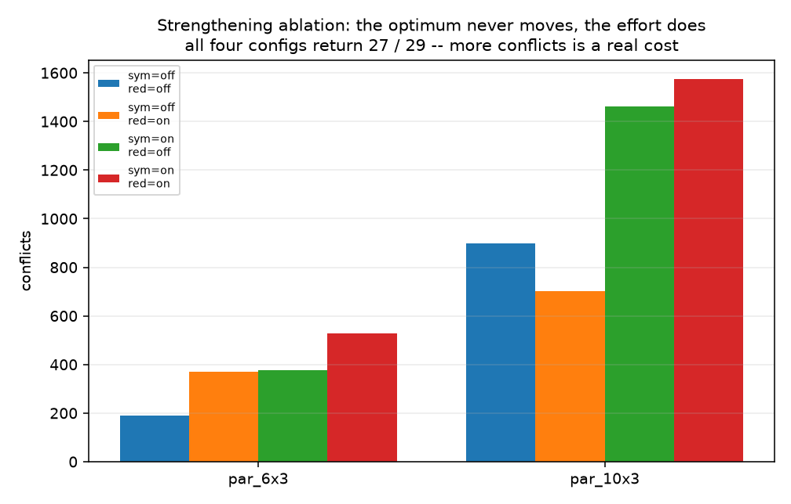

# Week 4 · Day 1：模型强化：冗余约束、有效不等式与对称破缺

> **先读教材正文**：[第 6 章：求解器工程](../教材/06_求解器工程与结果解释.md)。本页用于读后的复习和项目实验，不能代替零基础教材中的完整推导。

[月度索引](../README.md) · [本周知识主线](../week4.md) · [上一周复盘](../Week_3/Day7.md) · [后一天](Day2.md)

> 当日主题：把「冗余约束 / 有效不等式 / 对称破缺」三件事的**作用范围**分开，再用一次 2×2 消融实验回答「强化到底值不值」
> 当日产出：**四种开关组合的搜索量对照表 + 一份对称破缺的合法性论证**（`m2w4d1_symmetry.py`）
> 建议投入：3～4 小时

---

## 1. 今日学习目标

完成今天的学习后，你应该能够：

1. 用一句话分别说清**冗余约束**、**有效不等式**、**对称破缺**各自「允许删除哪些解」，并说出这三份合法性论证为什么不能互换。
2. 说清**有效不等式**与**目标截断**的区别：前者的对象是目标可行集的**所有点**，后者只保证**保住一个最优解**。
3. 写出「由 $2x+2y\ge3$ 推出 $x+y\ge2$」这一步，并解释它为什么删的是 LP 松弛里的小数点、而不是整数解。
4. 写出同质机器重编号这个对称变换，并说清它**保留全部完工时间与迟交量**，因此总迟交对它不变。
5. 说清对称性为什么有害：它放大的是**搜索代价**，与正确性无关。
6. 写出负载降序破缺约束 $\text{load}_0 \ge \text{load}_1 \ge \dots \ge \text{load}_{m-1}$，并说出它在什么条件下是错的。
7. 解释为什么「几次开关实验里目标值相等」不能证明强化普遍正确，而一般合法性必须靠数学论证。
8. 读一张强化消融表时，同时看 `status`、`objective`、`iterations`、`solve_time` 四列，而不是只比目标值。

---

## 2. 为什么第 1 天要先学会「分清手段」

前面几周已经把「怎样写一个正确的模型」做完：Week 2 Day 3 把「模型更强」定义成一个**可测量**的问题，Week 2 Day 4 把下界与上界各自的来源拆开，Week 3 Day 5 讲了状态码描述的是「停止时得到了什么信息」。今天开始做另一件事：**在模型已经正确的前提下，主动往里面加东西，让它更好解。**

「加东西」这件事有一个反直觉的地方：它和改题只差一线。加一条约束以后，最优值可能不变、可能变小、也可能变大 —— 而对一个**最小化**问题来说，加了约束以后最优值**变大**，通常意味着你把真正的最优解切掉了。所以今天的第一课不是「加什么」，而是「加了之后，凭什么说原来的最优解还在」。

三种手段的合法性来源完全不同，混在一起讲，一定会讲错：

| 手段 | 允许删除哪些解 | 合法性来自 |
|---|---|---|
| 冗余约束 | **一个都不删** | 由已有约束**逻辑推出** |
| 整数有效不等式 | 可以删掉一部分 LP 松弛点 | 对**全部整数可行点**成立 |
| 对称破缺 | 可以删掉重复的等价方案 | 每个等价类**保留至少一个代表** |
| 目标截断 $f(x)\le U$ | 可以删掉比已知解更差的方案 | $U$ 来自一个**已验证的可行解** |

注意最后一行是**单独一类**，不是「有效不等式的一种」。这是今天的核心辨析，第 5 节会专门展开。

一句话：**「加了以后最优值没变」只是观察；「为什么原来的最优解还在」才是论证。**

---

## 3. 冗余约束：由模型自身蕴含

**定义**：一条约束如果已经由模型里的其他约束**逻辑推出**，它就是冗余的。加上它不删除任何一个原可行点。

教材 6.2 的例子最干净：模型里已经有 $S\ge r$ 与 $E=S+p$，把两式合起来就直接得到

$$E\ \ge\ r+p .$$

这条不等式在最初的模型里没有显式写出，但它对**每一个**可行点都成立 —— 想找一个「满足 $S\ge r$、$E=S+p$，却违反 $E\ge r+p$」的点，是找不到的。

**「冗余」不等于「没用」。** 求解器的预处理与传播器会把显式写出的约束当成推理素材：$E$ 的下界一旦被抬高，$E$ 参与的其他约束就能更早被收紧，变量的取值域也会更早被削掉。这一层收益是真实的。

但有一条必须说清：**如果 LP 松弛本来就已经蕴含这条约束，那么显式写出它不会改变 LP 松弛的可行域，更不会改变根节点的 LP 界。** 这是 Week 2 Day 3 那条纪律的新面孔 —— 那里是「收紧 $M$ 不必然抬高界」，这里是「显式写出蕴含式不必然抬高界」，机制是同一个：**可行域变小与该目标下界上升是两件事**。

项目里的对应实现在 [strengthening.py](../../projects/02_optimization_models/opt_models/strengthening.py) 的 `add_redundant_bounds()`，它追加两类约束：

```text
Cmax >= LB          其中 LB = max( max_j p_j,  ceil(Σp / m),  max_j (r_j + p_j) )
C_o  >= r_o + p_o   对每道工序 o      （由 C = S + p 与 S >= r 蕴含）
```

第一行是 M1 就能解析算出的下界，第二行就是上面那个 $E\ge r+p$。在 6 作业 3 机器的实例上，这个函数返回 **7**（1 条全局 + 6 条逐工序），第 14 节的脚本会把这两个数打印出来。

**这个文件里踩过的一个真实的坑值得记住。** 早期版本在这里写过「所有工序的完工时间之和不超过 $m\sum_o p_o$」—— 直觉上「每台机器的总负载不超过全部工时」当然对。但在**有释放时间**的实例上它是错的：机器空转会让 $\sum_o C_o$ 超过这个值，于是一条被当成「冗余」的约束把一个合法的**最优**解切掉了。识别方法正是今天要练的那一手：**同一个实例，开/关这条约束各求一次最优，最优值变了就说明它不是冗余约束，而是一条新约束。**

---

## 4. 有效不等式：对目标可行集的所有点成立

**定义**：设原模型的整数可行集为 $F$（注意是**整数**可行集，不是 LP 松弛可行集）。一条不等式 $a^Tx\le b$ 称为**有效不等式**（valid inequality），如果

$$a^Tx\ \le\ b\quad\text{对每一个 } x\in F \text{ 都成立}.$$

关键词是「每一个」。有效性是一个**全称命题**，它的证明方式是从模型的约束与变量的整数性出发做推导，而不是在若干实例上试。

教材 6.2 的例子是今天最值得手算一遍的那一个：$x,y$ 是二元变量，模型要求

$$2x+2y\ \ge\ 3,\qquad x,y\in\{0,1\}.$$

因为 $x,y$ 只能取 0 或 1，$2x+2y$ 只能取 $0,2,4$。要求它 $\ge3$，等价于要求它 $=4$，也就是 $x=y=1$。所以

$$x+y\ \ge\ 2$$

对**每一个**整数可行点都成立 —— 事实上 $F$ 里只有 $(1,1)$ 一个点，它当然满足。

有意思的是它对**松弛**做的事。把 $x,y$ 放宽到 $[0,1]$，原约束两边除以 2 是 $x+y\ge1.5$，松弛最优值 1.5（取在 $(1,0.5)$ 这类点上）。新写出来的 $x+y\ge2$ 把这条线整体推高，LP 最优值从 **1.5 抬到 2**，正好等于整数最优值 —— 这条有效不等式把松弛切得只剩整数最优的那一点，根节点就证明完了。（对照 Week 2 Day 4 手推的那棵树：那里为了看清机制老老实实分了两次支；只要在根节点加上 $x+y\ge2$，那棵树一个分支都不用走。）

**一个必须补上的限定**：有效不等式**不是**凭空变强的。$x+y\ge2$ 之所以合法，靠的是「$x,y$ 是整数」这一条信息 —— 而松弛恰恰丢掉了它。所以有效不等式的价值可以理解成：**把松弛自己丢掉的整数信息，以一条线性不等式的形式还回去。** 还得好，界就抬；还得不好，就只是一条多余的约束。

---

## 5. 有效不等式 ≠ 目标截断（勘误第十一条）

这是今天**必须分开的两个概念**，也是[概念勘误](../CONCEPT_CORRECTIONS.md)里专门列出的第 11 条：

> **旧表述**：有效不等式就是已有可行解给出的目标截断。
> **正确理解**：有效不等式对目标可行集的**所有点**成立；截断通常删除劣解但**保留最优解**。

把两者并排摆开，差别一眼可见。假设手上已经有一个**通过独立验证**的排程，它的总迟交是 10：

| | 有效不等式（例：$x+y\ge2$） | 目标截断（例：$\sum_j T_j\le10$） |
|---|---|---|
| 它对谁成立 | 目标可行集的**每一个点** | **不保证**对每个可行点成立 |
| 被删掉的解 | 只有 LP 松弛里的小数点 | 全部目标值 $>10$ 的**合法**方案 |
| 保留了谁 | 全部整数可行点 | 至少一个原问题**最优解** |
| 合法性需要什么 | 一次全称推导 | 一个已验证的可行解（它给出 $z^*\le10$） |

两处最容易说错的地方：

1. **截断会删掉合法解。** 目标值为 11、12、15 的排程完全满足全部加工约束，只是比手上这个差 —— 截断把它们全部排除。所以它**不能**被定义成「对原可行集所有点都成立的有效不等式」。
2. **反过来，有效不等式不负责「保住最优解以外的东西」。** 好的有效不等式（比如割平面）往往删掉大量可行的小数点，它的取舍标准是「一个整数点都不能删」，而不是「最优解别删就行」。

**为什么这个区分是实用的、而不是咬文嚼字？** 因为两者的**报告口径**不同。一条有效不等式被证明合法之后，你可以说「这个模型仍然表示同一个整数问题」；而加上一个目标截断之后，正确的说法是「这是一个以已知可行解为上界的问题，它的最优值不会比原来更差」，并且**这个上界来自一次规则求解或启发式**，必须一起报告。项目 `solve_single_machine()` 把 `objective_cutoff`、`set_hint`、`fixed_prefix` 三件事分开存放、分别写进 `detail`，做的正是这件事。

还有一个反方向的坑：**如果那个上界来自一个没有通过独立验证的排程，截断就可能切掉真正的最优解，甚至让模型直接不可行。** 所以「先验证，再截断」这个顺序不能反。

---

## 6. 对称性在哪里

**对称性**指的是：存在一个对解的操作，它把可行解映成可行解，且**目标值不变**。这样的操作把解集划分成若干个**等价类**；同一个类里的解在业务上往往没有区别，但求解器会当成不同的解，一个一个去探。

调度里有三处最常见：

1. **同质机器的重编号。** 如果所有工序都能上所有机器、加工时间与机器无关、机器没有各自的日历，那么「把机器 0 与机器 1 的名字互换」就是一个对称变换。
2. **交期相同的作业。** 两个交期、释放时间、工时都相同的作业，互换身份后目标不变。
3. **工时相同的作业。** 在没有其他区分特征时同理。

第 2、3 条是**作业层面**的对称，处理它们要格外小心「这两个作业是不是真的不可区分」；第 1 条是今天的主角，因为项目里的并行机实例（`par_6x3`、`par_10x3`、`parallel_24`）正好都满足它。判定函数是 `detect_machine_symmetry()`：它要求**每一道工序的合格机器集合都等于全部机器**，只要有一道工序的资格集合更小，就返回 `False`。

---

## 7. 同质机器重编号到底改变了什么（勘误第十条）

先说清那个**必须纠正**的说法：

> **旧表述**：机器置换会改变总迟交。
> **正确理解**：真正的同质机器重编号保留全部完工时间与迟交量。

把它摊开来算。设一个排程把三道工序排在两台机器上：

```text
重编号前：
机器 M0： A [0, 3)   B [3, 7)
机器 M1： C [0, 5)

重编号（M0 <-> M1）后：
机器 M0： C [0, 5)
机器 M1： A [0, 3)   B [3, 7)
```

逐条比对：**A 的开工 0、完工 3 没变；B 的 3 和 7 没变；C 的 0 和 5 没变。** 变化的只有「这些区间挂在哪台机器名下」这一件事。而总迟交是由每个作业的**完工时刻**与交期算出来的：

$$\sum_j T_j=\sum_j \max(0,\ C_j-d_j).$$

$C_j$ 一个都没变，所以 $\sum_j T_j$ **一个字都没变**。同理 $Cmax=\max_j C_j$ 也不变。

**错误是从哪里来的？** 是把「重编号」误解成了「把作业挪到另一台机器上重新排」。那是**另一个动作**，它当然可能改变完工时间 —— 但那不是重编号，那是一次真正的重新调度。两句话只差几个字，结论却完全相反。

这条辨析还解释了 `strengthening.py` 里一处容易读错的地方：`solve_parallel_cpsat()` 只对 `makespan` 目标做按机器编号的对称破缺，对 `total_tardiness` 会跳过，并把原因写进 `detail["symmetry_skipped_reason"]`。这是**当前实现的策略选择**（这个注册方法走的是同质并行机那一套，优化的是 $Cmax$），**不能**读成「总迟交本身不具备机器置换不变性」—— 按上面的推导，它对同质机器重编号恰恰是不变的。

**「完全相同」的门槛比想象中高。** 要让重编号保持可行性，必须同时满足：加工时间与机器无关、**资格集合相同**（没有作业只能上某台机器）、机器的可用日历相同、费用与相关业务规则相同。只要有一条不满足，重编号就可能把可行排程变成不可行排程，此时按机器编号做的任何破缺都是错的。存在机器等价组时，只在组内做处理。

---

## 8. 为什么对称性有害：它解释的是搜索代价

对称性不影响正确性 —— 上面那些操作都不会改变最优值。它影响的是**搜索**：求解器看不到「这两个解其实是一回事」，于是把同一个等价类里的解一个一个探完。

具体到分支定界（Week 2 Day 4 的那棵树）：

1. 把某个作业指派给机器 0 与指派给机器 1，在树上就是**两棵结构完全同构的子树**：界一样、松弛解形状一样、可剪枝性也一样。
2. 求解器必须在**两个方向上都搜一遍**，才能确定这片区域里没有更好的解。
3. 对称的机器有 $m$ 台时，同一个等价类可能被重复搜到 $m!$ 种写法；同交期的作业有 $k$ 个时，是 $k!$ 种。

所以「对称性有害」这句话的**准确含义**是：**它放大的是搜索量，不是难度本身。** 一个高度对称的实例，最优值可能很容易知道（一个显然的下界就能达到），但求解器要证明「没有更好的了」却要多走成倍的节点。

这也解释了为什么**对称破缺是一个纯粹的性能手段**：它不改变最优值，也不改变问题，它只是**禁止求解器去探那些注定等价的兄弟分支**。

---

## 9. 对称破缺：怎么写，什么时候会写错

**写法。** 机器同质时，任何排程都能通过重编号变成「机器 0 的负载最大、机器 1 次之、……」的形式。既然每个等价类里都有这么一个代表，那么把约束

$$\text{load}_0\ \ge\ \text{load}_1\ \ge\ \cdots\ \ge\ \text{load}_{m-1}$$

写进模型，就**至少保留了一个最优解**。项目里的 `add_load_ordering()` 做的就是这件事：对相邻的机器对逐条加不等式，$m$ 台机器加 $m-1$ 条（第 14 节会看到 3 台机器加 **2** 条）。每条不等式左边是「所有可能指派到左边那台机器的工序工时之和」，用布尔变量线性表达，不需要新的整数变量。

**为什么它合法**：因为（a）重编号是模型的一个对称变换，（b）`makespan` 与 `total_tardiness` 对机器置换都不变，所以（c）**最优解集合在重编号下封闭**。三条合起来，才能说「不切掉任何最优解」。

**什么时候会写错。** 违反上面任何一条，破缺约束就会变成一条**新约束**：

| 反例 | 破坏了哪一条 | 后果 |
|---|---|---|
| 某道工序只能上机器 0 | (a) 重编号不再保持可行性 | 约束可能把最优解切掉 |
| 目标对机器置换敏感 | (b) 最优解集合不再封闭 | 同上 |
| 按机器编号排序但两台机器性能不同 | (a) | 同上 |

所以调用前必须先过 `detect_machine_symmetry()` —— 它返回 `False` 时，按机器编号做的破缺就是**错的**，而不是「效果不好」。

**写错的代价比一般约束更严重。** 一般约束写错，往往还能得到一个合法但更差的解；对称破缺写错，**切掉的是最优解**。你仍然会得到一个 `OPTIMAL`，只是那是「错误模型的最优」—— 这与 Week 2 Day 3 讲的「$M$ 太小会切掉真解、求解器仍返回最优」是同一类事故。

**残余对称**：负载全都相等时，$\text{load}_0\ge\text{load}_1$ 对两种编号都成立，等价类里仍然有多个代表。教材 6.10 的第 3 题就是这个例子：负载 $(4,4)$ 加上 $\text{load}_0\ge\text{load}_1$，最优性保住了，但每类不止一个代表。**它不保证完全消除对称性**，只保证不丢最优解。

---

## 10. 实验与证明：各自负责什么（勘误第十二条）

第三条要纠正的说法是：

> **旧表述**：几次开关实验目标相等就证明强化普遍正确。
> **正确理解**：实验用于**发现错误**；一般合法性需要**数学论证**。

分工要说清楚：

| | 实验（开/关对拍） | 证明（推导） |
|---|---|---|
| 能做什么 | 在**具体实例**上发现「最优值变了」这种错误 | 给出对**所有实例**都成立的结论 |
| 不能做什么 | 覆盖还没试过的实例、别的规模、别的后端 | 告诉你实现有没有写对 |
| 失败时的意义 | 最优值不等 ⇒ **确定**有错 | 推导出错 ⇒ 逻辑错误 |
| 成功时的意义 | 这几个实例上没发现问题 | 合法 |

今天脚本里的那行断言

```python
assert len(values) == 1, f"强化改变了最优值：{values}"
```

正确读法是：**这是一道回归测试，不是一份正确性证明。** 它守住了「本批实例没有被改坏」；而「这条约束对一般实例合法」必须靠第 9 节那种推导。反过来，**实验找到反例的能力是推导给不了的** —— `add_redundant_bounds()` 里那条「完工时间之和不超过 $m\sum p$」正是被一次开/关对拍抓住的。

**结论必须带条件。** 一个诚实的实验结论至少写清三件事：**哪些实例**、**多大预算**、**哪个后端**。今天的两张图恰好说明了为什么 —— 同一对开关，在小实例上和大实例上符号相反。

---

## 11. 第一张插图：小实例上，强化反而更贵

先看数据。`artifacts/month2_w4/results.csv` 的 `strengthening_ablation` 组，把「对称破缺」与「冗余约束」两个开关的四种组合，在同一实例、同一预算（10 秒）、同一随机种子（0）下各跑一次：

| 实例 | sym=0 red=0 | sym=0 red=1 | sym=1 red=0 | sym=1 red=1 |
|---|---:|---:|---:|---:|
| `par_6x3`（6 作业 3 机器） | 目标 27 · 搜索 190 | 目标 27 · 搜索 370 | 目标 27 · 搜索 377 | 目标 27 · 搜索 529 |
| `par_10x3`（10 作业 3 机器） | 目标 29 · 搜索 898 | 目标 29 · 搜索 701 | 目标 29 · 搜索 1461 | 目标 29 · 搜索 1574 |

**第一列全等是「强化成立」的证据**：两组实例的四个变体目标值分别都是 27 与 29，一个都没变。如果哪个变体给出 28，那不是性能差异，是建模错误。



图注（英文标签与上面这张图上的文字一一对应）：

1. 标题两行 **"Strengthening ablation: the optimum never moves, the effort does"** 与 **"all four configs return 27 / 29 -- more conflicts is a real cost"** —— 强化消融：最优值纹丝不动，代价却会动；四种配置分别返回 27 / 29，冲突数变多是一笔真实的成本。
2. 纵轴 **"conflicts"** —— 冲突数（CSV 里是 `iterations` 列，第 13 节会说明这一列装的是什么）；横轴两组的标签 **"par_6x3"**、**"par_10x3"** 是两个实例名。
3. 图例四项 **"sym=off red=off"**（蓝）、**"sym=off red=on"**（橙）、**"sym=on red=off"**（绿）、**"sym=on red=on"**（红）—— 对称破缺与冗余约束两个开关的四种组合，柱高就是上表里的四个数字。
4. 读法：`par_6x3` 上四根柱子单调升高（190 → 370 → 377 → 529），`par_10x3` 上「只开冗余约束」那根反而最低（701）；**同一最优值，却走着不同的搜索量**。

这张图由 `projects/02_optimization_models/examples/m2_figures.py` 的 `fig_symmetry_ablation()` 生成，数据直接读 `artifacts/month2_w4/results.csv` 的 `strengthening_ablation` 组，不手写任何数值。

**为什么小实例上会变贵？** 因为强化不是免费的：

1. 每加一条约束，传播器每次都要多看一条。
2. 实例本身很小（6～10 个作业）时，搜索空间本来就不大，**省下的搜索量有限**，而固定的传播开销照样要付。
3. 冗余约束同理：6 作业实例上加 7 条冗余下界 + 2 条负载排序，一共 **9 条**。9 条约束放在一个 0.02 秒就解完的实例上，是不小的常数开销。

---

## 12. 第二张插图：收益的符号随规模反转

把同一个技巧放到大实例上，再看一眼。`artifacts/month2/results.csv` 的 `main` 组，实例 `parallel_24`，10 秒预算：

| 方法 | 状态 | 目标 | 界 | 搜索量 | 求解(s) |
|---|---|---:|---:|---:|---:|
| `cpsat_parallel` | FEASIBLE | 71 | 24.0 | 49613 | 10.00 |
| `cpsat_symmetry` | OPTIMAL | 71 | 71.0 | 10644 | 0.48 |

（取自 CSV 的 `parallel_24__main__cpsat_parallel__0` 与 `parallel_24__main__cpsat_symmetry__0` 两行。）

两行的**目标值相同（71）**，含义却完全不同：上面一行是「找到了 71，10 秒用完，界还停在 24」；下面一行是「0.48 秒证明这就是最优」。同实例、同后端、同预算，差别只在开关。


图注（英文标签与上面这张图上的文字一一对应）：

1. 总标题两行 **"Symmetry breaking: the sign of the effect depends on instance size"** 与 **"(left: same optimum, more conflicts   right: 10s could not prove it, 0.48s does)"** —— 对称破缺的作用方向取决于实例规模：左边是「同一最优值、更多冲突」，右边是「10 秒证不完，0.48 秒证完」。
2. 左子图标题 **"Small instances: strengthening HURTS"**、副题 **"(more conflicts for the same optimum)"** —— 小实例：强化反而有害，同一最优值下冲突更多；这张子图画的就是上一张图的数据，纵轴同样标 **"conflicts"**。
3. 右子图标题 **"Large instance: symmetry breaking WINS"**，横轴两个标签 **"parallel"** 与 **"symmetry"** 是方法名去掉前缀后的缩写（`cpsat_parallel` 与 `cpsat_symmetry`），柱顶标注 **"FEASIBLE / 10.00s"** 与 **"OPTIMAL / 0.48s"**。
4. 读法：左图的柱高在几百到一千五之间，右图的灰柱接近五万、绿柱约一万 —— **同一个技巧，小实例上是负担，大实例上是决定性的**。

同样由 `m2_figures.py` 生成：右半张读 `artifacts/month2/results.csv`，左半张读 `artifacts/month2_w4/results.csv`。

**两张图放在一起，结论只能是一句**：收益的**符号与大小取决于实例**。「对称破缺总是有用」与「对称破缺总是没用」都是错的 —— 前者是从大实例过度推广，后者是从小实例过度推广。这也是[概念勘误](../CONCEPT_CORRECTIONS.md)把它记成一条的理由：一次实验只描述它自己那一格。

---

## 13. 不要只看目标值

第 12 节的表如果只看 `objective` 一列，会得出「两个方法完全一样」—— 而它们一个证完了、一个没证完。这是强化实验里最常见的读法错误。

**四列必须一起看**：

| 列 | 含义 | 只看它会漏掉什么 |
|---|---|---|
| `status` | OPTIMAL / FEASIBLE / … | 漏掉「有没有证明」这件事 |
| `objective` | 已知最好可行解的目标值 | 漏掉代价与证据等级 |
| `iterations` | 搜索量（本模块写入的是 `NumBranches()`） | 漏掉「搜索走了多远」 |
| `solve_time` | 求解阶段耗时 | 漏掉「快慢」 |

关于 `iterations` 这一列要说一句精确的话：脚本与图都把它显示为「冲突数」（`m2w4d1_symmetry.py` 的表头就写着 `冲突`），而 `solve_parallel_cpsat()` 往这个字段里写的是 `solver.NumBranches()`，真正的 `solver.NumConflicts()` 记在结果的 `detail` 里。两者都是**搜索量**的代理量。

再补一条 Week 2 Day 4 就立过的纪律：**这一列只能在同一批实验内部做相对比较**，它不是跨软件、跨运行统一的工作量单位，也不保证重复运行后逐位复现（月末报告里就有同一实例节点数从 305 变到 16500 的记录）。所以今天所有的比较都限定在「同实例、同预算、同种子、同后端」这一格里。

还有一件事要分开：**`solve_time` 不含建模时间。** `solve_parallel_cpsat()` 把 `build_time`（建模 + 加约束）与 `solve_time`（调用求解器）分开记录，CSV 里两列都在。小实例上「多加了 9 条约束」的开销主要落在 `build_time` 上，这也是第 11 节那笔负收益的一部分来源。

---

## 14. 实验：脚本怎么读

脚本链接：[m2w4d1_symmetry.py](../../projects/02_optimization_models/examples/m2w4d1_symmetry.py)。

在仓库根目录下运行：

```powershell
python projects/02_optimization_models/examples/m2w4d1_symmetry.py
```

脚本分四段，每段回答一个问题：

**第 1 段：对称性检测。** `detect_machine_symmetry()` 在 5 作业 3 机器的实例上返回 `True`，在 5 作业 1 机器的实例上返回 `False` —— 后者只有一台机器，没有可交换的对象，破缺无从谈起。这一段的用处是：**先确认对称性存在，再谈破缺**。

```text
  5j/3m 同质     detect_machine_symmetry = True
  5j/1m 单机     detect_machine_symmetry = False
  说明：单机只有一台机器，没有可交换的对象，对称破缺无从谈起。
```

**第 2 段：消融。** 同一个 6 作业 3 机器实例（种子 80）上跑三种配置，并列打印状态、目标、界、搜索量与耗时：

```text
  配置                     状态          目标      界     冲突   耗时(s)
  baseline               OPTIMAL       27     27     190    0.019
  symmetry               OPTIMAL       27     27     377    0.021
  symmetry+redundant     OPTIMAL       27     27     529    0.025
```

这三行就是第 11 节那张表 `par_6x3` 那一行的三个变体（脚本没跑 `sym=0 red=1`，那一格由批量实验补上）。

**第 3 段：最优值必须不变。** 脚本把三个目标值收成集合，断言集合大小是 1：

```text
  三种配置的最优值全部 = 27  →  强化成立
  独立下界 makespan_lower_bound = 24  →  与最优值 27 相比：松：不足以证明最优
```

**第二行是这一段最值得读的地方**：`makespan_lower_bound()` 是项目自己解析算出的下界（取「最长工序」「总负载平摊」「释放时间加本作业工时」三者的大者），它给出 **24**，而最优值是 **27**。脚本紧接着打印了它的态度：

```text
  注意：下界不等于最优值时，'OPTIMAL' 是求解器自己搜完得到的结论，
        不是这个解析下界给的。两者是独立的证据，不要混为一谈。
```

这正是 Week 2 Day 4 讲的「下界与上界各有来源」在一个新场景里的样子：**求解器说 OPTIMAL，不等于你手上那个解析下界也证明了它。**

**第 3b 段：承认负收益。** 脚本把三个配置的搜索量并列打印，发现「越强化越多」时，它写的是：

```text
  本例中对称破缺**增加**了冲突数：这些实例本来就小，
  额外约束的开销没有被搜索空间的缩小抵消。如实记录，不粉饰。
```

**第 4 段：到底加了多少条约束。** 这一段用 `build_parallel_model()` 建一次不带强化的模型，再分别调两个函数数约束：

```text
  变量数（对称破缺前）: 61
  add_redundant_bounds 追加约束数 = 7
  add_load_ordering   追加约束数 = 2
```

3 台机器加 2 条负载排序（$m-1$），6 道工序加 7 条冗余下界（1 条全局 + 6 条逐工序）。**「强化的代价」在这里第一次变成了一个可以数的数。**

**读这个脚本时不要做的两件事**：不要把某一次运行的耗时当成固定结论；不要把第 2 段那三行读成「对称破缺没用」的证明 —— 它只是这一个实例、这一个预算、这一个后端上的一次观察。

---

## 15. 今日练习

1. **练习 1（手算）**：对 $x,y\in\{0,1\}$、$2x+2y\ge3$ 这个模型，写出整数可行集 $F$ 与 LP 松弛最优值，验证 $x+y\ge2$ 对 $F$ 的每一个点都成立。再把约束改成 $2x+2y\ge2$，问 $x+y\ge2$ 还是有效不等式吗？如果不是，说出一条正确的有效不等式。
2. **练习 2（推导）**：一个排程在两台同质机器上的负载是 $(3,4)$。写出交换机器编号后每个作业的开工与完工时刻，并说明为什么 $\sum_j T_j$ 与 $Cmax$ 都不变。再构造一个「两台机器并不真正等价」的实例（让某道工序只能上一台机器），说明这时按机器编号做负载排序会有什么危险。
3. **练习 3（辨析）**：某报告写「我们加入了一条有效不等式，删掉了全部比已知解差的方案」。指出这句话混用了哪两个概念，并分别给出正确的说法。
4. **练习 4（实现）**：给 `m2w4d1_symmetry.py` 加第四种配置（只开冗余约束、不开对称破缺），在同一实例上跑一次，把四个数字补全，与第 11 节的表对照。脚本打印出来的那个数应当与 CSV 里 `par_6x3` 的哪一格相等？
5. **练习 5（判据）**：先猜一句「强化一定让搜索量变多」或「一定变少」，然后给脚本加一条断言去检验它，在 `par_6x3` 与 `parallel_24` 两组数据上分别看这条断言成立不成立。哪一组会把它推翻？
6. **练习 6（报告）**：用一句话写出「对称破缺在本项目的实例上有多大收益」，要求这句话**不带**「总是」「一定」这类词，并且写明实例范围、预算与后端。

---

## 16. 验收清单

- [ ] 能用一句话分别说清冗余约束、有效不等式、对称破缺各自允许删除哪些解。
- [ ] 知道有效不等式对**目标可行集的所有点**成立，而目标截断只保证**保住一个最优解**。
- [ ] 能写出 $2x+2y\ge3\Rightarrow x+y\ge2$，并说出它把 LP 界从 1.5 抬到 2 靠的是整数性。
- [ ] 能写出同质机器重编号，并说清它保留全部完工时间，因此总迟交不变。
- [ ] 能说出「重编号」与「把作业挪到另一台机器上重排」是两件不同的事。
- [ ] 能说出对称性放大的是搜索量，不是难度，也不影响正确性。
- [ ] 能写出负载降序破缺约束，并说出它合法所需的前提。
- [ ] 知道 `detect_machine_symmetry()` 返回 `False` 时**必须放弃**按机器编号的破缺。
- [ ] 知道负载相等时仍有残余对称，负载排序不保证完全消除对称性。
- [ ] 能分别说出实验与证明各自能回答什么问题，并知道实验只能发现错误。
- [ ] 记得 `par_6x3` 的四个搜索量 190 / 370 / 377 / 529 与 `par_10x3` 的 898 / 701 / 1461 / 1574，以及它们对应的目标值 27 / 29。
- [ ] 记得 `parallel_24` 上 `cpsat_parallel` 是 FEASIBLE、49613、10 秒用满；`cpsat_symmetry` 是 OPTIMAL、10644、0.48 秒。
- [ ] 知道读强化实验必须同时看 `status`、`objective`、`iterations`、`solve_time`。
- [ ] 知道 `iterations` 不是可复现的量，只能同批内部相对比较。
- [ ] `python projects/02_optimization_models/examples/m2w4d1_symmetry.py` 能跑通（退出码 0），四段输出与第 14 节一致。

---

## 17. 自测题

- Q1：冗余约束会删除原可行解吗？它一定有性能收益吗？
- Q2：有效不等式的定义是什么？它的合法性是一个什么形式的命题？
- Q3：$x+y\ge2$ 在 $2x+2y\ge3$ 的模型里合法，换到 $2x+2y\ge2$ 的模型里还合法吗？为什么？
- Q4：目标截断 $f(x)\le U$ 为什么不能叫有效不等式？
- Q5：把两台同质机器的编号互换，某个作业的完工时刻会变吗？总迟交会变吗？
- Q6：什么情况下按机器编号做对称破缺是**错的**？
- Q7：负载为 $(4,4)$ 时，$\text{load}_0\ge\text{load}_1$ 能完全消除对称吗？
- Q8：对称破缺写错时，被切掉的是劣解还是最优解？会造成什么后果？
- Q9：脚本在小实例上观察到「越强化搜索量越大」，这能否说明「对称破缺没有价值」？
- Q10：`parallel_24` 上两个方法的 `objective` 都是 71，为什么不能说它们「效果一样」？
- Q11：为什么说 `assert len(values) == 1` 是一条回归测试而不是正确性证明？
- Q12：写实验结论时至少要带哪三个限定条件？

### 参考答案

- A1：不会删除任何原可行解 —— 它由已有约束逻辑推出，每个原可行点都自动满足它。性能收益不保证：如果 LP 松弛本来就蕴含它，LP 可行域与根节点的界都不会改变，只有预处理与传播可能受益。
- A2：对**目标模型整数可行集的每一个点**都成立的不等式。它的合法性是一个**全称命题**，证明方式是从模型约束与变量的整数性出发做推导，而不是在若干实例上验证。
- A3：不合法。$2x+2y\ge2$ 的整数可行集包含 $(1,0)$ 与 $(0,1)$（这两点上 $x+y=1$），而 $x+y\ge2$ 在这些点不成立。此时正确的有效不等式是 $2x+2y\ge2$ 本身（它就是原约束），或由整数性得到的 $x+y\ge1$。
- A4：因为它对**合法但更差**的解不成立 —— 目标值 11、12 的排程完全满足加工约束，只是比已知的 10 差。有效不等式要求对每一个可行点成立，截断只保证至少一个最优解被保留。
- A5：都不会变。重编号只改变「区间挂在哪台机器名下」，每个作业的开工与完工时刻逐个不变；而 $\sum_j T_j$ 与 $Cmax$ 只由完工时刻决定。会变的是「负载挂在谁身上」这种与机器编号绑定的量。
- A6：只要出现下列任一条就错：（a）某道工序的合格机器集合不是全部机器；（b）机器的日历、费用或相关业务规则不同；（c）目标在机器置换下不是不变量。换句话说，`detect_machine_symmetry()` 返回 `False`，或目标不满足置换不变性时，都必须放弃按机器编号的破缺。
- A7：不能。两种编号都满足 $4\ge4$，等价类里仍然保留了两个代表。它保住了最优性，但不保证每个等价类只剩一个解。
- A8：切掉的是**最优解**，这与普通约束写错不同。后果是求解器仍然返回 `OPTIMAL`，但那是**错误模型的最优**，报告者会以为拿到了原问题的最优值。
- A9：不能。它说明的是「在这个实例、这个预算、这个后端上，额外约束的开销没有被搜索空间的缩小抵消」。大实例 `parallel_24` 上同一个技巧把「10 秒证不完」变成「0.48 秒证明最优」，符号正好相反。**收益随实例变化，所以结论必须带条件。**
- A10：因为 `status` 不同。一个是 FEASIBLE（10 秒用满，界停在 24.0），一个是 OPTIMAL（0.48 秒，界 71.0）。前者只能说「找到了 71」，后者才是「证明了 71 就是最优」。只比目标值，等于把「有解」与「证完」混为一谈。
- A11：因为它只覆盖本批实例。断言通过只说明「这些实例没被改坏」，不覆盖没试过的实例、别的规模、别的后端；一般合法性要靠推导 —— 比如「重编号是对称变换 + 目标在置换下不变 ⇒ 最优解集合封闭 ⇒ 破缺约束不切最优解」这条链。反过来，实验的独特价值是**能找到反例** —— 那条被误当成冗余的约束就是被开/关对拍抓住的。
- A12：至少写清**实例范围**（哪些实例、什么规模）、**预算**（时间限制、种子、线程数）与**后端**（CP-SAT / CBC 及其版本）。缺任何一条，读者都无法判断这个结论能不能用到自己的问题上。

---

## 18. 今日一句话总结

> **强化是往模型里加东西，所以先要回答「原来的最优解凭什么还在」：冗余约束靠蕴含，有效不等式靠全称成立，对称破缺靠每个等价类留代表 —— 而收益的符号，要靠带条件的实验说话。**

---

## 配套代码入口

从仓库根目录运行（需先按[项目指南](../../projects/02_optimization_models/PROJECT_GUIDE.md)配置环境）：

```powershell
python projects/02_optimization_models/examples/m2w4d1_symmetry.py
```

[阅读示例源码](../../projects/02_optimization_models/examples/m2w4d1_symmetry.py)。先完成正文手算，再用脚本核对项目实例；记录实例、状态、约束检查与目标，不把一次运行耗时作为固定结论。实现与数学语义的区别见[概念勘误](../CONCEPT_CORRECTIONS.md)。
