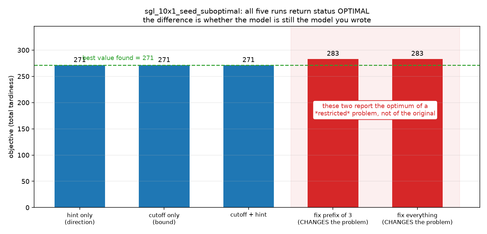

# Week 4 · Day 2：初解与变量固定：改善搜索还是改变问题

> **先读教材正文**：[第 6 章：求解器工程](../教材/06_求解器工程与结果解释.md)。本页用于读后的复习和项目实验，不能代替零基础教材中的完整推导。

[月度索引](../README.md) · [本周知识主线](../week4.md) · [前一天](Day1.md) · [后一天](Day3.md)

> 当日主题：hint、目标截断、变量固定——三件常被笼统叫作「warm start」的事，性质完全不同
> 当日产出：一张**三种手段的性质对照表** + 一次**消融实测** + 一句「证书属于哪个问题范围」的说明
> 建议投入：2～3 小时

---

## 1. 今日学习目标

完成今天的学习后，你应该能够：

1. 把常被笼统称作「warm start」的三件事拆开，并说出各自**对可行域做了什么**：hint 只是建议、目标截断是有效不等式、变量固定**会改变问题**。
2. 用「是否保留至少一个原最优解」这一条判据，区分「有效不等式」与「改变可行域」——这是 Day 1 那套判据在初解场景下的延续。
3. 说出好初解为什么**可能**帮助证明：最小化时 incumbent $U$ 越小，越多下界不优于 $U$ 的节点可以被剪掉；并同时说出为什么它**不保证**有帮助（传入与修复本身有开销）。
4. 写出并解释 $z^*(F)\le z^*(F')$，说明为什么**子问题的最优不能冒充原问题的最优**，也不能把子问题的 bound 填进原问题的界那一列。
5. 亲手算出教材 7.3 那个反例的六种顺序的目标值，验证「固定 C 第一之后最优是 3，而原问题最优是 2」。
6. 用本批实测说出三种手段在同一实例上的不同表现：hint / 截断都拿到 271，而固定前 3 个位置与固定全部都被**封顶在初解的 283**。
7. 解释为什么 `fix_all` **必然**等于初解本身 —— 它不是强化，是把解空间缩到一个点。
8. 给一条 `milp_fixing` 的结果行写出正确的读法：它的 `OPTIMAL` 属于**受限子问题**，进不了「原问题方法排名」。
9. 设计一个能分开归因的消融实验，并说出为什么「同时开 hint 与截断」的收益不能全部归给 hint。

---

## 2. 为什么第 2 天要先把三种「warm start」分开

Day 1 立了一条纪律：**先分清手段，再谈收益**（冗余约束 / 有效不等式 / 目标截断 / 对称破缺各有各的条件）。今天要把这条纪律用在「用已有排程帮助求解」这件事上。

这一步必须单独存在，原因有三个。

1. **这三种手段在工程语言里经常共用一个名字。** 它们都被叫做 warm start / 初解 / 热启动，接口上也都可能表现为「多传了一个参数」。但**一个不改变可行域，一个收窄可行域但不切最优解，一个会删掉最优解**。混在一起讲，任何一次「变快了」都无法归因，任何一次「变差了」也无从解释。
2. **第三种手段会产出一个很容易被误读的证书。** 固定变量之后求解器返回的 `OPTIMAL` 是**真的最优** —— 只不过是对那个被改小了的子问题。把它当原问题的证书，是本项目里最容易发生、也最不容易被表面检查发现的一类错误（教材 6.5 专门讲这一条）。
3. **本批刚好有一个「初解是次优解」的实例。** 三条规则给出的初解是 283，而模型的最优值是 271。这个 12 的差距让三种手段的区别**在数字上直接可见** —— 如果初解本身就是最优的，三种手段会给出完全一样的读数，什么也说明不了。

一句话：**前一天的纪律是「分清手段」，今天要分清的是这些手段究竟动了可行域的哪一部分 —— 因为动了可行域，就动了最优值的含义。**

---

## 3. 三种看似相近的做法

已有规则排程，可以作为候选解交给求解器，可以用其目标 $U$ 截断劣解，也可以固定部分变量。三者对可行域的影响不同，实验时要分别开关。

| 手段 | 做了什么 | 对可行域的影响 | 会不会切掉原最优解 |
|---|---|---|---|
| **hint / MIP start** | 把变量候选值**建议**给求解器 | **不改**（通常不新增硬约束） | 不会（求解器可以忽略它） |
| **目标截断** $f(x)\le U$ | 加一条上界约束，$U$ 来自**已验证可行**的方案 | 删去比已知方案更差的区域 | 不会 —— 因为已知 $U$ 可达，至少一个原最优解被保留 |
| **固定变量** $x_j=\hat x_j$ | 把一部分决策钉死在初解上 | **真的变小**（$F'\subseteq F$） | **会** —— 所有 $x_j\ne\hat x_j$ 的最优解都被删掉 |

逐条说清三件事：

**第一，hint 是建议，不是约束。** MIP start 的接收、补全与修复取决于后端和接口。调用 `SetHint` 成功**不证明** CBC 实际使用了它；应看接口支持、日志与实验。可参考 [Gurobi MIP start 文档](https://doc.gurobi.com/projects/optimizer/en/current/features/warmstart.html)，但不能把其具体行为直接套到 CBC —— 本项目用的是 CBC / GLOP / CP-SAT，**另一种后端的语义不能当作这几个后端的能力承诺**。

**第二，目标截断是有效不等式，但它的有效是有条件的。** 说它「不切最优解」的前提是 $U$ 来自一个**经过独立验证的可行方案**。若上界 $U$ 来自不可行方案，加入 $f(x)\le U$ 可能误删真正最优解，甚至使整个模型不可行。所以使用截断之前必须做两件事：先验证那条排程确实合法（机器不重叠、工序先后、释放时间），再重算它的目标值 —— 不能拿规则算法自己报的数当 $U$。

**第三，固定变量是局部搜索，不是强化。** 「强化」这个词在本月有明确含义：加上去不改变最优值的约束（Day 1 第 3、4 节的冗余约束与有效不等式）。固定变量恰恰相反，它**以改变最优值为代价**换取搜索空间。教材 7.3 给了这个反例的最小版本（第 7 节手算），本批数据给了它的工程版本（第 8 节）。

### 3.1 与 Day 1 那几类手段放在同一根轴上

Day 1 把四件事拆开过：冗余约束、有效不等式、目标截断、对称破缺。今天再加上固定变量，**五件事可以排在同一根轴上 —— 问它们各自把最优值怎么办**：

| 手段 | 对可行域做了什么 | 会改变最优值吗 | 凭什么这么说 |
|---|---|---|---|
| **冗余约束**（Day 1） | **不变** —— 它被模型自身蕴含 | 不会 | 加与不加的可行集是同一个集合 |
| **有效不等式**（Day 1） | 收窄，但**不切掉任何最优解** | 不会 | 每一个最优解都仍满足它 |
| **目标截断**（今天） | 收窄到 $f(x)\le U$ | 不会 | $U$ 来自**已验证可行**的方案，所以至少一个最优解被保留 |
| **对称破缺**（Day 1） | 收窄 —— 每个等价类只留一个代表 | 不会 | 每个等价类仍至少保留一个代表 |
| **变量固定**（今天） | 收窄到 $F'=\{\,x\in F: x_j=\hat x_j\,\}$ | **会** | 最优解可能满足 $x_j\ne\hat x_j$，于是被整个删掉 |

**这一列的划分不是修辞，是可检验的。** Day 1 第 10 节立过一条判据：**强化之后最优值必须完全相同，不同即建模错误。** 那条判据对上面前四行都成立 —— 如果对称破缺之后目标值变了，那是破缺写错了，不是"效果差异"。

**但第五行不能套用这条判据。** 固定变量之后目标值**本来就允许改变**，8.2 节的 283（对 271）就是它改变的实测值。所以：

> **同一批实验里，前四种手段可以放在一起比较目标值是否一致；固定变量必须单独拎出来，并且标注证书范围。**

**这条区分是今天最需要带走的一条。** 把固定变量和前四种混在一张表里比目标值，会得到两个错误结论当中的一个 —— 要么以为"固定变量也保证了最优值"（把 283 当成原问题最优），要么以为"强化手段出问题了"（因为目标值变了）。**两种情况都不是算错，是分类错了。**

---

## 4. 为什么好初解可能帮助证明

最小化时，incumbent $U$ 越小，越多「下界不优于 $U$」的节点可以被剪掉。好初解因此既能让用户较早获得方案，也可能减少搜索。

**但这是一条「可能」，不是一条「必然」。** 三个原因：

1. **传入和修复初解本身有开销。** 生成一条规则排程要时间，把它翻译成变量取值要时间，后端接收后检查/补全要时间。实例小的时候，这笔开销可能大于省下的搜索。
2. **差初解未必有害，也未必有益。** 它给不出好的剪枝阈值，但也不会阻止求解器自己找到好的 incumbent —— 求解器通常会先用启发式构造一个。
3. **效果依赖后端是否真的采纳了它。** 后端可能接受、补全、修复或忽略。**「传了初解」与「用了初解」是两件事**，中间的差别只能靠日志或对照实验看出来。

**传入前必须独立验证**其机器资格、工序顺序、资源容量和目标。这一条在第 3 节已经说过一次，这里再说一次是因为它同时是**正确性前提**：上界来自不可行方案，模型可能直接变不可行。

---

## 5. 固定变量时，子问题的界不能冒充全局界

这一节是今天最需要长期记住的一条。

设原可行集 $F$，固定变量后的集合 $F'\subseteq F$。最小化时：

$$z^*(F)\le z^*(F').$$

**证明只有一行**：在 $F'$ 中找到的可行解仍然是 $F$ 中的可行解（因为 $F'\subseteq F$），所以它给原问题一个上界；又因为 $F'$ 比 $F$ 小，$F'$ 上的最小值不可能比 $F$ 上的更小。两句话合起来就是上面那条不等式。

由此得到两条对称的结论：

| 子问题上的读数 | 对原问题意味着什么 | 能不能用 |
|---|---|---|
| 子问题的**可行解**（目标 8） | **可以**当原问题的上界：原问题最优值不超过 8 | 能，但要说清它来自受限问题 |
| 子问题的 **bound**（也是 8） | **不能**当原问题的下界：原问题最优值可能更低（本例是 5） | 不能 |

教材 6.5 的例子把这件事说得最清楚：原问题最优成本 5，固定一部分变量后只能做到 8。子问题求解器返回 `OPTIMAL`、`objective = 8`、`bound = 8` 是**完全可能的** —— 它确实证明了受限范围内没有更好的方案。但原问题还有被排除的区域，所以：

> 不能把 8 当成原问题下界，更不能说原问题 `gap = 0`。

**所以「固定前缀后 OPTIMAL」只能证明受限问题最优。** 原问题的 gap 应使用原问题有效下界，或明确留空并标注证书范围。项目历史表中 `milp_fixing` 的状态和 bound 必须按此范围解释。

### 5.1 一条推论：子问题的零 gap 不是原问题的零 gap

`milp_fixing` 那一行经常出现 `gap = 0.0`。它**没有算错** —— 它的上下界都取自同一个受限子问题，两者相等当然 gap 为零。**它证明的是「在被固定的那些取值下没有更好的方案」，不是「原问题最优」。**

把这一行读成「原问题已被证明最优」，正是 Day 1 第 10 节说的那种错误：**把工具的结论当成了问题的结论**。区别只在有没有写清证书范围，而「没有可比的界」与「忘了取界」在表格上长得一模一样。

---

## 6. 设计可解释的实验

使用四组：**无初解、仅 hint、仅合法目标截断、固定部分变量**。

要记录的东西分四类：

| 类别 | 记什么 | 为什么 |
|---|---|---|
| **初解本身** | 生成成本、目标值、由哪条规则给出 | 它是应用成本的一部分，不算进去会高估收益 |
| **接收情况** | 求解器是否确认接收 / 采纳 | 「传了」不等于「用了」 |
| **结果** | 首个可行解时间、最终目标、状态、冲突数 | 分开记「多快拿到解」与「最后拿到什么」 |
| **证书范围** | 原问题还是受限子问题 | 决定这一行能不能进原问题的方法排名 |

两条纪律：

1. **固定零个变量应恢复完整问题。** 这是一个自检：如果固定 0 个位置得到的结果与基准不同，说明固定逻辑本身有副作用。
2. **不用「固定全部顺序」证明「原顺序选择最优」。** 固定全部 10 个位置就是**复现初解本身**，它是一个恒等式检验，不是一次优化。

还有一条归因纪律：**若同时开 hint 与截断，即使更快，也无法把收益全部归因于 hint** —— 两个因素同时变了。要回答「hint 值多少」必须让截断关掉（第 8 节的六行就是这么来的）。

---

## 7. 手算：教材 7.3 那个「固定之后最优值反而更大」的例子

作业 A、B、C，加工时间 $p=(2,3,1)$，交期 $d=(2,4,3)$，释放时间全为零，目标是总迟交 $\sum_jT_j$。

### 7.1 先枚举六个顺序

$T_j=\max(0,C_j-d_j)$，逐个算：

| 顺序 | 完工时刻 | 各自迟交 | $\sum_jT_j$ |
|---|---|---|---|
| **A→C→B** | $C_A=2,\ C_C=3,\ C_B=6$ | $0,\ 0,\ 2$ | **2** |
| C→A→B | $C_C=1,\ C_A=3,\ C_B=6$ | $0,\ 1,\ 2$ | 3 |
| A→B→C | $C_A=2,\ C_B=5,\ C_C=6$ | $0,\ 1,\ 3$ | 4 |
| C→B→A | $C_C=1,\ C_B=4,\ C_A=6$ | $0,\ 0,\ 4$ | 4 |
| B→C→A | $C_B=3,\ C_C=4,\ C_A=6$ | $0,\ 1,\ 4$ | 5 |
| B→A→C | $C_B=3,\ C_A=5,\ C_C=6$ | $0,\ 3,\ 3$ | 6 |

**原问题最优：A→C→B，$\sum_jT_j=2$。**

### 7.2 再固定「C 必须第一个做」

C 第一之后只剩两种顺序，上表里已经算过：C→A→B 得 3，C→B→A 得 4。**受限子问题最优是 3。**

### 7.3 把两个数放在一起

$$z^*(F)=2\ \le\ z^*(F')=3 .$$

两个数都是**真的**：受限求解器返回 `OPTIMAL = 3` 没有说谎，它确实证明了「在 C 第一的前提下没有比 3 更好的方案」。但原问题的最优值是 2，而那个最优方案（A→C→B）**已经被固定条件删掉了**。

**这个反例值得记很久**，因为它同时说明了三件事：

1. 固定变量会删掉最优解 —— 不是「可能删掉」，是**这个例子里确实删掉了**。
2. 子问题的 `OPTIMAL` 与子问题的 `bound` 都是子问题内部的量，**都不能直接搬到原问题上**。上界那半边可以搬（3 是原问题的一个可行值，所以原问题最优不超过 3），下界那半边不行。
3. 这个错误**不会自己暴露**。求解器不会报错，验证器也会通过（排程确实合法），唯一的防线是**在报告里写明证书范围**。

### 7.4 顺带一个用负载判定的不可行

把三个交期改成硬截止：三个作业都必须在时刻 4 前完成，而总工时是 $2+3+1=6>4$。**单机的负载下界直接证明了不可行**，不需要调用冲突集工具。

这一步的作用是分清「业务偏好」与「硬规则」：总迟交是**软目标**（晚交有代价），硬截止是**硬约束**（晚交不可接受）。两者的区别决定了「放宽哪一条」是业务决策而不是数学决策。

---

## 8. 本批实测：一个初解次优的实例

`artifacts/month2_w4/results.csv` 的 `warmstart_ablation` 组，实例 `sgl_10x1_seed_suboptimal`（10 作业单机，$\sum_jT_j$，`time_limit = 10.0` 秒）。

### 8.1 初解从哪来

三条 M1 规则各给一条排程，重算目标：

```text
  spt    初解目标 = 283
  edd    初解目标 = 283
  wspt   初解目标 = 312
  取最好的规则：spt（283）作为初解
```

**注意 283 不是最优值。** 同一实例的完整模型能做到 **271** —— 初解比最优差 12，差 4.43%。这个差距是本节的实验能说明问题的前提。

### 8.2 五种用法的对照

| 配置 | 状态 | 目标 | 相对初解 | 冲突 | 求解(s) |
|---|---|---:|---:|---:|---:|
| 不做任何事（基准） | `OPTIMAL` | 271 | −12 | 0 | 0.081 |
| 只给 hint | `OPTIMAL` | 271 | −12 | 0 | 0.020 |
| 只加目标上界割 | `OPTIMAL` | 271 | −12 | 0 | 0.040 |
| hint + 上界割 | `OPTIMAL` | 271 | −12 | 0 | 0.040 |
| 固定前 3 个位置 | `OPTIMAL` | 283 | **+0** | 0 | 0.011 |
| 固定全部 10 个位置 | `OPTIMAL` | 283 | **+0** | 0 | 0.011 |

同一实例、同一预算、同一个后端，**六行的状态全都是 `OPTIMAL`**。差别只在最后一列的目标值上。四条读法：

1. **前三组（基准、hint、截断）目标值完全相同（271）。** 这一格说明：**在这个实例上，hint 与截断都没有带来可行解质量的改善** —— 求解器自己就找到了 271。它们改变的是耗时（0.081 → 0.020 / 0.040 秒），不是结果。
2. **后两组（固定）目标值也完全相同，但那是初解本身的值（283）。** `fix_all` 等于初解**不是巧合，是必然**：固定全部位置之后，可行集只剩一个点，那个点的目标当然就是 283。
3. **`fix_prefix_3` 与 `fix_all` 给出同一个数，这件事本身就是结论。** 它说明**前 3 个位置一旦钉死，剩下的 7 个位置怎么排都到不了 271** —— 最优解的前缀与规则初解的前缀不同。**固定前缀不是「大步走」，是「换了一条路」。**
4. **耗时那一列不能读成「固定更快所以更好」。** 0.011 秒确实比 0.081 秒快，但它是**在一个更小的问题上**快 —— 把定义域改小了再比速度，比较的是两个不同的对象。

### 8.3 另外两个实例：初解已经最优时，什么也测不出来

同一批里还有 `sgl_8x1` 与 `sgl_12x1` 两个实例，五种用法给出**完全相同**的目标值（85 与 532）：

| 实例 | 五种用法的目标值 | 说明 |
|---|---|---|
| `sgl_8x1` | 全部 85 | 规则初解恰好是最优解 |
| `sgl_12x1` | 全部 532 | 同上 |
| `sgl_10x1_seed_suboptimal` | 271 / 271 / 271 / **283 / 283** | 初解次优，差别显现 |

**这张小表是本节的实验设计课**：如果只跑前两个实例，会得出「三种手段没有区别」的结论；而那个结论是**实例选得不好**造成的，不是手段真的没区别。**要观察一个因素的效果，必须让这个因素真的有机会起作用** —— 这就是为什么批次里要专门放一个「初解次优」的实例。

### 8.4 初解离最优有多远，决定了能测出什么

把那三个实例的关键数字并排：

| 实例 | 初解（规则） | 最优值 | 差距 | 相对差距 | 实验的灵敏度 |
|---|---:|---:|---:|---:|---|
| `sgl_8x1` | 85 | 85 | 0 | 0% | **零** —— 三种手段都无从发挥 |
| `sgl_12x1` | 532 | 532 | 0 | 0% | **零** —— 同上 |
| `sgl_10x1_seed_suboptimal` | 283 | 271 | 12 | 4.43% | 有 —— 差别在 8.2 节显现 |

**「初解离最优有多远」就是这类实验的灵敏度。** 它同时决定了两件事：

1. **目标截断的 $U$ 有多紧。** 上界割 $f(x)\le U$ 用的是初解的目标值。$U=283$ 时，它删掉的是「目标大于 283」的区域，而 271 到 283 这一段**完整保留**；如果初解本身就是 271，那么割掉的就是全部非最优解 —— 求解器只需要在 $f(x)\le271$ 的区域里证明「这里的最好值是 271」，而那个区域里的任意可行解一旦被找到，配合 $L=271$ 就收工了。**割的强度直接由初解质量决定。**
2. **固定变量的代价有多大。** 固定前缀把解局限在初解的邻域里。初解离最优 12，那个邻域就**必然不含最优解**（8.2 节实测：固定在 283）；初解已经最优时，邻域里就含最优解，固定不造成损失（`sgl_8x1` 与 `sgl_12x1` 上五种用法同值）。

**这解释了一个容易看反的现象**：`sgl_8x1` 与 `sgl_12x1` 上「固定」没有让结果变差，**不是因为固定无害**，而是因为**该实例的初解恰好最优，固定没删掉任何最优解**。把这两行读成「固定也不损失什么」，就完全反了。

**顺带一条成本纪律：** 初解不是白来的。三条规则要跑一遍、要重算目标、要翻译成变量取值 —— 这些时间都属于**应用成本**（教材 6.4）。本批的规则都是毫秒级（`heur_edd` 在 12 作业实例上记录为 0.0001 秒），所以这笔账可以忽略；但在更大实例或更复杂的构造式初解上，它必须记进去，否则「warm start 提速多少」会被系统性高估。

---

## 9. 图：五根柱子里的两件事



- 横轴五根柱依次是 `hint only (direction)`、`cutoff only (bound)`、`cutoff + hint`、`fix prefix of 3 (CHANGES the problem)`、`fix everything (CHANGES the problem)`；纵轴是 `objective (total tardiness)`；数据取自 [`artifacts/month2_w4/results.csv`](../../projects/02_optimization_models/artifacts/month2_w4/results.csv) 的 `warmstart_ablation` 组，实例 `sgl_10x1_seed_suboptimal`。
- **颜色是这张图的主要信息**：前三根是蓝色，后两根是红色，红底那一片还有一句 *these two report the optimum of a \*restricted\* problem, not of the original*。**颜色编码的不是「好 / 坏」，而是「问题还是不是原来那个」。**
- 绿色虚线 `best value found = 271` 画在原问题的最好已知值上。前三根柱子正好顶到这条线，后两根**高出 12** —— 高出这一段就是被固定掉的解空间。
- 三个刻意的标注：`(direction)` 与 `(bound)` 把 hint 和截断各自贡献的东西写清楚（一个给方向，一个给界）；两次 `(CHANGES the problem)` 是给读者的警告，防止把 283 与 271 并列成「两种方法的结果」。
- 标题 *all five runs return status OPTIMAL* 是这张图最值得记住的一句。**五行状态一模一样，含义却分成两类。** 只看状态列，这五行完全不可区分。

**这张图与第 7 节的手算是同一件事的两端**：手算给的是最小反例（2 对 3），图给的是工程数据（271 对 283）。两处的结论都是 $z^*(F)\le z^*(F')$ 这一条不等式。

---

## 10. 实验：`m2w4d2_warmstart.py` 逐段读

脚本链接：[m2w4d2_warmstart.py](../../projects/02_optimization_models/examples/m2w4d2_warmstart.py)。实例是 `generate_instance(81, jobs=10, machines=1)`，目标 `total_tardiness`，预算 10 秒。

**第 1 段：初解从哪来。** 依次调用 `spt` / `edd` / `wspt` 三条 M1 规则，用 `M2_OBJECTIVES[objective]` **重算**目标，取最好的作为初解。**重算这一步不是多余的**：规则算法自己报的数不能直接当 $U$ 用，目标函数必须由共同的口径算一遍。

**第 2 段：六种配置的正交组合。** 配置表把三个开关写全：

```python
configs = [
    ("不做任何事（基准）",    dict(set_hint=False, objective_cutoff=False, fixed_prefix=0)),
    ("只给 hint",            dict(set_hint=True,  objective_cutoff=False, fixed_prefix=0)),
    ("只加目标上界割",        dict(set_hint=False, objective_cutoff=True,  fixed_prefix=0)),
    ("hint + 上界割",        dict(set_hint=True,  objective_cutoff=True,  fixed_prefix=0)),
    ("固定前 3 个位置",       dict(set_hint=False, objective_cutoff=False, fixed_prefix=3)),
    ("固定全部 10 个位置",    dict(set_hint=False, objective_cutoff=False, fixed_prefix=10)),
]
```

**这是一个正交设计**：前四组是 $2\times2$（hint 开/关 $\times$ 截断开/关），后两组单独测固定。前四组的存在本身就是第 6 节那条归因纪律的实现 —— **不用「hint+截断」那一行去说明 hint 值多少**，因为那一行里两个因素同时变了。

**第 3 段：三条结论，每条都带断言。** 脚本不是打印几个数就完事，它用 `assert` 把「可证伪」写在代码里：

```python
assert base == cutoff, "上界割不应该改变最优值"
...
assert fixed_all == seed_value, "固定全部位置必须复现初解本身"
```

**这两条断言的性质不同，值得分开看：**

1. `base == cutoff` 是一条**数学性质**：目标截断用的是已验证可行方案的目标值，所以它**不可能**切掉最优解 —— 加了它之后最优值必须一模一样。**如果这条断言失败，说明建模或实现写错了**，不是「这次效果不好」。
2. `fixed_all == seed_value` 是一条**恒等式**：固定全部位置就是把解空间缩到一个点，那个点的目标就是初解的目标。**它必然成立**，所以它检验的是「固定逻辑有没有把变量接错」，而不是一次实验结果。

**实际输出（本次运行，节选）：**

```text
== 3. 三条结论（都可证伪，不是口号）==
  ① 上界割是最优值不变的：基准 271 == 加割 271  →  它是有效不等式
  ② hint 不提供任何质量保证：只给 hint 得 271，与基准 271 的关系取决于求解器是否采纳建议
  ③ 固定全部位置 = 复现初解：283 == 初解 283  →  这不是强化，是把解空间缩到一个点
     固定前 3 个位置得 283：它是初解的**邻域**里的最优，k 越大越接近初解

全部断言通过。
```

**这段输出里值得停下来看的两处：**

1. **第 ② 句的措辞是刻意的。** 它没有写「hint 没有用」，而是写「与基准 271 的关系取决于求解器是否采纳建议」。本次运行 hint 恰好与基准同值，但**这不能推广成「hint 没有价值」** —— 换一个实例、换一个后端，结论都可能变。脚本把这句话留成条件句，而不是断言。
2. **第 ③ 句里 `k 越大越接近初解` 是一个趋势陈述，不是定理。** 本次只测了 $k=3$ 与 $k=10$，两端都落在 283。$k$ 从 3 到 10 之间的单调性**没有在本批数据上被验证**，写进报告时要如实说明这是两点的观察。

**一处必须如实说明的差别：** 本次脚本运行的 `hint only` 求解阶段是 0.020 秒，而批次记录里同一格（`sgl_10x1_seed_suboptimal` / `hint_only`）的 `solve_time` 是 0.015067 秒、`wall_time` 是 0.020307 秒。**这是两次独立运行**，本项目的 MILP 后端经由 `pywraplp` 不暴露随机种子（`seed_effective = False`），搜索轨迹本来就不同；而且 `solve_time` 与 `wall_time` 是**两个口径**，混着比会得出多余的小数点。**能稳定复现的是目标值与状态（271 / 283 与 `OPTIMAL`），耗时是读数不是规格值。**

**还有一处标签要当心：** 脚本第 2 段的表头把第五列写成「冲突」，但代码里打印的是 `r.iterations`（本项目里等于 `solver.NumBranches()`），**真正的冲突数是 `detail['conflicts']`**。本节的表沿用这个列名，但读数时应按分支数理解 —— 这与第 9 节那张图的第三行标注是同一个问题。

---

## 11. 反例与边界

1. **「初解越好结果越好」的反例**：本批 `sgl_8x1` 与 `sgl_12x1` 上，规则初解恰好就是最优解，五种用法给出完全相同的目标值 —— **初解已经最好时，怎么用它都测不出差别**。这说明「warm start 有多少收益」这个问题**必须先问「初解离最优有多远」**。
2. **「固定的变量多一定更差」的反例**：`fix_prefix_3` 与 `fix_all` 在本例中给出**同一个数（283）**。固定更多变量并没有让结果更糟 —— 因为前 3 个位置一旦定死，最优解就已经出局了。**代价是在第一个被固定的变量上付出的，不是在最后一个上。**
3. **「子问题的界可以当原问题的界」的反例**：教材 6.5 的 5 与 8。子问题报 `OPTIMAL 8, bound 8`，原问题最优 5 —— 把 8 填进原问题的界那一列，不但错，而且**错的方向是「过于乐观」**（把界抬高到真实下界之上）。
4. **「固定零个变量等于什么都不做」**：这条在实现上**不一定成立**。固定 0 个变量应当恢复完整问题（第 6 节的自检），但如果固定逻辑本身引入了额外的约束或改变了变量顺序，结果可能不同。**「固定 0 个」是一个值得跑的对照**，而不是一个可以跳过的显然情形。

**反例的用法是给结论加定语。** 上面四条把今天的结论改写成：

> 在本批的单机 $\sum_jT_j$ 实例上，当规则初解**次优**时，hint 与目标截断没有改善可行解质量（都停在 271，与基准同值），而固定前缀或固定全部会把结果**封顶在初解值 283**。初解已经最优的实例上三种手段无法区分。

---

## 12. 概念边界清单：今天最容易说过头的六句话

| 容易说过头的话 | 准确说法 | 依据 |
|---|---|---|
| 「warm start 能加速求解」 | hint 只是建议，后端可能忽略；本批里它改变的是耗时，不是目标值。加速不是它的定义，只是一个可能的结果 | 第 3、8 节 |
| 「加了目标截断就没法找到更差的解了」 | 截断**故意**删掉比 $U$ 更差的解 —— 它的作用是保证「不会比初解差」，不是「保留所有解」 | 第 3 节 |
| 「固定变量是一种强化」 | 强化不改变最优值，固定变量**以改变最优值为代价**换搜索空间。它是局部搜索 | 第 3 节 |
| 「子问题报了 OPTIMAL，说明原问题也解完了」 | 子问题的 `OPTIMAL` 与 `bound` 都属于子问题。只有可行解那半边能给原问题当上界 | 第 5 节 |
| 「`milp_fixing` 的 gap = 0，这一行是原问题最优」 | 它的上下界取自同一个受限子问题。零 gap 证明的是「在被固定的取值下没有更好」 | 第 5.1 节 |
| 「`fix_all` 的结果说明了这个方法的质量」 | `fix_all` 必然等于初解本身，它是恒等式检验，不是一次优化 | 第 8.2 节、第 10 节 |

---

## 13. 今日练习

1. **练习 1（手算）**：用第 7 节的数据，把「固定 A 必须最后一个做」作为新的受限条件，枚举剩下的顺序，算出 $z^*(F')$，并与原最优 2 比较。说明这个新子问题的 `bound` 能不能填进原问题的界那一列。
2. **练习 2（性质判断）**：下面三件事里，哪一件是**数学上必然**的，哪两件只是**本次观察**？—— (a) 加目标截断后最优值不变；(b) 只给 hint 能改善可行解质量；(c) 固定全部位置等于初解目标。
3. **练习 3（读表）**：给出一条 `milp_fixing` 的结果行（`OPTIMAL` / `objective = 283` / `best_bound = 283` / `gap = 0.0`），写出两句正确的话和一句**不能**写的话。
4. **练习 4（设计）**：你要回答「hint 在这批实例上值多少」。设计一个实验：需要几组配置？每组控制什么？为什么不能拿「hint + 上界割」那一行来回答？
5. **练习 5（边界）**：把教材 7.3 的三个交期改成硬截止，用负载下界说明不可行。然后回答：如果业务上必须保留硬截止，能动的旋钮有哪些？（提示：加机器、延长窗口、拆分作业。）

---

## 14. 验收清单

- [ ] 能说出三种手段各自**对可行域做了什么**，以及哪一件会切掉原最优解。
- [ ] 能写出 $z^*(F)\le z^*(F')$ 并给出只有一行的证明。
- [ ] 知道子问题的**可行解**可以当原问题上界，子问题的 **bound 不可以**当原问题下界。
- [ ] 能背出教材 6.5 的 5 与 8，并说出「把 8 填进原问题界那一列」错在哪个方向。
- [ ] 能手算教材 7.3 的六个顺序得到 2 / 3 / 4 / 4 / 5 / 6，并指出固定 C 第一之后最优是 3。
- [ ] 知道本批 `sgl_10x1_seed_suboptimal` 的初解是 283、最优是 271，差距 12。
- [ ] 知道 `fix_prefix_3` 与 `fix_all` 都给 283，并解释这意味着「代价在第一个被固定的变量上就付出了」。
- [ ] 知道 `sgl_8x1` / `sgl_12x1` 上五种用法无法区分，并说出这是实例选择造成的。
- [ ] 能说出为什么 `assert base == cutoff` 是数学性质而 `assert fixed_all == seed_value` 是恒等式。
- [ ] 能写出「条件 + 观察 + 证书范围」三段式，并说出 `milp_fixing` 的行要标注为受限子问题。
- [ ] `python projects/02_optimization_models/examples/m2w4d2_warmstart.py` 能跑通（退出码 0），三段输出与第 10 节一致。

---

## 15. 自测题

- Q1：hint、目标截断、变量固定，哪一件**不会**改变可行域？哪一件**必然**改变最优值？
- Q2：目标截断「不切最优解」的前提是什么？如果 $U$ 来自一条不可行的排程会怎样？
- Q3：写出 $z^*(F)\le z^*(F')$ 的证明。哪半边可以用来更新原问题？
- Q4：子问题报 `OPTIMAL`、`bound = 8`，而原问题最优是 5。能不能说原问题的界是 8？错在哪个方向？
- Q5：本批 `sgl_10x1_seed_suboptimal` 上 `fix_prefix_3` 与 `fix_all` 都得到 283，这说明什么？
- Q6：为什么 `fix_all` 的结果**必然**等于初解？它是一次实验还是一次检验？
- Q7：`sgl_8x1` 上五种用法都给 85，能不能得出「三种手段没有区别」？
- Q8：本次脚本运行 `hint only` 是 0.020 秒、基准是 0.081 秒，能不能说 hint 提速 4 倍？
- Q9：为什么不能拿「hint + 上界割」那一行来说 hint 的价值？
- Q10：固定零个变量的那一组实验为什么值得跑？
- Q11：某个初解的目标是 400，模型最优是 271。用这个初解做目标截断 $f(x)\le400$，它删掉了什么？又保证了什么？
- Q12：本批 `fix_prefix_3` 与 `fix_all` 都给 283，能不能说「多固定几个变量没有代价」？

### 参考答案

- A1：hint **不改变可行域**（它只是建议，求解器可以忽略）。变量固定**必然可能改变最优值** —— 它删掉所有 $x_j\ne\hat x_j$ 的解，其中可能包含原最优解。目标截断会收窄可行域但不改变最优值（前提是 $U$ 已验证可行）。
- A2：前提是 $U$ 来自一条**经过独立验证的可行排程**，并且目标值是按共同口径**重算**的。若 $U$ 来自不可行方案，加入 $f(x)\le U$ 可能误删真正的最优解，甚至让整个模型变成不可行 —— 这时不是「结果差一点」，而是「模型错了」。
- A3：在 $F'$ 中的任一可行解都属于 $F$（因为 $F'\subseteq F$），所以它给 $F$ 一个上界；又 $F'$ 比 $F$ 小，$F'$ 上的最小值不可能小于 $F$ 上的最小值。**上半边（上界）可以搬**：子问题的可行解是原问题的可行解。**下半边（下界）不能搬**。
- A4：不能。子问题的 8 是子问题内部的下界，只控制 $F'$。把它填进原问题的界那一列，错的方向是「**过于乐观**」：真实的原问题下界是 5 或更低，填 8 会把界抬到真实下界之上，等于凭空宣称原问题「至少是 8」。
- A5：说明**前 3 个位置一旦被钉死，最优解（前缀与规则初解不同）就已经出局**，后面再固定多少变量都不会让结果更差 —— 代价在第一个被固定的位置之后就付完了，不是在最后一个上。
- A6：必然等于。固定全部位置把可行集缩到一个点，而那个点就是初解本身，所以它的目标当然等于初解的目标。它是**恒等式检验**：用来验证固定逻辑有没有接错变量，不是一个能说明方法好坏的实验结果。
- A7：不能。85 是这个实例的最优值，规则初解恰好也拿到了 85 —— 三种手段**在这个实例上没有起作用的机会**，所以测不出差别。结论应该是「这个实例无法用于比较三种手段」，而不是「三种手段等价」。要比较必须先让初解次优（本批的第三个实例就是为此设置的）。
- A8：不能。这是两次独立运行的耗时读数，本项目的 MILP 后端不暴露随机种子（`seed_effective = False`），搜索轨迹本来就不同；而且 0.020 与 0.081 都只是单次观测，没有重复次数就没有方差。可写的句子是「本次运行中 `hint only` 的求解阶段耗时记录为 0.020 秒」，并注明这是读数不是规格值。
- A9：因为那一行里**两个因素同时变了**（hint 与截断都开着）。即使它更快，也无法判断收益来自哪一个。要回答 hint 的价值，必须关掉截断（本批的「只给 hint」那一行），保持其它一切不变。
- A10：因为它是固定逻辑的**自检**。固定 0 个变量在语义上应当恢复完整问题；如果结果与基准不同，说明固定逻辑本身有副作用（引入了额外约束、改了变量顺序等）。**「显然成立」在实现里恰恰是最容易出问题的地方**，所以它值得一个对照行。
- A11：删掉的是所有目标大于 400 的可行方案。它**保证**原最优解（271）还在 —— 因为 400 是一个已验证可行方案的目标值，所以最优值必不超过 400，割掉的部分不可能包含它。但因为 400 离 271 很远，**被割掉的区域里本来就几乎没有好解**，所以这个割几乎没有帮助。**割的强度由初解质量决定**：初解越接近最优，$U$ 越紧，截断删掉的才是真正没用的那一大片。
- A12：不能。准确表述是「**在这个实例上**，代价在固定前 3 个位置时就付完了」—— 因为最优解的前缀与规则初解不同，前 3 个一旦钉死，最优解就已经出局，后面再固定多少都不改变这一点。换一个「前缀一致、中段不同」的实例，`fix_prefix_3` 与 `fix_all` 完全可能给出不同的值。所以准确的规律是「代价在**第一个与最优解不一致的**被固定变量上付出」，而不是「代价与固定个数无关」。

---

## 16. 今日一句话总结

> **三种「warm start」里，只有两种还在解原来那道题：hint 给方向、截断给界，固定则是把题改小了 —— 所以固定前缀报出的 `OPTIMAL` 是真话，只不过它说的是另一个问题的最优。**

---

## 配套代码入口

从仓库根目录运行（需先按[项目指南](../../projects/02_optimization_models/PROJECT_GUIDE.md)配置环境）：

```powershell
python projects/02_optimization_models/examples/m2w4d2_warmstart.py
```

[阅读示例源码](../../projects/02_optimization_models/examples/m2w4d2_warmstart.py)。先完成正文手算，再用脚本核对项目实例；记录实例、状态、约束检查与目标，不把一次运行耗时作为固定结论。原始数字见 [`artifacts/month2_w4/results.csv`](../../projects/02_optimization_models/artifacts/month2_w4/results.csv) 与同目录的 [report.md](../../projects/02_optimization_models/artifacts/month2_w4/report.md)；插画由 [m2_figures.py](../../projects/02_optimization_models/examples/m2_figures.py) 的 `fig_warmstart_ablation()` 生成。实现与数学语义的区别见[概念勘误](../CONCEPT_CORRECTIONS.md)。
