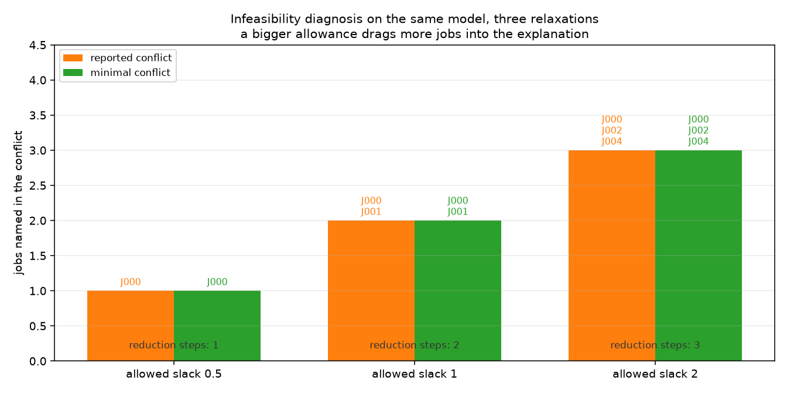

# Week 4 · Day 3：不可行诊断与数值缩放：先定位，再修复

> **先读教材正文**：[第 6 章：求解器工程](../教材/06_求解器工程与结果解释.md)。本页用于读后的复习和项目实验，不能代替零基础教材中的完整推导。

[月度索引](../README.md) · [本周知识主线](../week4.md) · [前一天](Day2.md) · [后一天](Day4.md)

> 当日主题：把「模型无解」拆成可分类的四种成因，再用**冲突诊断**定位到具体哪几条要求互斥
> 当日产出：**一张成因分类表 + 一份删除过滤的正确性论证 + 一批冲突集与系数跨度的实测读数**
> 建议投入：3～4 小时

---

## 1. 今日学习目标

完成今天的学习后，你应该能够：

1. 把「模型跑不出来」分成三类——**模型非法**、**模型不可行**、**搜索未知**——并说清每一类各自能给出什么证据、不能给出什么证据。
2. 按教材 6.7 节的顺序做眼睛排查：加工时间是否为负、截止是否早于「释放时间 + 加工时长」、机器资格是否为空、是否把软交期误写成硬截止。
3. 说出不可行的**四种常见成因**（需求超过产能、硬截止太紧、资源容量不足、建模错误），并说清为什么**建模错误必须最先排除**。
4. 准确写出**冲突集**、**极小冲突集**（IIS）与**最少条数冲突**的定义，并说清「极小」为什么推不出「最小」。
5. 用删除过滤（deletion filter）把求解器给出的**充分冲突集**收缩成 IIS，并写出正确的两条循环不变量。
6. 复述本周的勘误第十五条：完整可判定检查至多保证**包含极小**，而一个 **UNKNOWN** 会中断这条证明。
7. 读 `artifacts/month2_w4/` 里同一模型在三种允许松弛下的冲突集，并说明 `reported_conflict` 与 `minimal_conflict` 是两个不同的字段。
8. 区分**冲突诊断**与**可行性松弛**这两个都叫「不可行分析」但输出完全不同的东西。
9. 用 `scaling.json` 的数字说清系数跨度（span）的含义，并解释缩放实验里「绝对量级随单位变、span 不变」。
10. 拿到一个偏差时先看量级再看前提：1e-2 量级的违反是**建模错误**，不是浮点噪声。

---

## 2. 为什么这一天要求「先定位，再修复」

模型第一次报 `INFEASIBLE` 的时候，几乎所有人的第一反应都是「那就把交期放宽一点」或者「再加一台机器」。这个反应在**业务确实做不到**的时候是对的，但在其余三种情形下都是错的——而且代价不对称：改需求要付业务代价，改一条写错的约束只要付五分钟。

所以今天的主线只有六个字：**先定位，再修复**。

定位这件事，求解器能帮上一部分忙，但帮的忙有明确的边界：

1. **它知道哪几条要求互斥**。当不可行来自模型内部（而不是数据本身）时，它可以给出一组「同时成立就会冲突」的约束——这组约束就是今天的主角，冲突集。
2. **它不知道该牺牲哪一条**。教材 6.7 节最后一段写得很直白：求解器能展示冲突，不会自动决定哪一条业务规则可以让步。放宽截止、加资源、拆任务各有成本，这是业务判断。
3. **它不区分「数据错」和「模型错」**。这句话是今天最容易被忽略的一句。项目 `opt_models/diagnostics.py` 的模块文档把它写进了返回值的 `notes` 里：求解器只会说「这组假设互斥」，不会说「你的模型漏了机器约束」。也就是说，**一类最常见的病（建模错误）在诊断报告里长得和业务不可行一模一样**，只能靠人排除。

再加一句关于排查成本的话：今天要用的删除过滤会对同一个模型反复重解，代价随实例规模线性增长；而眼睛排查（单位、符号、边界）的代价近乎为零。**昂贵的工具应该用在便宜的检查之后**，这是本日实验设计的全部理由。

数值缩放放在同一天，也是因为它是「定位」的一部分：当一个偏差出现时，你必须先判断它属于**哪一层**——是浮点噪声、是容差踩边、是尺度跨度太大，还是前提根本不成立（公式写错）。这四层的处理方式完全不同，而跨度（span）恰好是其中「模型固有数值结构」那一层的度量。

一句话：**先花十分钟定位，再决定要不要花一天修复。**

---

## 3. 三种失败：非法、不可行、未知

这三个词在口语里可以混着说，在报告里必须分开写。

| 状态 | 它说的是什么 | 这时手里有什么证据 | 这时**不能**说什么 |
|---|---|---|---|
| 模型非法 | 表达或数值范围没有通过接口验证（变量域为空、资格集合为空、时长为负） | 一条抛出位置明确的错误 | 不要说「不可行」——这时还没有一个完整的模型 |
| 模型不可行 | 约束无法同时满足，且求解器**完成了证明** | 可以进入冲突诊断；至少要有一组被证明互斥的要求 | 不要说「哪几条约束冲突」，除非真的跑过诊断 |
| 搜索未知 | 预算用完或被提前停止，**没有结论** | 只有当前最好的解或什么都没有 | 既不能说可行，也不能说不可行；更不能说某组约束冲突 |

**第三行是今天最容易出错的地方。** `UNKNOWN` 不是「慢一点的不可行」，也不是「大概是可行」；它就是一个方向都没有的信息。项目把这条写进了诊断报告的返回路径：一次子求解只要不是 `INFEASIBLE` 也不是可解状态，`ConflictReport` 就返回 `status="UNKNOWN"`，并在 `detail["failure_reason"]` 里写明「求解器返回 X：连『哪组约束冲突』都还不能断言」。

第 1 行同样值得展开一句：**非法是好事**。模型在构造阶段被拒绝，说明接口帮你在求解前拦住了表达错误——比如给一个没有合格机器的工序建变量、给负时长的工序建区间。真正麻烦的是那些**能构造、能求解、但语义错**的模型，它们在报告上看起来一切正常。

眼睛排查的顺序（教材 6.7 节）抄在这里当清单用：

```text
1. 加工时间是否为负
2. 截止时间是否早于「释放时间 + 加工时长」
3. 机器（或资源）资格是否为空
4. 是否把业务上的软交期写成了硬截止
5. 单位是否统一（分钟 / 秒 / 小时混用）
```

前四条任何一条命中，都不需要动用诊断工具；第五条命中时，模型仍然「能解」，只是解的语义不是你要的。

---

## 4. 不可行的四种常见成因

不可行的成因可以分类，而分类决定了修复方向。下面这张表是今天最该背下来的一张。

| 成因 | 判据 / 特征 | 本批 `sgl_6x1` 上的对应证据 | 修复方向 |
|---|---|---|---|
| 需求本身超过产能 | 单个作业自己就做不到：`r_j + p_j > d_j` | 允许松弛 0.5 时，6 个作业**全部**满足此式 | 拆工序、加班、外协——求解时间再长也修不了 |
| 交期 / 硬截止太紧 | 硬约束 `C_j <= D_j`，而业务上它其实是软交期 | 本日诊断的全部假设就是「每个作业都准时」 | 把硬约束改成带惩罚的软目标（迟交量进目标函数） |
| 资源容量不足 | 独占资源不够（并行机台数），或共享资源的容量上限太小 | 本批 `machines=1`，一台机器同一时刻只能做一件事 | 加机器、加人手、放宽共享容量（第 3 周 Day 4 的 Cumulative 容量） |
| **建模错误** | 两条约束互相矛盾；或约束与业务规则不一致 | 诊断 `notes` 明写：求解器不会替你区分数据错与模型错 | **先排除这一类**，再谈前三类 |

第四行单独讲。**建模错误最容易被误判成「业务不可行」**，因为它在诊断报告里的长相和前三类完全一样：一样是 `INFEASIBLE`，一样能返回一组冲突的约束，一样会给出「删掉某一条就可行」的验证结果。区别只在于——那组冲突里的某一条，本来就是不该存在的。

手边就有一个干净的建模错误例子，在 [Week 1 Day 6](../Week_1/Day6.md) 第 6 节那个刻意构造的不可行 LP 里：需求侧写着 `x_P2 <= 50`，交付侧写着 `x_P2 >= 60`，两条手算就能看出不可能同时成立。同一个模型里还有第二条冲突——交付 60 件需要 120 单位资源，超过了 80 的产能。这两个冲突里，第一条是典型的建模错误（同一个量的上下界自相矛盾），第二条才是资源容量问题。**把它们都叫「不可行」而不加区分，修复就会修错地方。**

所以本日的操作顺序是：

```text
第一步：确认模型是不是写错了
        —— 把冲突集里的每一条约束翻译回一句业务规则，逐条问「这条规则业务上真的存在吗」
第二步：再看业务约束能否放宽
        —— 交期、产能、资源容量分别放宽要付什么代价
第三步：前两步都不成立，才考虑改需求或加产能
```

报告里必须写清用的是哪一种。写成「模型不可行，已放宽交期」和写成「模型不可行，已删除一条重复写入的截止约束」是两份完全不同的报告：前者动的是业务，后者动的是代码。

---

## 5. 冲突集：极小不等于最小

**定义（冲突集 / 不可行子集）**：设约束系统为 `C`。若 `S ⊆ C` 满足 `S` 自己不可行，就称 `S` 是一个冲突集。

**定义（极小冲突集 / IIS）**：若 `S` 不可行，并且删去 `S` 中**任意**一条都变可行，就称 `S` 是**包含意义的极小**冲突集，也叫不可约冲突集（Irreducible Infeasible Subset，简称 IIS）：

$$
S\ \text{不可行},\qquad \forall c\in S:\ S\setminus\{c\}\ \text{可行}.
$$

**定义（最少条数冲突）**：在所有冲突集里**条数最少**的那一个。

两个定义差一个字，含义差很远。**极小**说的是一件事：集合里没有多余的成员，每一条都在为「不可行」做贡献。它**不比较**不同冲突集的规模——一个模型完全可以同时拥有一个 2 条约束的极小冲突和一个 5 条约束的极小冲突，后者的 5 条每一条都必要，但它仍然比前者的 2 条多。

手算一个最小的例子，把三种集合放在一起看：

```text
约束 a: x >= 5
约束 b: x <= 3
约束 c: x <= 10

{a, b}      : 不可行，且删 a 可行、删 b 可行        -> 极小冲突集（也是最少条数）
{a, b, c}   : 不可行，但删掉 c 之后仍然不可行        -> 是冲突集，不是极小的
{a, c}      : 可行（x = 5）                          -> 不是冲突集
{b, c}      : 可行（x = 3）                          -> 不是冲突集
```

`c` 不是这个矛盾所必需的——它是这个冲突的「无辜牵连者」。这正是删除过滤要删掉的东西。

还有四个必须记住的性质：

1. **同一个模型可以有多个不同的 IIS。** 上面这个例子只有一个，但今天的实例里有很多个（第 7 节会数出来）。
2. **IIS 可能包含变量界，而不只是显式约束。** 一个变量的下界与另一条约束上界冲突，同样构成 IIS；诊断工具通常把变量界也当成可报告的成员。
3. **找到一个冲突不等于修好模型。** 教材 6.10 的题 2 就是反例：系统里有 `x >= 5, x <= 3, y >= 2, y <= 0` 两条独立冲突，去掉 `x <= 3` 之后模型**仍然**不可行（`y` 的两条还在）。修完一个冲突必须重跑一次诊断。
4. **「冲突」不能脱离「相对哪组要求」单独讲。** 后面的数据会看到：同一份排程数据，把「允许的松弛」从 0.5 调到 2，被点名冲突的作业就从 1 个变成 3 个。

---

## 6. 删除过滤：它能证明什么，不能证明什么

求解器给出的不是一个 IIS，而是一个**充分冲突集**：它确实足以造成不可行，但它可能带上了不必要的成员，也可能换一个 `seed`、换一台机器就给出另一个超集。项目因此一律再做一遍**删除过滤**。

算法的骨架只有十行，但每一行的正确性条件都必须写清：

```text
S <- 求解器给出的充分冲突集
i <- 0
while i < len(S):
    T <- S 去掉第 i 个元素
    求解 T
    if T 被证明不可行:            # 有确定证据
        S <- T                    # 第 i 个元素不必要，永久删掉
    else:                         # 可解，或者 UNKNOWN
        i <- i + 1                # 不能删，游标前进
return S
```

**两条循环不变量**（这是整个算法的正确性根据）：

1. **每一步之后 `S` 仍然不可行。** 因为我们只在「删掉之后仍被证明不可行」时才真的删。
2. **每个留在集合里的元素都有一条「去掉它就可行」的证据。** 只有当一次试探返回了可解状态，游标才前进——也就是这个元素被记为必需。

两条合起来，循环结束时就得到「不可行 + 删任一条都可行」= IIS。

**第一条不变量靠的是 INFEASIBLE 的证明，第二条靠的是可解状态的证明。** 于是问题来了：如果某个试探返回的是 `UNKNOWN` 呢？代码里 `UNKNOWN` 走的是 `else` 分支——元素被保留，游标前进。这个选择是**保守**的（不能仅凭一次超时就宣布某条约束多余），代价是：**这个元素留在集合里，但没有得到「它必需」的证明**。第二条不变量在这一点上没有闭合。

于是得到本周勘误第十五条的准确表述：

> **旧表述**：删除过滤必得最少条数冲突。
>
> **正确理解**：**完整可判定检查至多保证包含极小；UNKNOWN 会中断该证明。**

拆成三句话：

1. **「至多包含极小」**：即使每一次子求解都给出了确定的结论，删除过滤能保证的也只是**包含意义下的极小**（不可约），它**从不保证最少条数**。要断言「条数最少」，必须额外穷举所有更小的子集、并证明它们全部可行——那是另一个算法，不是删除过滤。
2. **「UNKNOWN 会中断该证明」**：只要有一次试探返回 `UNKNOWN`，第二条不变量就断了，此时把结果标成「极小冲突集」是**没有依据**的，只能报告「尚未证实极小性」。
3. **「至多」两个字不能省**：连极小性都是条件成立的结论，而不是删除过滤的默认输出。

项目把这件事做成了**可核对的记录**，而不是一句口号。`ConflictReport.verification` 里有两个字段：

```text
verification["still_infeasible"] = ( IIS 单独求解的状态 == "INFEASIBLE" )   # 第一不变量
verification["irreducible"]      = ( IIS 去掉每个元素后的状态都属于可解状态 )  # 第二不变量
verification["drop_one_status"]  = 逐个元素记录「去掉它之后是什么状态」
```

只要有任何一次子求解返回 `UNKNOWN`（或者超时），`irreducible` 就会变假——因为它的判据是「每一个去掉后的状态都在可解状态集合里」，`UNKNOWN` 不在其中。**报告里贴的是这两个布尔值，不是一句「已得到极小冲突集」。**

最后两条边界，来自 `diagnostics.py` 的模块文档：

1. **`minimal` 是「关于这组假设集合的极小」**，不是「全实例的最小冲突」。不在假设集合里的约束（例如加工时长本身、机器互斥本身）不参与最小化，它们只是背景。
2. **假设集合里的要求必须覆盖到每个作业**，否则报告直接返回 `status="FAILED"` 并写明 `failure_reason`。这不是形式主义：一个漏掉了某个作业的假设集合，问的已经不是你原本想问的那个问题。

还有一条返回路径值得知道：如果模型报 `INFEASIBLE`，但求解器**一条假设都没归咎**，报告会写明「不可行与这批假设无关，先检查模型本身」。也就是说，不可行可能来自背景约束（模型自身就矛盾），而不是来自你怀疑的那批要求。这条是最接近「建模错误」的一个信号。

---

## 7. 用批次数据看「松弛越大，牵连越多」

`artifacts/month2_w4/` 里的诊断组用的是同一个实例 `sgl_6x1`（6 个作业、1 台机器），唯一变的是**允许的松弛**（记为 `slack`）。交期按

$$
d_j(\sigma)=r_j+\lceil \sigma\cdot p_j\rceil
$$

造出来，`σ` 越小交期越紧。



- 横轴三个刻度 `allowed slack 0.5 / 1 / 2` 就是三种允许的松弛；橙色柱 `reported conflict` 是求解器给出的充分冲突集，绿色柱 `minimal conflict` 是删除过滤之后的集合。
- 纵轴 `jobs named in the conflict` 是冲突集里被点名的作业个数；柱顶标注的 `J000`、`J000/J001`、`J000/J002/J004` 就是集合本身。
- 柱内下方的 `reduction steps: 1 / 2 / 3` 是删除过滤实际做的试探次数，本批这三个数恰好等于集合大小，说明**一次也没删成功**——留下的每条都拿到了「去掉它就可行」的证据。
- 标题两句 read 作：同一个模型、三种松弛；**允许得越宽，被牵连进解释的作业越多**。

批次读数（`artifacts/month2_w4/results.csv` 的 `infeasibility_diagnosis` 组）：

| 允许的松弛 `slack` | 状态 | `reported_conflict` | `minimal_conflict` | `reduction_steps` | 求解次数 | 总求解耗时 |
|---|---|---|---:|---:|---:|---:|---:|
| 0.5 | INFEASIBLE | `J000` | `J000` | 1 | 4 | 0.011 s |
| 1 | INFEASIBLE | `J000|J001` | `J000|J001` | 2 | 6 | 0.028 s |
| 2 | INFEASIBLE | `J000|J002|J004` | `J000|J002|J004` | 3 | 8 | 0.030 s |

**先把「求解次数」这一列算清**，它是删除过滤代价的账本：1 次初始求解 + `reduction_steps` 次试探 + 验证阶段（IIS 重解 1 次 + 逐个元素去掉再解，等于 IIS 的大小）。`slack=1` 那一行：`1 + 2 + (1 + 2) = 6`，与结果表里的 `iterations` 列一致。删除过滤的开销就是这样随集合大小线性增长的，而单次子求解还有一个 3 秒的上限（`metadata.json` 的 note 写明「诊断用 3s 预算限制删除过滤的代价」）。**耗时一列只作组内对照，不是固定结论**——换机器、换版本都会变。

**再手算一遍这三组冲突，看它们是不是真的。**

`slack = 0.5`：交期是 `J000: 10, J001: 7, J002: 7, J003: 14, J004: 5, J005: 11`（`d_j = r_j + ceil(0.5 p_j)`）。拿 `J000` 核对：它 `r = 7`、`p = 5`，最早也只能在时刻 7 开工、12 完工，而交期是 10。

```text
J000: r + p = 7 + 5 = 12  >  d = 10    -> 单个作业自己就做不到
J001: 2 + 10 = 12 > 7      J002: 2 + 9 = 11 > 7      J003: 7 + 14 = 21 > 14
J004: 3 + 4 = 7  > 5       J005: 2 + 18 = 20 > 11
```

六个作业全部满足 `r_j + p_j > d_j`，所以**每一个单元素集合都是冲突**。求解器报的是 `{J000}`，但这个模型里 `{J001}`、`{J002}`……各自也构成冲突——这就是第 5 节说的「一个模型可以有多个 IIS」，而且它们条数相同、同时存在，谁也没法说「只有它一个原因」。

`slack = 1`：交期变成 `12, 12, 11, 21, 7, 20`。这时每个作业单独都能准时（`{J000}`：7 → 12 正好压线；`{J001}`：2 → 12 正好压线），所以冲突至少要两个作业：

```text
{J000, J001} 在两个交期 12 下：
  J001 的窗口是 [2, 12]，工时 10，正好占满整段 [2, 12]
  J000 的窗口是 [7, 12]，工时 5，需要有 5 个单位落在 [7, 12]
  但 [7, 12] 这 5 个单位已经被 J001 占满       -> 不可行
去掉 J000 或去掉 J001 都各自可行                -> 所以它是极小冲突
```

`slack = 2`：交期是 `17, 22, 20, 35, 11, 38`，单元素与两元素都可行了，冲突要到三个作业：

```text
{J000, J002, J004}：r/p/d = 7/5/17、2/9/20、3/4/11
  最早释放时间是 2 -> 机器最早 2 点开动；三个作业工时之和 5 + 9 + 4 = 18
  窗口 [2, 17] 只有 15 个单位的容量，装不下 18 -> 至少 3 个单位必须落在 17 之后
  能落在 17 之后的只有 J002（J000 必须 17 前完工，J004 必须 11 前完工）
  -> J002 的 9 个连续单位里恰好有 3 个单位在 [17, 20]，即 J002 整段就是 [11, 20]
  -> [2, 11) 必须装下 J000 的 5 单位与 J004 的 4 单位，正好 9 个单位、没有空隙
  -> 但 J000 最早 7 点开工，[7, 11) 只有 4 个单位，装不下 5 个单位  -> 不可行
```

这一步手算之所以合法，是因为**不在假设集合里的作业没有交期要求**：`J001`、`J003`、`J005` 的工序可以整体排到后面（三道工序共 42 个单位，排在时刻 20 之后仍然落在 `horizon = 67` 之内），所以「这三个作业在假设下不可行」与「这三个作业自己排不下」是同一件事。

**这里有一个必须写进报告的区别**：`reported_conflict` 与 `minimal_conflict` 是**两个字段**。本批三行里它们恰好相同，但这不是必然——求解器给的充分冲突集完全可能带上无辜成员，此时两个字段就会不同。报告里要写清用的是哪一个：写「报出的冲突集」和写「极小冲突集」是两句不同的话。

**「最少条数」这件事，本批是另外穷举出来的，不是删除过滤给的。** 我把三种松弛下的所有子集都枚举了一遍：

```text
slack = 0.5 : 6 个单元素集合全部不可行      -> 最少条数 = 1，共 6 个极小冲突
slack = 1   : 15 个两元素集合里 13 个不可行 -> 最少条数 = 2，共 13 个极小冲突
              （唯二可行的两元素集合是 {J000, J004} 与 {J003, J004}）
slack = 2   : 两元素集合全部可行，8 个三元素集合不可行 -> 最少条数 = 3
              求解器报的 {J000, J002, J004} 是这 8 个之一
```

这张表正好把第 6 节的两句话摆成了证据：本批三行里 `minimal_conflict` **凑巧**也是最少条数的，但那个结论来自**额外做的穷举**（6 + 15 + 20 个子集），删除过滤本身只保证「包含极小」。把「恰好最少」写成「删除过滤保证最少」，就是把一次观察说成了定理——这类错误在本周的前两天已经见过一次（[Week 4 Day 1](Day1.md) 的第三种论证）。

**最后一个要点：允许的松弛本身就是一个人为选择。** 同一份数据、同一个模型，`σ` 取 0.5 / 1 / 2 就能得到三个大小不同的解释。冲突集不是「这个实例的固有属性」，而是「这组要求 + 这份数据」的联合属性。所以报告里不能只写「冲突是 J000」，必须写「在允许松弛 0.5 的那组交期下，冲突是 J000」。

---

## 8. 两种「不可行分析」：定位与放宽

「不可行分析」这个说法下面藏着两个不同的问题，输出也不同，不能互相替代：

| | 冲突诊断（infeasibility analysis） | 可行性松弛（feasibility relaxation） |
|---|---|---|
| 回答的问题 | **哪几条要求互相矛盾** | **至少要放宽多少才可行** |
| 输出形态 | 一个约束集合（成员是谁） | 一组「把哪条约束放开多少」的数值 |
| 数学形式 | 子集不可行性（含变量界） | 带惩罚的优化：允许违反，代价进目标 |
| 是否需要权重 | 不需要 | **需要**：不同约束罚多重是业务决定 |
| 本日的对应物 | `diagnose_infeasibility` 的 `minimal_conflict` | `deadlines_with_slack` 这一个参数族 |
| 不能替代的地方 | 它不说「放开多少」（本批已知冲突是 `{J000}`，但它没告诉你交期要加几个单位） | 它不说「哪几条互斥」（它给出的是一个可行解，冲突原因仍要另找） |

第二列里「需要权重」这句要展开一点：可行性松弛把一个不可行模型改成「允许违反、但要付代价」的模型，代价怎么定直接决定它给你哪个答案。给交期违反定一个大罚、给产能违反定一个小罚，得到的松弛方案就完全不同。**权重是业务决定，不是数学结论**；换一组权重，同一个模型会给出不同的「最小放宽量」。

本日脚本第 5 节做的是**参数化松弛**：把交期整体按 `σ` 缩放，然后扫描三个 σ。它回答的问题比可行性松弛更粗——不是「把哪一条放开多少」，而是「这族松弛里，允许得越宽会发生什么」。三个 σ 全部不可行这件事本身就是结论：

```text
slack = 0.5 -> INFEASIBLE      slack = 1 -> INFEASIBLE      slack = 2 -> INFEASIBLE
```

**它没有告诉你临界点在哪里。** 这族松弛一定会在某个 σ 处变成可行（当 `d_j` 大到不再约束任何作业时，单机排程总是可行的），但三次探测不足以定位那个点，`slack = 2.0` 也仍然不可行说明临界值在 2 之上。**「三次都不可行」不是「永远不可行」，「三次的间隔里没有可行点」也不是「可行点不存在」**——这两句是同一件事的两种错说法。

---

## 9. 数值缩放：为什么量级也算技术问题

换一个完全不同的维度。浮点 MILP **不用精确实数运算**：约束与整数性都在一定容差内判断（教材 6.6 节）。系数之间的量级跨度一旦拉开，求解器就在小数位上丢精度：同时兼顾 `1e6` 量级与 `1e-3` 量级，双精度能保留的有效位要分给两头。

本批的缩放体检（`artifacts/month2_w4/scaling.json`，由 `opt_models/diagnostics.py` 的 `scaling_report` 生成，**只读数据、不求解**）：

| 量 | 读数 | 怎么来的 |
|---|---:|---|
| `jobs` / `operations` / `machines` | 6 / 6 / 1 | 单机实例 |
| `horizon` | 67 | `max_j r_j + Σ p` = 7 + 60 |
| `coefficient_min` / `coefficient_max` | 2 / 67 | 系数集合 = 加工时间 + 释放时间 + 交期 + horizon |
| `span` = `tight_model_span` | 33.5 | 67 / 2 |
| `big_m.loose` | 402.0 | 第 2 周的 `loose_big_m` = `n × H` = 6 × 67 |
| `big_m.pair_max` / `pair_min` | 65.0 / 60.0 | `pair_big_m` = `H − r_k`，最大 67 − 2、最小 67 − 7 |
| `big_m_span` | 201.0 | 402 / 2 |
| 解析下界（makespan） | 60 | `makespan_lower_bound`，写在该文件的 `notes` 里 |

**spans 的定义是比值，不是绝对量级**：

$$
\text{span}=\frac{\max|\text{系数}|}{\min|\text{非零系数}|}.
$$

把加工时间、释放时间、交期与 horizon 一起放进系数集合之后，本实例的系数最小值是 2（来自释放时间），最大值是 67（horizon）。松模型的最大系数换成了 Big-M：`loose` 是 402，是 horizon 的 6 倍；于是 `big_m_span = 402 / 2 = 201`，也正好是紧模型 span 的 6 倍。`scaling.json` 的 `notes` 把这件事总结成一句：**紧模型的最大系数是 horizon，松模型的最大系数是 Big-M，量级通常高出一到两个数量级**——本实例落在这一档的下沿（6 倍）。

**「span 与单位无关」这件事，用一个缩放实验看最清楚。** 把实例的时间数据整体乘一个因子（`rescale_instance`，要求乘积仍是整数）：

| factor | horizon | 最大系数 | span（比值） | `big_m_span` |
|---:|---:|---:|---:|---:|
| 1.0 | 67 | 67 | 33.5 | 201.0 |
| 10.0 | 670 | 670 | 33.5 | 201.0 |
| 100.0 | 6700 | 6700 | 33.5 | 201.0 |

绝对量级随因子线性放大，**span 一动不动**。这条观察有两个用处：

1. **看 span 才看得出模型的固有数值结构**，看绝对系数只看到你选了多大的时间单位。同样是这套数据，用秒记和用毫秒记，`coefficient_max` 会差 1000 倍，而模型真正的数值困难程度一点没变。
2. **「换个单位」不是改善数值条件的手段。** 乘一个因子只改变绝对量级，跨度不变、条件数不变。能真正改变结构的只有两件事：**去掉不必要的 Big-M**（第 2 周的紧写法 `M_jk = H − r_k` 就是一个），以及**把上界收紧**。后者对 span 的影响可以直接算：本实例的解析下界是 60，如果某个实例的 horizon 能被合法地收到 60，紧模型的 span 会从 67/2 降到 60/2 = 30——方向对，但幅度有限（注意 60 是下界，只有当它同时也被证明是合法上界时才能当 horizon 用，这一点在 [Week 2 Day 3](../Week_2/Day3.md) 讲时间界时论证过）。

**这就是第 2 周 Day 3 那些 Big-M 写法在数值上要付的代价**：合法性与强度是两个独立的问题，而数值条件还额外是第三个。`M_jk = H − r_k` 与 `n × H` 都能证明合法，但后者的系数是前者的六倍多，而且它出现在每条排序约束里。Big-M 越紧，模型的数值条件越好——这一点和 `Week 4 Day 1` 讲「上界收紧」的思路是同一条。

最后一句关于场景的说明：`scaling_report` 的 `notes` 里还写明，取 Big-M 数值是**只读调用第 2 周的公开函数**，本模块自己的模型不使用 Big-M。诊断模型用的是可选区间 + `AddNoOverlap`，机器互斥是一条约束，不是一对 `y_jk` 加两条排序式。**「一套模型、一种语义」**——诊断不给同一个问题造第二套变量，否则「冲突是这组假设」这句话的语义就没法与主模型对齐。

---

## 10. 不要把所有偏差都归给浮点

数值缩放重要，但它不是偏差的万能解释。拿到一个偏差时的排查顺序是：**先看量级，再看前提是否成立，最后才怀疑浮点**。把 [Week 1 Day 6](../Week_1/Day6.md) 第 10 节那张表搬到这里：

| 偏差量级 | 先怀疑什么 | 不该说的话 |
|---|---|---|
| 恰好 0 或 1e-13 以下 | 不是错误 | —— |
| 1e-9 ~ 1e-6 | 是否踩在求解器容差上、是否存在尺度跨度 | 「一定是噪声」 |
| **1e-4 ~ 1e-2** | **建模错误**：系数抄错、单位不一致、不等号写反 | 「浮点误差嘛」 |
| 1e-1 以上 | 前提不成立：变量名错配、约束根本没进模型 | 「再收紧容差就好」 |

第三行是今天要单独强调的：**1e-2 量级的违反是建模错误，不是噪声。** 本环境实测的浮点噪声在 `2e-13` 量级（`Week 1 Day 6` 的第 6 节），中间隔着八个数量级；把 1e-2 归给浮点，等于把八个数量级当成了零。

本日还有一个更容易犯的版本：**把 `INFEASIBLE` 归给浮点**。不可行是一个有证明方向的结论，不是一次读数偏差；怀疑它之前要问的是「量级是多少」（如果是因为 `x <= M z` 里 `M` 太大、而 `z` 落在整数容差内被接受，那反而是个**模型问题**，见教材 6.6 节），而不是「容差调大一点就好了」。顺序反过来只会掩盖真正的错误——调宽容差不会让模型变可解，只会让检查器少报警。

---

## 11. 实验：`m2w4d3_diagnostics.py` 逐节读

脚本链接：[m2w4d3_diagnostics.py](../../projects/02_optimization_models/examples/m2w4d3_diagnostics.py)。它做的事就是今天的两条线：**缩放体检**（第 1、2 节）与**不可行诊断**（第 3、4、5 节）。下面按节读，输出是本环境这一次运行的结果。

**第 1 节：系数跨度。**

```text
== 1. 系数跨度：Big-M 是主要来源 ==
  jobs=6 operations=6 machines=1
  horizon（有效时间界）        = 67
  系数最小 / 最大              = 2 / 67
  紧模型跨度 tight_model_span  = 33.5  （= horizon / 最小系数）
  Big-M 用量                   = {'loose': 402.0, 'pair_max': 65.0, 'pair_min': 60.0}
  松模型跨度 big_m_span        = 201.0
  这里松模型比紧模型大了约 6.0 倍：
```

就是第 9 节那张表。**注意脚本自己把 span 定义写成「比值」并强调它不是绝对量级**，这个提示是为了防止「horizon 是 67，所以模型数值条件很差」这类误读。

**第 2 节：缩放实验。** 同一份数据乘 1 / 10 / 100，`span` 与 `big_m_span` 三行完全一样（33.5 与 201.0），horizon 与最大系数则线性放大。

**第 3 节：构造一个真正不可行的实例。**

```text
  把每个作业的交期都压到 0：deadlines = {'J000': 0, 'J001': 0, ...}
  求解次数 = 4   总耗时 = 0.06s
  INFEASIBLE: 充分冲突集 1 个 → 极小冲突集 1 个 ['J000']
  充分冲突集（求解器给的）: ('J000',)
  极小冲突集（删除过滤后）: ('J000',)
  删除过滤用的步数        : 1
```

交期全压到 0，而每个作业至少要一段正工时——这是一个**手算就能判定**的不可行实例，所以它适合当冒烟测试：脚本最后用 `assert conflict.status == "INFEASIBLE"` 与 `assert conflict.minimal_conflict` 把它固化下来。删除过滤只用 1 步：试探「去掉 J000」，剩下空假设集合，模型立刻可解，于是 J000 被记为必需。

**第 4 节：求解器不会替你区分「数据错」和「模型错」。** 这一节直接把 `ConflictReport.notes` 逐条打出来，是全天最该记住的一段：

```text
  - SufficientAssumptionsForInfeasibility() 只保证「充分」，不保证最小、也不保证唯一；
    换 seed 或换设备可能给出不同的超集。
  - 不可行可能来自建模错误而不是数据；求解器不会替你区分这两者。
  - IIS 是「关于这组假设集合的极小」，不在假设集合里的约束不参与最小化。
  - 验证结果里 irreducible 为真表示：IIS 去掉任意一个作业后都变得可解，所以这组作业确实是冲突的来源。
```

最后一条对应第 6 节的 `verification["irreducible"]`：**「极小」不是一个形容词，而是一份逐项可核对的记录。**

**第 5 节：松弛交期这个可控旋钮。**

```text
  slack= 0.5  status=INFEASIBLE  极小冲突集=('J000',)  求解次数=4
  slack= 1.0  status=INFEASIBLE  极小冲突集=('J000', 'J001')  求解次数=6
  slack= 2.0  status=INFEASIBLE  极小冲突集=('J000', 'J002', 'J004')  求解次数=8
  三个 slack 全部不可行，但**冲突集在变大**：slack 越宽，能各自达标的作业越多，
  就需要更多作业凑在一起才产生冲突——冲突集是相对假设集合定义的，不是作业的固有属性。
  注意本例里即使 slack=2.0 仍不可行：单机上每个作业只有 2 倍自身工时的交期，
  而它必须等前面所有作业做完。可行的临界点要靠实验找，不能靠直觉断言。
```

这三行就是第 7 节那张批次表在脚本里的对应读数（同一实例、同一参数）。**允许的松弛是一个人为旋钮**——换一个 σ，你看到的解释就换一个样子；这一点必须写进报告。

**关于「一遍跑完要多久」**：本页引用的耗时都是本环境这一次的读数。删除过滤的求解次数是 `1 + 步数 + 验证次数`，随集合大小线性增长；实例一大，`3` 秒的单次预算就会开始咬人，而**超时正是第 6 节说的那个会中断极小性证明的 `UNKNOWN`**。诊断的成本和诊断的可信度是同一个旋钮的两面。

---

## 12. 今日练习

1. **手算（分类）**：给下面三条各写出它的成因类别与修复方向——(a) 某作业 `r = 5`、`p = 8`、`d = 11`；(b) 同一台机器上两个作业的交期窗口合计容不下两个工时之和；(c) 需求行写 `<= 50`、交付行写 `>= 60`。
2. **手算（极小性）**：系统里有 `x >= 5`、`x <= 3`、`y >= 2`、`y <= 0` 四条约束。写出两个不同的 IIS，并说明 `{x >= 5, x <= 3, y >= 2}` 是不是极小冲突集。
3. **推导**：证明删除过滤的两条循环不变量。特别说明「一次试探返回可解状态」为什么能支撑「这个元素必需」的结论——提示：最终集合是那次试探时集合的**子集**。
4. **改代码**：把 `diagnose_infeasibility` 的删除过滤改成记录每一次试探的状态，并让 `verification["irreducible"]` 在出现 `UNKNOWN` 时明确标成 `False` 并附上原因。说明为什么不许把 `UNKNOWN` 当成「可解」来删除元素。
5. **实验**：对 `sgl_6x1` 再扫 `slack = 3` 与 `slack = 4`，记录 `status` 与 `minimal_conflict`，并回答：冲突集会不会无限变大？为什么？
6. **数值**：把 `horizon` 手动改成 `60` 再跑一次 `scaling_report`，读出新的 `span` 与 `big_m_span`，并说明为什么这次改动**可能**切掉最优解（提示：60 是下界，不一定是合法上界）。

---

## 13. 验收清单

- [ ] 能一句话区分**模型非法**、**模型不可行**、**搜索未知**，并说出 `UNKNOWN` 不提供任何方向。
- [ ] 能背出不可行的四种成因，并说清为什么**建模错误**必须最先排除。
- [ ] 能写出极小冲突集的定义 `S 不可行 且 删任一条都可行`，并举例说明极小 ≠ 最小。
- [ ] 能默写删除过滤的循环骨架，并说出两条循环不变量。
- [ ] 能复述勘误第十五条：**完整可判定检查至多保证包含极小；UNKNOWN 会中断该证明**。
- [ ] 知道「最少条数」需要另外穷举更小的子集，删除过滤不提供这个保证。
- [ ] 能说出 `reported_conflict` 与 `minimal_conflict` 是两个字段，并知道本批三行恰好相同。
- [ ] 能手算 `slack = 0.5` 下 `J000` 为什么单独就是冲突（`7 + 5 = 12 > 10`）。
- [ ] 能说出「允许的松弛」是人为选择，冲突集不是实例的固有属性。
- [ ] 能对照冲突诊断与可行性松弛：一个输出集合，一个输出「放宽多少」，且后者需要权重。
- [ ] 能解释 `span = 最大系数 / 最小非零系数`，并说出本批 `33.5` 与 `201.0` 的来源。
- [ ] 能说出缩放实验的结论：绝对量级随单位变，`span` 不变。
- [ ] 知道 1e-2 量级的违反是建模错误而不是噪声（与 `Week 1 Day 6` 的排查表一致）。
- [ ] 能说出修复的顺序：先查建模错 → 再谈业务放宽 → 最后才改需求或加产能。
- [ ] `python projects/02_optimization_models/examples/m2w4d3_diagnostics.py` 能跑通（退出码 0），输出与第 11 节一致。

---

## 14. 自测题

- Q1：模型报 `INFEASIBLE`，能不能直接说「业务上做不到」？缺哪一步？
- Q2：交期被写成硬约束 `C_j <= D_j`，业务上其实是软交期。这属于四种成因里的哪一种？加长求解时间有用吗？
- Q3：`x >= 5, x <= 3, x <= 10` 里，哪些子集是冲突集？哪个是极小的？哪个是条数最少的？
- Q4：「极小冲突集」与「最少条数冲突」的差别是什么？给出一个能区分两者的情形。
- Q5：删除过滤做完之后，结果是 IIS 吗？需要哪些条件？
- Q6：某次删除试探返回 `UNKNOWN`，能不能把这个元素删掉？能不能把它标成「必需」？
- Q7：求解器给的是「充分冲突集」，为什么不能直接当 IIS 报出去？
- Q8：本批 `slack` 从 0.5 调到 2，冲突集从 1 个作业变成 3 个。这个变化说明冲突集是什么的属性？
- Q9：冲突诊断与可行性松弛分别回答什么问题？为什么松弛分析需要权重？
- Q10：`scaling.json` 里 `tight_model_span = 33.5`、`big_m_span = 201.0`。这两个数的分母是同一个吗？
- Q11：把时间单位从分钟改成秒，`span` 会变大吗？为什么？
- Q12：一个残差读数是 `1e-2`，先怀疑什么？为什么不先调容差？

### 参考答案

- A1：不能。至少缺一步「排除建模错误」：把冲突集里的每条约束翻译回业务规则逐条确认。模型里可能有一条本该是软约束的截止被写成了硬约束，或两条互相矛盾的约束（`>= 60` 与 `<= 50`）同时存在；这些都不是业务做不到。
- A2：属于「交期 / 硬截止太紧」这一类，而且往往同时是「建模错误」——业务上它本来是软交期（迟一点可以接受，只是有代价），被写成了硬约束之后就变成了必须满足。加长求解时间完全无用：不可行是有证明的结论，与搜索预算无关。
- A3：`{x >= 5, x <= 3}` 是冲突集、是极小的、也是条数最少的（2 条）；`{x >= 5, x <= 3, x <= 10}` 是冲突集但不是极小（`x <= 10` 不必要）。`{x >= 5, x <= 10}` 与 `{x <= 3, x <= 10}` 都可行，不是冲突集。
- A4：极小是「集合内部没有多余成员」，只比较同一个集合与它自己的子集；最少条数是「跨集合比较规模」。能区分两者的情形：一个模型里既有 2 条的极小冲突，又有一个 5 条的极小冲突（5 条每一条都必要，比如两两配对的时间窗口都挤在一起）；后者极小但条数不是最少。
- A5：只有在**每一次子求解都返回了确定结论**（不可行 → 删除；可解 → 保留）时才成立。只要出现一次 `UNKNOWN`，那个元素就被保守地保留下来而没有「必需」的证据，结果只能报告为「尚未证实极小性」。项目的 `verification["irreducible"]` 就是这条条件的显式记录。
- A6：不能删——删除的前提是「删掉之后仍被证明不可行」，`UNKNOWN` 没有这个证明。也不能标成「必需」——「必需」的证据是「删掉之后可解」，`UNKNOWN` 同样没有。两个结论都拿不到，只能如实报告未获结论。
- A7：因为它只保证「充分」，不保证最小、也不保证唯一：它可能带上不必要成员，也可能换一个 `seed` 或换台机器给出另一个超集。直接报出去等于把求解器的内部传播痕迹当成了数学结论。
- A8：说明冲突集是「**这组要求 + 这份数据**」的联合属性，不是实例的固有属性。`slack` 越宽，能各自达标的作业越多，就需要更多作业凑在一起才产生冲突。报告里必须连「相对哪组假设」一起写。
- A9：冲突诊断回答「哪几条约束互相矛盾」（输出是一个集合）；可行性松弛回答「至少要放宽多少才可行」（输出是一组数值）。后者需要权重，因为「允许违反、代价进目标」里的代价是业务决定——哪条约束罚得重，松弛方案就往另一条上跑；换一组权重会得到不同的「最小放宽量」。
- A10：是同一个分母。两者的分母都是 `coefficient_min = 2`（本实例来自释放时间），分子分别是紧模型的最大系数（horizon = 67）与松模型的最大系数（Big-M = 402），所以 33.5 与 201.0 正好差 6 倍。
- A11：不会。`span` 是比值，分子分母同时被放大同样的倍数，比值不变。缩放实验里 factor = 1 / 10 / 100 三行的 `span` 都是 33.5。换单位只改变绝对量级；真正能改善数值结构的是去掉不必要的 Big-M 与收紧上界。
- A12：先怀疑**建模错误**（系数抄错、单位不一致、不等号写反）。本环境实测的浮点噪声在 2e-13 量级，中间的差距是八个数量级；调宽容差不会让错误消失，只会让检查器不再报警，把问题藏起来。

---

## 15. 今日一句话总结

> **求解器能告诉你哪几条要求互斥，但它不会告诉你哪一条不该存在——所以修复的第一步永远是「先排除建模错误」，而删除过滤给出的至多只是包含极小的集合，一次 UNKNOWN 就能让这个结论作废。**

---

## 配套代码入口

从仓库根目录运行（需先按[项目指南](../../projects/02_optimization_models/PROJECT_GUIDE.md)配置环境）：

```powershell
python projects/02_optimization_models/examples/m2w4d3_diagnostics.py
```

[阅读示例源码](../../projects/02_optimization_models/examples/m2w4d3_diagnostics.py)。先完成正文的手算（三组松弛下冲突集的构成、`span` 的两个比值），再用脚本核对项目实例；记录实例、状态、假设集合、冲突集与求解次数，**不把一次运行耗时作为固定结论**。本页引用的批次数据在 [`artifacts/month2_w4/results.csv`](../../projects/02_optimization_models/artifacts/month2_w4/results.csv) 与 [`artifacts/month2_w4/scaling.json`](../../projects/02_optimization_models/artifacts/month2_w4/scaling.json)，图的生成代码在 [`examples/m2_figures.py`](../../projects/02_optimization_models/examples/m2_figures.py)。诊断模块的语义边界写在 [`opt_models/diagnostics.py`](../../projects/02_optimization_models/opt_models/diagnostics.py) 的模块文档里；实现与数学语义的区别见[概念勘误](../CONCEPT_CORRECTIONS.md)。
