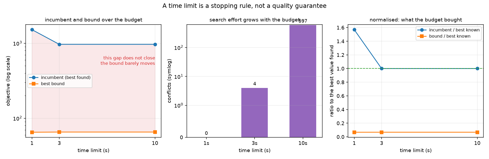

# Week 4 · Day 4：求解预算与参数：把终止行为写进实验定义

> **先读教材正文**：[第 6 章：求解器工程](../教材/06_求解器工程与结果解释.md)。本页用于读后的复习和项目实验，不能代替零基础教材中的完整推导。

[月度索引](../README.md) · [本周知识主线](../week4.md) · [前一天](Day3.md) · [后一天](Day5.md)

> 当日主题：时间限制、workers、种子——把「求解器是怎么停下来的」写进实验定义，而不是只记目标值
> 当日产出：一张**分阶段耗时表** + 一次**预算扫描实测** + 一句「解出 X 必须连预算一起说」
> 建议投入：2～3 小时

---

## 1. 今日学习目标

完成今天的学习后，你应该能够：

1. 说出为什么「使用精确算法」**不保证**每次运行都完成精确证明 —— 求解器是**有终止条件**的，而限时正是最常见的那个。
2. 把一次运行的时间拆成**建模 / 求解 / 端到端**三段，并说清求解器的 `time_limit` 覆盖的是哪一段。
3. 用本批实测说出「预算改变的是终止原因，不只是数值」：同一实例 1 秒给 1519、3 秒起稳定在 968，而四档**全部**是 `FEASIBLE` —— 从头到尾没有证明最优。
4. 解释为什么**界随预算单调不降**（分支定界的基本性质），而**目标值不保证单调**。
5. 亲手算出三档预算的 gap（0.9571 / 0.9323 / 0.9323）与两档之间的改善幅度（目标 36.3%、界 0.58%），并解释这个不对称说明时间花在了哪里。
6. 说出 workers 与 seed 各自控制什么、**不**控制什么，并解释为什么「同种子即可复现」在多线程下是假承诺。
7. 说出为什么**两次独立重启的运行之间**，未经检查不能断言长预算一定给出更好的结果。
8. 解释 `gap limit` 的语义：容许正 gap 意味着接受一个**带界的近似终止**，要宣称严格最优必须确认当前语义与精度下确实有相应证据。
9. 设计一个一次只改一个因素的参数实验，并说出为什么同时改多项就无法归因。

---

## 2. 为什么第 4 天要专门做「预算」

前两天处理的是「模型对不对」：Day 1 让加进去的约束是合法的，Day 2 让初解与变量固定的副作用被说清，Day 3 让失败与数值缩放有诊断路径。**今天要处理的是另一类问题：这次运行到底什么时候结束、为什么会这样结束。**

这一步必须单独存在，原因有三个。

1. **「解出 X」这句话，不带预算就是不完整的。** 同一个实例、同一个模型，1 秒给 1519，3 秒给 968。如果报告只写「本方法解出 1519」，读者会以为这是方法的能力上限 —— 而它其实是**预算的上限**。这一条是本批实测最直接的教训（第 8 节）。
2. **时间不是一维的。** 「跑了 10 秒」至少可以是三件事：建模 10 秒、求解 10 秒、端到端 10 秒。求解器的 `time_limit` **只覆盖求解阶段**，不含 Python 建模、初解生成与输出。把三者混成一个数，出问题时无法归因。
3. **有两条会误导人的直觉需要提前拆掉。** 一条是「预算翻十倍，结果应该好得多」——本批的界几乎没有动；另一条是「多开线程就更快」——并行有开销，而且会改变搜索轨迹。两者都不是「有时不成立」的例外，而是**需要条件才成立**的规律。

一句话：**前三天在让模型与结果可信，今天要让「这次运行是怎么停下来的」也变成实验记录的一部分。**

---

## 3. 时间限制属于应用需求

离线计划可能允许数小时求证；在线派工可能需要秒级方案。**精确模型可以在限时内返回尚未证明最优的可行解**，因此「使用精确算法」并不保证每次运行都完成精确证明。

正确的顺序是**先定需求，再定预算**：

1. 可接受的响应时间是多少？
2. 最低方案质量是多少？
3. 是否**必须**给出最优性证书？

有了这三条，预算才有依据。**没有这些需求，盲目增加线程或时间未必提高实际价值** —— 一个 3 秒就能给出 968、而 30 秒仍在 968 的模型（第 8 节），把预算加到 30 秒买到的不是更好的方案。

反过来说，如果业务**必须**要证书，那就不能拿简单实例的耗时去承诺：证书只有在最难的那几个实例上被证完，才说明这一批都证完了。

---

## 4. 时间要按阶段记录

完整运行包括读数据、生成初解、建模、求解、解码、验证和输出。项目提供 `build_time` 与 `solve_time`；**二者之和不自动等于**用户观察到的全部端到端延迟。

| 阶段 | 本项目的字段 | 谁在计时 |
|---|---|---|
| 建模 | `build_time` | 我们的 Python 代码（构造变量与约束） |
| 求解 | `solve_time` | 求解器内部 |
| 端到端 | `wall_time`（本项目的记录） | 外层 |

三条读数纪律：

1. **求解器内部 `time_limit` 通常只覆盖它自己的执行阶段**，且停止检查和清理可能带来偏差。报告应写「**求解阶段**限时多少」，而不是「程序在多少秒内退出」。
2. **不要承诺程序必在同一墙钟时间内退出。** 建模、初解生成、解码、验证都在预算之外。
3. **建模时间基本不随预算变化**（第 8 节实测：四档预算下建模都在 0.012～0.016 秒），所以把它算进「快了 10 倍」里会把一个常数说成变量。

### 4.1 两次独立重启之间，不要断言长预算一定更好

这一条容易被跳过，但它决定了预算扫描的数据能不能用。

**同一次求解过程内部**，incumbent 与有效界应逐步改善 —— 这是搜索单调性保证的。**但两次独立的运行**是完全不同的两件事：它们从同一起点出发，走的是不同的搜索路径（受线程调度、墙钟截断、求解器内部启发式影响）。

所以：

> 两次独立重启运行，即使其中一次预算更长，也**不应未经检查断言**其限时输出一定优于较短的那次。

本批的四档预算（第 8 节）就是一次**看起来**违反直觉的观察：预算从 3 秒加到 30 秒，记录到的目标值与界**一个数字都没变**。它不能读成「预算没有用」，也不能读成「预算无关」—— 能支持的说法只有一句：**在本批记录到的这几列上，两档给出相同读数。**

---

## 5. workers、seed 与复现

多个 workers 可以采用不同策略协作，但**更多线程不保证更快**，小实例还可能被并行开销拖慢。

| 参数 | 控制什么 | **不**控制什么 |
|---|---|---|
| `workers` | 并行搜索的策略数 / 线程数 | 搜索轨迹的确定性；线程调度顺序 |
| `seed`（CP-SAT） | **实例生成**与部分随机选择 | 多线程下的执行顺序、墙钟截断点 |
| `seed`（本项目的 MILP） | 不适用 —— `pywraplp` 不暴露随机种子 | 任何东西（模块记 `seed_effective = False`） |

**固定 seed 有助于控制随机选择，却不能消除多线程调度和墙钟截断带来的差异。** 本批 `artifacts/month2_w3` 的配置是一律 `num_search_workers = 1`，正是为了让限时截断点尽量稳定；即便如此，Week 3 Day 5 的实测仍然观察到「同一 spec 跑两次，目标值一致、分支数不同」。

**复现至少需要**：实例、源码版本、依赖版本、参数、硬件和运行方式。而且要区分三种层次的复现目标：

| 层次 | 内容 | 本批能不能做到 |
|---|---|---|
| 数学最优值 | 最优值本身 | 能（对已证明最优的实例） |
| 容差内结果 | 在给定容差下目标值一致 | 部分能 |
| 精确运行轨迹 | 逐位的分支数、迭代路径 | **不能** |

本批的 `metadata.json` 记 Python 版本、平台、`git_commit`、`source_sha256` 与工作区是否脏 —— 就是为前两个层次准备的。

---

## 6. 参数实验要一次回答一个问题

先固定模型，用多个时间预算观察 $U$ 与 $L$ 的变化；再固定预算比较 worker 数；必要时增加种子重复。**若同时改 horizon、线程数、hint 和容差，结果变化无法归因。**

四条设计纪律：

1. **一次只改一个因素。** 这是 Day 2 那条归因纪律的延续（不能拿「hint + 截断」那一行说明 hint 值多少）。
2. **预算写在结果行里**，不只写在脚本里。本项目的 `time_limit` 列就是为此存在的 —— 少了它，「这两个数可比吗」无法回答。
3. **记录终止原因**，而不只是目标值。状态、停止理由、是否触到墙钟，都要留痕。
4. **留出未获结论的行。** 限时跑完但没有结论的运行必须照样进表，不能因为「不好看」而删掉。

**还要防范一种选取偏差**：只报告「提速最大」的那一次运行。本批的做法是同一实例固定 seed 只跑一次，并在报告里明写「每个格子只有一次运行，给不出方差」—— **把限制写出来，比假装它有统计意义更诚实。**

---

## 7. gap limit 的语义

容许正的最优性差距意味着**接受一个带界的近似终止**。

要记录的东西有两组，缺一不可：

| 要记的 | 例子 | 少记了会怎样 |
|---|---|---|
| 绝对 gap | $U-L$ | 目标量级大时百分比会显得很小，掩盖绝对差距 |
| 相对 gap | $(U-L)/\max(1,|U|)$ | 分母约定不同则不可比 |
| 原始状态 | `FEASIBLE` / `OPTIMAL` | 把「找到解」当成「证明最优」 |
| 停止原因 | 触到墙钟？触到 gap limit？ | 无法判断这个结果可不可复现 |

**项目约定的相对 gap 是 $g=(U-L)/\max(1,|U|)$**，分母是当前可行目标 $U$。这是一个报告约定，不是所有求解器原生相对 gap 的统一定义 —— 用之前先确认分母。

要宣称严格最优，必须确认**当前语义和数值精度下确实有相应证据**；不能只看统一状态字符串。本项目的 `gap_limits` 一旦设成正值，即使求解器报 `OPTIMAL`，也要检查它是不是「在容许 gap 内提前停下的 OPTIMAL」。

### 7.1 一次运行可能因为四种原因结束

**状态字符串不是终止原因。** 一次求解停下来至少有四条路径，而其中三条都可能落在同一个状态上：

| 终止原因 | 发生了什么 | 常见状态 | 可复现性 |
|---|---|---|---|
| **自然收敛** | 搜索空间穷尽，或者界与目标重合 | `OPTIMAL` / `INFEASIBLE` | 高 —— 结论与预算无关 |
| **触到墙钟** | 预算用完，搜索被强行截断 | `FEASIBLE` / `UNKNOWN` | 中 —— 目标值多半稳定，轨迹不稳定 |
| **触到 gap limit** | 差距进入容许范围，提前停手 | `OPTIMAL`（**带条件**） | 高，但**结论强度降了一档** |
| **报错 / 未启动** | 建模或求解抛异常 | `FAILED` / `NOT_SOLVED` | 不适用 |

**第 2 行与第 3 行都可能显示成"成功"，但含义完全不同。** 这正是本日最需要带走的一条：**状态告诉你"这次运行给出了什么结论"，不告诉你"它是怎么停下来的"。** 要回答后者，得看预算有没有被用满（`solve_time` 是否贴着 `time_limit`）、gap limit 有没有设成正数、以及有没有记录停止理由。

两条实用的判据：

1. **`solve_time` 明显小于 `time_limit` 时，这次运行是自然收敛的。** 本批 `tl_3` / `tl_30` 两组里，`single_8`、`parallel_8`、`parallel_12`、`routes_6` 四对的求解时间在两档预算下几乎相同（例如 `parallel_8` 是 0.00758 与 0.00743 秒）—— **它们根本没等到预算用完**，因此那两档预算对它们本来就没有区别（第 8.5 节）。
2. **`solve_time` 贴着 `time_limit` 时，这次运行是被截断的。** `single_12` 的 3.016 与 30.237 秒、`parallel_24` 的 3.002 与 30.002 秒都是这个形状。**被截断的运行只保证"到目前为止最好"，不保证"足够好"。**

**把这两类分开报，是本日对报告格式的唯一硬要求。** 一张把所有 `FEASIBLE` 并列的表，读不出哪些是"搜完了但没证完"、哪些是"被砍断了"—— 而这两者的下一步动作完全不同：前者要换模型或换后端，后者只要加预算。

---

## 8. 手算：把三档预算的 gap 与改善幅度自己算一遍

实例 `sgl_20x1`（20 作业单机，$\sum_jT_j$），`milp_tight`，数据取自 [`artifacts/month2_w4/results.csv`](../../projects/02_optimization_models/artifacts/month2_w4/results.csv) 的 `time_limit_scan` 组。

### 8.1 三档预算的读数

| 预算(s) | 状态 | 目标 $U$ | 界 $L$ | $g$ 手算 | 迭代数 | 建模(s) | 求解(s) |
|---:|---|---:|---:|---|---:|---:|---:|
| 1 | `FEASIBLE` | 1519 | 65.1297 | $(1519-65.1297)/1519=0.9571$ | 0 | 0.016 | 1.018 |
| 3 | `FEASIBLE` | 968 | 65.5093 | $(968-65.5093)/968=0.9323$ | 4 | 0.014 | 3.046 |
| 10 | `FEASIBLE` | 968 | 65.5093 | $(968-65.5093)/968=0.9323$ | 597 | 0.016 | 10.037 |

### 8.2 两组改善幅度：一个 36%，一个 0.6%

预算从 1 秒加到 3 秒：

$$\text{目标改善}=\frac{1519-968}{1519}=36.3\%,\qquad
\text{界改善}=\frac{65.5093-65.1297}{65.1297}=0.58\% .$$

**两个数差 60 多倍，这个不对称就是这张表最重要的信息。**

- 目标值从 1519 掉到 968，是求解器**找到了更好的方案**；
- 界从 65.1297 爬到 65.5093，是求解器**多排除了极小一块区域**。

多出来的两秒几乎全部花在**找解**上，几乎没有花在**证明**上。于是 3 秒到 10 秒之间目标值一动不动（968 → 968），只有迭代数从 4 涨到 597。**这就是「限时是停止规则，不是质量保证」的实测版本。**

### 8.3 界为什么单调，目标值为什么不单调

| 量 | 单调性 | 原因 |
|---|---|---|
| 有效界 $L$ | **随预算单调不降** | 分支定界的基本性质：已经排除的区域不会被「加回来」 |
| 目标值 $U$ | **不保证单调** | 它只保证「不劣于本次运行到目前的最好解」；不同预算下搜索路径不同，中间可能波动 |

脚本用一条断言把第一条写进代码：

```python
assert all(b2 >= b1 - 1e-6 for b1, b2 in zip(bounds, bounds[1:])), "界必须随预算单调不降"
```

**注意它断言的是界，不是目标值。** 目标值那一列在本次运行里恰好也是单调的（1519 → 968 → 968），但那是观察结果，不是可以写进断言的数学性质 —— **把观察当性质，下一次换实例就会翻车。**

### 8.4 建模时间与求解时间是两个问题

本次脚本运行（四档预算）的分段：

| 预算(s) | 建模(s) | 建模占比 | 求解(s) |
|---:|---:|---:|---:|
| 1.0 | 0.0136 | 1.3% | 1.0197 |
| 3.0 | 0.0121 | 0.4% | 3.0374 |
| 10.0 | 0.0121 | 0.1% | 10.0348 |
| 30.0 | 0.0153 | 0.1% | 30.0362 |

**建模时间基本不随预算变化**（0.0121～0.0153 秒），占比却从 1.3% 掉到 0.1% —— 因为分母在变大。报告里只写一个「总耗时」，就同时藏掉了这两件事。

### 8.5 批次视角：八对预算对照（3 秒对 30 秒）

第 8.1 节是**一个实例**的四档扫描。月末批次里还有一组更整齐的对照：同样的 8 个实例，每个跑 **3 秒**与 **30 秒**两档 —— 8 对，共 16 行。

| 实例 | 方法 | 状态（3s / 30s） | 目标（3s / 30s） | 界（3s / 30s） | 迭代数（3s / 30s） |
|---|---|---|---:|---|---|
| `single_8` | `milp_tight` | `OPTIMAL` / `OPTIMAL` | 85 / 85 | 85 / 85 | 130 / 130 |
| `single_12` | `milp_tight` | `FEASIBLE` / `FEASIBLE` | 543 / 543 | 55.173 / 55.173 | 223 / 356638 |
| `single_20` | `milp_tight` | `FEASIBLE` / `FEASIBLE` | 968 / 968 | 65.509 / 65.509 | 36 / 3633 |
| `parallel_8` | `cpsat_parallel` | `OPTIMAL` / `OPTIMAL` | 29 / 29 | 29 / 29 | 227 / 227 |
| `parallel_12` | `cpsat_parallel` | `OPTIMAL` / `OPTIMAL` | 39 / 39 | 39 / 39 | 687 / 687 |
| `parallel_24` | `cpsat_parallel` | `FEASIBLE` / `FEASIBLE` | 71 / 71 | 24 / 24 | 17052 / 138210 |
| `routes_6` | `cpsat_parallel` | `OPTIMAL` / `OPTIMAL` | 56 / 56 | 56 / 56 | 903 / 903 |
| `routes_10` | `cpsat_parallel` | `FEASIBLE` / `FEASIBLE` | 71 / 71 | 37 / 37 | 24095 / 181188 |

**八对里没有一对在状态、目标或界上有任何差别。** 预算翻了十倍，记录到的结论列全部逐位相同。

真正的信息藏在最后一列，它把八对**干净地分成两组**：

**第一组：四对「预算根本没被用上」。** `single_8`、`parallel_8`、`parallel_12`、`routes_6` 的迭代数在两档下**完全相同**（130/130、227/227、687/687、903/903），求解时间也几乎相同。它们**在 3 秒之前就解完了** —— 给再多预算也没有意义，因为求解器早就停了。**这一组不能用来说明「预算没用」，它说明的是「这些实例太容易」。**

**第二组：四对「预算被用满了，但结论没变」。** `single_12`、`single_20`、`parallel_24`、`routes_10` 的迭代数涨了 1～2 个数量级（223→356638 是 1600 倍），而状态、目标、界**全部不动**。这一组才是真正的观察对象：**多出来的搜索量没有换成任何一条更有力的结论。**

两组一起读，得到的是一句比第 8.1 节更稳的话：

> **在本批这 8 个实例、这两个预算档下，「加预算」要么无关（实例已经解完），要么没有改变任何一条记录的结论。** 它**没有**说「预算永远无用」—— 要说明机制必须看求解日志里界是怎么产生的，而这几列不区分这件事。

**一个必须写出来的限制：** 这 8 对是**两次独立运行**，不是同一次求解在两个时刻的读数。所以第二组的「界完全不动」是"两次运行都记录到同一个数"，不是"同一次运行里界停住了"。两者的区别在于：后者可以用搜索单调性解释，前者不能 —— **前者只能作为观察陈述。**

---

## 9. 图：预算买到了什么，没买到什么



- 总标题 *A time limit is a stopping rule, not a quality guarantee* 是全图要说的事；数据取自 [`artifacts/month2_w4/results.csv`](../../projects/02_optimization_models/artifacts/month2_w4/results.csv) 的 `time_limit_scan` 组（`sgl_20x1` / `milp_tight`）。
- **左面板** *incumbent and bound over the budget*：纵轴是 `objective (log scale)`，蓝圆点是 incumbent（找到的最好方案），橙方块是 best bound；两者之间用红色阴影填充，图内标注 *this gap does not close / the bound barely moves*。**用对数轴是因为两个量差了一个多数量级**（968 对 65），线性轴上界那条线会贴在底部看不见。
- **中面板** *search effort grows with the budget*：三根柱子是 0 / 4 / 597，纵轴是 symlog（0 画成 1）。**这一面板的纵轴标签写着 `conflicts`，但柱高取的是 `results.csv` 的 `iterations` 列**（本项目里等于 `solver.NumBranches()`），真正的冲突数是 `detail['conflicts']`。绘图代码里写的是 `axes[1].bar(..., iters, ...)` 而 ylabel 是 `conflicts (symlog)` —— **读图时按分支数理解**。
- **右面板** *normalised: what the budget bought*：纵轴是「相对本批最好值的比值」，绿色虚线在 1.0。这一面板是给左面板的补充：把两个量都除以 968 之后，**incumbent 那条线停在 1.0 不动、bound 那条线几乎不动** —— 同一件事的另一种画法。
- 三块面板一起读，得到的是一句话：**预算涨了三倍多，可行解质量改善了一截，界几乎没动。**

**这张图与第 8 节的手算是两条路径**：手算从两列数字推出 36.3% 与 0.58%，图把同一批数字画成高度。两边对上了，才说明表的读法没有错。

---

## 10. 实验：`m2w4d4_time_limits.py` 逐段读

脚本链接：[m2w4d4_time_limits.py](../../projects/02_optimization_models/examples/m2w4d4_time_limits.py)。实例是 `generate_instance(70, jobs=20, machines=1)`（与批次 `sgl_20x1` 同族），目标 `total_tardiness`，扫描 1 / 3 / 10 / 30 秒。

**第 1 段：预算扫描。** 一行一档预算，列出状态、目标、界、gap、节点数、建模与求解时间。**这一段把 Day 2 立下的「分开记两笔账」落实成表头** —— `建模(s)` 与 `求解(s)` 是两列，不是一列。

**第 2 段：预算不是装饰，它改变了终止原因。** 脚本先把状态序列打出来，然后**分支处理**：

```python
if "OPTIMAL" in statuses and "FEASIBLE" in statuses:
    print("  同一实例在不同预算下既有 OPTIMAL 也有 FEASIBLE ——")
    print("  所以「某方法解出 X」这句话，不带上预算就是不完整的。")
else:
    print("  本实例在各档预算下都没有搜完；目标值随预算改善，但都未证明最优。")
```

**这个 `else` 分支比 `if` 分支更重要。** 本次运行走的正是 `else`：四档全部 `FEASIBLE`。脚本没有粉饰这一点，而是直接打印「都没有搜完」—— **否定结论必须照样输出**，否则报告里只剩成功的行。

**第 3 段：界单调、目标值不一定单调。** 用 `assert` 检查界序列单调不降，然后打印一段说明区分两者。**断言只加在真正是性质的那一列上**（第 8.3 节）。

**第 4 段：两笔时间账。** 逐档打印 `建模 / 求解` 以及建模占总墙钟的比例。

**第 5 段：workers 与种子。** 在 `parallel_24`（seed 72、24 作业、3 机器、5 秒预算）上比较 `workers = 1` 与 `workers = 4`：

```text
  workers=1: status=FEASIBLE obj=71 bound=24 wall=5.01s
  workers=4: status=FEASIBLE obj=71 bound=24 wall=5.00s
```

**两行读数完全相同。** 这一段的结论不是「多线程没用」，而是脚本紧接着打印的那两句：**多 worker 会改变搜索路径，因此同一 seed 不保证同一中间轨迹；要严格复现就固定 `workers = 1`。** 两次运行给出同一个目标值与同一个界，是**这一格的观察**，不是「4 线程等价于 1 线程」的证明 —— 要说明后者需要多实例、多重复。

**实际输出（本次运行，节选）：**

```text
== 1. 时间预算扫描（同一实例、同一 seed）==
      预算(s) 状态             目标          界      gap     节点    建模(s)    求解(s)
       1.0 FEASIBLE      1519    65.1691   0.9571      0    0.014    1.020
       3.0 FEASIBLE       968    65.5093   0.9323     13    0.012    3.037
      10.0 FEASIBLE       968    65.5093   0.9323    696    0.012   10.035
      30.0 FEASIBLE       968    65.5093   0.9323   3154    0.015   30.036

== 2. 预算不是装饰：它改变了终止原因 ==
  状态序列 = ['FEASIBLE', 'FEASIBLE', 'FEASIBLE', 'FEASIBLE']
  本实例在各档预算下都没有搜完；目标值随预算改善，但都未证明最优。
```

**这段输出里值得停下来看的两处：**

1. **1 秒那一档的界是 65.1691，批次记录是 65.1297。** 两个都是「1 秒预算下 `milp_tight` 的界」，值不一样 —— 见下面那条说明。
2. **节点数从 0 涨到 3154，而目标值与界从 3 秒起就一动不动。** 这是全篇最值得记住的一行：**多出来的搜索量没有换成更好的结论。**

**一处必须如实说明的差别：** 本次脚本运行的节点数是 0 / 13 / 696 / 3154，而批次记录是 0 / 4 / 597（批次只跑了 1 / 3 / 10 三档）。1 秒档的界也不同：65.1691 对 65.1297。**这是两次独立运行的读数**，本项目的 MILP 后端经由 `pywraplp` 不暴露随机种子（`seed_effective = False`），搜索轨迹本来就不同。所以：

> **能稳定复现的是状态（四档全 `FEASIBLE`）与「3 秒起目标值不再改善」这个形状；迭代数与界的小数末位是读数，不是规格值。**

这也正是 Week 3 Day 5 那条纪律在限时场景下的再现：**限时输出的目标值可以稳定复现，搜索轨迹不保证逐位一致。**

---

## 11. 反例与边界

1. **「预算翻十倍，结果会好得多」的反例**：本次脚本运行里，3 秒与 30 秒的目标值与界完全相同（968 与 65.5093），只有迭代数从 13 涨到 3154；批次记录里 3 秒与 10 秒也是同样的形状（目标与界不动，迭代数 4 → 597）。**多出来的时间全用在搜索上，没有用在证明上。** 正确写法是陈述读数并说明这是本批的条件限定，而不是「预算没有用」。
2. **「时间限制就是响应时间」的反例**：本批里建模时间虽然只有 0.012 秒，但它是**预算之外**的；若模型规模大十倍，建模可能变成几秒，端到端延迟就不再等于限时。报告里必须分开写。
3. **「多线程一定更快」的反例**：`parallel_24` 上 `workers = 1` 与 `workers = 4` 的墙钟都是 5 秒左右（都跑满预算），目标值与界也相同。这一格既没有证明多线程有用，也没有证明它有害 —— **它只说明这一格上测不出差别**。
4. **「同种子即可完全复现」的反例**：本项目的 MILP 后端经由 `pywraplp` 根本拿不到种子（`seed_effective = False`）；CP-SAT 侧固定了 `num_search_workers = 1`，但墙钟截断点仍可能移动。**种子的效力本身是一个需要记录的读数**，不是一个可以默认成立的假设。
5. **「限时跑完没结论 = 失败」的反例**：本批四档全部 `FEASIBLE`，但它们都给出了**可用的排程**与**有效下界**。它们是**未获结论**，不是失败 —— 报告里要留出这一类行，而不是把它们删掉。

**反例的用法是给结论加定语。** 上面五条把今天的结论改写成：

> 在这个 20 作业单机实例、这个后端上，1 秒能给出一个目标 1519 的可行方案，3 秒起稳定在 968；四档预算内**都没有证明最优**。界从 65.13 移到 65.51 之后就停住了，因此**在这个实例上**，把预算从 3 秒加到 30 秒买到的是搜索量，不是更好的结论。

---

## 12. 概念边界清单：今天最容易说过头的六句话

| 容易说过头的话 | 准确说法 | 依据 |
|---|---|---|
| 「本方法解出 968」 | 限时结果必须连预算说：「在 3 秒预算内解出 968，未证明最优」 | 第 8.1 节 |
| 「求解限时 5 秒，所以响应时间是 5 秒」 | 限时只覆盖求解阶段；建模、解码、验证都在预算之外，端到端要另测 | 第 4 节 |
| 「预算翻十倍，界应该改善很多」 | 界随预算**单调不降**，但不保证改善幅度大 —— 本批从 65.13 到 65.51，0.58% | 第 8.2 节 |
| 「上次 30 秒比这次 3 秒好，所以预算越大越好」 | 两次独立重启走的是不同搜索路径；未经检查不能断言长预算必然更好 | 第 4.1 节 |
| 「固定了 seed 就能复现」 | 种子控制的是实例生成与部分随机选择；多线程调度与墙钟截断不在它控制范围内 | 第 5 节 |
| 「多开几个 worker 会更快」 | 并行有开销，小实例可能更慢；本批这一格上根本测不出差别 | 第 11 节第 3 条 |

---

## 13. 今日练习

1. **练习 1（手算）**：用第 8.1 节的数据，算出 1 秒档与 3 秒档之间的目标改善率与界改善率，并写出这两句话各自准确的表述（要包含实例、预算与「未证明最优」）。
2. **练习 2（阶段拆分）**：某次运行记到 `build_time = 0.012`、`solve_time = 10.035`、`wall_time = 10.052`。有三个说法：(a) 这个模型 10 秒能跑完；(b) 求解阶段限时 10 秒；(c) 端到端 10.05 秒。指出哪两个有依据、哪一个需要补信息才能说。
3. **练习 3（单调性）**：为什么界可以写成 `assert` 而目标值不可以？如果下一次运行里目标值出现 968 → 1010 → 950 这样的波动，是出了 bug 吗？
4. **练习 4（设计）**：你要回答「把 workers 从 1 提到 4 有没有帮助」。设计一个实验：需要固定哪些量、改哪些量、跑几次、用什么读数判断？为什么本批 `parallel_24` 那一格的数据回答不了这个问题？
5. **练习 5（语义）**：某人把 `gap_limit` 设成 0.01，求解器返回 `OPTIMAL`。写出两句正确的话和一句**不能**写的话。

---

## 14. 验收清单

- [ ] 能说出「使用精确算法」为什么不保证每次运行都完成精确证明。
- [ ] 能把运行时间拆成立模 / 求解 / 端到端三段，并说出 `time_limit` 覆盖哪一段。
- [ ] 知道本批 `sgl_20x1` 四档预算全部是 `FEASIBLE`，1 秒给 1519、3 秒起稳定在 968。
- [ ] 能写出 $g=(U-L)/\max(1,|U|)$ 并算出 0.9571 / 0.9323 / 0.9323。
- [ ] 能算出 1→3 秒的目标改善 36.3% 与界改善 0.58%，并解释这个不对称说明时间花在哪。
- [ ] 知道界随预算单调不降，而目标值只保证不劣于本次最好解，**不保证单调**。
- [ ] 能说出 `seed` 与 `workers` 各自控制什么、不控制什么，以及本项目 MILP 后端的 `seed_effective = False`。
- [ ] 能说出为什么两次独立重启之间不能断言长预算必然更好。
- [ ] 知道 `iteration` / `conflicts` 这两个名字在本项目的表与图里经常被混用，读之前先确认取的是哪一列。
- [ ] 能说出 `gap limit` 的语义是「带界的近似终止」，并知道要宣称严格最优需要额外证据。
- [ ] `python projects/02_optimization_models/examples/m2w4d4_time_limits.py` 能跑通（退出码 0），五段输出与第 10 节一致。

---

## 15. 自测题

- Q1：同一个实例、同一个模型，1 秒给 1519、3 秒给 968。能不能说「这个方法能解到 968」？该怎么写？
- Q2：求解限时 5 秒、建模 20 秒，应该怎样汇报响应时间？
- Q3：三档预算下界从 65.1297 变到 65.5093，改善幅度是多少？这个数说明时间花在了哪里？
- Q4：界为什么可以断言单调不降，目标值为什么不可以？
- Q5：本批四档预算全部 `FEASIBLE`，这是失败吗？报告里该怎么处理这类行？
- Q6：8 workers 一定比 1 快吗？本批 `parallel_24` 那一格给出了什么结论？
- Q7：相同种子能保证毫秒级的耗时一致吗？为什么？
- Q8：`gap_limit = 0.01` 下求解器返回 `OPTIMAL`，能不能直接宣称找到了严格最优？
- Q9：本次运行的节点数与批次记录不一致（696 对 597），能不能归因于「这次机器更空」？
- Q10：为什么「一次只改一个因素」这条纪律在这里特别重要？
- Q11：某行的 `solve_time` 是 0.02 秒而 `time_limit` 是 10 秒。这次运行是什么终止原因？报告里还要不要写预算？
- Q12：一批实验里**所有**行的 `solve_time` 都贴着 `time_limit`。这说明什么？下一步该先看哪个量再决定动作？

### 参考答案

- A1：不能。「这个方法能解到 968」把预算的上限说成了方法的能力上限。正确写法是「在 3 秒预算内，该方法给出目标 968 的可行解，**未证明最优**；同一实例 1 秒预算下给出的是 1519」。三档读数必须连预算一起交付。
- A2：分别报告：建模 20 秒、求解阶段限时 5 秒、端到端约 25 秒以上。**不能写「响应时间 5 秒」** —— 求解器的限时只覆盖它自己的执行阶段，不含 Python 建模、初解生成、解码与验证。
- A3：$(65.5093-65.1297)/65.1297=0.58\%$。同一区间内目标改善了 36.3%。两个数差 60 多倍，说明**多出来的时间几乎全部花在找解上，几乎没有花在证明上** —— 3 秒到 10 秒之间目标值再也动不了，只有迭代数在涨。
- A4：界单调是**分支定界的基本性质**：已经排除的区域不会被加回来。目标值只保证「不劣于本次运行到目前的最好解」，而不同预算下搜索路径不同，中间完全可能波动。把观察当性质写进断言，换一个实例就会失败。
- A5：不是失败。四档都给出了**可用的排程**与**有效下界**，它们是**未获结论**（`FEASIBLE`），不是 `FAILED`。报告里要保留这些行并注明「限时结束、未证明最优」，删掉它们等于系统性隐藏困难情况。
- A6：不一定。并行有开销，小模型可能被拖慢。本批 `parallel_24` 上 `workers = 1` 与 `workers = 4` 都跑满 5 秒预算，目标值与界都相同 —— 这一格**既没证明有用也没证明有害**，只说明这一格上测不出差别。要下结论需要多实例、多重复。
- A7：不能。固定种子控制的是实例生成与部分随机选择；**线程调度顺序与墙钟截断点不在它控制范围内**，两者都会改变搜索轨迹。本项目的 MILP 后端更彻底 —— 经由 `pywraplp` 拿不到种子，模块直接记 `seed_effective = False`。
- A8：不能直接宣称。`gap_limit = 0.01` 意味着允许在 1% 的相对差距内提前停止，此时返回的 `OPTIMAL` 只说明「在容许的 gap 内没有更好的了」。要宣称严格最优，必须确认当前语义下这个状态确实对应零 gap 的证据；不能只看状态字符串。
- A9：不能。这是两次独立运行的读数差异，本项目 MILP 后端不暴露随机种子，搜索轨迹本来就不同；「机器更空」是一个未经检验的猜测，要用它解释必须做单因素实验并重复多次。可写的只是「两次运行记录到的迭代数分别为 696 与 597」。
- A10：因为预算、线程、初解、容差会互相影响。若同时改 horizon、线程数、hint 和容差，结果变化无法归因到任何一项 —— 这正是 Day 2 那条纪律（不能拿「hint + 截断」那一行说明 hint 值多少）在参数实验上的再现。
- A11：**自然收敛** —— 它在预算用完之前就停了。报告里**仍然要写预算**：「在 10 秒预算内自然结束，求解阶段用时 0.02 秒」。因为预算是**实验条件**，只是这次没有触到它；省掉预算，读者无法判断这个 0.02 秒是在什么条件下取得的。这类行在预算扫描里还是有用的证据：它说明**这个实例对当前预算不敏感**（第 8.5 节第一组正是这个形状）。
- A12：说明这一批**全部是被墙钟截断的**，每一条都只是「到目前为止最好」，没有一条构成结论。下一步先看 **`best_bound` 与 `objective` 的距离**，而不是先加预算：差距很大、界几乎没动（例如 CP-SAT 在单机上停在 1）时，加预算通常无效，应该换 formulation 或换后端；界已经贴着目标（差距只剩几个百分点）时，加预算才有可能收口。**先看界有多强，再决定加时间还是换模型** —— 这是第 8.4 节那条经验的直接应用。

---

## 16. 今日一句话总结

> **限时是停止规则，不是质量保证：本批四档预算里目标值改善了 36%、界只动了 0.6%，而从头到尾没有一行证明最优 —— 所以「解出 X」这句话，必须连预算与终止原因一起说。**

---

## 配套代码入口

从仓库根目录运行（需先按[项目指南](../../projects/02_optimization_models/PROJECT_GUIDE.md)配置环境）：

```powershell
python projects/02_optimization_models/examples/m2w4d4_time_limits.py
```

[阅读示例源码](../../projects/02_optimization_models/examples/m2w4d4_time_limits.py)。先完成正文手算，再用脚本核对项目实例；记录实例、状态、约束检查与目标，不把一次运行耗时作为固定结论。原始数字见 [`artifacts/month2_w4/results.csv`](../../projects/02_optimization_models/artifacts/month2_w4/results.csv) 与同目录的 [report.md](../../projects/02_optimization_models/artifacts/month2_w4/report.md)；插画由 [m2_figures.py](../../projects/02_optimization_models/examples/m2_figures.py) 的 `fig_time_limit_scan()` 生成。实现与数学语义的区别见[概念勘误](../CONCEPT_CORRECTIONS.md)。
