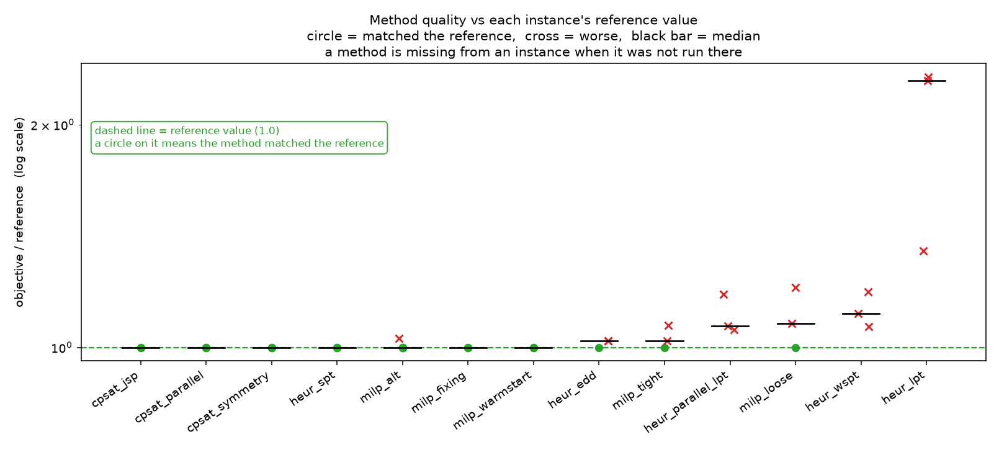
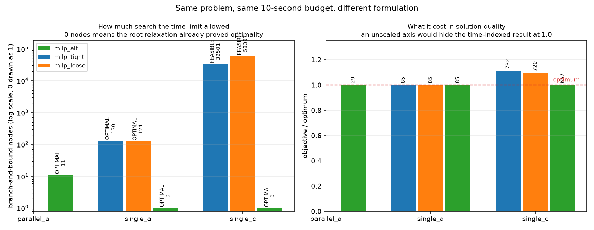

# Week 4 · Day 6：方法选择与实验结论：从单次结果走向证据

> **先读教材正文**：[第 6 章：求解器工程](../教材/06_求解器工程与结果解释.md)。本页用于读后的复习和项目实验，不能代替零基础教材中的完整推导。

[月度索引](../README.md) · [本周知识主线](../week4.md) · [前一天](Day5.md) · [后一天](Day7.md)

> 当日主题：把「跑了一次」变成「有证据的方法选择」——同一批实例、同一预算下的比较，以及结论的适用边界
> 当日产出：**一张选型维度表 + 一份公平比较清单 + 一张选择矩阵**（`m2w4d6_selection_matrix.py`），并用 `artifacts/month2/results.csv` 的 `main` 组逐格核对两张分布图
> 建议投入：3～4 小时

---

## 1. 今日学习目标

完成今天的学习后，你应该能够：

1. 说出选型的**六个维度**，并且对每一个维度指出：它用什么证据支撑、缺了这份证据会出现什么错误结论。
2. 背下**公平比较的九条清单**，并能对一批现成的实验逐条判断它是否成立；说清少任何一条为什么比较就不成立。
3. 把「最好可行解」与「给出证书的方法」分成两件事读：单次运行的输出里它们是两行，不是一行。
4. 用 `main` 组的实测说明「**精确方法之间也不是没有差别**」：同一个后端、同一个 10 秒预算下，`milp_tight` 最差 1.0720、`milp_loose` 最差 1.2060，而 `milp_warmstart`、`milp_fixing`、`milp_alt` 在三个单机实例上都命中参考值并给出 `OPTIMAL`。
5. 用同一批数据说明「**不能笼统说启发式差多少**」：`heur_lpt` 最差 2.3189、`heur_spt` 三条全命中 1.0000、`heur_edd` 有两条偏到 1.02 —— 差异必须**按方法与实例分别看**。
6. 解释两张图各回答什么问题，并说清为什么不能把它们的纵坐标当成同一个量。
7. 把「我观察到」与「在所有情况下」分开写，并知道本月的 artifacts 里**每个格子只有一次运行**，因此它给不出方差。
8. 解释反例为什么比平均值更有信息量：一个「方法 A 在某些实例上不如方法 B」的例子划出了适用边界，而「A 平均更好」不划任何边界。
9. 给业务同事写推荐时带上条件（哪些实例、哪个预算），并把「数学结论」与「该批次观察」分列两栏。

---

## 2. 为什么第六天要专门做「方法选择」

Day 1 到 Day 5 做的都是**单次测量的可信化**：让加进去的约束是合法的（Day 1）、让初解与变量固定的副作用被说清（Day 2）、让失败与数值缩放有诊断路径（Day 3）、让预算与参数的终止行为写进实验定义（Day 4）、让每个字段保留它原来的含义（Day 5）。

这些都是「一次运行本身」的问题。今天要跨出去一步：**当手上有一批运行记录时，怎么从里面读出一句能交付的方法选择结论。**

这一步必须单独存在，原因有三个。

1. **单次运行只是样本量为一的一次观察。** 它足以支持「这个方法在这个实例上做到了什么」，不足以支持「这个方法适合这类问题」。后者需要实例集、预算与重复次数三个限定词一起出现。把前者写成后者，是这一类报告最常见的错误 —— 它不是计算错误，而是**结论强度被偷偷抬高了一档**。
2. **选型本来就是一个多目标问题，而多目标没有唯一解。** 时间预算、结论强度、建模与维护成本、数值稳定性在同一个项目里互相冲突：要证书就要时间，要时间就要牺牲方案质量或建模通用性。既然没有哪个方法在六个维度上同时最好，那么「哪个方法最好」这个问题的正确形式是「**在这组条件下，哪个方法合适**」。
3. **本项目已经积累了一批可比数据，正好用来练这件事。** `artifacts/month2/results.csv` 是同一个驱动脚本、同一套实例生成器、同一个后端在同一个 10 秒预算下跑出来的 43 行记录，13 个方法分布在 8 个实例上。它既不是挑出来的漂亮例子，也不是别人论文里的数字 —— 用它练读表，每一条结论都能回指到具体一格。

一句话：**前五天在把每一条数字做可信，今天在把一批数字做成结论 —— 并且给结论装上合适的限定词。**

---

## 3. 先分清：一场方法比较里有三个不同的问题

「哪个方法更好」这句话在被拆开之前没有答案，因为「更好」可以指三件互不替代的事。这三件事在 Week 2 Day 6 就已经拆过一次（`milp_tight` / `milp_loose` / `milp_alt` 的写法比较），今天把它推广到**跨方法**的比较上。

| 问题 | 回答它需要什么 | 答错的表现 |
|---|---|---|
| **正确性**：两者在解同一道题吗 | 模型语义与目标定义逐项对齐；实例哈希一致；返回排程过独立验证器 | 把「两个数字不同」误读成「模型强弱不同」，实际是目标接错或时间单位不一致 |
| **结论强度**：这次运行给出了哪种结论 | 原始状态字符串、证书范围、带分母的 gap | 把 `FEASIBLE` 与 `OPTIMAL` 的目标值并列成「两个可比的解」 |
| **适配与成本**：在这组条件下值不值 | 预算内的解质量、尾部耗时、建模与改需求的时间 | 用一次运行的耗时给方法排名，忽略建模成本与失败处置 |

这三件事里，前两件是**可以证明的**，第三件是**只能观察的**。第 4 节把它们落到六个具体的选型维度上。

### 3.1 四种结论强度，各自的措辞不一样

在本月的表里，同一列 `objective` 背后的证据强度可能差得很远。读表时要先把每一行归到下面四档之一：

| 档 | 原始状态 | 本轮到底证明了什么 | 可以写的句子 |
|---|---|---|---|
| 1 | `OPTIMAL`（证书范围 = 原问题） | 有可行解，且证明了它是原问题最优 | 「在预算内证明最优」 |
| 2 | `FEASIBLE` + 有效的原问题下界 | 有可行解，界与它之间还有距离 | 「限时结束时的可行目标 U，有效下界 L，gap = …」 |
| 3 | `FEASIBLE` + 无界（典型是启发式） | 只有一个可行方案，没有任何下界 | 「给出了一个目标为 U 的合法排程」 |
| 4 | `INVALID_SOLUTION` / `FAILED` | 求解器给了东西，但独立验证器拒绝，或根本没跑成 | 「本次运行不可用，原因 …」 |

第 2 档里有一个陷阱：**`best_bound` 必须注明它的范围**。项目里的 `milp_fixing` 属于受限子问题，它的 `OPTIMAL` 证明的是「被固定的变量取值下没有更好的方案」，不是原问题的最优性（Week 4 Day 2 第 5 节已经论证过 $z^*(F)\le z^*(F')$）。读它那一行之前，先确认固定的变量集合 —— 证书范围写不清，这一行就不能进「方法排名」。

第 3 档的措辞最容易写错。「启发式给出了 903」与「启发式证明了 903 是最优」是两句话；`heur_*` 的 `best_bound` 一律是空，填零或把 `objective` 抄进 `best_bound` 都是**假证书**（教材 6.9、Week 4 Day 5 第 3 节的字段表）。

---

## 4. 选型的六个维度

选型不是给方法打分求和，而是**先问清这组条件下哪几个维度是硬约束**，再在满足硬约束的候选里比较其余的。下面六行是本月定下来的检查顺序。

| # | 维度 | 要问的问题 | 用什么证据支撑 |
|---|---|---|---|
| 1 | **问题结构** | 有没有复杂逻辑、可选区间、累计资源、换型、日历？ | 模型清单：变量定义能否直接表达这些结构；不能表达就要改写或换后端 |
| 2 | **需要的结论强度** | 只要一个好方案，还是要最优性证明？ | 状态列与证书范围；要求证书时只认 `OPTIMAL`（档 1） |
| 3 | **规模** | 变量数、时间网格有多大？ | 建模产出的规模统计与规模红线（时间索引模型的 `MAX_TIME_INDEXED_VARS`） |
| 4 | **时间预算与可接受 gap** | 分钟级、秒级，还是准实时？gap 容忍到多少？ | 同一预算下的 `status` / `objective` / `best_bound` / `gap`，以及预算扫描组 |
| 5 | **建模与维护成本** | 写一遍模型要多久？业务改一条规则要改几处？ | 建模时间 `build_time`、模型行数与参数个数、同一需求在两套写法里的改动量 |
| 6 | **数值稳定性** | 系数跨度大吗？单位换算会不会踩坑？ | 缩放诊断、单位约定、Big-M 的取值与目标格点（Day 3 第 4 节） |

逐条展开几句：

1. **问题结构决定候选集合，而不只是影响性能。** 本月的实测里有一类「未运行」不是因为慢，而是因为**不支持**：顺序模型（sequence）的 Big-M 论证依赖单机性质，所以在并行机实例上根本没有 `milp_tight` / `milp_loose` 这两行；`cpsat_jsp` 只出现在带工序路线的实例（`routes_6` / `routes_10`）上。缺格不能补零，也不能读成「跑得很快」。
2. **结论强度是最容易被含糊过去的一维。** 决策方如果只需要一个可执行的方案，档 3 就够了，而且可能秒级就拿到；如果要写进合同或对外承诺「这是最优」，那只有档 1 能用，而档 1 意味着预算必须按最难的那几个实例来定，不能用简单实例的耗时去承诺。
3. **规模不是变量数这一个数。** Week 2 Day 6 第 5 节已经看到：变量数只是每节点成本的代理，总成本还要乘上搜索量；`milp_alt` 在 8 作业实例上有 475 个变量却只用 0.18 秒，而 44 个变量的顺序模型要 1.48 秒。今天选型时也一样：**规模维度真正要问的是「这个写法在这个实例族上会不会越界」**，而不是「谁的变量少」。
4. **时间预算与可接受 gap 必须一起给。** 只给预算不给 gap 容忍度，「预算内没证完」与「预算内证完了但方案差」这两种失败就分不开。本批的 `gap` 分母是 $\max(1,|U|)$（项目约定，Week 4 Day 5 第 4 节），用之前先确认分母。
5. **建模与维护成本是仓库里最容易欠账的一维。** 一个每天要改一次交期规则的业务，一套能随手改的规则式模型往往比一个必须重写时间网格的精确模型更有价值。这一维没有现成读数，但它决定了「下次需求变更时这套东西还活着吗」。
6. **数值稳定性不是学术问题。** 单位从分钟换成秒，时间值、交期、时间界要一起换（教材 6.6）；目标系数跨六个数量级会让容差失去意义；把小时换成秒还会让时间索引模型的变量数直接放大约十倍。

**这一节的要点只有一句：没有「最好的方法」，只有「在这组条件下合适的方法」。** 上表六行里的任何一行换了取值，同一批方法的排序都可能反过来。

---

## 5. 公平比较的九条清单（本日最可复用的产出）

把上一节落到可执行的检查表上。这九条是从教材 6.8、6.9 与本月的批次实现里抽出来的；每一条后面都写上「少了它会发生什么」。

1. **同一实例集。** 生成参数固定，并且**逐实例记录输入哈希**（本项目写在 `input_sha256` 列）。少了它，两次运行是不是同一个实例只能靠文件名猜；实例生成本身就变过，比较从第 0 步失效。
2. **同一目标函数。** 目标名、常数项、单位必须一致。$\sum_j C_j$ 与 $\sum_j (C_j-r_j)$ 只差常数、最优排程相同，但**目标值不同**，跨方法比 `objective` 与 `best_bound` 时两端都要换算（Week 3 Day 6 第 4 节）。
3. **同一时间单位与同一时间界。** $H$ 的定义、时间粒度、是否允许小数时刻都要一致；否则「同一个实例」在两边其实是两个模型（Week 4 Day 5 第 4 节）。
4. **同一预算与同一线程设置。** 预算写在结果行里（本项目的 `time_limit` 列：`main` 组全是 10.0，扫描组是 3.0 与 30.0），不只写在脚本里。不同预算下的读数不可比。
5. **固定种子，并如实记录它的效力。** 本项目的 `seed` 列全是 0；但**固定种子只固定了实例生成，没有固定搜索轨迹** —— 本项目用的 CBC 经由 `pywraplp` 不暴露随机种子，模块把它记成 `seed_effective = False`（Week 2 Day 6 第 9 节）。所以「同种子即可复现」在这个后端上是假承诺。
6. **记录原始状态字符串，而不是自己归类的结论。** `status` 列保存后端给的原文（本批 43 行里 `FEASIBLE` 23 行、`OPTIMAL` 20 行）；把 `FEASIBLE` 手动改写成「已解决」就是销毁证据。
7. **保留输入哈希与源码版本。** `metadata.json` 里记 Python 版本、平台、`git_commit`、`source_sha256` 与工作区是否脏。少了它，「这个数是谁跑出来的」无法回答。
8. **报告失败与未获结论。** 结果表必须留出 `validation` 与 `failure_reason` 两列（本批 59 行这两列都是空，即没有被独立验证器拒绝的行），并且**未运行的格子留空并注明原因**，不能补零。
9. **一次只改一个因素。** 同时开 hint、截断、对称破缺与更多线程，即使更快也无法归因（教材 6.4、6.10 的题 4）。这一条直接决定第 4 节的维度能不能被单独回答。

**要点：少任何一条，比较就不成立。** 清单里最容易被跳过的是第 1、5、8 条 —— 哈希、种子效力、失败列。它们不改变任何一个数字，但决定了这些数字能不能被引用。

---

## 6. 手算：把本批的两列数字自己对一遍

在读图之前，先把 `main` 组的几个关键数字亲手算出来，确认它们不是「跑出来的随机数」。

### 6.1 先数格子：43 行是怎么来的

```text
实例：single_8, single_12, single_20, parallel_8, parallel_12,
      parallel_24, routes_6, routes_10                 共 8 个
方法：13 个（6 个精确 MILP / CP-SAT 变体 + 5 个规则启发式 + 2 个 CP-SAT 路由模型）
满格 = 13 × 8 = 104 格
实跑 = 43 行
```

43 行里有 61 格是空的，原因是每个实例只登记了**它能跑的方法**：单机实例登记 9 个方法（`milp_tight`、`milp_loose`、`milp_alt`、`milp_warmstart`、`milp_fixing` 与四个单机规则），并行机实例登记 4 个，带路线的实例登记 2 个。**空白是「未运行」，不是「跑得很快」，也不是 0。**

参考值本身还要再分一档：8 个实例里只有 1 个的参考值来自独立穷举（`single_8` = 85，`optimum`），6 个是某个求解器在预算内自证后取的 `proven_by_solver`，还有 1 个（`routes_10` = 71）是 `best-known` —— **本批见过的最好可行值，不是最优性证书**。第三档上出现的绿色圆圈（下一节图里会看到）只能读成「命中了本批最好已知值」。

### 6.2 手算四个 gap

项目约定的相对 gap 与「离参考值有多远」是两个分母不同的量：

$$g=\frac{U-L}{\max(1,|U|)},\qquad g_{\text{ref}}=\frac{U-\text{参考值}}{\max(1,|\text{参考值}|)} .$$

| 实例 / 方法 | $U$ | $L$ | $g$ 手算 | $g_{\text{ref}}$ 手算 | $U/\text{参考值}$ |
|---|---:|---:|---|---|---:|
| `single_20` / `milp_tight` | 968 | 65.5093 | $(968-65.5093)/968=0.9323$ | $(968-903)/903=7.20\%$ | $968/903=1.0720$ |
| `single_20` / `heur_lpt` | 2094 | 无 | 无（启发式不给界） | $(2094-903)/903=131.9\%$ | $2094/903=2.3189$ |
| `parallel_24` / `cpsat_parallel` | 71 | 24 | $(71-24)/71=0.6620$ | $(71-71)/71=0$ | $71/71=1.0000$ |
| `parallel_24` / `milp_alt` | 73 | 43 | $(73-43)/73=0.4110$ | $(73-71)/71=2.82\%$ | $73/71=1.0282$ |

四行一起读才能看出这张表为什么必须**两列都写**：

1. `single_20` / `milp_tight` 的两列是 0.9323 与 7.20%，差一个数量级 —— 前者量的是「离自证最优还有多远」（界停在 65.5），后者量的是「离参考值有多远」。只写一个百分比，读者无法判断究竟是哪一种不足。
2. `parallel_24` / `cpsat_parallel` 这一行更极端：$g_{\text{ref}}=0$（目标值恰好等于参考值 71），但 $g=0.6620$（界只爬到 24）。**「命中参考值」与「证明最优」是两件事**，这一行就是它们分岔的地方。
3. `heur_lpt` 那一行的 $g$ 栏必须是空的。不是 0，也不是「约等于」；这一列的定义是「已知可行值与有效下界之间的距离」，而启发式没有下界（Week 4 Day 5 第 3 节）。
4. `milp_alt` 那一行的 2.82% 是**比值**意义上的偏差：73 比 71 差 2 个时间单位，在 makespan 这个量级上就是 2.82%。

---

## 7. 精确方法之间也不是没有差别

「精确方法」不是一个同质标签：它们证明的是**自己收到的那个模型**，而证明要花的时间取决于写法与实例。本批在三个单机实例上把五个精确方法放在同一个 10 秒预算下，结果分成两类：

| 实例 | 方法 | 状态 | 目标 | 比值 | 建模 (s) | 求解 (s) |
|---|---|---:|---:|---:|---:|---:|
| `single_8` | `milp_tight` | `OPTIMAL` | 85 | 1.0000 | 0.004 | 1.340 |
| `single_8` | `milp_loose` | `OPTIMAL` | 85 | 1.0000 | 0.002 | 1.217 |
| `single_8` | `milp_warmstart` | `OPTIMAL` | 85 | 1.0000 | 0.005 | 0.006 |
| `single_8` | `milp_fixing` | `OPTIMAL` | 85 | 1.0000 | 0.004 | 0.006 |
| `single_8` | `milp_alt` | `OPTIMAL` | 85 | 1.0000 | 0.029 | 0.119 |
| `single_12` | `milp_tight` | `FEASIBLE` | 543 | 1.0207 | 0.007 | 10.477 |
| `single_12` | `milp_loose` | `FEASIBLE` | 573 | 1.0771 | 0.009 | 10.859 |
| `single_12` | `milp_warmstart` | `OPTIMAL` | 532 | 1.0000 | 0.009 | 0.024 |
| `single_12` | `milp_fixing` | `OPTIMAL` | 532 | 1.0000 | 0.008 | 0.005 |
| `single_12` | `milp_alt` | `OPTIMAL` | 532 | 1.0000 | 0.112 | 0.599 |
| `single_20` | `milp_tight` | `FEASIBLE` | 968 | 1.0720 | 0.013 | 10.035 |
| `single_20` | `milp_loose` | `FEASIBLE` | 1089 | 1.2060 | 0.013 | 10.027 |
| `single_20` | `milp_warmstart` | `OPTIMAL` | 903 | 1.0000 | 0.016 | 0.037 |
| `single_20` | `milp_fixing` | `OPTIMAL` | 903 | 1.0000 | 0.015 | 0.009 |
| `single_20` | `milp_alt` | `OPTIMAL` | 903 | 1.0000 | 0.128 | 0.575 |

四条读法：

1. **`single_8` 上五个方法都命中 85**，而 85 是独立穷举给出的最优值（`optimum` 档）—— 这一行说明它们确实在解同一道题，差别只体现在代价：1.340 秒与 0.006 秒差两个数量级。
2. **`single_12` 与 `single_20` 上分岔了。** `milp_tight` 与 `milp_loose` 都报 `FEASIBLE`，界停在 55.17 / 54.80 与 65.51 / 67.06，**在预算内没有证完**；另三个方法都拿到了 `OPTIMAL`，而且目标值正好落在参考值上。它们是同一个后端（CBC）上的不同写法，预算也完全相同 —— 所以「都是精确方法」这句话不足以保证「都能给出证书」。
3. **`milp_loose` 的 1089 比 `milp_tight` 的 968 更差。** 周知识主线里那句「更紧的 M 不保证界严格改善」说的是松弛强度（Week 2 Day 6 第 4 节：两者根界都是 0），今天这一行补上另一半：**同一对写法在两个实例上给出不同的可行解质量**（`single_8` 上完全同值，`single_20` 上差 121）。这类现象只能逐实例报告。
4. **读 `milp_fixing` 的两行之前要先看证书范围。** 它的 `OPTIMAL` 属于**受限子问题**：固定变量后 $F'\subseteq F$，子问题最优只能给原问题上界（Week 4 Day 2 第 5 节）。它的耗时（0.005 / 0.009 秒）也说明搜索空间被大幅限制过，这与「原问题也被证明了」不是一回事。

并行机一侧也有同一形状的一组对照：`parallel_24` 上 `cpsat_parallel` 报 `FEASIBLE`（71，界 24，$g=0.6620$），而 `cpsat_symmetry` 在 0.485 秒内报 `OPTIMAL`（71，界 71，$g=0$）。同后端、同实例、同预算，**对称破缺把「命中参考值」变成了「证明参考值」** —— 这正是 Day 1 那种模型强化的价值，只不过它的收益不是「快一点」，而是「结论强度上了一档」。

---

## 8. 启发式：不能笼统说「差多少」

同一批数据里，四个单机规则与一个并行机规则的表现分布得很开：

| 方法 | `single_8` | `single_12` | `single_20` | 并行机三个实例 |
|---|---:|---:|---:|---|
| `heur_spt` | 1.0000 | 1.0000 | 1.0000 | — |
| `heur_edd` | 1.0000 | 1.0207 | 1.0210 | — |
| `heur_wspt` | 1.1882 | 1.0677 | 1.1107 | — |
| `heur_lpt` | 2.2941 | 1.3515 | **2.3189** | — |
| `heur_parallel_lpt` | — | — | — | 1.0690 / 1.1795 / 1.0563 |

（表格里的数是 $U/\text{参考值}$；并行机一列按 `parallel_8` / `parallel_12` / `parallel_24` 的顺序写。）

三条读法：

1. **`heur_lpt` 最差到 2.3189，也就是参考值的两倍多**（2094 对 903），而它在 `single_12` 上只有 1.3515。同一个方法在三个单机实例上给出三个不同的偏差 —— 只报它三条的平均值（约 1.99）既藏掉了最好的一次，也藏掉了最差的一次。
2. **`heur_spt` 三条全部命中参考值**，并且耗时是 0.0001 到 0.0004 秒。在 `single_8` 上它的 85 与五个精确方法的目标值一模一样，但它只有可行性、没有界 —— 所以它与精确方法**不是并列关系**，不能写进同一列「最优解」里。
3. **`heur_parallel_lpt` 的 1.1795 出现在 `parallel_12` 上**（46 对 39），而它在 `parallel_24` 上只差 1.0563。这提醒一件事：偏差最小的实例往往也是精确方法最不需要它的实例。

**要点：说「启发式比精确方法差 x%」这句话在语法上就不完整。** 它至少缺三个限定：哪个方法、哪个实例、哪个预算。本批里 `heur_spt` 与 `milp_tight` 在 `single_20` 上的「差多少」是 1.0000 对 1.0720 —— **启发式反而更接近参考值**，而两者的证书强度又反过来。这两句话必须一起写，否则读者会以为其中有一个人在撒谎。

---

## 9. 两张图回答两个不同的问题



- 标题 *Method quality vs each instance's reference value* 说的是横纵坐标的关系：横轴是方法名（按**中位数**排序，越靠左中位数越好），纵轴是 *objective / reference (log scale)*，也就是「该方法在这个实例上的目标值 ÷ 该实例的参考值」。用对数刻度是因为最右一列到了 2.3 倍，线性刻度会把 1.0 附近那一大堆点全挤成一条线。
- 第二行 *circle = matched the reference, cross = worse, black bar = median* 是三种记号的定义：绿色圆圈 = 恰好等于参考值，红色叉号 = 比参考值差，黑色横杠 = 该批里的中位数；绿色虚线画在参考值 1.0 处，图内绿框那句 *a circle on it means the method matched the reference* 就是这条线的读法。
- 第三行 *a method is missing from an instance when it was not run there* 是点数不齐的解释：`milp_alt` 一列有 6 个点、`cpsat_jsp` 只有 2 个，点少表示**该方法没有在那个实例上运行**，不表示失败 —— 与第 6.1 节那 61 个空格是同一件事。
- 本图的读数：最左七列（`cpsat_jsp`、`cpsat_parallel`、`cpsat_symmetry`、`heur_spt`、`milp_alt`、`milp_fixing`、`milp_warmstart`）的中位数都压在 1.0 上；越过 `heur_edd` 与 `milp_tight`（中位数同为 1.0207）之后，红叉逐渐变多、中位数抬高，最右的 `heur_lpt` 中位数约 2.29、最高一叉落在 2.3189。



- 总标题 *Same problem, same 10-second budget, different formulation* 是本图的限定：三根柱子共享同一个实例、同一个 10 秒预算，**只有写法不同**，而且是同一个后端（CBC）内部的比较 —— 它是「换写法值多少」的证据，不是跨方法排名。
- 左面板 *How much search the time limit allowed* 的纵轴是 *branch-and-bound nodes (log scale, 0 drawn as 1)*：0 个节点被画成高度 1，所以那两根标着 `OPTIMAL / 0` 的绿柱的真实含义是「根节点就结案」；副标题 *0 nodes means the root relaxation already proved optimality* 说的就是这一条，它**不等于**「松弛的最优值等于最优解」（Week 2 Day 6 第 4.4 节）。
- 左面板里 `FEASIBLE / 32501` 与 `FEASIBLE / 58397` 两根高柱是「搜了很多但没证完」的形状，与那两根绿柱构成今天最有说服力的一组对照：**同一实例、同一预算，换写法决定的是能不能给出结论**，而不是快几秒。
- 右面板 *What it cost in solution quality* 的纵轴是 *objective / optimum*，红色虚线标在 1.0（图内标 *optimum*）；副标题 *an unscaled axis would hide the time-indexed result at 1.0* 解释了为什么刻度要放大到 1.35：`single_c` 上两根柱子落在 1.11 与 1.10（732/657 与 720/657），第三根贴在 1.0 上，不放大就看不见这段差别。

**两张图不要混用**，因为纵轴的口径不同：上图纵轴是 `objective / reference`，数据来自 `artifacts/month2/results.csv` 的 `main` 组（13 方法 × 8 实例，参考值分 `optimum` / `proven_by_solver` / `best-known` 三档）；下图纵轴是 `objective / optimum`，数据来自 Week 2 那批 `artifacts/month2_w2/results.csv` 的 `limit` 组（3 实例 × 3 写法，分母是同一个实例的参考值）。把两张图的纵坐标当成同一个量来比较，会得出「换写法比换方法重要」这类没有依据的结论 —— 它们测的是不同批次、不同实例集上的不同对象。

---

## 10. 实验：`m2w4d6_selection_matrix.py` 逐段读

脚本链接：[m2w4d6_selection_matrix.py](../../projects/02_optimization_models/examples/m2w4d6_selection_matrix.py)。它把第 3 到第 5 节的纪律落成一个可以照着改的模板，四段各自负责一件事。

**第 1 段：常量与四组实例。** 顶部 `TIME_LIMIT = 5.0` 是**唯一**一个预算常量，四个实例共用它 —— 这是第 5 节清单第 4 条的实现方式。实例表 `CASES` 里每个元素是 `(标签, 实例, 目标名, 方法列表)`，实例由 `generate_instance(seed, jobs=…, machines=…)` 生成：

| 标签 | 生成参数 | 目标 | 方法 |
|---|---|---|---|
| `single_12 (ΣT, 已可解)` | seed 51、12 作业、1 机器 | `total_tardiness` | `heur_spt` / `milp_tight` / `milp_alt` |
| `single_20 (ΣT, 搜不完)` | seed 70、20 作业、1 机器 | `total_tardiness` | 同上 |
| `parallel_12 (Cmax)` | seed 53、12 作业、3 机器 | `makespan` | `heur_parallel_lpt` / `cpsat_parallel` / `cpsat_symmetry` / `milp_alt` |
| `parallel_24 (Cmax, 搜不完)` | seed 72、24 作业、3 机器 | `makespan` | `heur_parallel_lpt` / `cpsat_parallel` / `milp_alt` |

这四个 seed 与批次配置里 `single_12` / `single_20` / `parallel_12` / `parallel_24` 完全一致，所以脚本跑的是**和批次同一批实例**，只是预算从 10 秒降到了 5 秒。

**第 2 段：主循环。** `load_week_modules()` 之后，每个实例逐个方法调用 `get(name)(inst, {"objective": objective, "time_limit": TIME_LIMIT, "seed": 0})` —— 预算与种子写在**调用参数**里，也就是写进结果行的那两个字段。拿到结果立刻过 `validate_result(inst, r)`，打印时分两件事：`gap` 为 `None` 时打印字符串 `None`（而不是 0），`best_bound` 为 `None` 时同理，最后打印「通过 / 拒绝」。这一段就是第 5 节清单第 6、8 条的实现：状态与失败列不许被美化。

**第 3 段：谁的解最好、谁给了证书。** `rank()` 把 `objective` 为 `None` 的行排到最后（返回 `float("inf")`），`winner` 由 `min(results, key=rank)` 选出；`proven` 是 `status == "OPTIMAL"` 的方法名列表。这里源码里留了一条值得抄下来的注释：**不能写 `objective or inf`** —— 目标值为 0.0 时它是假值，会被当成无穷大，于是「最好的解」永远选不上。这两行输出把第 3.1 节的两档证据分开摆：

```text
  → 本实例最好可行解来自 heur_spt（903）
  → 在预算内证明最优的方法：['milp_alt']
```

**第 4 段：脚本自己的「选择矩阵」。** 末尾那段归纳不是先验信条，而是由上面四组实测写出来的：小规模要保证最优 → MILP 或 CP-SAT；单机排序型且目标含迟交 → 序列 MILP 建模最直接但根界弱；并行机只看 `Cmax` → CP-SAT 的区间 + `NoOverlap`；多工序 / JSP 型 → CP-SAT 的 precedence + `NoOverlap`；大规模搜不完 → 先规则给解、再让精确方法在剩余预算里改进；只要一个能用的解 → 启发式，但**没有界**。

**实际输出（本次运行，节选）：**

```text
共同预算：每种方法 5 秒；启发式不使用该预算（秒级完成）。
gap 为 None 表示该方法不提供 bound，不是 0。

=== single_20 (ΣT, 搜不完)   objective=total_tardiness ===
  方法                   状态             目标     bound      gap    耗时(s)    验证
  heur_spt             FEASIBLE      903      None     None    0.000    通过
  milp_tight           FEASIBLE      968      65.5   0.9323    5.069    通过
  milp_alt             OPTIMAL       903     903.0   0.0000    1.233    通过
  → 本实例最好可行解来自 heur_spt（903）
  → 在预算内证明最优的方法：['milp_alt']

=== parallel_24 (Cmax, 搜不完)   objective=makespan ===
  方法                   状态             目标     bound      gap    耗时(s)    验证
  heur_parallel_lpt    FEASIBLE       75      None     None    0.001    通过
  cpsat_parallel       FEASIBLE       71      24.0   0.6620    5.007    通过
  milp_alt             FEASIBLE       79      42.2   0.4654    5.415    通过
  → 本实例最好可行解来自 cpsat_parallel（71）
  → 在预算内证明最优的方法：无
```

**这段输出里值得停下来看的三处：**

1. `single_20` 上「最好可行解」来自启发式，而**唯一**给出最优性证书的是 `milp_alt`。如果报告只留第一行输出，读者会以为启发式赢了；只看第二行，会以为启发式没有价值。两行一起才是答案。
2. `parallel_24` 上三个方法全部 `FEASIBLE`，`→ 在预算内证明最优的方法：无`。这一行是**否定结论**，必须照样打印出来 —— 报告里不能只有成功的行。
3. `gap` 一栏里 `None` 与 `0.0000` 同时出现：`None` 是「没有这个读数」，`0.0000` 是「有界且界等于目标」。把前者写成 0 会凭空造出一批「已证明最优」的启发式。

**一处必须如实说明的差别：** 批次在 `parallel_24` 上给 `milp_alt` 记的是 73（10 秒预算），今天脚本给的是 79（5 秒预算）。预算不同，所以**不能**把 6 这个差距归因于预算，也不能归因于随机性 —— 本项目的 MILP 后端不暴露种子（`seed_effective = False`），两次运行的搜索轨迹本来就不同。正确的写法是：这是同一实例在两组条件下的两次观察，要回答「预算是不是原因」必须做第 5 节清单第 9 条那种单因素实验。

---

## 11. 从单次结果到证据：重复次数、方差，以及哪些实例上不成立

一次运行只能算一个样本。**证据**这个词要求三样东西：重复次数、方差，以及结论在哪些实例上**不**成立。

**本批的重复次数是 1。** `configs/month2.json` 的 `seeds` 是 `[0]`，`main` 组的每个 (实例, 方法) 格因此只有一行 —— 所以这张表里**没有任何一行带方差**，第 7、8 节所有「谁比谁好」的话都只是「该批次、该预算下的一次观察」。这不是表格的缺陷，而是必须写进报告的一条限制。

**批次里唯一带两个预算的组是扫描组。** `tl_3` 与 `tl_30` 把 `milp_tight` 与 `cpsat_parallel` 在 3 秒与 30 秒各跑了一遍：

| 实例 / 方法 | 预算 | 状态 | 目标 | final bound | 迭代数 |
|---|---:|---|---:|---:|---:|
| `single_12` / `milp_tight` | 3 s | `FEASIBLE` | 543 | 55.173 | 223 |
| `single_12` / `milp_tight` | 30 s | `FEASIBLE` | 543 | 55.173 | 356638 |
| `single_20` / `milp_tight` | 3 s | `FEASIBLE` | 968 | 65.509 | 36 |
| `single_20` / `milp_tight` | 30 s | `FEASIBLE` | 968 | 65.509 | 3633 |
| `parallel_24` / `cpsat_parallel` | 3 s | `FEASIBLE` | 71 | 24.0 | 17052 |
| `parallel_24` / `cpsat_parallel` | 30 s | `FEASIBLE` | 71 | 24.0 | 138210 |

三组的形状一样：**预算涨了十倍，可行的目标值与记录的界一个数字都没动，只有迭代数涨了一到两个数量级。** 这不能读成「预算没有用」（更长的预算在这三次里确实没有换成更好的界），更不能读成「预算无关」（要解释这个现象得看求解器日志里界是怎么产生的，比如它是不是来自根节点松弛；本表的 `best_bound` 一列不区分这件事）。它能支持的是 Week 4 Day 4 第 4 节那句纪律：**两次独立重启的运行之间，未经检查不能断言长预算一定给出更好的结果**；报告里要写的是「3 秒与 30 秒两档在本批记录的列上给出相同读数」，而不是「30 秒比 3 秒好」或「预算无所谓」。

**「在哪些实例上不成立」也要主动写。** 第 7 节的结论是「同后端同预算下，写法决定能否证完」，它在 `single_12` 与 `single_20` 上成立、在 `single_8` 上**不成立**（五个方法全都证完了）—— 所以这条结论的适用范围是「预算被绑住的实例」。第 8 节的结论是「启发式要按方法与实例分别看」，它在三个单机实例上成立，但**没有**在并行机实例上被检验（那三个实例只跑了 `heur_parallel_lpt` 一个启发式）。把适用范围写出来，结论才有份量。

---

## 12. 反例的价值：它划出了边界

报告里最有信息量的句子通常不是「A 比 B 好」，而是「**A 在这个实例上不如 B**」。前者是排序，后者是边界。

本批里有几个现成的反例形状：

1. **「精确方法一定比启发式准」的反例**：`single_20` 上 `milp_tight` 的 968 比 `heur_spt` 的 903 差 7.2%（$1.0720$ 对 $1.0000$），而 `milp_loose` 的 1089 差了 20.6%。两个精确方法都没在预算内证完，其中一个的可行解还比不上一个 0.0004 秒的规则。
2. **「启发式一定差一截」的反例**：同一个 `heur_spt` 在三个单机实例上全部命中参考值。所以「启发式差多少」这句话必须补上「哪个方法」。
3. **「更紧的 M 一定更好」的反例**：Week 2 Day 6 第 4 节的根界是两者都等于 0，今天第三节的单机 20 作业实例上 `milp_loose` 的可行解反而更差。两处合起来说明：M 的大小既不改松弛强度（在这个目标上），也不保证搜索更顺。
4. **「参考值就是最优值」的反例**：`routes_10` 的参考值是 `best-known`。`cpsat_jsp` 与 `cpsat_parallel` 在这一格上都命中它（比值 1.0000），但两行的 $g$ 都是 0.4789 —— 界停在 37。**命中一个 best-known 不等于达到最优**，这一格如果被当成「已证明最优」，整张表的最右一列就被污染了。

反例的用法不是推翻结论，而是**给结论加上定语**。上面四个反例把今天的结论改写成了四句可交付的话：「在这批实例、这个 10 秒预算下，精确方法的可行解质量通常不低于规则方法，例外出现在预算被绑住且界很弱时」；「`heur_spt` 在这三个单机实例上与参考值一致，但没有证书」；「M 的取值在这批数据里既没有改变界，也没有稳定改善可行解」；「带 `best-known` 参考值的实例上，比值 1.0000 只能说明它命中了本批最好已知值」。

---

## 13. 给业务同事的结论要带条件

报告里最容易出事的地方是把「数学结论」与「该批次观察」混在一段里。今天把这两类分列两栏，是本月反复出现的纪律（Week 3 Day 6 第 11 节、Week 4 Day 4 第 12 节都提过同一件事）。

| | 数学结论（可推广） | 该批次观察（不可外推） |
|---|---|---|
| 例子 | 顺序模型在单机上的 Big-M 取 $M_{jk}=H-r_k$ 合法；子问题最优不能充当原问题下界 | `milp_tight` 在 `single_20` 上 10 秒内给出 968，`milp_alt` 给出 903 并自证最优 |
| 依据 | 推导（教材 4.4；Week 4 Day 2 第 5 节） | 一次运行，单个 seed，`input_sha256` 可核对 |
| 限定词 | 无（在前提成立时对一般输入成立） | 「这批实例、这个 10 秒预算、这个后端与版本」 |
| 能不能写进推荐 | 可以，但要连前提一起写 | 可以，但要连条件一起写 |

推荐某方法时的句式是**三段**：条件 + 观察 + 证书强度。例如：

> 在这批 12 与 20 作业的单机实例、10 秒预算下，`milp_alt` 给出参考值并用 0 个节点自证最优；`milp_tight` 在同一预算内未获结论，其可行目标为参考值的 1.02 到 1.07 倍。因此在这个实例族与预算上，如果业务需要最优性证书，应优先试时间索引写法；如果只需要一个可用方案，`heur_spt` 在 0.0004 秒内给出的目标与参考值一致，但它不提供任何界。

这段话里没有一句「普遍更好」。它给了方法名、实例族、预算、目标值、证书强度与耗时 —— 读者可以据此判断「换到我手上的实例还成不成立」，也可以据此设计下一步实验（换一批规模更大的实例、把预算提到 30 秒、加一个启发式）。

还有一条工程上的纪律：**推荐里要写清失败时的处置**。在线派工关心的是尾部延迟与失败处理，不是平均值：一个平均 0.4 秒但有 1% 的请求跑满预算的方法，和一个稳定 2 秒的方法，在业务上的价值可能完全反过来。本批记录里没有超时与异常（`failure_reason` 与 `validation` 两列全空），但这只能说明这批实例上没有触发，不能说明「不会触发」。

---

## 14. 三次收口：换写法、换后端、换方法类

本周把三次比较收在同一套维度上，前两次分别在 Week 2 Day 6 与 Week 3 Day 6 完成，今天做第三次。

| 收口 | 比较对象 | 只改了哪一个因素 | 共同要回答的四个维度 |
|---|---|---|---|
| Week 2 Day 6 | `milp_tight` / `milp_loose` / `milp_alt` | **写法**（Big-M 的取法与变量定义） | 正确性（是否同一解集）、界（root LP 强度）、速度（同预算下能否给结论）、成本（规模与建模时间） |
| Week 3 Day 6 | MILP 与 CP-SAT | **后端**（表达体系不同） | 同上 |
| 今天 | 精确方法（MILP / CP-SAT 变体）与规则启发式 | **方法类**（有证书 vs 只有方案） | 同上 |

三次比较的结论形状是一样的：**没有一个维度能单独决定选择。** 换写法改的是「能不能在预算内给出结论」（Week 2 Day 6 的 `single_c`，今天第 9 节那张图）；换后端改的是「哪一类结构能被自然表达」（有可选区间、累计资源、换型、日历时 CP-SAT 的区间与逻辑对象更直接）；换方法类改的是「要不要证书」这一根本问题 —— 启发式在秒级给出可用方案，但它**永远不给界**，因此不能与精确方法的 gap 并列。

把三次收口写成一张检查表的顺序是：

1. **先问正确性**：两种东西解的是不是同一道题？目标、单位、时间界、实例哈希是否一致。
2. **再问界**：谁能给出有效下界？范围是原问题还是受限子问题？
3. **再问速度**：在同一个预算下，是「快一点」还是「能不能给出结论」？
4. **最后问成本**：建模与改需求要多久？失败时怎么处置？数值上稳不稳？

前两步是能证明的，后两步只能观察。把它们混在一句话里，得到的正是今天要戒掉的那种句子：「跑了一次，A 比 B 快，所以 A 更好。」

---

## 15. 今日练习

1. **练习 1（读表）**：只看 `single_20` / `milp_tight` 那一行（`FEASIBLE` / 968 / 65.5093 / $g=0.9323$ / 10.035 秒），写出三个**不能**从这一行得出的结论，并说明每个结论需要补哪一行数据。
2. **练习 2（手算）**：用第 6.2 节的公式，把 `single_8` / `milp_tight`（85 / 85 / $g=0$）与 `parallel_12` / `heur_parallel_lpt`（46 对 39）两个格子的两个 gap 各自算一遍，并说明第二个格子的 $g$ 为什么只能留空。
3. **练习 3（清单）**：把第 5 节的九条清单逐条对照 `artifacts/month2/results.csv`，指出哪些列承担哪一条；然后列出这张表**做不到**的两条（提示：重复次数与线程设置）。
4. **练习 4（反例）**：用第 12 节的四个反例之一，写一段 150 字以内的推荐，要求包含方法名、实例、预算、观察与证书强度，并且不出现「普遍」「一定」「最优」这三个词。
5. **练习 5（工程）**：给 `m2w4d6_selection_matrix.py` 的输出加一列「证书范围」，取值是 `原问题` / `受限子问题` / `无`：`OPTIMAL` 且方法名不含 `fixing` 记 `原问题`，`milp_fixing` 记 `受限子问题`，其余记 `无`。然后在 `single_20` 那一组上核对：这一列是否与第 3.1 节的四档划分一致。

---

## 16. 验收清单

- [ ] 能说出选型的六个维度，并各举一条本批的证据来源。
- [ ] 能背出公平比较的九条清单，并说清第 1、5、8 条为什么最容易被跳过。
- [ ] 知道本批 `main` 组是 43 行 / 13 方法 × 8 实例 = 104 格，空格是「未运行」而不是 0。
- [ ] 知道参考值分三档：`single_8` 是 `optimum`（独立穷举 85），6 个是 `proven_by_solver`，`routes_10` 是 `best-known`（71）。
- [ ] 能写出 $g=(U-L)/\max(1,|U|)$ 与 $g_{\text{ref}}=(U-\text{ref})/\max(1,|\text{ref}|)$，并解释 `single_20` / `milp_tight` 为什么是 0.9323 与 7.20%。
- [ ] 知道 `parallel_24` / `cpsat_parallel` 是「命中参考值但没有证书」：$g_{\text{ref}}=0$ 而 $g=0.6620$。
- [ ] 知道 `single_8` 上五个精确方法都是 85，而 `single_12` / `single_20` 上只有 `milp_warmstart` / `milp_fixing` / `milp_alt` 拿到 `OPTIMAL`。
- [ ] 能说出 `milp_fixing` 的 `OPTIMAL` 属于受限子问题，读它之前要先确认固定的变量集合。
- [ ] 记得 `heur_spt` 三条全 1.0000、`heur_lpt` 最差 2.3189、`heur_edd` 两条 1.02，并知道「启发式差多少」必须带方法与实例。
- [ ] 能分别说出 `method_quality.png` 与 `formulation_effort.png` 的纵轴口径、数据来源与各自回答的问题。
- [ ] 知道本批每个格子只有一次运行（`seeds: [0]`），因此给不出方差；知道 `tl_3` / `tl_30` 两档预算下目标是同一个数。
- [ ] 能写出「条件 + 观察 + 证书强度」三段式推荐，并说出数学结论与该批次观察的分栏要求。
- [ ] `python projects/02_optimization_models/examples/m2w4d6_selection_matrix.py` 能跑通（退出码 0），四段输出与第 10 节一致。

---

## 17. 自测题

- Q1：选型的六个维度里，哪两个是「能证明的」，哪些是「只能观察的」？这个区分为什么重要？
- Q2：公平比较清单里的「同一实例集」靠什么字段落实？少了它会出什么问题？
- Q3：`single_8` 上五个精确方法都得到 85，这说明哪一个维度已经有了结论？
- Q4：`milp_tight` 与 `milp_alt` 在 `single_20` 上分别是 968 与 903，能不能说「`milp_alt` 更精确」？
- Q5：`parallel_24` 上 `cpsat_parallel` 的比值是 1.0000，能不能说它「达到了最优」？要说什么才准确？
- Q6：`heur_lpt` 与 `heur_spt` 都叫启发式，为什么不能放在一起报「启发式的平均偏差」？
- Q7：两张图的纵轴分别是什么？为什么不能拿两张图的柱高互相比较？
- Q8：本批的重复次数是多少？由此对「哪个方法更好」这类句子有什么限制？
- Q9：`tl_3` 与 `tl_30` 给出同一个目标与同一个界，能得出「预算没有用」吗？该怎么写？
- Q10：`routes_10` 那一格的绿色圆圈代表什么？为什么同一行的 $g=0.4789$ 不矛盾？

### 参考答案

- A1：正确性与结论强度是可以证明的（模型语义对齐、证书范围与有效下界）；适配与成本只能观察（耗时、建模与维护成本、数值稳定性受环境与实例影响）。区分它们很重要，因为两类证据的写法不同：前者可以带前提写成一般句，后者必须带实例、预算、后端与版本一起写。
- A2：靠逐实例的 `input_sha256`（以及生成参数）。两次运行若哈希不一致，就是两个实例，比较从第 0 步失效；只靠文件名「single_12」不足以担保同题，因为实例生成本身就可能被改过。
- A3：正确性有了一格证据（五个方法解同一道题，且与独立穷举一致）。界要看另一组读数（例如根松弛或 `best_bound` 列），速度要看预算被绑住的实例（`single_12` / `single_20`），这一行都没有回答。
- A4：不能。它们给出的都是可行解，区别在于**证书强度**：`milp_alt` 在预算内自证最优，`milp_tight` 没有。更精确的写法是「在同一预算下，`milp_alt` 给出了带证书的 903，`milp_tight` 未获结论而可行目标是 968」。
- A5：不能。参考值 71 在这台实例上是 `proven_by_solver` 档，但 `cpsat_parallel` 自己的界停在 24（$g=0.6620$），它证明了 71 可行、没有证明 71 最优。准确写法：「命中了参考值，但在本次预算内未证明最优」；同一实例上 `cpsat_symmetry` 用 0.485 秒证出了 71，才是带证书的那一行。
- A6：因为两者的行为差异极大且随实例变化：`heur_spt` 在三个单机实例上都等于参考值，`heur_lpt` 最差到 2.3189。取平均会同时抹掉「有一个规则方法几乎免费地命中了参考值」与「另一个规则方法差了两倍多」这两条最有用的信息。
- A7：`method_quality.png` 的纵轴是 `objective / reference`（数据来自 `main` 组，13 方法 × 8 实例）；`formulation_effort.png` 的纵轴是 `objective / optimum`（数据来自 Week 2 的 `limit` 组，3 实例 × 3 写法）。分母的来源与批次都不同，所以两张图的柱高不能互相比较。
- A8：重复次数是 1（`seeds: [0]`，每个 (实例, 方法) 只有一行），因此本批没有方差。所有比较句都只能是「该批次、该预算下的一次观察」，不能写成「方法 A 更好」这类没有限定词的句子；要给出方差必须做同预算的重复运行。
- A9：不能。这两档是两次独立运行，读者看到的只是「在记录到的这几列上读数相同」，而界为什么没随预算改善需要看求解日志，不能凭两行数据断言机制。正确写法是陈述读数并说明这是本批的条件限定（Week 4 Day 4 第 4 节的纪律）。
- A10：它表示 `cpsat_jsp`（以及 `cpsat_parallel`）在 `routes_10` 上的目标值恰好等于该实例的参考值 71 —— 而这一格的参考值档次是 `best-known`，只是本批见过的最好可行值，不是最优性证书。同一行的 $g=0.4789$ 说明连它自己的有效界都离 71 有 48% 的距离，两件事各自成立，所以不矛盾。

---

## 18. 今日一句话总结

> **方法选择的答案从来不写在方法的名字里，而写在条件里：哪一批实例、哪个预算、要不要证书 —— 把这三样与数字一起交付，「我观察到」才变成「有证据」。**

---

## 配套代码入口

从仓库根目录运行（需先按[项目指南](../../projects/02_optimization_models/PROJECT_GUIDE.md)配置环境）：

```powershell
python projects/02_optimization_models/examples/m2w4d6_selection_matrix.py
```

[阅读示例源码](../../projects/02_optimization_models/examples/m2w4d6_selection_matrix.py)。先完成正文手算，再用脚本核对项目实例；记录实例、状态、约束检查与目标，不把一次运行耗时作为固定结论。实现与数学语义的区别见[概念勘误](../CONCEPT_CORRECTIONS.md)。
