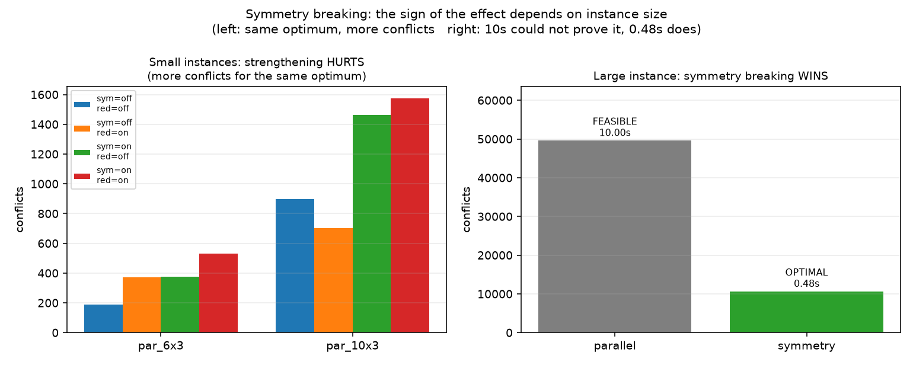
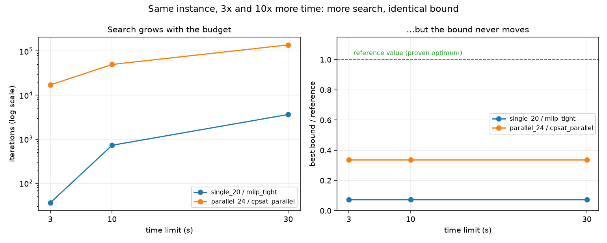

# Week 4 · Day 7：月末复盘：从数学模型到可信的调度结论

> **先读教材正文**：[第 7 章：综合实训](../教材/07_综合实训与解答.md)。本页用于读后的复习和项目实验，不能代替零基础教材中的完整推导。

[月度索引](../README.md) · [本周知识主线](../week4.md) · [前一天](Day6.md) · [月度报告](../MONTH2_REPORT.md)

> 当日主题：把整月的内容**重组**成一条能自己走一遍的链，并如实列出没做的部分
> 当日产出：一张**验收对应表** + 五条**实验结论** + 一份**未做清单** + 月末综合作业
> 建议投入：3～4 小时

---

## 1. 今日学习目标

完成今天的学习后，你应该能够：

1. 说出「复盘」与「摘要」的区别：复盘是**重组**——把同一件事在不同日子里的侧面拼成一条链，并指出每一环对应哪一类错误。
2. 说出全月七个环节（模型 → 解 → 结构 → 界 → 局部性 → 核验 → 复盘）各自的产物，以及**每个环节答错时表现成什么错误**。
3. 独立完成月末综合作业：一个有释放时间与交期的小型单机实例，写出顺序 MILP、时间索引 MILP 与 CP-SAT 三种表达，用枚举获得参考最优值并验证各方法排程。
4. 说出本月五条核心结论，并**逐条指出它是"数学结论"还是"该批次观察"**。
5. 说出代码地图里每个模块负责哪一周，以及 `Instance` / `Schedule` / `validate_schedule` / 统一结果接口为什么**一行都不用改**就被后两周复用了。
6. 用验收对应表把六项验收要求逐条落到具体的文件、脚本与数字上。
7. 主动说出**本月没有做的五件事**，并解释为什么「不假装做过」是一条纪律而不是一句客套。
8. 对一句现成的结论（例如「更紧的 M 更好」）判断它属于定理、观察还是过度推广。

---

## 2. 复盘不是摘要，是重组

「复盘」最容易被写成摘要 —— 把每天的第一节抄一遍，按时间顺序排好。**那样做只能帮你回忆，不能帮你使用。**

真正有用的复盘做的是另一件事：**把同一件事在不同日子里的侧面拼起来，看它们合成了一条什么样的链。** 这一个月里有三条这样的链：

| 链 | 起点 | 经过 | 终点 |
|---|---|---|---|
| **「界」这条链** | Week 2：Big-M 的紧与松**不改变**根 LP 界 | Week 2 Day 6：换**结构**（时间索引）才带来数量级更强的界 | Week 3 Day 6：界强不强还取决于**实例族与预算** |
| **「强化」这条链** | Week 4 Day 1：对称破缺与冗余约束**不改变最优值** | Week 1 的同一判据：有效不等式不切最优解 | Week 4 Day 2：**固定变量会改变最优值**，它不是强化 |
| **「证据」这条链** | Week 1 Day 4：双方可行加目标相等才构成最优性证书 | Week 3 Day 5：状态是背景不是答案 | Week 4 Day 5：没有界就写 `None`，绝不写 0 |

**三条链的写法都是"同一句话在三个地方出现，含义逐次收窄"。** 摘要记不出这种收窄 —— 它只会在三处各抄一遍，看起来像重复。

复盘还要多做一件摘要不会做的事：**明确说出哪些东西没有做。** 第 9 节专门列了这一份清单。

---

## 3. 全月的逻辑闭环：七个环节各对应一类错误

模型规定可行决策；目标比较方案；LP 对偶解释界；整数建模表达选择；松弛和搜索逐步缩小界差；区间与容量表达调度结构；独立验证和工程记录使结果可复核。

**每个环节都对应一种不同的错误。** 这条对应关系是这个月最值得带走的东西：

| 环节 | 它负责回答 | 答错时会表现成什么 |
|---|---|---|
| **模型** | 能决定什么、哪些决定被允许、怎样比较两个决定 | 题意写错、量纲写错 —— **求解器不会报错，它会给你一个"最优的错误答案"** |
| **解** | 不枚举全部方案，怎么走到最优 | 把启发式解当成最优解；把 `FEASIBLE` 当成 `OPTIMAL` |
| **结构** | 为什么有些 LP 总能自然得到整数解 | 误以为"用了 LP 就等于有整数性"；把额外约束造成的非整数解当成求解器出错 |
| **界** | 不用枚举，怎么**证明**没有更好的方案 | 把子问题的界当原问题的界；把空值填成 0 |
| **局部性** | 参数变了，结论还成立吗 | 把影子价格外推出允许区间；把区间内结论当成全局结论 |
| **核验** | 求解器说的话，怎么独立检查 | 听信状态字符串；跳过独立验证器 |
| **复盘** | 这六件事怎么连成一条可复述的链 | 用一次快慢推广一般结论；只报成功的行 |

**学习笔记应该帮助定位这些错误，而不是只积累 API 名称。** 上面七行里没有一行是"某个函数的参数是什么"—— 那些查文档就有，而**错误的形状**只能靠这样一张对应表记住。

---

## 4. 月末综合作业

选择一个有释放时间和交期的小型单机实例。任务分五步：

**第 1 步：三种表达。** 写出**顺序 MILP**、**时间索引 MILP** 与 **CP-SAT 区间模型**，并明确共同的时间范围 $H$。三者必须使用相同的时间粒度与相同的业务语义 —— 否则它们不是同一个问题的三种写法。

**第 2 步：参考最优值。** 用**枚举**获得参考最优值（小实例的排列数可以接受），再用它验证三种表达的排程。这一步的作用是**给后面的所有比较一个不依赖任何求解器的基准**。

**第 3 步：扩大实例。** 使用相同预算比较可行目标与界。要记录的是四组读数：状态、目标 $U$、有效界 $L$、两笔耗时。

**第 4 步：分别测试三种工程手段。** M 收紧、hint、安全目标截断 —— **一次只开一个**（Week 4 Day 4 第 6 节的纪律）。

**第 5 步：把变量固定单列为局部优化实验。** 若加入变量固定，必须标注**它的证书只适用于受限子问题**。这一步不能与前一步混在一起：前一步的手段都不改变最优值，这一步会。

**最后一步：加入冲突的硬截止期。** 解释不可行原因（单机负载下界就够），再改回迟交惩罚，观察问题为什么变成可行。

> **这一步检验你是否真的区分"业务偏好"和"硬规则"。**

硬截止是硬约束（晚交不可接受），迟交惩罚是软目标（晚交有代价）。前者可能无解，后者永远有解（只是代价大）。**把软目标写成硬约束，是建模里最常见的一类语义错误** —— 它不会让求解器报错，只会让模型变成 `INFEASIBLE`，然后你去怀疑数据。

---

## 5. 应交付的四件东西

月末综合作业要交出四样东西，缺一样都不算完成：

1. **模型说明**：假设、集合、参数、变量、目标、约束、**时间界的论证**。
   —— 时间界 $H$ 为什么合法（它保留了最优解）必须单独论证，不能"取个大数"。
2. **正确性证据**：手算例子、独立验证、模型之间的数学对应关系和反例检查。
   —— "模型之间的对应关系"指的是双向映射：任一可行排程能构造出一组可行变量，反之亦然。
3. **实验记录**：输入、版本、预算、原始状态、目标、界、**证书范围**及耗时。
   —— 证书范围是第 3 件里最容易被漏掉、也最容易造成误读的一栏。
4. **结论与局限**：哪些是定理、哪些是此次观察、哪些实现问题尚未处理。
   —— 第 4 件是唯一一件**不能靠跑脚本产出**的，也是最容易被写成套话的。

**历史批次保存在项目 `artifacts`，月报告仅作为历史证据入口。** 阅读时**先看定义和范围，再看数值**，避免倒过来从某次输出"总结定理" —— 那是把观察当成定理的典型路径。

---

## 6. 代码地图与验收对应表（实测）

### 6.1 代码地图

`m2w4d7_review.py` 逐个检查模块文件是否存在，并统计行数：

```text
  [OK ]  106 行  opt_common/bridge.py                      复用 M1 的领域模型与验证器
  [OK ]  128 行  opt_solvers/result.py                     统一 SolveResult：无 bound 写 None
  [OK ]   91 行  opt_solvers/registry.py                   方法注册表
  [OK ]   88 行  opt_solvers/heuristics.py                 M1 规则接入统一接口
  [OK ]  913 行  opt_models/lp_models.py                   W1 生产计划/运输/指派 LP + 对偶
  [OK ]  804 行  opt_models/milp_scheduling.py             W2 单机 MILP：tight/loose/替代
  [OK ]  578 行  opt_models/cpsat_models.py                W3 区间模型：并行机/JSP/Cumulative
  [OK ]  960 行  opt_models/strengthening.py               W4 对称破缺/warm start/fixing
  [OK ]  503 行  opt_models/diagnostics.py                 W4 数值缩放与不可行诊断
  [OK ]  514 行  opt_experiments/benchmark.py              跨方法批次与参考值分档
```

**这张表本身就是一条结论**：四周的模型分别落在四个模块里，而 `bridge.py`（106 行）与 `result.py`（128 行）**从第一周起就没再改过**。前者是 M1 留下的领域模型与验证器，后者是统一结果接口。

**注册表里现在有 14 个方法**（6 个精确 MILP / CP-SAT 变体、5 个规则启发式、1 个对称破缺变体、2 个工程包装方法）。它们全部通过同一张表被调用 —— 月末批次与每日脚本用的是同一套入口。

### 6.2 验收对应表

六项验收要求逐条落到具体的文件、脚本与数字上：

| 验收要求 | 证据 | 说明 |
|---|---|---|
| 生产计划 / 运输 / 指派 LP，能解释对偶、互补松弛与影子价格 | `opt_models/lp_models.py` + `artifacts/month2_w1/` | 由 Week 1 驱动脚本生成 |
| loose/tight Big-M 与替代 formulation 对比 | `configs/month2.json` 的 `single_*` 方法表 | 由月末批次生成 |
| 至少两项工程手段实验，无改进也如实分析 | `artifacts/month2_w4/`（对称破缺消融 + warm start 消融） | 29 行记录，0 失败 |
| 返回解通过独立验证 | `opt_solvers/result.py` 的 `validate_result` | 批次 `results.csv` 的 `validation` 列 |
| 能解释目标、bound、gap、时间限制与不可行冲突 | `examples/m2w4d4_time_limits.py` + `m2w4d3_diagnostics.py` | 实测输出 |
| MILP / CP-SAT / 启发式同实例同预算比较，分记 build/solve time | `opt_experiments/benchmark.py` | `artifacts/month2/` |

**这张表的关键在第三行**：它写的是"**无改进也如实分析**"。第三项验收要求实验**必须做得出来**，而不是必须有效果 —— 一个只接受"有效果"的实验会诱导人去挑好看的那次运行。

### 6.3 月末批次的规模

`artifacts/month2/results.csv` 一共 **59 行**：

| 组 | 行数 | 内容 |
|---|---:|---|
| `main` | 43 | 13 方法 × 8 实例的满格 104 格中被登记的部分 |
| `tl_3` | 8 | 预算敏感性，3 秒 |
| `tl_30` | 8 | 预算敏感性，30 秒 |

`main` 组的 43 行里，`FEASIBLE` 23 行、`OPTIMAL` 20 行。**43 行不是 104 格** —— 空格是"该方法未在这个实例上运行"，不是 0，也不是"跑得很快"。

### 6.4 三个校验过的事实

这份批次在**提交后的干净工作区**上跑出来，`metadata.json` 记录了：

| 字段 | 值 | 意义 |
|---|---|---|
| `git_commit` | `7133500` | 是一个**真实提交**，不是"未提交工作区" |
| `working_tree_dirty` | `false` | 跑批时工作区干净 |
| `source_sha256` | `2d557ab9…` | 与当前源码重算值一致 |

**三者一起才能说"这批数字对应这份源码"。** 少任何一项，"这个数是谁跑出来的"就答不上来。这也是本月在证据链上做对的一件事 —— 同一仓库里更早的批次就曾因为这三项对不上而无法复现。

### 6.5 参考值分三档，每一档的证据强度不同

月末批次最容易被整列误读的是**参考值**。它的 8 个实例分属三种来源：

| 档 | 实例 | 参考值 | 这个数证明了什么 |
|---|---|---:|---|
| `optimum` | `single_8` | 85 | **独立枚举**给出的最优值 —— 不依赖任何求解器 |
| `proven_by_solver` | `single_12` / `single_20` / `parallel_8` / `parallel_12` / `parallel_24` / `routes_6` | 532 / 903 / 29 / 39 / 71 / 56 | 某个求解器在预算内**自证**的最优值 |
| `best-known` | `routes_10` | 71 | **本批见过的最好可行值** —— 不是最优性证书 |

**三档混在同一列里，这一列的强度就不统一了。** 具体后果有三条：

1. **"命中参考值"在不同行含义不同。** 在 `single_8` 上命中 85 是命中一个独立枚举的最优值；在 `routes_10` 上命中 71 只是命中本批最好已知值 —— **它完全可能是次优的，只是这一批里没人找到更好的。**
2. **图上的绿色圆圈也跟着分档。** 第 8 节那张 `method_quality.png` 用圆圈表示"恰好等于参考值"。**同一个圆圈在 `routes_10` 那一列与 `single_8` 那一列不是同一种证据。** 图的图例只区分"命中 / 未命中"，不区分参考值本身的强度 —— 这是读图时必须带上的背景。
3. **月结论的措辞要跟着降档。** 凡是涉及 `routes_10` 的句子，都只能写到"命中本批最好已知值"为止；写成"达到最优"就越档了。

**还要看交叉印证。** `single_8` 的 85 有五个精确方法各自给出同一个值，其中包含两条不同的技术路线（MILP 与 CP-SAT）—— 这是本批**最强**的一格证据，比任何一个求解器单独自证的格都强。反过来，`single_12` 的 532 只有 `milp_alt` 一家给出（Week 3 Day 6 第 8.1 节）。**同一列 `proven_by_solver` 内部也有强弱之分，只是表格记不下这一层** —— 它需要人读的时候去核。

---

## 7. 本月的五条核心结论

脚本第 4 段把全月结论压成五条，并声明"都是实验观察，不是普遍规律"。这个声明很重要 —— 下面每一条后面都标注了它的性质。

### ① 没有 bound 就写 `None`

启发式在**接口层**被禁止冒充"已证明最优"。这是第 5 节那条"证据"链的终点：把"未知"写成 0，是本项目里唯一一种能让表格外观完全不变、却把结论抬高一档的错误。

**性质：工程约定（可以推广）。** 它不是实验结论，而是一条接口纪律。

### ② Big-M 的紧与松**不改变根 LP 界**；`formulation` 的**结构**才带来数量级更强的界

单机 $\sum_jT_j$ 的序列模型里，tight 与 loose 两种取法的根 LP 界**都是 0**；换成时间索引结构之后，根界达到参考值的 98.75%–99.97%。

**性质：数学结论 + 该批次观察。** "紧与松不改变根界"在这个目标上是可推导的（两者的松弛都放掉了互斥），"时间索引强多少"则依赖实例与目标。

### ③ 强化手段**不改变最优值**——改变即建模错误

对称破缺与冗余约束在小实例上甚至带来**负收益**：它们的额外约束让冲突数上升（`par_6x3` 上从 190 涨到 529）。而在更大的实例上，同一个手段把 30 秒未解的实例变成 0.46 秒的已证明最优。

**性质：前半句是数学结论，后半句是该批次观察。** "不改变最优值"是强化的**定义**；"收益的符号随规模反转"是这两批数据上的现象。

### ④ 前缀固定是**限制解空间**，不是强化

实测它在初解处封顶（283），而同一实例的完整模型能到 271。

**性质：数学结论 + 该批次观察。** $z^*(F)\le z^*(F')$ 是定理；283 与 271 这两个数是本批的记录。

### ⑤ 时间预算决定终止原因

同一实例 1 秒给 1519、3 秒起稳定在 968，且**始终没有证明最优**。"解出 X"必须连预算一起说。

**性质：该批次观察。** "预算决定终止原因"是软件层面的事实；具体到哪一档给出哪个数，只属于这一批实例与这个后端。

**五条的写法有一个共同点：都把自己的适用条件写在结论里面。** 这正是本月反复练的那件事 —— 把"我观察到"与"在所有情况下"分开写。

### 7.1 每条结论都要能落到一个具体文件上

「都是实验观察」这句话要落到实处，就得能回答"哪一批、哪一列"。逐条给出出处：

| 结论 | 证据文件与分组 | 可以核对的具体数字 |
|---|---|---|
| ① 没有 bound 就写 `None` | `opt_solvers/result.py` 的 `gap` 属性 + 批次 `results.csv` 的 `validation` 列 | 启发式行的 `best_bound` 与 `gap` 都是空单元格 |
| ② 紧与松不改变根 LP 界 | `artifacts/month2_w2/results.csv` 的 `root_lp` 组 | `single_a` 上 `milp_tight` 与 `milp_loose` 的界**都是 0.0**，而 `milp_alt` 是 83.93 |
| ③ 强化不改变最优值 | `artifacts/month2_w4/results.csv` 的 `strengthening_ablation` 组 | `par_6x3` 的四个变体目标**全是 27**；`par_10x3` 全是 29 |
| ④ 前缀固定限制解空间 | `artifacts/month2_w4/results.csv` 的 `warmstart_ablation` 组 | `sgl_10x1_seed_suboptimal` 上 271 / 271 / 271 / **283** / **283** |
| ⑤ 预算决定终止原因 | `artifacts/month2/results.csv` 的 `tl_3` 与 `tl_30` 组 | 八对里状态、目标、界**全部相同**，只有迭代数变化 |

**这张表比结论本身更重要**，因为它把每条结论从"笔记里的断言"变成了"可以去核对的记录"。核对方式是打开对应文件、找到那一行、看那一格 —— **不需要重跑任何东西**。

**为什么这条纪律值得单列一节？** 因为本月见过反面的例子：同一仓库里更早的一份中间报告写过一组节点数，而那些数在已提交的 `artifacts` 里**一个都找不到** —— 来源是某个未提交的中间运行。后果不是"数字错了"，而是**那一整张表失去了被引用的资格**：读者无法判断它对应哪个版本、哪次运行、甚至有没有跑过。

> **一个数能不能写进报告，不取决于它看起来合不合理，而取决于它能不能落到一个具体的文件与行上。**

**这条纪律有一个例外，而且要写明**：**自己当场跑出来的实测值**是合法的证据，但必须**说清是当场跑的**（例如 Week 3 Day 6 第 8.4 节的三个根 LP 界，写法是给出复算用的那一行调用）。**"来源不明"与"来源是自己跑的"是两件事** —— 前者不可引用，后者可引用但要标明条件。

---

## 8. 四张图回顾这个月

这四张图分别对应上面的四条结论，放在一起就是本月的图像版。



- **对应结论 ③。** 对称破缺在 6–10 作业的小实例上是负收益，在 24 作业上把 30 秒未解的实例变成 0.46 秒的已证明最优。**横轴两侧是同一手段、同一实例族的两个规模档**，所以这张图说的不是"对称破缺有没有用"，而是"**它在哪个规模上开始有用**"。



- **对应结论 ⑤。** 预算从 3 秒到 30 秒，节点数涨了一到两个数量级，**目标值与界一个数字都没动**。这张图是"限时是停止规则，不是质量保证"最直接的证据。


- **对应结论 ④。** 前三种用法（hint / 截断 / 两者）都停在 271，后两种（固定前缀 / 固定全部）都停在 283。**红蓝分色编码的不是好坏，而是"问题还是不是原来那个"。**


- **对应结论 ①。** 最左七列的中位数都压在 1.0 上，但它们**证书强度并不相同**：`heur_spt` 那一列全是圆圈却没有任何界，`milp_alt` 那一列有圆圈也有证书。**这张图能画出"离参考值有多远"，画不出"有没有证明"。** 后者只能回到表里看 `gap` 那一列 —— 这就是为什么图和表必须一起读。

**四张图有一个共同的读法**：它们的纵轴都不是"性能"，而是**某个比值**（相对参考值、相对预算、相对初解）。**把比值当成性能读数，是这个月最容易犯的一类读图错误。**

---

## 9. 本月没有做的（不假装做过）

这一节是复盘里最容易被写成套话、也最不该被省略的部分。逐条列出：

| 没做的事 | 为什么没做 / 影响 |
|---|---|
| **没有做 workers / seed 的完整敏感性** | 只做了单点对照（1 与 4 两个取值、一个实例）。要回答"多线程值多少"需要多实例多重复，本批数据回答不了 |
| **没有在独立测试集上验证任何调参结论** | 所有结论都来自同一批实例族。换一批实例，"对称破缺从哪个规模开始有用"的位置可能移动 |
| **Cumulative 未进入月末批次** | 共享实例格式里没有资源容量字段；它由 Week 3 自己的容量实验覆盖。**这不是失败，是覆盖范围的问题** —— 但必须写出来，否则读者会以为月末批次覆盖了 Cumulative |
| **没有跑 lint / 类型检查** | 验证环境里没有 ruff / black / mypy。代码正确性是靠测试与断言保证的，不是靠静态检查 |
| **没有做工业约束（换型、日历、工人）** | 这些都会改变可行域，属于本月范围之外 |

**「不假装做过」是一条纪律，不是一句客套。** 它的实际作用是：**让下一位读者知道哪些结论可以直接引用、哪些必须先补实验。** 一份没有"未做清单"的报告，读者只能默认所有东西都做了 —— 那是把风险转移给了读者。

---

## 10. 闭卷检查

下面五组问题是本月的自查入口，都能只靠推导或本笔记回答。

### 10.1 界的方向

**问：** 为什么最大化 LP 的对偶给上界，而最小化 MILP 的 LP 松弛给下界？

**答：** 前者由加权约束的不等式链推出（$c^Tx\le y^TAx\le y^Tb$）；后者由**可行域扩大**推出 —— 松弛问题的可行集包含原问题的可行集，所以它的最小值不可能更大。

### 10.2 Big-M 的两侧

**问：** 为什么小 M 会错，大 M 会慢？

**答：** 小 M 可能**删去合法的整数点**（把不该禁止的组合禁止了），这是正确性问题；大 M 可能留下过多的小数点并**恶化数值条件**。注意"慢"是**可能性**，不是必然 —— 本月的实测里，M 的紧与松连根 LP 界都没有改变。

### 10.3 可选区间

**问：** 为什么可选区间需要选择约束？

**答：** **存在变量本身不保证任务必做或仅做一次。** `presence` 只是允许缺席；不写 `AddExactlyOne` 之类的约束，求解器可以把所有任务都设为缺席而目标看起来更好。

### 10.4 有解不等于最优

**问：** 为什么有解不能证明最优？

**答：** 还需要**与可行目标匹配的全局有效界**或完整证明。有一个目标为 $U$ 的可行解只说明最优值不超过 $U$；要证明最优，必须有 $L=U$ 且 $L$ 的范围是原问题。

### 10.5 子问题的零 gap

**问：** 为什么变量固定后的零 gap 不是原问题零 gap？

**答：** 它比较的是**受限子问题内部**的上下界。子问题的界只控制子问题，$z^*(F)\le z^*(F')$ —— 原问题可能还有更好的解，只是被固定条件删掉了。

---

## 11. 实验：`m2w4d7_review.py` 逐段读

脚本链接：[m2w4d7_review.py](../../projects/02_optimization_models/examples/m2w4d7_review.py)。它**不新增算法**，只做核对：每条验收要求指向哪个文件、哪个脚本、哪组数字；以及**哪些还没做**。

**第 1 段：代码地图。** 用 `path.exists()` 逐个检查十个模块，并**统计实际行数**。注意它检查的是"文件是否存在"，不是"文件里写了什么" —— 这一段的产物是一张**存在性核对表**，不是一次质量评估。

**第 2 段：注册的方法。** 打印注册表里的全部方法名。

**第 3 段：验收对应表。** 六项验收要求，每项跟三行：要求本身、证据在哪、由什么生成。**这一段的价值在于它把"要求"与"文件路径"绑定** —— 验收不再是主观判断"我觉得做到了"，而是"这条要求对应这个文件"。

**第 4 段：本月核心结论。** 五条结论，每条都标注了它是观察还是规律。

**第 5 段：本月没有做的。** 这一段是脚本里唯一一段**输出否定信息**的地方，也是它最不该被删掉的一段。

**第 6 段：接口的复用性。** 脚本最后做一个自检：注册表可用，示例实例能生成。

**实际输出（本次运行，节选）：**

```text
=== 4. 本月的核心结论（都是实验观察，不是普遍规律）===
  ① 没有 bound 就写 None：启发式在接口层被禁止冒充「已证明最优」。
  ② Big-M 的紧与松**不改变根 LP 界**（单机 ΣT 的序列模型两者根界都是 0），
     它改变的是系数规模与搜索路径；formulation 的**结构**（时间索引）
     才带来数量级更强的界。
  ③ 强化手段（对称破缺、冗余约束）**不改变最优值**——改变即建模错误；
     在小实例上它们的额外约束甚至会让冲突数上升，是负收益。
  ④ 前缀固定是**限制解空间**，不是强化：实测它在初解处封顶（283），
     而同一实例的完整模型能到 271。
  ⑤ 时间预算决定终止原因：同一实例 1s 给 1519、3s 起稳定在 968，
     且始终没有证明最优——「解出 X」必须连预算一起说。

=== 5. 本月没有做的（不假装做过）===
  · 没有做 workers / seed 的完整敏感性（只做了单点对照）
  · 没有在独立测试集上验证任何调参结论
  · Cumulative 未进入月末批次：共享实例格式没有资源容量字段，
    它由 Week 3 自己的容量实验覆盖
  · 没有跑 lint / 类型检查：验证环境里没有 ruff / black / mypy
  · 没有做工业约束（换型、日历、工人）
```

**这段输出里值得停下来看的一处：** 第 ⑤ 条里的两个数字（1519 与 968）来自 `artifacts/month2_w4/results.csv`，而在同一仓库里更早的中间报告曾经写过**另一个版本**的数字，那些数字在已提交的 `artifacts` 里一个都找不到。**复盘脚本只引用能落到具体文件上的数** —— 落不到的就删掉。**这不是洁癖**：一个无法溯源的数字会让整张表失去被引用的资格。

---

## 12. 今日练习

1. **练习 1（重组）**：任选三条链之外的一个主题（例如"耗时读数的地位"），在 Week 1 到 Week 4 里找出它在三处出现的位置，写成一条链，并说明含义是怎样逐次收窄的。
2. **练习 2（作业第 1 步）**：取教材 7.3 的 A/B/C 三作业实例（$p=(2,3,1)$、$d=(2,4,3)$），写出它的**顺序 MILP**：变量、目标、约束、以及时间界 $H$ 的取值与论证。
3. **练习 3（作业第 2 步）**：对同一实例用枚举求出参考最优值（六个顺序已在 Week 4 Day 2 第 7 节算过），然后用它检验你在练习 2 里写的模型。
4. **练习 4（验收）**：从第 6.2 节的六项里挑一项，写出"如果这项没做，读者会产生什么误解"。要求举一个具体的句子。
5. **练习 5（边界）**：把第 7 节的五条结论各改写成一句**可以交付**的话，要求每句都带实例族、预算或适用条件，且不出现"普遍""一定""总是"。

---

## 13. 验收清单

- [ ] 能说出复盘与摘要的区别，并至少举出三条跨周的主题链。
- [ ] 能背出七个环节（模型 / 解 / 结构 / 界 / 局部性 / 核验 / 复盘）各自对应的错误类型。
- [ ] 能独立走完月末综合作业的五步，并说出第 5 步（变量固定）为什么要与前一步分开。
- [ ] 能说出"软目标写成硬约束"为什么会表现为 `INFEASIBLE` 而不是报错。
- [ ] 知道应交付的四件东西，并能说出"结论与局限"为什么不能靠跑脚本产出。
- [ ] 知道代码地图里 `bridge.py` 与 `result.py` 从第一周起没有再改过。
- [ ] 知道 `artifacts/month2/results.csv` 是 59 行（`main` 43 + `tl_3` 8 + `tl_30` 8），`main` 里 23 行 `FEASIBLE`、20 行 `OPTIMAL`。
- [ ] 能说出 `git_commit` / `working_tree_dirty` / `source_sha256` 三者为什么必须一起看。
- [ ] 能说出本月五条核心结论，并逐条标注它是数学结论还是该批次观察。
- [ ] 能说出本月没有做的五件事，并解释"不假装做过"的实际作用。
- [ ] 能只靠推导回答第 10 节闭卷检查的五组问题。
- [ ] `python projects/02_optimization_models/examples/m2w4d7_review.py` 能跑通（退出码 0），六段输出与第 11 节一致。

---

## 14. 自测题

- Q1：复盘与摘要的区别是什么？为什么按时间顺序抄一遍每天的第一节没有用？
- Q2：全月七个环节里，哪一个的错误**不会被求解器报出来**？举两个具体的例子。
- Q3：为什么"至少两项工程手段实验"这条验收要求要加上"无改进也如实分析"？
- Q4：`artifacts/month2/results.csv` 是 43 行还是 59 行？两个数各指什么？
- Q5：`git_commit` 与 `source_sha256` 都对，但 `working_tree_dirty` 是 `true`，这批数据能用吗？为什么？
- Q6：五条核心结论里，哪一条是纯工程约定（不含实验成分）？
- Q7：`method_quality.png` 能画出"离参考值有多远"，为什么画不出"有没有证明最优"？
- Q8："Cumulative 未进入月末批次"这件事为什么必须写进报告？
- Q9：某报告只列了成功的运行，"未做清单"里也没提失败。这可能意味着什么？
- Q10：把"更紧的 M 更好"这句话判断成定理、观察，还是过度推广？说明理由。
- Q11：「Cumulative 未进入月末批次」是否等于「本月没有研究 Cumulative」？两者差在哪里？
- Q12：`single_8` 的参考值是 `optimum`、`routes_10` 是 `best-known`。这两格上「命中参考值」分别意味着什么？

### 参考答案

- A1：摘要是按时间顺序复述每天写了什么；复盘是**重组** —— 把同一主题在不同日子里的侧面拼成一条链，看含义如何逐次收窄。按时间抄一遍只能帮你回忆"那天讲了什么"，无法回答"这件事到月末变成了什么说法"；而后者才是能被使用的知识。
- A2：**模型环节**。它答错时求解器不会报错 —— 它会照常返回一个"最优的错误答案"。具体例子：(a) 把软交期写成硬截止，模型变成 `INFEASIBLE`，而数据本身没错；(b) 目标漏掉一个常数项或单位不一致，最优排程可能仍然正确而目标值全错。两者都要靠建模人与独立验证发现，不靠求解器。
- A3：因为它的目的**不是要求实验有效果，而是要求实验做得出来**。如果验收写成"必须有改进"，就会诱导人只挑好看的那次运行报告；加上"无改进也如实分析"，等于把"如实"写进了合格线。本批的对称破缺消融在小实例上正是负收益，而它照样进了验收。
- A4：**两个都对，指的东西不同**：59 行是 `results.csv` 的全部记录（`main` 43 + `tl_3` 8 + `tl_30` 8）；43 行只是 `main` 组（13 方法 × 8 实例的 104 格中被登记的部分）。
- A5：要谨慎。`working_tree_dirty = true` 意味着跑批时工作区有**未提交的改动** —— 那么"这批数字对应哪个源码"就只能靠 `source_sha256` 去比对，而无法用 `git_commit` 直接检出对应的代码。三者一起看的目的是让"这批数是谁跑出来的"可以回答；缺了 dirty 这一项，答案会变成"某个介于两次提交之间的状态"。
- A6：**第 ① 条**（没有 bound 就写 `None`）。它是一条接口纪律，不依赖任何实验数据；另外四条都至少含有一个来自具体批次的数字。
- A7：因为它是用 `objective / reference` 画的，而"有没有证明最优"取决于 **`best_bound` 与 `objective` 是否相等**，这是另一个量。图中用圆圈/叉号区分的是"命中了参考值没有"，不是"证明了最优"——`heur_spt` 那一列全是圆圈却没有任何界。要看证书必须回到表里的 `gap` 那一列。
- A8：因为不写会让人默认它被覆盖了。月末批次是"跨方法比较"的主要证据入口，读者看到 `artifacts/month2/` 里有 14 个方法，很容易以为 Cumulative 也在其中。**明确写出覆盖范围之外的东西，是在替读者划边界**，而不是自曝其短。
- A9：可能是两种情况的组合：报告没有留出失败与未获结论的行，或者作者把失败行删掉了。**一份只有成功记录的报告，其成功率是不可信的** —— 因为分母被悄悄改小了。可检验的做法是核对 `results.csv` 里的总行数与状态分布是否与报告一致。
- A10：**过度推广。** 它不是定理（本月的可推导结论只是"在这个目标上紧与松的根 LP 界都是 0"，两者**相等**，谈不上谁更好）；它也不只是一次观察（Week 2 Day 6 的根界与 Week 4 Day 6 的可行解质量是两批独立数据）。正确的表述是：**在这两批数据上，M 的取值既没有改变根界，也没有稳定改善可行解质量；"更紧更好"在这个目标上没有依据。**
- A11：不等于。**两者说的是不同的范围**：Cumulative 由 Week 3 自己的容量实验覆盖（`artifacts/month2_w3/` 里有 `cap_1`、`cap_2`、`infeasible_demand_2` 三组记录），只是它没有进入**月末的跨方法批次** —— 原因是共享实例格式里没有资源容量字段。未做清单写的是**月末批次的覆盖范围**，不是"这个主题整月没人碰"。把两者混起来，会让人以为 Cumulative 整个月都没研究过。
- A12：`single_8` 上命中 85 意味着达到了**独立枚举证明的最优值** —— 这一格有最强的证据（连枚举和五个求解方法都对上了）。`routes_10` 上命中 71 只意味着命中了**本批见过的最好可行值**：它完全可能仍不是最优，只是这一批里没有方法找到更好的。所以图上同样的绿色圆圈在这两列**不是同一种证据**；凡涉及 `routes_10` 的句子只能写到"命中本批最好已知值"，写成"达到最优"就越档了。

---

## 15. 今日一句话总结

> **复盘的产物不是一份更短的笔记，而是一张"错在哪里"的对应表：七个环节各对应一类错误，五条结论各带着自己的适用条件，还有一份写明没做什么的清单 —— 有了这三样，这个月才算能被下一个人接手。**

---

## 配套代码入口

从仓库根目录运行（需先按[项目指南](../../projects/02_optimization_models/PROJECT_GUIDE.md)配置环境）：

```powershell
python projects/02_optimization_models/examples/m2w4d7_review.py
```

[阅读示例源码](../../projects/02_optimization_models/examples/m2w4d7_review.py)。月末批次见 [`artifacts/month2/`](../../projects/02_optimization_models/artifacts/month2/)（配置、元数据、结果与运行明细），四周的消融与诊断见 [`artifacts/month2_w1/`](../../projects/02_optimization_models/artifacts/month2_w1/) 到 [`artifacts/month2_w4/`](../../projects/02_optimization_models/artifacts/month2_w4/)；本页引用的四张图由 [m2_figures.py](../../projects/02_optimization_models/examples/m2_figures.py) 生成。实现与数学语义的区别见[概念勘误](../CONCEPT_CORRECTIONS.md)。
