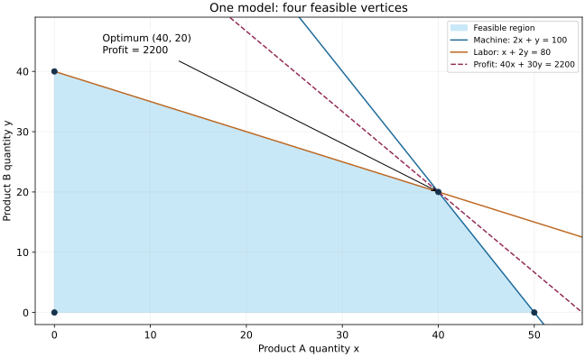

# 第 1 章　线性规划：从一个工厂到单纯形法

[教材目录](../README.md) · [上一章](00_数学语言与建模起步.md) · [下一章：对偶与敏感性](02_对偶与敏感性分析.md)

本章把第 0 章的模型真正算出来。先画出允许的生产方案，再用代数一步步改进方案，最后扩展到运输与指派。即使暂时不运行程序，也能完成全部手算学习。

## 1.1 完整描述生产问题

工厂生产可分割产品 A、B，单位利润 40、30。A 消耗机器 2 小时、人工 1 小时；B 消耗机器 1 小时、人工 2 小时。机器共 100 小时，人工共 80 小时。需求足够大，暂不考虑销量上限、开机固定费用和必须整件生产。

这些假设不能省略。例如利润可能只对卖出的产品成立；本例把“生产后能卖出”视为已知条件。现实不满足时，要补需求上限或库存模型。

设 x、y 分别为 A、B 产量：

$$
\begin{aligned}
\max\quad &z=40x+30y\\
\text{s.t.}\quad &2x+y\le100\\
&x+2y\le80\\
&x,y\ge0.
\end{aligned}
$$

s.t. 是 subject to 的缩写，读作“满足以下条件”。目标与每条限制共同定义问题，不能只看目标式。

## 1.2 可行域怎样画出来

横轴画 x，纵轴画 y。非负约束把范围限制在第一象限。直线 $2x+y=100$ 与横纵轴交于 (50,0)、(0,100)，允许区域在直线靠近原点的一侧。判断哪一侧最简单的方法是代入 (0,0)：0≤100，所以含原点的一侧被保留。

第二条直线 $x+2y=80$ 与坐标轴交于 (80,0)、(0,40)。两片允许区域的交集才是可行域。不能把两条边界围出的整个区域不加判断地涂满。

两直线交点通过消元得到：第一式乘 2，减去第二式，得 3x=120，所以 x=40；代回得 y=20。可行域四个顶点为：

| 点 | 机器消耗 | 人工消耗 | 利润 |
|---|---:|---:|---:|
| (0,0) | 0 | 0 | 0 |
| (50,0) | 100 | 50 | 2000 |
| (40,20) | 100 | 80 | 2200 |
| (0,40) | 40 | 80 | 1200 |

可见 (40,20) 最好。为什么比较几个顶点就够了，下一节解释。



图中浅蓝区域是同时满足全部约束的点；蓝线为机器约束，橙线为人工约束，紫色虚线为利润 2200 的等值线。它在 (40,20) 接触可行域；继续向利润更大的方向平移，就不再接触可行点。

## 1.3 凸性与极点：不靠图也能理解

两个可行点 u、v 之间任一点可写成 $w=\lambda u+(1-\lambda)v$，其中 $0\le\lambda\le1$。例如 λ=1/2 是中点，λ=1/4 是更靠近 v 的点。

若 Au≤b、Av≤b，则 $Aw=\lambda Au+(1-\lambda)Av\le b$。所以线性约束的可行域具有凸性：连接两个可行点的整条线段也可行。

沿线段，目标同样满足 $c^Tw=\lambda c^Tu+(1-\lambda)c^Tv$。一个加权平均不可能超过两端较大的值。因此在线段内部通常找不到优于两端的新利润。对于非空有界多面体，这个性质支持“至少存在一个顶点最优解”的结论。

极点是不能再写成两个不同可行点的严格凸组合的点。本例极点就是四个角。若目标与某条边平行，该边全部可能最优；不是“只有极点才能最优”。可行域无界或含直线时，还需要补充条件，不能把本例结论无条件套到所有 LP。

## 1.4 松弛变量把不等式变成等式

定义机器剩余量 s、人工剩余量 t：

$$
2x+y+s=100,\qquad x+2y+t=80,\qquad x,y,s,t\ge0.
$$

slack 即松弛量，它表示没有用完多少资源。任何原模型可行 x、y，都能唯一算出非负 s、t；反过来，满足这些等式的非负变量也一定满足原不等式。因此这一步是等价改写。

大于等于约束则要减去一个非负“剩余量”：$2x+y\ge8$ 可改为 $2x+y-s=8,s\ge0$。不要对所有不等式都机械地加一个变量。

## 1.5 亲手完成两次单纯形换基

单纯形法不逐一尝试所有产量。它把部分变量暂设为零，用等式解出其他变量，再寻找能改善目标的可行方向。

初始取 x=y=0，则 s=100、t=80、z=0。这时 s、t 称为基变量，x、y 为非基变量。等式可以写成“字典”：

$$
s=100-2x-y,\quad t=80-x-2y,\quad z=40x+30y.
$$

先增加 x，保持 y=0。为使 s≥0，x≤50；为使 t≥0，x≤80。最先触及的是机器限制，因此 x 最多增加到 50，s 降为零。这叫最小比值检验：沿改善方向走到第一条阻挡边界。

让 x 进入基、s 离开基。从第一式解出 x，再代入另两式：

$$
x=50-\tfrac12y-\tfrac12s,
$$
$$
t=30-\tfrac32y+\tfrac12s,
$$
$$
z=2000+10y-20s.
$$

当前非基变量 y=s=0，所以 x=50、t=30、利润 2000。此时每增加一单位 y，必须减少半单位 x，净利润增加 $30-40/2=10$。因此 y 的系数是 10，而不是原来的 30：它已经考虑了让出资源的代价。

保持 s=0，增加 y。x≥0 给出 y≤100；t≥0 给出 y≤20，所以人工约束先阻挡，令 y=20、t=0。让 y 进入基、t 离开基，得到：

$$
y=20+\tfrac13s-\tfrac23t,
$$
$$
x=40-\tfrac23s+\tfrac13t,
$$
$$
z=2200-\tfrac{50}{3}s-\tfrac{20}{3}t.
$$

现在 s、t 都非负，目标中的系数都不为正，故不可能超过 2200。取 s=t=0 恰好达到 2200，最优性被证明。我们经历了 (0,0) → (50,0) → (40,20)，每一步都保持可行并改善利润。

## 1.6 基、检验数与算法边界

两条独立等式通常需要选择两个基变量，由非基变量的取值解出它们。高维时用基矩阵 B 表示这个过程，基变量满足 $x_B=B^{-1}b$。现在无需手算逆矩阵，只需理解它与上面的消元是同一回事。

目标字典中非基变量的系数称为 reduced cost，常译作检验数或约化成本。其符号表示当前基下增加该变量会怎样改变目标。最大化问题、变量处于非负下界时，正系数意味着可能改善；负系数意味着这种局部移动会降低目标。

并非每个 LP 都有像本例这样显然的初始基。两阶段法会先求“能否找到可行基”；退化时换基可能不移动点，需要避免循环；求解器还可能使用对偶单纯形或内点法。初学阶段先掌握本例完整过程，不需要把所有算法变体同时学完。

## 1.7 运输模型：一条变量代表一条边

两个仓库供应量 3、2，两个客户需求量 2、3。单位费用为：

| | 客户 1 | 客户 2 |
|---|---:|---:|
| 仓库 1 | 1 | 4 |
| 仓库 2 | 3 | 2 |

设 $x_{ij}$ 为仓库 i 发往客户 j 的量。目标是 $\min x_{11}+4x_{12}+3x_{21}+2x_{22}$。供给约束为 $x_{11}+x_{12}=3,x_{21}+x_{22}=2$；需求约束为 $x_{11}+x_{21}=2,x_{12}+x_{22}=3$；四个变量均非负。

令 $x_{11}=q$，则 $x_{12}=3-q,x_{21}=2-q,x_{22}=q$。非负性要求 0≤q≤2。代入目标得到 18−4q，故 q=2 最好，费用 10。运输方案是仓库 1 向客户 1 发 2、向客户 2 发 1，仓库 2 向客户 2 发 2。

这里四条守恒等式并不全独立：总供给等于总需求，最后一条可由其余推出。实际建模可以保留这种冗余关系，但要理解它为什么存在。

供需不平衡时，是否允许库存、缺货、外购必须由业务决定。虚拟节点是表达这些行为的方法，其费用不能随意设零。

## 1.8 指派的 LP 为什么可能自然得到整数

一个人员必须分配一个任务，每个任务必须恰好有一人，可写：

$$
\sum_jx_{ij}=1\ (\forall i),\qquad\sum_ix_{ij}=1\ (\forall j),\qquad x_{ij}\ge0.
$$

业务上 x 应是 0 或 1。平衡指派具有特殊结构：其极点正好对应完整的一对一指派。因此线性成本总能在某个整数极点达到最优，即使先不声明整数限制也可以找到整数最优方案。

不要把这个结论推广到普通 LP。它来自结构；增加一个额外预算约束可能破坏结构。也不要误解为“所有最优解都整数”：若所有费用相同，两人两任务时四个变量全为 1/2 也是最优，只是它位于两个整数方案的连线上。

运输问题的整数性可由全幺模矩阵理论解释：矩阵每个方形子矩阵的行列式都为 −1、0 或 1，配合整数右端项等条件，极点具有整数性。这是后续可深入的定理，本月先掌握适用条件和不能随意推广的边界。

## 1.9 用代码核对纸笔答案

本教材的[教学算例脚本](examples.py)提供 `lp` 入口，只使用 Python 标准库枚举二维 LP 的候选顶点。它用于核对手算，不是通用 LP 求解器：

```powershell
python "Month_02_精确算法与参数学习/教材/examples.py" lp
```

应看到最优点 (40,20)、利润 2200。实际项目的 LP 接口与结果字段，可在完成本章后阅读[第一周 Day 2 实验](../Week_1/Day2.md)。先检查可行性，再检查目标，最后阅读对偶信息。

## 1.10 练习与完整解答

**题 1。** 将单位利润改成 A=30、B=30，资源不变。手算最优方案。

解：四个顶点利润为 0、1500、1800、1200，故 (40,20) 最优、值 1800。也可将两条资源限制相加得 3x+3y≤180，从而利润 30(x+y)≤1800；交点达到该上界。这已经预示了下一章“给约束加权以产生界”的思想。

**题 2。** 原利润不变，增加需求限制 x≤30。最优点和利润如何变化？

解：固定 x 后，y 至多取 $\min(100-2x,(80-x)/2)$。当 0≤x≤30 时人工限制更紧，故 y=(80−x)/2。利润为 $40x+15(80-x)=1200+25x$，随 x 增大，最优取 x=30、y=25，利润 1950。此时机器还剩 15 小时，说明最优时不一定所有资源都用满。

**题 3。** 为什么单纯形第二步增加 y 的边际利润是 10 而不是 30？

解：在机器已满载的边上，增加一单位 B 会占一小时机器。必须减少半单位 A 释放这一小时，损失 20 利润，所以净增 30−20=10。检验数是考虑当前替代关系后的净改善，不等于直接收益系数。

**题 4。** 运输例子将仓库 1→客户 1 费用从 1 改为 6，其他不变，最优方案如何变化？

解：仍令 q=x11，目标变成 $6q+4(3-q)+3(2-q)+2q=18+q$，应取 q=0，最优费用 18。所有约束未变，但目标方向改变了选择的端点。这展示了同一可行域可以对应不同最优决策。

## 1.11 本章学会了什么

现在你应能完成从业务到 LP、从不等式到可行域、从松弛变量到两次换基的全过程。下一章把最后得到的 $50/3$ 和 $20/3$ 解释为资源价格，并说明如何不枚举所有生产方案就证明利润上限。
