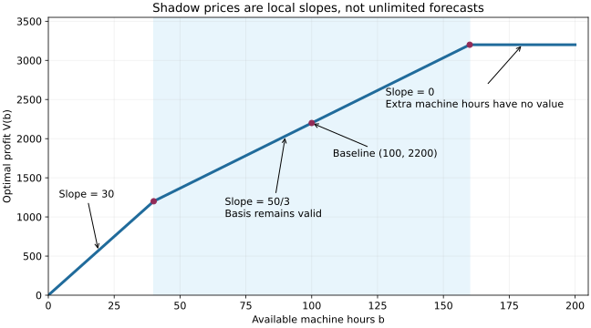

# 第 2 章　对偶与敏感性：答案为什么最优，条件变化后怎么办

[教材目录](../README.md) · [上一章](01_线性规划从建模到求解.md) · [下一章：0-1 规划](03_零一规划与逻辑建模.md)

需要的前置知识只有第 1 章的生产模型和不等式。先不背对偶规则表；我们从“给利润找一个上限”推导另一个优化问题。

## 2.1 一个可行方案只回答了问题的一半

生产 A=40、B=20，利润 2200，说明“至少能赚 2200”。但若没有进一步证据，仍可能存在利润 2300 的方案。

怎样一次排除所有更高利润？可以用资源总价值给利润设上限。例如将机器工时定价为 20 元、人工定价为 10 元。A 消耗的资源价值为 2×20+10=50，高于利润 40；B 消耗价值为 20+2×10=40，高于利润 30。既然每种产品的利润都不超过其资源价值，总利润也不超过全部资源的价值 100×20+80×10=2800。

2800 是有效上界，但与 2200 之间还有距离。我们想寻找更低、同时仍然有效的资源估价。

## 2.2 从资源价格推出对偶模型

设每小时机器估价为 u、人工估价为 v。要求价格非负，因为未用完资源不应让“全资源价值”低于“实际消耗价值”。为了覆盖每种产品的利润，需要：

$$
2u+v\ge40,\qquad u+2v\ge30,\qquad u,v\ge0.
$$

对任意可行产量 x、y：

$$
40x+30y\le(2u+v)x+(u+2v)y
=u(2x+y)+v(x+2y)\le100u+80v.
$$

第一个不等式依赖 x、y 非负及产品定价限制；最后一个依赖 u、v 非负及资源约束。每个条件都有作用，不能省去。

因此我们得到一个新的 LP：

$$
\min 100u+80v\quad\text{s.t. }2u+v\ge40,\ u+2v\ge30,\ u,v\ge0.
$$

原模型称为原始问题，新模型称为对偶问题。“对偶”不是把最大化符号简单改成最小化，而是把原来的资源约束转成价格变量，把原来的产品变量转成定价约束。

## 2.3 亲手找到一个最优性证书

为了让上界尽量小，尝试让两种产品的利润恰好等于资源价值：

$$
2u+v=40,\qquad u+2v=30.
$$

消元得到 u=50/3、v=20/3，均非负，且满足对偶约束。资源总价值为：

$$
100\cdot\frac{50}{3}+80\cdot\frac{20}{3}=2200.
$$

已经知道存在利润 2200 的生产方案，又知道任何生产方案利润至多 2200，最优性因此成立。这就是一份“证书”：给别人 x、y、u、v 四个数，他们不需要重跑搜索，只需代入几条不等式和目标就能检查。

本例恰好可以让两条对偶约束取等号，不意味着任何对偶都应机械地全部取等号。哪些约束取等号与原始变量是否为正有关，见下一节。

## 2.4 弱对偶与强对偶分别说了什么

**弱对偶**：任意原始可行解的最大化目标，不超过任意对偶可行解的最小化目标。我们已经用上面的不等式链证明它，不要求两边最优。

**强对偶**：对于 LP，如果原始问题可行且最优值有限，则对偶也存在最优解，两边最优值相等。它说明总能找到匹配的最佳界，是比弱对偶更深的定理。本章展示直观和使用方法，不在此证明一般强对偶定理。

若原始最大化问题无界，则对偶不可能有可行解，否则弱对偶给出了有限上界，产生矛盾。若原始不可行，则对偶可能无界，也可能不可行，不能只选其中一种。

这套强对偶对应连续 LP。把原始变量强行要求整数以后，LP 对偶仍可以给松弛的界，但未必等于整数最优值。第 4 章会讨论这个间隙。

## 2.5 互补松弛：把利润差拆成四个非负部分

记机器和人工剩余为 s=100−2x−y、t=80−x−2y。原始与对偶的目标差可以重排为：

$$
(100u+80v)-(40x+30y)
=us+vt+x(2u+v-40)+y(u+2v-30).
$$

双方可行时，右侧四项都非负。只有每项都为零，总差才为零。于是最优原始、对偶解满足：

$$
us=0,\quad vt=0,\quad x(2u+v-40)=0,\quad y(u+2v-30)=0.
$$

读成业务语言：如果机器还剩余，即 s>0，那么 u 必须为零；如果 A 确实生产，即 x>0，那么 A 的资源估价必须恰好等于利润。这里是乘积为零，不是“两个因子必须同时为零”。

所以反向推理有边界：s=0 不保证 u>0，可能两者都为零；产品资源估价等于利润，也不保证该产品一定有正产量。退化和多重最优会出现这些情况。

## 2.6 现在再读一般对偶公式

对原始问题 $\max c^Tx,Ax\le b,x\ge0$，对偶为：

$$
\min b^Ty\quad\text{s.t. }A^Ty\ge c,\ y\ge0.
$$

原始第 i 行是一种资源，对偶第 i 个变量是它的价格；原始第 j 列是一种活动，对偶第 j 条约束要求该活动的资源价值覆盖收益。

若原始某行是等式，该行两侧永远相等，乘正数或负数都不会破坏等式，所以对应价格可以自由取正负。若原始某行是大于等于，价格符号要反向，以维持界的方向。记号规则来自这些不等式操作，而不是凭空规定。

对于最大化原始问题，常见规则为：≤行对应非负对偶变量，≥行对应非正变量，等式行对应自由变量；非负原始变量对应≥对偶约束，自由原始变量对应等式。变量的有限上界也是一条约束，不应在构造对偶时漏掉。

## 2.7 影子价格：一小时资源到底值多少钱

机器资源从 100 增加到 103，人工仍为 80。假设两种产品仍都生产，解两条取等式的资源限制：

$$
2x+y=103,\quad x+2y=80
\Rightarrow x=42,\ y=19.
$$

利润为 2250，比原来增加 50，即每小时机器增加 50/3。这正好是 u。

这不是“增加 3 小时就多生产某一种产品”的简单关系：A 多产 2，B 少产 1，组合变化带来利润增加 80−30=50。影子价格概括的是**重新优化后的净收益**。

但它是否对增加任意小时数都成立？不能，必须求适用范围。

## 2.8 一步步求影子价格的有效区间

将机器资源记为 b，人工固定 80。两条资源约束取等式时：

$$
x=\frac{2b-80}{3},\qquad y=\frac{160-b}{3}.
$$

要使这个方案非负，需要 b≥40 且 b≤160。在这个范围内，原始点可行，前面 u、v 的对偶可行性又不依赖 b，因此目标相等，给出：

$$
V(b)=\frac{50}{3}b+\frac{1600}{3},\qquad40\le b\le160.
$$

如果 b<40，公式中的 x 为负，不能继续用。此时机器特别稀缺，生产 B 的每小时机器利润为 30，生产 A 只有 20，所以取 x=0、y=b，且人工用量 2b≤80，利润为 30b。

如果 b>160，公式中的 y 为负，也不能用。此时人工限制主导，A 每小时人工利润为 40，高于 B 的 15，取 x=80、y=0，利润 3200。

因此：

$$
V(b)=\begin{cases}
30b,&0\le b\le40,\\
\frac{50}{3}b+\frac{1600}{3},&40\le b\le160,\\
3200,&b\ge160.
\end{cases}
$$

在 40 和 160 处，左右斜率不同。单个对偶价格不能代表双侧唯一边际收益；它仍可提供支持上界，但不能任意外推成实际增益。

横轴是机器可用工时，纵轴是重新优化后的利润。阴影区 [40,160] 是本例当前基仍有效的范围。折点两侧线段倾斜程度不同，正是“影子价格只有局部解释”的几何含义。

## 2.9 reduced cost 与新产品的进入门槛

新增产品 C，每件各耗机器和人工一小时、利润为 q。按当前价格，其资源消耗价值为 50/3+20/3=70/3。检验数为：

$$
\bar c_C=q-70/3.
$$

若 q=20，检验数为 −10/3，原有对偶价格仍覆盖 C 的利润，所以原来的 2200 上界仍有效，旧方案仍最优。

若 q=25，检验数为 5/3，旧资源价格不能覆盖新产品收益，原来的对偶证书失效。这里还能直接构造改善：新增 1 单位 C，为腾出各一单位资源，令 A、B 都减少 1/3，损失利润 70/3，却新增利润 25，净增 5/3。只要产量仍非负，这个方向可行。

q=70/3 时净改善为零，可能出现多个最优生产组合。一般模型中检验数为零也不必然保证不同最优点存在，还要检查能否作非零的可行移动。

## 2.10 从公式回到数值检查

实际软件使用浮点数，1/3 通常无法精确存储。因此验证不要只写 `primal == dual`。应先检查双方的约束与变量界，再检查目标差、互补乘积是否小于与单位相称的容差。

不等式 a≤b 的违反量是 max(0,a−b)，而不是 |a−b|：严格小于本来就合法。等式才用绝对残差。必要时结合绝对与相对容差，且与后端容差作区分。

运行本教材 `lp` 示例会用有理数精确检查这些教学算例。工程尺度、后端浮点容差的进一步讨论见[数值容差资料](https://docs.gurobi.com/projects/optimizer/en/current/concepts/numericguide/tolerances_scaling.html)。

## 2.11 练习与详细解答

**题 1。** 机器资源从 100 改成 90，其他不变，求最优产量和利润。

解：90 位于 [40,160]，可用本章公式。x=(180−80)/3=100/3，y=(160−90)/3=70/3。利润为 6100/3，约 2033.33；也等于 $2200-10\times50/3$。小数产量在本例允许，所以不是错误。若要求整件生产，则必须另求整数问题。

**题 2。** 资源剩余为零，就能断言影子价格为正吗？用 b=200 的情况解释。

解：不能。此时最优生产 x=80、y=0，机器资源剩余 40、价格为零，人工价格为 40。若将机器资源降到刚好 160，机器变成满用，但从右侧继续增加机器资源仍无收益，价格可以为零。互补松弛只要求乘积为零，不要求“紧约束对应严格正价格”。

**题 3。** 有人给出原始可行利润 2200、对偶“目标”2100，并说发现更紧上界，正确吗？

解：违反弱对偶，说明至少一边并不可行、目标算错或符号约定错。代入检查对偶各产品定价约束，比直接相信打印出的“dual objective”更重要。

**题 4。** 写出运输模型 $\min\sum c_{ij}x_{ij}$、供给需求均为等式、x≥0 的对偶。

解：为仓库等式引入自由变量 ui，为客户等式引入自由变量 vj。对偶是 $\max\sum_i a_iu_i+\sum_jb_jv_j$，约束 ui+vj≤cij。它提供最小运输成本的下界：任一运输的成本至少等于按节点价格计算的总值。供需平衡时将所有 u 增加同一常数、所有 v 减少该常数，约束和目标都不变，所以对偶解可能不唯一。

下一章开始研究“不允许切半”的决定。请保留“可行方案给一侧的界、数学推论给另一侧的界”这一思想，它将在整数规划中继续使用。
