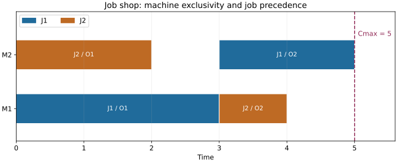

# 第 5 章　CP-SAT：一步步建立时间、机器与资源模型

[教材目录](../README.md) · [上一章](04_混合整数规划与调度.md) · [下一章：求解器工程](06_求解器工程与结果解释.md)

本章从只有两个整数变量的约束开始，逐步建立单机、并行机、Job Shop 和容量资源模型。无需先学习 SAT 算法，也不要求记住 API；先理解每种约束承担的职责。

## 5.1 域与约束传播：先删掉不可能的值

假设整数开工时间 SA 的范围是 0 到 10，A 工时 3，B 必须在 A 完成后才可开始，且 B 最晚在 5 开始。模型给出 SB≥SA+3、SB≤5。

由于 SA≥0，推出 SB≥3，所以 SB 的域从原来的宽范围收紧到 [3,5]。再由 SA≤SB−3≤2，推出 SA∈[0,2]。没有试遍所有 SA、SB，就已经删除了大量不可能值。这叫约束传播。

传播与搜索配合：传播无法进一步决定时，求解器选择某个分支，例如 SA=0 或 SA≥1，再继续传播。出现矛盾就退回其他分支。传播结束不代表已找到完整解，也不保证所有域达到数学上最紧范围。

CP-SAT 把整数约束、SAT 风格的冲突学习及多种搜索方法结合起来，还可能使用 LP 松弛。它不只是“用另一种方式枚举”，也不能简单说“CP-SAT 完全不用线性规划”。

## 5.2 从一个时间段认识 IntervalVar

一道不可中断工序有开始 S、时长 p、结束 E，满足 S+p=E。使用半开区间 [S,E) 表示它占用的时间。例如 [0,3) 与 [3,5) 可以相接，不算同时加工。

IntervalVar 把这些时间关系组织成调度对象。高级 API 创建区间时会建立所需的开始、时长、结束关系，随后 NoOverlap、Cumulative 可以引用它。不要只创建 S 和 E，却忘记连接 E=S+p。

固定工时 p 是参数；也可以有可变工时区间，但本月先固定时长，减少同时需要理解的概念。

## 5.3 第一个完整 CP-SAT 模型：重做三作业单机例子

仍使用 A、B、C 工时 2、3、1，交期 2、4、3，时间上界 H=6。下面的程序可单独保存后运行：

```python
from ortools.sat.python import cp_model

p = [2, 3, 1]
due = [2, 4, 3]
H = sum(p)
model = cp_model.CpModel()
starts, ends, intervals, tardiness = [], [], [], []

for j in range(3):
    s = model.new_int_var(0, H - p[j], f"s{j}")
    e = model.new_int_var(p[j], H, f"e{j}")
    interval = model.new_interval_var(s, p[j], e, f"task{j}")
    t = model.new_int_var(0, H, f"t{j}")
    model.add(t >= e - due[j])
    starts.append(s)
    ends.append(e)
    intervals.append(interval)
    tardiness.append(t)

model.add_no_overlap(intervals)
model.minimize(sum(tardiness))

solver = cp_model.CpSolver()
solver.parameters.max_time_in_seconds = 10
solver.parameters.num_search_workers = 1
status = solver.solve(model)
print(solver.status_name(status))
if status in (cp_model.OPTIMAL, cp_model.FEASIBLE):
    for j in range(3):
        print(j, solver.value(starts[j]), solver.value(ends[j]))
    print("objective:", solver.objective_value)
    print("bound:", solver.best_objective_bound)
```

逐段解释：建立整数开始、结束变量；创建三个必选区间；每个迟交变量下界已设为零，再要求不小于 E−d；NoOverlap 把三个区间放进同一台机器；最小化迟交和会把 T 压到真实迟交量；最后先判断状态再读取变量。

相比上一章，模型没有显式的作业对排序变量，也不需要我们写 Big-M。先后关系被机器互斥约束组织起来。求解器内部如何处理，是实现层的事，不能据此说顺序选择的困难已经消失。

这个实例的最优目标仍应为 2。程序还可以返回不同但目标相同的排程；是否完全同一时间表不是正确性的唯一判据。

## 5.4 可选区间：存在才参与加工

如果一个作业可以选择机器 0 或机器 1，就为每个候选建立布尔量 a0、a1，并要求 a0+a1=1。一个机器候选对应一个可选区间。

存在变量为真时，该候选区间满足 S+p=E 并参与机器调度；为假时，它不参与对应的 NoOverlap、Cumulative。**它的开始结束数值不会自动归零。**

一个清楚的实现方式是各候选共享作业的主 S、E：

```python
chosen = []
for m in eligible_machines[j]:
    a = model.new_bool_var(f"choose_{j}_{m}")
    interval = model.new_optional_interval_var(
        start[j], processing[j][m], end[j], a, f"task_{j}_{m}"
    )
    machine_intervals[m].append(interval)
    chosen.append(a)
model.add_exactly_one(chosen)
```

这段是结构片段：`eligible_machines`、`processing`、主时间变量等需事先定义。可运行的完整版本在本教材[examples.py](examples.py)的并行机函数中。

若机器工时不同，选中哪台就激活对应的时长等式。只选一个保证不会同时要求 E−S 等于两个不同工时。

## 5.5 从选择到并行机模型

对每个作业建立上述候选，对每台机器分别执行 `model.add_no_overlap(machine_intervals[m])`。再定义 makespan Cmax，并对每个作业加 Cmax≥Ej，最小化 Cmax。

三个作业工时 3、2、2，两台同质机器。总工时 7，机器每单位时间最多完成两单位加工，所以 makespan≥7/2；整数时间下至少为 4。安排机器 0 做工时 3 的作业，机器 1 做两个工时 2 的作业，达到 4，故最优。

ExactlyOne 与 NoOverlap 分别解决不同问题：没有前者，任务可以全部缺席；没有后者，同一机器可以同时执行全部任务。二者不能互相替代。

如果采用每个候选独立的 Sjm、Ejm，并用求和恢复作业结束，就必须对缺席候选的 E 单独处理。共享主时间变量能避免这个特定陷阱，但不是唯一合法写法。

## 5.6 Job Shop：先后链与机器冲突同时存在

J1 先在 M1 做 3，再在 M2 做 2；J2 先在 M2 做 2，再在 M1 做 1。经典 JSP 中每道工序机器固定，因此区间可以必选。

对每个作业，相邻工序添加 S后≥E前。对每台机器，把来自不同作业的工序收集进同一个 NoOverlap。最后以各作业最后一道工序的结束来定义 makespan。

手工排程：J1 在 M1 [0,3)、M2 [3,5)；J2 在 M2 [0,2)、M1 [3,4)。J1 链本身长 5，所以任何解工期都至少 5；上述排程工期 5，因此最优。



每一行是一台机器，同一颜色属于同一个作业。沿一行检查是否重叠，再按相同颜色检查第二道工序是否在第一道工序完成后才开始。图中 J2 在第一道完成后等待了一段时间，这种等待是允许的。

若只写作业先后，不写机器冲突，会错误允许不同作业同时用同机；若只写机器冲突，不写作业内链，会错误允许后道工序先于前道。画甘特图时分别检查这两类关系。

FJSP 还允许每道工序选择机器，把 5.4 的可选区间叠加到这个结构中即可开始理解。日历、换型、工人再逐层加入，不要一次复制一个巨大模型而不知道每层负责什么。

## 5.7 Cumulative：一项资源允许几件事同时发生

机器常是容量 1 的独占资源，工人、功率或炉容量可以容纳多个任务。给任务 i 需求量 qi，资源容量 Q，要求所有时刻：

$$
\sum_{i:S_i\le t<E_i}q_i\le Q.
$$

假设容量 3。A=[0,3)、需求 2；B=[1,4)、需求 1；C=[2,4)、需求 2。在 [2,3) 总需求 5，违反容量。如果 C 改为 [3,5)，资源占用按时间段为：

| 时间段 | 活动任务 | 总需求 |
|---|---|---:|
| [0,1) | A | 2 |
| [1,3) | A、B | 3 |
| [3,4) | B、C | 3 |
| [4,5) | C | 2 |

模型中可写 `model.add_cumulative(intervals, demands, capacity)`。如果任务还必须使用指定机器，机器 NoOverlap 也应保留；工人容量并不自动保证机器互斥。

“资源需求总和大于容量”不是不可行的充分理由，因为任务可以错开。所有任务占用的资源时间为 Σqipi，在长 T 的窗口中容量最多提供 QT，因此 T≥Σqipi/Q 是一个下界，但释放时间和不可中断要求可能使它不可达。

## 5.8 整数时间与真实精度

CP-SAT 变量是整数。工时 0.5 小时和 1.25 小时可统一改用 0.25 小时为单位，得到 2 和 5。释放时间、交期及输出都必须同步换算。

不要把“精确换单位”与“四舍五入”混为一谈。若真实工时 1.24 小时，直接取 1 小时会让模型安排原本做不完的工作。时间网格是业务假设，需要说明误差容忍。

现代 CP-SAT 支持浮点线性目标；变量整数不等于所有目标系数都被禁止为小数。项目若另做权重缩放，应核查舍入误差和界的换算。[官方模型协议](https://github.com/google/or-tools/blob/stable/ortools/sat/cp_model.proto)

## 5.9 求解状态是报告的一部分

OPTIMAL、FEASIBLE、INFEASIBLE、UNKNOWN、MODEL_INVALID 的基本含义分别是：达到相应最优终止条件；已有可行解；证明不可行；尚未得出所需结论；模型表达非法。详细定义见[官方文档](https://developers.google.com/optimization/cp/cp_solver)。

若设置正的 gap 容限，报告还必须注明终止条件与实际差距，不能只凭一个状态字符串宣称严格零差距。没有解时不能读取变量默认值当作排程；UNKNOWN 也不能翻译成“没有可行方案”。

## 5.10 练习与详细解答

**题 1。** 两台机器，三个工时为 3、2、2 的作业，每个作业都需要一名工人，只有一名工人。最短工期是多少？

解：无论机器怎么选，工人容量 1 强制所有作业不能重叠，总工时 7 是下界。串行加工达到 7，所以最优为 7。增加第二台机器没有改善，是因为工人成为瓶颈；工人改为两名后回到最优工期 4。

**题 2。** 两个可选区间的存在量都是 0，但目标里直接加入它们的结束变量，会怎样？

解：这些结束变量仍有各自的域及普通约束；并不会因缺席自动消失。目标可能优化无意义的辅助值。应使用主结束变量并正确连接选择，或为缺席项规定中性值。

**题 3。** JSP 中 J2 第二工序开始于 2，结束于 3，与 J1 第一工序 [0,3) 共用 M1，为什么错？

解：虽满足 J2 第一工序在 2 完成的先后约束，但在 [2,3) 与 J1 共用机器，违反 NoOverlap。J2 第二工序至少应推迟到 3。

**题 4。** time limit 设得极小，就一定得到 UNKNOWN 吗？

解：不保证。小模型可能在限制前已完成，预处理甚至可直接证明可行或不可行。状态测试应验证语义，不应假定某个毫秒阈值在所有硬件上产生同一状态。

运行 `python "Month_02_精确算法与参数学习/教材/examples.py" cp`，核对单机迟交 2、并行机工期 4、JSP 工期 5、单工人工期 7。脚本会独立检查时间、机器与目标，不只是打印求解器状态。
